# 🔗 Roadmap Elixir/Phoenix - Ver Elixir

**Localização consolidada:** `/elixir/` (estrutura completa 01-11)

Este roadmap Elixir/Phoenix está integrado na estrutura consolidada da pasta `/elixir/`.

## Recursos Elixir/BEAM disponíveis:
- `/elixir/` - 15 módulos estruturados (01-11)
- `/beam/` - Casos de uso específicos BEAM VM
- Este arquivo mantém o roadmap específico aplicado ao contexto OSR2

---
**Nota:** Conhecimento Elixir centralizado em `/elixir/` para evitar dispersão

## 🌟 Filosofia: Aprender Fazendo, Crescer Construindo

Este roadmap revoluciona o aprendizado de tecnologias modernas, transformando cada conceito em uma experiência prática imediata. Em vez de teorizar sobre Elixir, Phoenix e WebAssembly, você os dominará construindo projetos reais do primeiro dia.

**Metodologia:**
1. **Just-in-Time Learning:** Cada conceito é introduzido no momento exato da necessidade prática
2. **Build-First Approach:** Construa primeiro, entenda depois, aprofunde por último
3. **Progressive Complexity:** De "Hello World" até arquiteturas distribuídas complexas
4. **Real-World Projects:** Cada fase produz algo funcional e utilizável

---

## 📊 Visão Geral das Tecnologias e Cronograma

```mermaid
gantt
    title Roadmap de Aprendizado - 16 Semanas
    dateFormat  YYYY-MM-DD
    section Fundamentos
    Elixir Básico           :2024-01-01, 2w
    Phoenix Fundamentos     :2024-01-15, 2w
    section DevOps Moderno
    Git & CI/CD            :2024-01-29, 1w
    PostgreSQL & Dados     :2024-02-05, 1w
    section WebAssembly
    WASM Conceitos         :2024-02-12, 2w
    Component Model        :2024-02-26, 2w
    section Produção
    wasmCloud Deploy       :2024-03-12, 2w
    Monitoring & Ops       :2024-03-26, 2w
    section Expertise
    Otimização & Scale     :2024-04-09, 2w
    Projeto Final          :2024-04-23, 2w
```



### 🎯 Stack Tecnológica

| Tecnologia | Fase | Profundidade | Tempo Foco |
|------------|------|--------------|------------|
| **Elixir** | 1-2 | Intermediário | 4 semanas |
| **Phoenix** | 2-3 | Avançado | 4 semanas |
| **WebAssembly** | 4-6 | Especialista | 6 semanas |
| **wasmCloud** | 7-8 | Profissional | 2 semanas |

---

## Fase 0: Preparação do Ambiente (Semana 0)

**Objetivo:** Configurar o ambiente de desenvolvimento com as ferramentas mais modernas, sem Docker, focado em WASM.

### Habilidade Fundamental: Setup Zero-Docker

**Por que sem Docker?** WebAssembly Component Model elimina a necessidade de containers, oferecendo:
- Cold starts < 1ms (vs 100ms-2s)
- 95% menos vulnerabilidades
- Isolamento perfeito por design

### 🔧 Setup Prático

**1. Sistema Base (Ubuntu/Debian)**
```bash
#!/bin/bash
# setup-elixir-wasm-env.sh

# 1. Instalar dependências do sistema
sudo apt-get update
sudo apt-get install -y \
  build-essential \
  autoconf \
  m4 \
  libncurses5-dev \
  libssl-dev \
  git \
  curl \
  inotify-tools \
  postgresql-client \
  cmake \
  clang

# 2. Instalar Rust (para compilação WASM)
curl --proto '=https' --tlsv1.2 -sSf https://sh.rustup.rs | sh -s -- -y
source $HOME/.cargo/env
rustup target add wasm32-wasip1 wasm32-wasip2

# 3. Instalar wasmtime (runtime WASM)
curl https://wasmtime.dev/install.sh -sSf | bash

# 4. Instalar WASM Component Tools
cargo install --locked --version 0.20.0 wac-cli
cargo install --locked wit-bindgen-cli
cargo install wasm-tools

# 5. Instalar Elixir e OTP
mix local.hex --force
mix archive.install hex phx_new --force
```

**2. Verificação da Instalação**
```bash
# Teste cada ferramenta individualmente
elixir --version        # Deve mostrar 1.17.3+
wasmtime --version     # Runtime WASM funcionando
wac --version          # Component composition tool
mix phx.new --help     # Phoenix instalado
```

**🎯 Projeto Prático:** Configure seu ambiente e crie um "Hello WASM" em 30 minutos:

```elixir
# hello_wasm.exs
Mix.install([{:wasmex, "~> 0.9.0"}])

# Seu primeiro código executando WASM
{:ok, store} = Wasmex.Store.new()
{:ok, instance} = Wasmex.Instance.new(store, simple_wasm_bytes())

defp simple_wasm_bytes do
  # Minimal WASM que retorna 42
  <<0x00, 0x61, 0x73, 0x6D, 0x01, 0x00, 0x00, 0x00>>
end
```

---

## Fase 1: Elixir Fundamentals through Building (Semanas 1-2)

**Objetivo:** Dominar Elixir construindo uma aplicação médica de cálculos que depois migraremos para WASM.

### Semana 1: Actor Model na Prática

**Conceito:** Em vez de aprender teoria sobre processos, construa um sistema de cálculos médicos onde cada cálculo é um processo independente.

**🏗️ Projeto: HealthCalc - Sistema de Cálculos Médicos**

```elixir
# lib/health_calc/calculator.ex
defmodule HealthCalc.Calculator do
  @moduledoc """
  Cada cálculo roda em um processo isolado.
  Aprenda Actor Model fazendo cálculos reais.
  """

  use GenServer

  # Cliente API - aprenda pattern matching aqui
  def calculate_bmi(pid, %{weight: weight, height: height})
      when is_number(weight) and is_number(height) and height > 0 do
    GenServer.call(pid, {:bmi, weight, height})
  end

  def calculate_bmr(pid, %{weight: w, height: h, age: a, gender: g}) do
    GenServer.call(pid, {:bmr, w, h, a, g})
  end

  # Servidor callbacks - aprenda state management
  def init(_) do
    {:ok, %{calculations: 0, results: []}}
  end

  def handle_call({:bmi, weight, height}, _from, state) do
    bmi = weight / (height * height)
    classification = classify_bmi(bmi)

    result = %{bmi: bmi, class: classification, healthy: bmi < 25.0}
    new_state = %{
      calculations: state.calculations + 1,
      results: [result | state.results]
    }

    {:reply, {:ok, result}, new_state}
  end

  def handle_call({:bmr, weight, height, age, gender}, _from, state) do
    # Aprenda guards e multiple function heads
    bmr = case gender do
      :male -> 88.362 + (13.397 * weight) + (4.799 * height) - (5.677 * age)
      :female -> 447.593 + (9.247 * weight) + (3.098 * height) - (4.330 * age)
    end

    result = %{bmr: bmr, daily_calories: bmr * 1.2}
    new_state = Map.update!(state, :calculations, &(&1 + 1))

    {:reply, {:ok, result}, new_state}
  end

  # Aprenda private functions e guards
  defp classify_bmi(bmi) when bmi < 18.5, do: :underweight
  defp classify_bmi(bmi) when bmi < 25.0, do: :normal
  defp classify_bmi(bmi) when bmi < 30.0, do: :overweight
  defp classify_bmi(_), do: :obese
end
```

**🎯 Exercícios Práticos Semana 1:**

1. **Dia 1-2:** Implemente o módulo acima e teste no IEx
2. **Dia 3-4:** Adicione supervisão com fault tolerance
3. **Dia 5-7:** Crie interface de linha de comando

```elixir
# Teste prático no IEx
iex> {:ok, calc} = GenServer.start_link(HealthCalc.Calculator, [])
iex> HealthCalc.Calculator.calculate_bmi(calc, %{weight: 70, height: 1.75})
{:ok, %{bmi: 22.86, class: :normal, healthy: true}}
```

### Semana 2: Concorrência e Fault Tolerance

**Conceito:** Construa um sistema que processa múltiplos pacientes simultaneamente com supervisão automática.

```elixir
# lib/health_calc/patient_supervisor.ex
defmodule HealthCalc.PatientSupervisor do
  use DynamicSupervisor

  def start_link(_) do
    DynamicSupervisor.start_link(__MODULE__, [], name: __MODULE__)
  end

  def init(_) do
    DynamicSupervisor.init(strategy: :one_for_one)
  end

  # Aprenda spawning dinâmico de processos
  def process_patient(patient_data) do
    child_spec = {HealthCalc.PatientWorker, patient_data}
    DynamicSupervisor.start_child(__MODULE__, child_spec)
  end
end

# lib/health_calc/patient_worker.ex
defmodule HealthCalc.PatientWorker do
  use GenServer, restart: :temporary

  def start_link(patient_data) do
    GenServer.start_link(__MODULE__, patient_data)
  end

  def init(patient_data) do
    # Processar em background
    send(self(), :process)
    {:ok, patient_data}
  end

  def handle_info(:process, patient) do
    # Simular processamento que pode falhar
    if :rand.uniform() > 0.1 do
      result = process_all_calculations(patient)
      HealthCalc.ResultStore.save(patient.id, result)
      {:stop, :normal, patient}
    else
      # 10% chance de falha para aprender fault tolerance
      raise "Processing error for patient #{patient.id}"
    end
  end

  defp process_all_calculations(patient) do
    # Aprenda pipelining com |>
    patient
    |> calculate_vitals()
    |> assess_health_risks()
    |> generate_recommendations()
  end
end
```

**🎯 Milestone Semana 2:** Sistema processando 1000 pacientes simultâneos com falhas automáticas recuperadas.

---

## Fase 2: Phoenix - Web Framework Moderno (Semanas 3-4)

**Objetivo:** Construir interface web para o sistema de cálculos médicos, preparando para integração WASM.

### Semana 3: Phoenix Fundamentals

**🏗️ Projeto: MedicalApp Web Interface**

```bash
# Gerar aplicação Phoenix
mix phx.new medical_app --live --binary-id --no-docker
cd medical_app
```

**Aprenda LiveView construindo interface reativa:**

```elixir
# lib/medical_app_web/live/calculator_live.ex
defmodule MedicalAppWeb.CalculatorLive do
  use MedicalAppWeb, :live_view

  def mount(_params, _session, socket) do
    socket = assign(socket,
      weight: "",
      height: "",
      age: "",
      gender: "male",
      result: nil,
      calculating: false
    )
    {:ok, socket}
  end

  def render(assigns) do
    ~H"""
    <div class="max-w-md mx-auto bg-white rounded-xl shadow-md p-6">
      <h2 class="text-2xl font-bold mb-6">Calculadora de Saúde</h2>

      <form phx-submit="calculate" phx-change="validate">
        <div class="mb-4">
          <label class="block text-sm font-medium mb-2">Peso (kg)</label>
          <input type="number" name="weight" value={@weight}
                 class="w-full p-2 border rounded" step="0.1" />
        </div>

        <div class="mb-4">
          <label class="block text-sm font-medium mb-2">Altura (m)</label>
          <input type="number" name="height" value={@height}
                 class="w-full p-2 border rounded" step="0.01" />
        </div>

        <div class="mb-4">
          <label class="block text-sm font-medium mb-2">Idade</label>
          <input type="number" name="age" value={@age}
                 class="w-full p-2 border rounded" />
        </div>

        <button type="submit"
                class="w-full bg-blue-500 text-white p-2 rounded disabled:opacity-50"
                disabled={@calculating}>
          <%= if @calculating do %>
            Calculando...
          <% else %>
            Calcular
          <% end %>
        </button>
      </form>

      <%= if @result do %>
        <div class="mt-6 p-4 bg-green-50 rounded">
          <h3 class="font-semibold">Resultados:</h3>
          <p>IMC: <%= Float.round(@result.bmi, 2) %></p>
          <p>Classificação: <%= @result.classification %></p>
          <p>BMR: <%= Float.round(@result.bmr, 0) %> kcal/dia</p>
        </div>
      <% end %>
    </div>
    """
  end

  def handle_event("validate", params, socket) do
    # Aprenda validação em tempo real
    socket = assign(socket,
      weight: params["weight"],
      height: params["height"],
      age: params["age"]
    )
    {:noreply, socket}
  end

  def handle_event("calculate", params, socket) do
    socket = assign(socket, calculating: true)

    # Processa de forma assíncrona
    pid = self()
    Task.start(fn ->
      result = perform_calculations(params)
      send(pid, {:calculation_done, result})
    end)

    {:noreply, socket}
  end

  def handle_info({:calculation_done, result}, socket) do
    socket = assign(socket,
      result: result,
      calculating: false
    )
    {:noreply, socket}
  end

  defp perform_calculations(params) do
    # Simular processamento pesado
    Process.sleep(1000)

    weight = String.to_float(params["weight"])
    height = String.to_float(params["height"])
    age = String.to_integer(params["age"])

    bmi = weight / (height * height)
    bmr = 88.362 + (13.397 * weight) + (4.799 * height) - (5.677 * age)

    %{
      bmi: bmi,
      bmr: bmr,
      classification: classify_bmi(bmi)
    }
  end

  defp classify_bmi(bmi) when bmi < 18.5, do: "Abaixo do peso"
  defp classify_bmi(bmi) when bmi < 25.0, do: "Peso normal"
  defp classify_bmi(bmi) when bmi < 30.0, do: "Sobrepeso"
  defp classify_bmi(_), do: "Obesidade"
end
```

### Semana 4: Dados e APIs

**Aprenda Ecto construindo persistência de dados:**

```elixir
# lib/medical_app/patients/patient.ex
defmodule MedicalApp.Patients.Patient do
  use Ecto.Schema
  import Ecto.Changeset

  @primary_key {:id, :binary_id, autogenerate: true}
  schema "patients" do
    field :name, :string
    field :email, :string
    field :birth_date, :date
    field :gender, Ecto.Enum, values: [:male, :female, :other]

    has_many :health_records, MedicalApp.Health.Record

    timestamps()
  end

  def changeset(patient, attrs) do
    patient
    |> cast(attrs, [:name, :email, :birth_date, :gender])
    |> validate_required([:name, :email, :birth_date, :gender])
    |> validate_format(:email, ~r/@/)
    |> unique_constraint(:email)
  end
end

# API REST para integração futura com WASM
defmodule MedicalAppWeb.API.PatientController do
  use MedicalAppWeb, :controller

  def calculate(conn, %{"patient_id" => id, "measurements" => measurements}) do
    # Esta função será migrada para WASM na Fase 4
    with {:ok, patient} <- Patients.get_patient(id),
         {:ok, result} <- HealthCalc.calculate_all(patient, measurements) do

      json(conn, %{
        success: true,
        patient_id: id,
        calculations: result,
        processing_time: "#{result.time_ms}ms",
        # Metadata que será importante para WASM
        computed_by: "elixir_native"
      })
    end
  end
end
```

**🎯 Milestone Semana 4:** Aplicação web completa salvando dados e calculando métricas em tempo real.

---

## Fase 3: Introdução ao WebAssembly (Semanas 5-6)

**Objetivo:** Migrar cálculos computacionalmente intensivos para WASM, mantendo a integração Phoenix.

### Semana 5: WASM Conceitos Fundamentais

**Por que WASM?** Demonstre com benchmark real:

```elixir
# benchmarks/native_vs_wasm.exs
Benchee.run(%{
  "Elixir Nativo" => fn ->
    # Cálculo complexo em Elixir
    Enum.reduce(1..10000, 0, fn i, acc ->
      acc + :math.sqrt(i) * :math.sin(i)
    end)
  end,
  "WASM Component" => fn ->
    # Mesmo cálculo em WASM (implementaremos)
    WasmCalculator.complex_calculation(10000)
  end
})
```

**🔧 Primeiro Componente WASM em Rust:**

```bash
# Criar componente de cálculos
mkdir wasm_components/health_calc
cd wasm_components/health_calc
```

```toml
# Cargo.toml
[package]
name = "health-calc"
version = "0.1.0"
edition = "2021"

[dependencies]
wit-bindgen = "0.16.0"

[lib]
crate-type = ["cdylib"]

[profile.release]
opt-level = "z"  # Tamanho mínimo
lto = true       # Link-time optimization
```

```wit
// health-calc.wit - Interface do componente
package medical:health-calc@0.1.0;

interface calculations {
  record patient-metrics {
    weight: float32,
    height: float32,
    age: u32,
    gender: gender-type,
  }

  enum gender-type {
    male,
    female,
  }

  record health-results {
    bmi: float32,
    bmr: float32,
    ideal-weight: float32,
    body-fat-percentage: float32,
    daily-calories: float32,
  }

  // Função principal do componente
  calculate-health-metrics: func(metrics: patient-metrics) -> health-results;

  // Funções especializadas
  calculate-bmi: func(weight: float32, height: float32) -> float32;
  calculate-bmr: func(metrics: patient-metrics) -> float32;
}

world health-calculator {
  export calculations;
}
```

```rust
// src/lib.rs
wit_bindgen::generate!({
    world: "health-calculator",
    exports: {
        "medical:health-calc/calculations": Component,
    },
});

struct Component;

impl exports::medical::health_calc::calculations::Guest for Component {
    fn calculate_health_metrics(
        metrics: exports::medical::health_calc::calculations::PatientMetrics,
    ) -> exports::medical::health_calc::calculations::HealthResults {
        let bmi = Self::calculate_bmi(metrics.weight, metrics.height);
        let bmr = Self::calculate_bmr(metrics);

        // Cálculos avançados que se beneficiam da performance WASM
        let ideal_weight = Self::calculate_ideal_weight(metrics.height, metrics.gender);
        let body_fat = Self::estimate_body_fat(bmi, metrics.age, metrics.gender);
        let daily_calories = bmr * Self::activity_factor(metrics.age);

        exports::medical::health_calc::calculations::HealthResults {
            bmi,
            bmr,
            ideal_weight,
            body_fat_percentage: body_fat,
            daily_calories,
        }
    }

    fn calculate_bmi(weight: f32, height: f32) -> f32 {
        weight / (height * height)
    }

    fn calculate_bmr(
        metrics: exports::medical::health_calc::calculations::PatientMetrics,
    ) -> f32 {
        match metrics.gender {
            exports::medical::health_calc::calculations::GenderType::Male => {
                88.362 + (13.397 * metrics.weight) + (4.799 * metrics.height) - (5.677 * metrics.age as f32)
            }
            exports::medical::health_calc::calculations::GenderType::Female => {
                447.593 + (9.247 * metrics.weight) + (3.098 * metrics.height) - (4.330 * metrics.age as f32)
            }
        }
    }

    // Implementações privadas
    fn calculate_ideal_weight(height: f32, gender: exports::medical::health_calc::calculations::GenderType) -> f32 {
        let base = (height - 1.0) * 100.0;
        match gender {
            exports::medical::health_calc::calculations::GenderType::Male => base - ((base - 150.0) / 4.0),
            exports::medical::health_calc::calculations::GenderType::Female => base - ((base - 150.0) / 2.5),
        }
    }

    fn estimate_body_fat(bmi: f32, age: u32, gender: exports::medical::health_calc::calculations::GenderType) -> f32 {
        match gender {
            exports::medical::health_calc::calculations::GenderType::Male => (1.20 * bmi) + (0.23 * age as f32) - 16.2,
            exports::medical::health_calc::calculations::GenderType::Female => (1.20 * bmi) + (0.23 * age as f32) - 5.4,
        }
    }

    fn activity_factor(age: u32) -> f32 {
        match age {
            0..=25 => 1.8,   // Muito ativo
            26..=35 => 1.6,  // Ativo
            36..=50 => 1.4,  // Moderado
            _ => 1.2,        // Sedentário
        }
    }
}
```

**🔨 Compilação e Integração:**

```bash
# Compilar componente WASM
cargo build --target wasm32-wasip1 --release

# Converter para Component Model
wasm-tools component new target/wasm32-wasip1/release/health_calc.wasm \
  -o health_calc.component.wasm

# Verificar estrutura
wasm-tools print health_calc.component.wasm | head -20
```

### Semana 6: Integração Elixir-WASM

**Integrar componente WASM no Phoenix:**

```elixir
# lib/medical_app/wasm/health_calculator.ex
defmodule MedicalApp.Wasm.HealthCalculator do
  @moduledoc """
  Interface Elixir para o componente WASM de cálculos de saúde.
  Demonstra performance superior e isolamento de segurança.
  """

  use GenServer
  require Logger

  @component_path "priv/wasm/health_calc.component.wasm"

  def start_link(opts) do
    GenServer.start_link(__MODULE__, opts, name: __MODULE__)
  end

  def init(_opts) do
    case load_wasm_component() do
      {:ok, instance} ->
        Logger.info("WASM Health Calculator carregado com sucesso")
        {:ok, %{instance: instance, calls: 0, errors: 0}}

      {:error, reason} ->
        Logger.error("Falha ao carregar WASM: #{inspect(reason)}")
        {:stop, reason}
    end
  end

  # API pública
  def calculate_health_metrics(patient_data) do
    GenServer.call(__MODULE__, {:calculate_health_metrics, patient_data})
  end

  def calculate_bmi(weight, height) do
    GenServer.call(__MODULE__, {:calculate_bmi, weight, height})
  end

  def get_stats do
    GenServer.call(__MODULE__, :get_stats)
  end

  # Implementação GenServer
  def handle_call({:calculate_health_metrics, data}, _from, state) do
    start_time = System.monotonic_time(:microsecond)

    case call_wasm_function(state.instance, "calculate-health-metrics", [
      data.weight, data.height, data.age, encode_gender(data.gender)
    ]) do
      {:ok, [bmi, bmr, ideal_weight, body_fat, daily_calories]} ->
        elapsed = System.monotonic_time(:microsecond) - start_time

        result = %{
          bmi: bmi,
          bmr: bmr,
          ideal_weight: ideal_weight,
          body_fat_percentage: body_fat,
          daily_calories: daily_calories,
          processing_time_us: elapsed,
          computed_by: "wasm_component"
        }

        new_state = Map.update!(state, :calls, &(&1 + 1))
        {:reply, {:ok, result}, new_state}

      {:error, reason} ->
        Logger.error("Erro WASM: #{inspect(reason)}")
        new_state = Map.update!(state, :errors, &(&1 + 1))
        {:reply, {:error, reason}, new_state}
    end
  end

  def handle_call({:calculate_bmi, weight, height}, _from, state) do
    case call_wasm_function(state.instance, "calculate-bmi", [weight, height]) do
      {:ok, [bmi]} -> {:reply, {:ok, bmi}, state}
      error -> {:reply, error, state}
    end
  end

  def handle_call(:get_stats, _from, state) do
    stats = %{
      total_calls: state.calls,
      total_errors: state.errors,
      success_rate: calculate_success_rate(state.calls, state.errors),
      component_loaded: not is_nil(state.instance)
    }
    {:reply, stats, state}
  end

  # Funções privadas
  defp load_wasm_component do
    with {:ok, bytes} <- File.read(@component_path),
         {:ok, store} <- Wasmex.Store.new(),
         {:ok, instance} <- Wasmex.Instance.new(store, bytes) do
      {:ok, instance}
    end
  end

  defp call_wasm_function(instance, function_name, args) do
    Wasmex.Instance.call_exported_function(instance, function_name, args)
  end

  defp encode_gender(:male), do: 0
  defp encode_gender(:female), do: 1
  defp encode_gender(_), do: 0

  defp calculate_success_rate(calls, errors) when calls > 0 do
    ((calls - errors) / calls * 100) |> Float.round(2)
  end
  defp calculate_success_rate(_, _), do: 0.0
end
```

**🎯 Milestone Semana 6:** Componente WASM integrado e funcionando, com benchmarks demonstrando performance superior.

---

## Fase 4: Orquestração e Deploy (Semanas 7-8)

**Objetivo:** Deploy em produção usando wasmCloud e ferramentas modernas de orquestração.

### Semana 7: wasmCloud Local

**Setup e configuração do ambiente wasmCloud:**

```bash
# setup-wasmcloud-dev.sh
#!/bin/bash

# Instalar wasmCloud tooling
curl -s https://packagecloud.io/install/repositories/wasmcloud/core/script.deb.sh | sudo bash
sudo apt-get install wash

# Iniciar lattice local
wash up --detached

# Verificar status
wash ctl get hosts
wash ctl get inventory
```

**Manifesto WADM para aplicação médica:**

```yaml
# medical-app.wadm.yaml
apiVersion: core.oam.dev/v1beta1
kind: Application
metadata:
  name: medical-app
  annotations:
    version: v1.0.0
    description: "Medical Health Calculator with WASM Components"
spec:
  components:
    # API Gateway Phoenix
    - name: medical-api
      type: actor
      properties:
        image: file://./build/medical_api.wasm
      traits:
        - type: spreadscaler
          properties:
            replicas: 3
            spread:
              - name: "zone"
                requirements:
                  zone: "local"
        - type: linkdef
          properties:
            target: httpserver
            values:
              address: "0.0.0.0:8080"

    # Componente de Cálculos
    - name: health-calculator
      type: actor
      properties:
        image: file://./wasm_components/health_calc.component.wasm
      traits:
        - type: spreadscaler
          properties:
            replicas: 5
            spread:
              - name: "performance"
                requirements:
                  performance: "high"

    # Capabilities providers
    - name: httpserver
      type: capability
      properties:
        image: wasmcloud.azurecr.io/httpserver:0.19.1
      traits:
        - type: spreadscaler
          properties:
            replicas: 1
```

### Semana 8: Monitoramento e Observabilidade

**Sistema de telemetria completo:**

```elixir
# lib/medical_app/telemetry/wasm_telemetry.ex
defmodule MedicalApp.Telemetry.WasmTelemetry do
  @moduledoc """
  Telemetria específica para componentes WASM em produção.
  """

  use GenServer
  require Logger
  require OpenTelemetry.Tracer, as: Tracer

  def start_link(_opts) do
    GenServer.start_link(__MODULE__, [], name: __MODULE__)
  end

  def init(_) do
    # Configurar métricas WASM
    setup_wasm_metrics()

    # Configurar eventos telemetria
    :telemetry.attach_many(
      "wasm-telemetry",
      [
        [:wasm, :component, :call, :start],
        [:wasm, :component, :call, :stop],
        [:wasm, :component, :call, :exception]
      ],
      &handle_telemetry_event/4,
      []
    )

    {:ok, %{}}
  end

  def instrument_wasm_call(component_name, function_name, args, fun) do
    metadata = %{
      component: component_name,
      function: function_name,
      args_count: length(args),
      call_id: generate_call_id()
    }

    :telemetry.span(
      [:wasm, :component, :call],
      metadata,
      fn ->
        Tracer.with_span "wasm.component.call" do
          Tracer.set_attributes([
            {"component.name", to_string(component_name)},
            {"function.name", to_string(function_name)},
            {"args.count", length(args)},
            {"wasm.version", "component-model-1.0"}
          ])

          start_time = System.monotonic_time(:microsecond)

          try do
            result = fun.()

            elapsed = System.monotonic_time(:microsecond) - start_time

            # Detectar cold start (> 1ms é considerado cold start para WASM)
            cold_start = elapsed > 1000

            Tracer.set_attributes([
              {"call.duration_microseconds", elapsed},
              {"call.cold_start", cold_start},
              {"call.success", true}
            ])

            {result, metadata}

          rescue
            error ->
              Tracer.set_attributes([
                {"call.error", true},
                {"error.type", error.__struct__ |> to_string()},
                {"error.message", Exception.message(error)}
              ])

              reraise error, __STACKTRACE__
          end
        end
      end
    )
  end

  defp setup_wasm_metrics do
    metrics = [
      # Contadores
      Telemetry.Metrics.counter("wasm.component.calls.total",
        tags: [:component, :function],
        description: "Total number of WASM component calls"
      ),

      # Distribuições
      Telemetry.Metrics.distribution("wasm.component.call.duration",
        tags: [:component, :function],
        unit: {:microsecond, :millisecond},
        buckets: [100, 500, 1000, 5000, 10000, 50000],
        description: "WASM component call duration"
      )
    ]

    # Exportar para Prometheus
    TelemetryMetricsPrometheus.init(
      metrics: metrics,
      port: 9568,
      name: :wasm_metrics_exporter
    )
  end

  defp generate_call_id do
    System.unique_integer([:positive, :monotonic])
    |> Integer.to_string(36)
  end

  def handle_telemetry_event([:wasm, :component, :call, :stop], measurements, metadata, _config) do
    Logger.info("WASM call concluída",
      component: metadata.component,
      function: metadata.function,
      duration_us: measurements.duration,
      cold_start: metadata[:cold_start] || false
    )

    # Alertas para performance degradada
    if measurements.duration > 10_000 do  # > 10ms
      Logger.warning("WASM call lenta detectada",
        component: metadata.component,
        duration_ms: div(measurements.duration, 1000)
      )
    end
  end
end
```

**🎯 Milestone Semana 8:** Sistema completo em produção com observabilidade avançada.

---

## Fase 5: Projeto Final e Especialização (Semanas 9-16)

### Semanas 9-12: Projeto Capstone

**🏗️ Projeto Final: Sistema Médico Completo**

Construir uma aplicação médica completa que demonstre todos os conceitos aprendidos:

1. **Frontend**: Phoenix LiveView com interações em tempo real
2. **Backend**: Múltiplos componentes WASM especializados
3. **Segurança**: Compliance LGPD/GDPR com isolamento WASM
4. **DevOps**: Deploy automatizado com wasmCloud

### Semanas 13-16: Deploy e CI/CD

**Deploy em produção com automação completa:**

```yaml
# .github/workflows/production-deploy.yml
name: Production Deploy - Medical WASM Platform

on:
  push:
    branches: [main]
    tags: ['v*']

env:
  REGISTRY: ghcr.io
  IMAGE_NAME: medical-wasm-platform

jobs:
  security-scan:
    runs-on: ubuntu-latest
    steps:
      - uses: actions/checkout@v4

      - name: Security scan WASM components
        run: |
          for component in wasm_components/*/; do
            echo "Scanning $component"
            wasm-tools validate $component/*.wasm
          done

  build-and-test:
    needs: security-scan
    runs-on: ubuntu-latest
    strategy:
      matrix:
        component: [health_calc, validator, formatter]

    steps:
      - uses: actions/checkout@v4

      - name: Setup Rust
        uses: actions-rs/toolchain@v1
        with:
          toolchain: stable
          target: wasm32-wasip1

      - name: Build WASM component
        run: |
          cd wasm_components/${{ matrix.component }}
          cargo build --target wasm32-wasip1 --release
          wasm-tools component new target/wasm32-wasip1/release/*.wasm \
            -o ${{ matrix.component }}.component.wasm

      - name: Test component
        run: |
          wasmtime ${{ matrix.component }}.component.wasm \
            --invoke test_basic_functionality

  deploy-production:
    needs: build-and-test
    if: startsWith(github.ref, 'refs/tags/v')
    runs-on: ubuntu-latest
    environment: production

    steps:
      - name: Deploy to wasmCloud
        run: |
          wash app deploy medical-app-production.wadm.yaml
          ./scripts/comprehensive-health-check.sh
```

---

## 📊 Avaliação e Certificação

### Critérios de Avaliação por Fase

**Fase 1-2: Elixir/Phoenix (25 pontos)**
- [ ] Sistema de cálculos médicos funcionando (10 pts)
- [ ] Interface web com LiveView (8 pts)
- [ ] Testes e documentação (7 pts)

**Fase 3-4: WebAssembly (30 pontos)**
- [ ] Componente WASM integrado (12 pts)
- [ ] Performance superior ao código nativo (8 pts)
- [ ] Deploy com wasmCloud (10 pts)

**Fase 5: Projeto Final (25 pontos)**
- [ ] Aplicação completa funcionando (12 pts)
- [ ] CI/CD automatizado (8 pts)
- [ ] Documentação profissional (5 pts)

**Observabilidade e Ops (20 pontos)**
- [ ] Monitoramento completo (10 pts)
- [ ] Alertas e dashboards (5 pts)
- [ ] Performance benchmarks (5 pts)

### 🏆 Níveis de Certificação

**🥉 Bronze: WASM Component Developer (70-79 pontos)**
- Domina integração básica Elixir-WASM
- Capaz de criar componentes simples
- Entende conceitos fundamentais

**🥈 Silver: WASM Systems Architect (80-89 pontos)**
- Projeta arquiteturas de componentes
- Deploy em ambiente de produção
- Monitoramento e observabilidade

**🥇 Gold: WASM Platform Expert (90-100 pontos)**
- Otimização avançada de performance
- Automação completa de CI/CD
- Mentoring de outros desenvolvedores

---

## 🎯 Projeto de Certificação Final

**Especificação do Projeto Avaliativo:**

Desenvolver um "Sistema de Análise Médica" que demonstre:

1. **Arquitetura Distribuída**: Mínimo 3 componentes WASM especializados
2. **Performance**: Cold start < 1ms, P99 < 10ms
3. **Observabilidade**: Dashboards e alertas completos
4. **Deploy**: Automação completa com rollback
5. **Segurança**: Isolamento e auditoria

**Entregáveis:**
- Código fonte completo no GitHub
- Documentação técnica detalhada
- Vídeo demonstração (10 min)
- Apresentação arquitetural (15 min)
- Performance benchmarks

**Prazo:** 4 semanas após conclusão do roadmap

---

## 📚 Recursos Complementares

### 📖 Leitura Essencial
- "Programming Phoenix LiveView" - Bruce Tate
- "The Little Elixir & OTP Guidebook" - Benjamin Tan Wei Hao
- "WebAssembly: The Definitive Guide" - Brian Sletten

### 🎥 Videos e Cursos
- ElixirConf talks sobre WASM
- Bytecode Alliance YouTube channel
- Phoenix LiveView deep dives
- wasmCloud community calls

### 🔧 Ferramentas de Desenvolvimento
- **VS Code Extensions**: Rust Analyzer, ElixirLS, WASM Preview
- **CLI Tools**: wash, wasm-tools, cargo, mix
- **Monitoring**: Grafana Cloud free tier
- **Testing**: ExUnit, cargo test

### 🌐 Comunidades
- [ElixirForum](https://elixirforum.com) - Suporte Elixir/Phoenix
- [Bytecode Alliance Discord](https://discord.gg/bytecodealliance) - WASM Community
- [wasmCloud Slack](https://slack.wasmcloud.com) - Deploy e ops

---

## 🎉 Conclusão

Este roadmap representa a vanguarda do desenvolvimento web moderno, combinando a robustez funcional do Elixir/Phoenix com a eficiência e segurança revolucionárias do WebAssembly Component Model.

**Ao completar este roadmap, você será capaz de:**
- 🚀 Construir aplicações 100x mais rápidas que containers tradicionais
- 🔐 Implementar segurança capability-based nativa
- 💰 Reduzir custos de infraestrutura em 60%
- ⚡ Criar sistemas com cold start sub-milissegundo
- 🎯 Dominar as tecnologias que definirão a próxima década

**O futuro é Component Model. O momento é agora.**

Happy coding! 🦀🧪✨