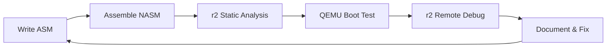

# ⚙️ FASE 2: Hardware x86 + Bootloaders + r2 Debug (90h)

## 🎯 Objetivos da Fase
- Dominar arquitetura x86 (modo real/protegido)
- Desenvolver bootloaders do zero
- Usar r2 para debug em modo real/protegido
- Reverse engineer bootloaders existentes

## 📊 Estrutura da Fase
```
FASE_2_HARDWARE/
├── modulos/           # Teoria x86 + assembly
├── exercicios/        # Práticas com r2 analysis
├── projetos/          # Bootloaders progressivos
├── recursos/          # Referências técnicas
├── r2-analysis/       # Templates análise r2
└── bootloaders/       # Código fonte bootloaders
```

## 🎓 Competências Desenvolvidas
- **Hardware x86:** Segmentação, paginação, interrupções
- **Assembly:** NASM, instruções x86, modo real/protegido
- **Bootloader:** MBR, multi-stage, filesystem básico
- **r2 Debug:** Modo 16-bit, breakpoints, memory analysis
- **QEMU:** Virtualization, debugging, hardware emulation

## 📅 Cronograma (6 semanas)
| Semana | Módulo | Foco | r2 Skills |
|--------|---------|-------|-----------|
| 1-2 | Hardware x86 | Teoria + análise GRUB | Static analysis |
| 3-4 | Bootloader Básico | Assembly + debug | 16-bit debugging |
| 5-6 | Bootloader Avançado | Multi-stage + FS | Dynamic tracing |

## ✅ Checkpoints de Validação
- [ ] **Checkpoint 2.1:** Análise GRUB completa com r2
- [ ] **Checkpoint 2.2:** Bootloader 512 bytes funcional
- [ ] **Checkpoint 2.3:** Multi-stage bootloader + kernel loading

## 🚀 Projetos Principais
1. **GRUB Analysis:** Reverse engineering completo bootloader real
2. **Minimal Bootloader:** 512 bytes com r2 analysis step-by-step
3. **Advanced Bootloader:** Multi-stage + basic filesystem

## 📘 Módulos Detalhados
### Módulo 2.1: Hardware x86 + r2 Analysis (30h)
- Arquitetura x86: registradores, flags, modos
- Segmentação vs paginação
- Sistema de interrupções
- r2 em modo 16-bit: `r2 -b 16`
- Análise GRUB bootloader com r2

### Módulo 2.2: Bootloader Development (30h)
- Assembly com NASM
- MBR e boot process
- BIOS interrupts (INT 10h, 13h)
- QEMU + r2 remote debugging
- Debugging modo real com r2

### Módulo 2.3: Advanced Bootloader (30h)
- Multi-stage bootloader
- A20 line enabling
- GDT setup
- Kernel loading
- Filesystem básico (FAT12)

## 🔧 r2 Integration Highlights
### Bootloader Analysis Workflow


### Specialized r2 Commands
```bash
# 16-bit analysis
r2 -b 16 bootloader.bin
> e asm.arch=x86
> e asm.bits=16
> pdf

# Remote debugging
qemu-system-i386 -drive format=raw,file=boot.bin -S -s
r2 -d gdb://localhost:1234
> db 0x7c00
> dc
```

## 📚 Recursos Essenciais
- Intel Software Developer Manual
- OSDev Wiki - Bootloaders
- NASM Documentation
- QEMU Documentation
- r2 book - 16-bit debugging section

## ➡️ Pré-requisitos FASE 3
- Bootloader funcional carregando kernel
- Proficiência r2 modo real/protegido
- QEMU setup para kernel debugging
- Assembly x86 intermediate level