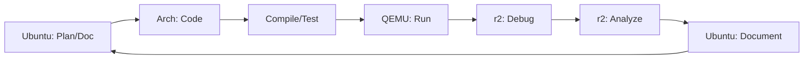

# 🚀 ROTEIRO GERAL - Trilha OS Development + Radare2 Integrada

## 📋 Visão Geral da Trilha OSR2
- **Nome:** OS Development + Radare2 Integration (OSR2)
- **Duração:** 420+ horas (7 meses intensivos)
- **Diferencial:** Única trilha que combina OS Dev + Binary Analysis profissional
- **Resultado:** Expertise completa em sistemas operacionais + análise binária

## 🎯 Objetivo Final
Formar **especialista completo** em desenvolvimento de sistemas operacionais com domínio profissional de análise binária usando Radare2, preparando para posições senior em:
- Embedded Systems Development
- Kernel/Driver Development
- Security Research & Reverse Engineering
- Performance Engineering
- Systems Programming

---

## 📊 Estrutura das Fases

### 🔧 FASE 0: Ambiente Dual + r2 Setup (25h)
**Foco:** Preparação completa Ubuntu + Arch + Radare2
- Configuração Arch Linux especializada
- Instalação e domínio r2 básico
- Workflow dual-distro otimizado
- Primeiro projeto com análise r2

**Checkpoint:** ✅ Ambiente dual funcional + r2 comandos básicos

### 💻 FASE 1: C/C++ + Análise Binária (70h)
**Foco:** Fundamentos + integração r2 desde início
- C/C++ para sistemas operacionais
- r2 para análise estática e dinâmica
- Debugging tradicional vs r2
- Projetos com análise completa

**Checkpoint:** ✅ Proficiência C/C++ + r2 básico/intermediário

### ⚙️ FASE 2: Hardware + Bootloaders (90h)
**Foco:** x86 + bootloader development + r2 debug
- Arquitetura x86 (modo real/protegido)
- Desenvolvimento bootloaders progressivos
- r2 debugging em modo 16-bit
- QEMU + r2 remote debugging

**Checkpoint:** ✅ Bootloader funcional + r2 hardware debugging

### 🖥️ FASE 3: Kernel Development (90h)
**Foco:** Kernel completo + r2 advanced debugging
- Kernel monolítico do zero
- VFS implementation
- r2 kernel debugging mastery
- Crash analysis sistemática

**Checkpoint:** ✅ Kernel básico + VFS + r2 expert debugging

### 🔄 FASE 4: Processos + Multitasking (90h)
**Foco:** Concorrência + r2 process tracing
- Sistema multitasking completo
- Scheduling algorithms
- r2 process/thread tracing
- Race condition debugging

**Checkpoint:** ✅ OS multitask + r2 concurrency analysis

### 🔌 FASE 5: I/O + Drivers + Production (85h)
**Foco:** Sistema completo + r2 hardware analysis
- Device drivers development
- Network stack básico
- r2 hardware reverse engineering
- OS production-ready

**Checkpoint:** ✅ Sistema operacional completo + r2 mastery

---

## 🛠️ Stack Tecnológico Integrado

### Ambiente Principal (Ubuntu 24.04)
- VSCode + Remote WSL integration
- Git + GitHub workflow
- Documentação e tracking
- Backup e sincronização

### Ambiente Especializado (Arch Linux)
- GCC + cross-compilation toolchain
- NASM + assembly development
- QEMU + hardware virtualization
- **Radare2 + análise framework**
- GDB + debugging tradicional

### Ferramentas r2 Progressivas
```
FASE 0-1: r2 básico     → Static analysis, disassembly
FASE 2:   r2 hardware   → 16-bit debugging, bootloaders
FASE 3:   r2 kernel     → Remote debugging, crash analysis
FASE 4:   r2 processes  → Dynamic tracing, concurrency
FASE 5:   r2 expert     → Hardware RE, production analysis
```

---

## 🎓 Metodologia de Aprendizado

### Workflow Diário Típico


### Princípios Pedagógicos
1. **r2-First Approach:** Integrar análise desde o início
2. **Incremental Complexity:** Cada fase builds na anterior
3. **Hands-on Learning:** Mais prática que teoria
4. **Real-world Focus:** Projetos aplicáveis profissionalmente
5. **Documentation:** Criar portfolio demonstrável

---

## 📈 Sistema de Validação

### Checkpoints por Fase
Cada fase tem **3 checkpoints principais**:
- **Teórico:** Conceitos fundamentais dominados
- **Prático:** Projeto funcional implementado
- **r2 Analysis:** Documentação completa análise r2

### Critérios de Progressão
- ✅ **Funcionalidade:** Código deve funcionar corretamente
- ✅ **r2 Mastery:** Análise completa documentada
- ✅ **Understanding:** Explicar conceitos claramente
- ✅ **Portfolio:** Projeto demonstrável criado

---

## 🏆 Diferenciais Únicos da Trilha OSR2

### vs Trilhas Tradicionais OS Dev
```markdown
✅ ADICIONADO: Radare2 expertise profissional
✅ ADICIONADO: Binary analysis systematic integration
✅ ADICIONADO: Hardware reverse engineering
✅ ADICIONADO: Production debugging workflows
✅ ADICIONADO: Security analysis mindset

🔄 MELHORADO: Debug capabilities exponencialmente
🔄 MELHORADO: Market relevance significativamente
🔄 MELHORADO: Problem-solving skills avançado
🔄 MELHORADO: Professional readiness completo
```

### Valor de Mercado
- **Salary Range:** $120k-200k+ (senior embedded/kernel)
- **Tool Savings:** $3000+ (vs IDA Pro license)
- **Skill Rarity:** <1% desenvolvedores têm esta combinação
- **Industries:** Embedded, security, gaming, fintech, aerospace

---

## 🚀 Como Usar Esta Trilha

### 1. Preparação Inicial
```markdown
"Claude, iniciar FASE 0 - configuração ambiente dual"
```

### 2. Progressão por Fase
```markdown
"Claude, iniciar FASE X"
"Claude, checkpoint FASE X.Y"
"Claude, validar progresso FASE X"
```

### 3. Tracking Contínuo
```markdown
"Claude, atualizar progresso - completei [atividade]"
"Claude, sessão de estudo" (iniciar/encerrar)
```

### 4. Suporte Especializado
```markdown
"Claude, explicar conceito [X] com r2 integration"
"Claude, debugar problema [Y] usando r2"
"Claude, criar exercício [Z] com validação"
```

---

## 📚 Recursos de Aprendizado

### Documentação Interna
- **Manuais:** `/documentacao/manuais/`
- **Guias Rápidos:** `/documentacao/guias-rapidos/`
- **Troubleshooting:** `/documentacao/troubleshooting/`
- **Best Practices:** `/documentacao/best-practices/`

### r2 Resources
- **Tutorials:** `/radare2-integration/tutorials/`
- **Scripts:** `/radare2-integration/scripts/`
- **Configs:** `/radare2-integration/configs/`
- **Templates:** `/radare2-integration/analysis-templates/`

### Referências Externas
- Intel Software Developer Manual
- Radare2 Book (book.rada.re)
- OSDev Wiki
- Linux Kernel Development (Love)

---

## 🎯 Call to Action

### Comando para Começar AGORA
```markdown
"Claude, iniciar FASE 0 da trilha OSR2"
```

### O que Acontece
1. ✅ **Verificação ambiente** atual
2. ✅ **Criação guias** específicos para sua configuração
3. ✅ **Setup tracking** personalizado
4. ✅ **Primeiro exercício** r2 básico

---

**Esta trilha transformará você de iniciante em expert profissional em OS Development + Binary Analysis - uma combinação única no mercado!**

---

**Trilha Criada:** 2025-09-04  
**Versão:** 3.0 - Estrutura Completa  
**Status:** 🚀 Pronta para execução  
**Diferencial:** Única no mundo combinando OS Dev + r2 Integration**