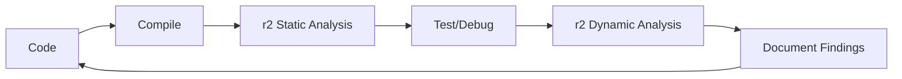

# 🏗️ [NOME DO PROJETO] - Projeto Integrado OSR2

## 📋 Visão Geral
- **Objetivo:** [Descrição do projeto]
- **Duração:** [X semanas/horas]
- **Complexidade:** [Básico/Intermediário/Avançado]
- **r2 Integration:** [Nível de integração r2]

## 🎯 Objetivos de Aprendizado
### Técnicos
- [Objetivo técnico 1]
- [Objetivo técnico 2]
- [Objetivo técnico 3]

### r2 Analysis Skills
- [Skill r2 1]
- [Skill r2 2]
- [Skill r2 3]

## 📊 Especificações Técnicas
### Funcionalidades Core
- [ ] Funcionalidade 1
- [ ] Funcionalidade 2
- [ ] Funcionalidade 3

### r2 Analysis Requirements
- [ ] Static analysis completa
- [ ] Dynamic analysis (se aplicável)
- [ ] Performance profiling
- [ ] Security assessment básico

## 🚀 Timeline de Desenvolvimento

### Semana 1: [Fase Inicial]
- [ ] Setup inicial do projeto
- [ ] Implementação core básica
- [ ] Primeira análise r2

### Semana 2: [Desenvolvimento]
- [ ] Funcionalidades principais
- [ ] r2 dynamic analysis
- [ ] Debugging e correções

### Semana 3: [Finalização] (se aplicável)
- [ ] Polimento e otimização
- [ ] Documentação r2 completa
- [ ] Validação final

## 🔧 r2 Integration Methodology
### Development Workflow

### r2 Analysis Checkpoints
1. **Static Analysis:** [Após implementação inicial]
2. **Dynamic Analysis:** [Durante debugging]
3. **Performance Analysis:** [Pré-finalização]
4. **Security Review:** [Final]

## 📝 Entregáveis

### Código
- [ ] Source code comentado
- [ ] Makefile/build system
- [ ] README com instruções

### r2 Documentation
- [ ] `[projeto]-static-analysis.md`
- [ ] `[projeto]-dynamic-analysis.md` (se aplicável)
- [ ] `[projeto]-performance-report.md`
- [ ] `[projeto]-lessons-learned.md`

### Demo/Tests
- [ ] Script de demonstração
- [ ] Test cases básicos
- [ ] Performance benchmarks

## ✅ Critérios de Sucesso

### Funcionalidade (60%)
- [ ] Todos os requisitos implementados
- [ ] Sistema funciona conforme especificado
- [ ] Error handling apropriado

### r2 Analysis Quality (30%)
- [ ] Static analysis completa e documentada
- [ ] Dynamic analysis com insights úteis
- [ ] Performance metrics coletados
- [ ] Security considerations documentadas

### Code Quality (10%)
- [ ] Código limpo e comentado
- [ ] Build system funcional
- [ ] Documentação clara

## 🎓 Learning Outcomes
Após completar este projeto, você será capaz de:
- [Learning outcome 1]
- [Learning outcome 2]
- [Learning outcome 3]

## 🔗 Conexões com Trilha
### Pré-requisitos desta Fase
- [Conceito/projeto anterior necessário]

### Preparação para Próxima Fase
- [Como este projeto prepara para próxima fase]

## 📚 Recursos Suporte
### Documentação Técnica
- [Recurso técnico 1]
- [Recurso técnico 2]

### r2 Resources
- [r2 tutorial específico]
- [r2 commands reference]

## 🚨 Common Pitfalls & Solutions
### Problema Comum 1
**Sintoma:** [Descrição do problema]
**Causa:** [Causa provável]
**Solução:** [Como resolver]
**r2 Debug:** [Como usar r2 para diagnosticar]

### Problema Comum 2
[Similar structure]

## 🎯 Extensions & Variations
### Para Estudantes Avançados
- [Extension 1]
- [Extension 2]

### Alternative Implementations
- [Alternativa 1]
- [Alternativa 2]

---

**Projeto Criado:** [Data]  
**Fase:** [FASE X]  
**r2 Level:** [Básico/Intermediário/Avançado]  
**Portfolio Ready:** [Yes/No]