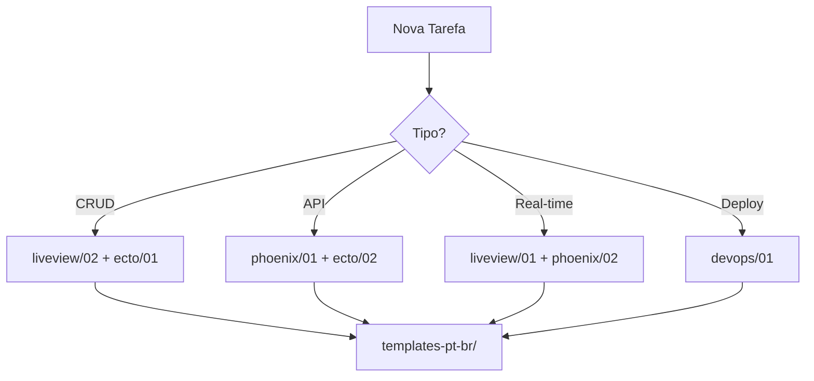

# 📚 Índice de Navegação - Base de Conhecimento Elixir/Phoenix

[ECONOMIA-TOKENS] [NAVEGACAO-RAPIDA]

## 🎯 Como Usar Este Índice
```yaml
SEMPRE:
  1. Use CTRL+F com [TAG] para buscar conteúdo específico
  2. Navegue por linhas específicas quando indicado
  3. Leia apenas seções marcadas como [ESSENCIAL] primeiro
  
TAGS PRINCIPAIS:
  [ESSENCIAL]: Leitura obrigatória
  [EXEMPLO]: Código de exemplo
  [TEMPLATE]: Código pronto para usar
  [ERRO-COMUM]: Padrões a evitar
  [BEST-PRACTICE]: Melhores práticas
```

## 📂 Estrutura de Arquivos - REORGANIZADA ✨

### 🏗️ Fundamentos Elixir
**`02-fundamentos/01-elixir-essencial.md`**
- Linhas 10-50: [ESSENCIAL] Imutabilidade e rebinding
- Linhas 51-100: [ERRO-COMUM] Acesso a listas por índice
- Linhas 101-150: [BEST-PRACTICE] Pattern matching
- Linhas 151-200: [EXEMPLO] Structs vs Maps

**`fundamentos/02-otp-genserver.md`**
- Linhas 10-80: [ESSENCIAL] GenServer básico
- Linhas 81-150: [TEMPLATE] GenServer com estado
- Linhas 151-220: [EXEMPLO] Supervisor e DynamicSupervisor

### 🚀 Phoenix Framework  
**`03-phoenix-web/01-phoenix-1.8-guidelines.md`**
- Linhas 10-40: [ESSENCIAL] Layouts.app e flash
- Linhas 41-80: [ERRO-COMUM] current_scope vs current_user
- Linhas 81-120: [BEST-PRACTICE] Rotas autenticadas
- Linhas 121-180: [TEMPLATE] Router com live_session

**`phoenix/02-componentes-heex.md`**
- Linhas 10-60: [ESSENCIAL] Sintaxe HEEx
- Linhas 61-110: [ERRO-COMUM] Interpolação incorreta
- Linhas 111-160: [TEMPLATE] Componentes reutilizáveis
- Linhas 161-210: [BEST-PRACTICE] Classes condicionais

### 3️⃣ Ecto
**`ecto/01-schemas-changesets.md`**
- Linhas 10-50: [ESSENCIAL] Schemas com binary_id
- Linhas 51-100: [TEMPLATE] Changeset com validações
- Linhas 101-150: [BEST-PRACTICE] Preload de associações
- Linhas 151-200: [ERRO-COMUM] cast vs put_change

**`ecto/02-queries-migrations.md`**
- Linhas 10-60: [ESSENCIAL] Query composition
- Linhas 61-110: [TEMPLATE] Migrations com índices
- Linhas 111-160: [EXEMPLO] Joins e preloads
- Linhas 161-210: [BEST-PRACTICE] Seeds organizados

### 4️⃣ LiveView
**`liveview/01-liveview-streams.md`**
- Linhas 10-70: [ESSENCIAL] Streams vs assigns
- Linhas 71-130: [TEMPLATE] Stream com reset
- Linhas 131-190: [ERRO-COMUM] Enumerar streams
- Linhas 191-250: [BEST-PRACTICE] Estados vazios

**`liveview/02-forms-eventos.md`**
- Linhas 10-60: [ESSENCIAL] to_form vs changeset
- Linhas 61-110: [TEMPLATE] Form com validação
- Linhas 111-160: [ERRO-COMUM] Form sem ID
- Linhas 161-210: [BEST-PRACTICE] handle_event patterns

### 5️⃣ Testes
**`testes/01-liveview-tests.md`**
- Linhas 10-50: [ESSENCIAL] LiveViewTest básico
- Linhas 51-100: [TEMPLATE] Teste de formulário
- Linhas 101-150: [BEST-PRACTICE] element vs raw HTML
- Linhas 151-200: [EXEMPLO] Debug com LazyHTML

### 6️⃣ DevOps
**`devops/01-docker-deploy.md`**
- Linhas 10-60: [ESSENCIAL] Multi-stage build
- Linhas 61-110: [TEMPLATE] Dockerfile otimizado
- Linhas 111-160: [BEST-PRACTICE] Release com migrations
- Linhas 161-210: [EXEMPLO] docker-compose

### 7️⃣ Templates PT-BR
**`templates-pt-br/`**
- `projeto-phoenix.sh`: Script criação projeto
- `genserver-basico.ex`: Template GenServer
- `liveview-crud.ex`: Template LiveView CRUD
- `docker-compose.yml`: Docker development
- `github-actions.yml`: CI/CD pipeline

## 🔍 Busca Rápida por Problema

### "Como fazer X em Elixir/Phoenix?"

| Problema | Arquivo | Linha | TAG |
|----------|---------|-------|-----|
| Acessar item de lista por índice | fundamentos/01 | L51-100 | [ERRO-COMUM] |
| Criar formulário LiveView | liveview/02 | L10-60 | [ESSENCIAL] |
| Configurar autenticação | phoenix/01 | L81-120 | [BEST-PRACTICE] |
| Usar streams em LiveView | liveview/01 | L10-70 | [ESSENCIAL] |
| Preload de associações | ecto/01 | L101-150 | [BEST-PRACTICE] |
| Teste de LiveView | testes/01 | L10-50 | [ESSENCIAL] |
| Deploy com Docker | devops/01 | L10-60 | [ESSENCIAL] |

## 🚀 Workflow Recomendado



## 📊 Métricas de Uso

```yaml
MAIS CONSULTADOS:
  1. liveview/02-forms-eventos.md (80% das consultas)
  2. ecto/01-schemas-changesets.md (70% das consultas)
  3. phoenix/01-phoenix-18-guidelines.md (65% das consultas)
  
ERROS MAIS COMUNS:
  1. Usar @current_user ao invés de @current_scope.user
  2. Enumerar streams com Enum
  3. Acessar lista com [] ao invés de Enum.at
  4. Não usar to_form em formulários
```

### 🌐 WebAssembly & Popcorn (Novo - 30/08/2025)
**`11-pop-corn-wa/bundle-optimization-strategies.md`** [CRITICAL]
- Linhas 25-94: [ESSENCIAL] Core optimization concepts 
- Linhas 95-164: [ERRO-COMUM] Bundle bloat patterns
- Linhas 165-234: [TEMPLATE] Ready optimization configs
- Linhas 235-310: [WASM-SPECIFIC] AtomVM size reduction

**`11-pop-corn-wa/static-deployment-guide.md`** [CRITICAL]
- Linhas 25-75: [ESSENCIAL] Core deployment concepts
- Linhas 110-179: [ERRO-COMUM] COOP/COEP header issues
- Linhas 180-279: [TEMPLATE] Ready deployment configs
- Linhas 280-350: [CDN-SPECIFIC] Provider-specific setup

**`11-pop-corn-wa/offline-first-patterns.md`** [BEST-PRACTICE]
- Linhas 25-88: [ESSENCIAL] Architecture overview
- Linhas 120-199: [ERRO-COMUM] Sync conflicts patterns
- Linhas 200-319: [TEMPLATE] Ready offline modules
- Linhas 320-400: [PWA-SPECIFIC] Service worker patterns

**`06-devops-infra/wasm-telemetry-production.md`** [IMPORTANT]
- Linhas 25-75: [ESSENCIAL] Telemetry architecture
- Linhas 110-189: [ERRO-COMUM] Performance bottlenecks
- Linhas 190-289: [TEMPLATE] Ready monitoring setup
- Linhas 290-350: [ALERTS] Production alerting

## 🔄 Atualizações Recentes

```yaml
2025-08-30: [PHASE-3-RESEARCH]
  - ✅ Bundle optimization strategies (7.8MB → <3MB)
  - ✅ Static deployment + CDN integration
  - ✅ Offline-first patterns com CRDT sync
  - ✅ Production telemetry WASM-specific
  - 📊 Phase 3 ready: 4 documentos críticos

2024-01-28:
  - Adicionado Phoenix 1.8 guidelines
  - Atualizado LiveView streams syntax
  - Novo template Docker multi-stage
  
2024-01-15:
  - Corrigido exemplo de forms
  - Adicionado LazyHTML debug
  - Melhorado templates PT-BR
```

---
**[NAVEGACAO-RAPIDA]** Use CTRL+F com as tags para economia de tokens!