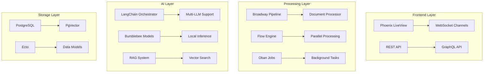

# Guia de Implementação: IA e Processamento de Documentos no Ecossistema Elixir

*Última atualização: 15 de Agosto de 2025*  
*Versão: 1.0.0*

## 📋 Sumário

1. [Visão Geral](#visão-geral)
2. [Arquitetura do Sistema](#arquitetura-do-sistema)
3. [Pipeline de Processamento de Documentos](#pipeline-de-processamento-de-documentos)
4. [Integração com LLMs](#integração-com-llms)
5. [Sistema RAG (Retrieval-Augmented Generation)](#sistema-rag-retrieval-augmented-generation)
6. [Agentes Inteligentes](#agentes-inteligentes)
7. [Casos de Uso Práticos](#casos-de-uso-práticos)
8. [Deployment e Monitoramento](#deployment-e-monitoramento)

---

## 🎯 Visão Geral

Este guia apresenta implementações práticas e production-ready para sistemas de processamento de documentos com IA no ecossistema Elixir/BEAM. As soluções aproveitam as características únicas do BEAM: concorrência massiva, tolerância a falhas e processamento distribuído.

### Principais Componentes

- **Broadway**: Pipelines de processamento com backpressure
- **LangChain**: Orquestração de múltiplos LLMs
- **Bumblebee**: Modelos locais com Hugging Face
- **Flow**: Processamento paralelo de dados
- **Jido/Agens**: Sistemas multi-agente
- **PgVector**: Vector search para RAG

### Benefícios do Ecossistema BEAM

✅ **Concorrência**: 2M+ processos simultâneos  
✅ **Resiliência**: Supervision trees e fault tolerance  
✅ **Escalabilidade**: Distribuição transparente  
✅ **Real-time**: LiveView para interfaces interativas  
✅ **Hot-reload**: Atualizações sem downtime  

---

## 🏗️ Arquitetura do Sistema

### Visão Macro



### Implementação Base

```elixir
defmodule AIDocumentProcessor.Application do
  use Application
  
  @impl true
  def start(_type, _args) do
    children = [
      # Database
      AIDocumentProcessor.Repo,
      
      # PubSub
      {Phoenix.PubSub, name: AIDocumentProcessor.PubSub},
      
      # Job processor
      {Oban, Application.fetch_env!(:ai_processor, Oban)},
      
      # Document pipeline
      AIDocumentProcessor.Pipeline.DocumentProcessor,
      
      # AI orchestrator
      AIDocumentProcessor.AI.Orchestrator,
      
      # Agent system
      AIDocumentProcessor.Agents.Supervisor,
      
      # Web endpoint
      AIDocumentProcessorWeb.Endpoint,
      
      # Telemetry
      AIDocumentProcessorWeb.Telemetry
    ]
    
    opts = [strategy: :one_for_one, name: AIDocumentProcessor.Supervisor]
    Supervisor.start_link(children, opts)
  end
end
```

---

## 📄 Pipeline de Processamento de Documentos

### Broadway Pipeline Completo

```elixir
defmodule AIDocumentProcessor.Pipeline.DocumentProcessor do
  use Broadway
  
  alias AIDocumentProcessor.{
    Documents,
    TextExtractor,
    Chunker,
    Embeddings,
    LLMAnalyzer,
    Storage
  }
  
  @impl true
  def start_link(_opts) do
    Broadway.start_link(__MODULE__,
      name: __MODULE__,
      producer: configure_producer(),
      processors: [
        default: [
          concurrency: System.schedulers_online() * 2,
          min_demand: 5,
          max_demand: 10
        ]
      ],
      batchers: [
        extraction: [concurrency: 4, batch_size: 10, batch_timeout: 1_000],
        embedding: [concurrency: 2, batch_size: 20, batch_timeout: 2_000],
        analysis: [concurrency: 3, batch_size: 5, batch_timeout: 5_000]
      ],
      partition_by: &partition_function/1
    )
  end
  
  defp configure_producer do
    [
      module: {BroadwayRabbitMQ.Producer,
        queue: "documents",
        connection: [
          username: System.get_env("RABBITMQ_USER"),
          password: System.get_env("RABBITMQ_PASS"),
          host: System.get_env("RABBITMQ_HOST")
        ],
        qos: [prefetch_count: 50]
      },
      concurrency: 2,
      rate_limiting: [
        allowed_messages: 100,
        interval: 1_000
      ]
    ]
  end
  
  @impl true
  def handle_message(_processor, message, _context) do
    message
    |> decode_message()
    |> validate_document()
    |> assign_processing_stage()
    |> Message.put_batch_key()
  end
  
  @impl true
  def handle_batch(:extraction, messages, _batch_info, _context) do
    messages
    |> Enum.map(&extract_text/1)
    |> handle_extraction_results()
  end
  
  @impl true
  def handle_batch(:embedding, messages, _batch_info, _context) do
    messages
    |> generate_embeddings_batch()
    |> store_embeddings()
  end
  
  @impl true
  def handle_batch(:analysis, messages, _batch_info, _context) do
    messages
    |> analyze_with_llm_batch()
    |> store_analysis_results()
  end
  
  # Text extraction from various formats
  defp extract_text(message) do
    document = Message.data(message)
    
    result = case document.format do
      :pdf -> extract_pdf(document)
      :docx -> extract_docx(document)
      :html -> extract_html(document)
      :txt -> {:ok, document.content}
      :image -> extract_with_ocr(document)
      _ -> {:error, :unsupported_format}
    end
    
    case result do
      {:ok, text} ->
        Message.update_data(message, fn data ->
          Map.put(data, :extracted_text, text)
        end)
      {:error, reason} ->
        Message.failed(message, reason)
    end
  end
  
  defp extract_pdf(document) do
    # Using Rust NIF for performance
    case PdfExtractor.extract(document.content) do
      {:ok, text} -> {:ok, text}
      {:error, _} -> extract_with_ocr(document)
    end
  end
  
  defp extract_with_ocr(document) do
    # Tesseract OCR integration
    with {:ok, image} <- prepare_image(document),
         {:ok, text} <- Tesseract.extract_text(image) do
      {:ok, text}
    end
  end
  
  # Batch embedding generation
  defp generate_embeddings_batch(messages) do
    texts = Enum.map(messages, fn msg ->
      msg.data.extracted_text
    end)
    
    # Using Bumblebee for local embeddings
    {:ok, model} = Bumblebee.load_model({:hf, "sentence-transformers/all-MiniLM-L6-v2"})
    {:ok, tokenizer} = Bumblebee.load_tokenizer({:hf, "sentence-transformers/all-MiniLM-L6-v2"})
    
    serving = Bumblebee.Text.text_embedding(model, tokenizer,
      compile: [batch_size: 32],
      defn_options: [compiler: EXLA]
    )
    
    embeddings = Nx.Serving.batched_run(serving, texts)
    
    Enum.zip(messages, embeddings)
    |> Enum.map(fn {message, embedding} ->
      Message.update_data(message, fn data ->
        Map.put(data, :embedding, embedding)
      end)
    end)
  end
  
  # LLM analysis batch processing
  defp analyze_with_llm_batch(messages) do
    # Group by document type for optimized prompts
    grouped = Enum.group_by(messages, fn msg ->
      msg.data.document_type
    end)
    
    Enum.flat_map(grouped, fn {doc_type, msgs} ->
      prompt = get_analysis_prompt(doc_type)
      
      msgs
      |> Enum.map(fn msg ->
        Task.async(fn ->
          analyze_single_document(msg, prompt)
        end)
      end)
      |> Task.await_many(30_000)
    end)
  end
  
  defp analyze_single_document(message, prompt) do
    text = message.data.extracted_text
    
    result = LLMAnalyzer.analyze(%{
      text: text,
      prompt: prompt,
      providers: [:openai, :anthropic],
      consensus: true
    })
    
    Message.update_data(message, fn data ->
      Map.put(data, :analysis, result)
    end)
  end
end
```

### Chunking e Preprocessamento

```elixir
defmodule AIDocumentProcessor.TextChunker do
  @default_chunk_size 500
  @default_overlap 50
  
  def chunk_document(text, opts \\ []) do
    chunk_size = Keyword.get(opts, :chunk_size, @default_chunk_size)
    overlap = Keyword.get(opts, :overlap, @default_overlap)
    strategy = Keyword.get(opts, :strategy, :semantic)
    
    case strategy do
      :semantic -> semantic_chunking(text, chunk_size, overlap)
      :fixed -> fixed_chunking(text, chunk_size, overlap)
      :sentence -> sentence_based_chunking(text, chunk_size)
      :markdown -> markdown_aware_chunking(text, chunk_size)
    end
  end
  
  defp semantic_chunking(text, chunk_size, overlap) do
    # Use NLP to find semantic boundaries
    sentences = split_into_sentences(text)
    
    sentences
    |> build_semantic_chunks(chunk_size)
    |> add_overlap(overlap)
    |> Enum.with_index()
    |> Enum.map(fn {chunk, index} ->
      %{
        id: UUID.uuid4(),
        index: index,
        content: chunk,
        tokens: count_tokens(chunk),
        metadata: extract_chunk_metadata(chunk)
      }
    end)
  end
  
  defp split_into_sentences(text) do
    # Using pragmatic_segmenter logic
    text
    |> String.split(~r/(?<=[.!?])\s+/)
    |> Enum.reject(&(&1 == ""))
  end
  
  defp build_semantic_chunks(sentences, target_size) do
    sentences
    |> Enum.reduce({[], []}, fn sentence, {chunks, current} ->
      current_size = Enum.join(current, " ") |> String.length()
      
      if current_size + String.length(sentence) > target_size && current != [] do
        {[Enum.join(current, " ") | chunks], [sentence]}
      else
        {chunks, current ++ [sentence]}
      end
    end)
    |> then(fn {chunks, current} ->
      if current == [] do
        Enum.reverse(chunks)
      else
        Enum.reverse([Enum.join(current, " ") | chunks])
      end
    end)
  end
  
  defp markdown_aware_chunking(text, chunk_size) do
    # Parse markdown structure
    {:ok, ast, _} = EarmarkParser.as_ast(text)
    
    ast
    |> flatten_ast()
    |> group_by_headers()
    |> merge_small_sections(chunk_size)
    |> format_chunks()
  end
end
```

---

## 🤖 Integração com LLMs

### Orquestrador Multi-Provider

```elixir
defmodule AIDocumentProcessor.AI.Orchestrator do
  use GenServer
  
  alias LangChain.{Chains.LLMChain, ChatModels, Message}
  
  defstruct providers: %{},
            rate_limiters: %{},
            metrics: %{},
            fallback_chain: []
  
  def start_link(opts) do
    GenServer.start_link(__MODULE__, opts, name: __MODULE__)
  end
  
  @impl true
  def init(_opts) do
    state = %__MODULE__{
      providers: initialize_providers(),
      rate_limiters: initialize_rate_limiters(),
      fallback_chain: [:openai, :anthropic, :google, :local]
    }
    
    {:ok, state}
  end
  
  def analyze_document(document, opts \\ []) do
    GenServer.call(__MODULE__, {:analyze, document, opts}, 60_000)
  end
  
  @impl true
  def handle_call({:analyze, document, opts}, _from, state) do
    strategy = Keyword.get(opts, :strategy, :single)
    
    result = case strategy do
      :single -> analyze_with_single_provider(document, opts, state)
      :consensus -> analyze_with_consensus(document, opts, state)
      :chain -> analyze_with_chain(document, opts, state)
      :specialized -> analyze_with_specialized(document, opts, state)
    end
    
    {:reply, result, update_metrics(state, result)}
  end
  
  defp initialize_providers do
    %{
      openai: init_openai(),
      anthropic: init_anthropic(),
      google: init_google(),
      cohere: init_cohere(),
      local: init_local_model()
    }
  end
  
  defp init_openai do
    ChatModels.ChatOpenAI.new!(%{
      model: "gpt-4-turbo-preview",
      temperature: 0.1,
      api_key: System.get_env("OPENAI_API_KEY"),
      max_tokens: 4096,
      response_format: %{type: "json_object"}
    })
  end
  
  defp init_anthropic do
    ChatModels.ChatAnthropic.new!(%{
      model: "claude-3-opus-20240229",
      temperature: 0.1,
      api_key: System.get_env("ANTHROPIC_API_KEY"),
      max_tokens: 4096
    })
  end
  
  defp init_google do
    ChatModels.ChatVertexAI.new!(%{
      model: "gemini-1.5-pro",
      project_id: System.get_env("GCP_PROJECT_ID"),
      location: "us-central1",
      temperature: 0.1
    })
  end
  
  defp init_local_model do
    # Using Ollama for local inference
    ChatModels.ChatOllama.new!(%{
      model: "mixtral:8x7b",
      base_url: "http://localhost:11434",
      temperature: 0.1
    })
  end
  
  defp analyze_with_consensus(document, opts, state) do
    providers = Keyword.get(opts, :providers, [:openai, :anthropic, :google])
    threshold = Keyword.get(opts, :threshold, 0.8)
    
    # Parallel execution
    tasks = Enum.map(providers, fn provider ->
      Task.async(fn ->
        with_rate_limit(state.rate_limiters[provider], fn ->
          execute_analysis(state.providers[provider], document)
        end)
      end)
    end)
    
    results = Task.await_many(tasks, 30_000)
    
    # Calculate consensus
    consensus = calculate_consensus(results)
    
    if consensus.confidence >= threshold do
      {:ok, consensus}
    else
      {:needs_review, consensus}
    end
  end
  
  defp calculate_consensus(results) do
    valid_results = Enum.filter(results, &match?({:ok, _}, &1))
    
    if length(valid_results) < 2 do
      {:error, :insufficient_providers}
    else
      analyses = Enum.map(valid_results, fn {:ok, analysis} -> analysis end)
      
      %{
        primary_result: merge_analyses(analyses),
        confidence: calculate_confidence_score(analyses),
        agreements: find_agreements(analyses),
        disagreements: find_disagreements(analyses),
        provider_results: analyses
      }
    end
  end
  
  defp execute_analysis(provider, document) do
    prompt = build_analysis_prompt(document)
    
    {:ok, chain} = LLMChain.new(%{
      llm: provider,
      prompt: prompt,
      parser: &parse_llm_response/1
    })
    
    chain
    |> LLMChain.add_message(Message.new_user!(document.content))
    |> LLMChain.run()
    |> handle_llm_response()
  end
  
  defp build_analysis_prompt(document) do
    """
    Analyze the following document and extract:
    
    1. Document Type and Category
    2. Key Entities (people, organizations, locations, dates)
    3. Main Topics and Themes
    4. Sentiment Analysis
    5. Summary (max 200 words)
    6. Action Items (if any)
    7. Risk Indicators (if applicable)
    
    Document Type: #{document.type}
    Language: #{document.language}
    
    Respond in JSON format with the structure:
    {
      "document_type": "string",
      "category": "string",
      "entities": {
        "people": [],
        "organizations": [],
        "locations": [],
        "dates": []
      },
      "topics": [],
      "sentiment": {
        "overall": "positive|neutral|negative",
        "score": 0.0-1.0
      },
      "summary": "string",
      "action_items": [],
      "risk_indicators": []
    }
    
    Document Content:
    #{document.content}
    """
  end
  
  defp with_rate_limit(limiter, func) do
    case RateLimiter.check_and_update(limiter) do
      :ok -> func.()
      {:error, :rate_limited} -> {:error, :rate_limited}
    end
  end
end
```

### Function Calling e Tool Use

```elixir
defmodule AIDocumentProcessor.AI.ToolUse do
  @moduledoc """
  Implementação de function calling para LLMs
  """
  
  def create_tool_enabled_chain do
    tools = define_tools()
    
    LLMChain.new(%{
      llm: ChatModels.ChatOpenAI.new!(model: "gpt-4-turbo-preview"),
      tools: tools,
      tool_choice: "auto"
    })
  end
  
  defp define_tools do
    [
      %{
        type: "function",
        function: %{
          name: "search_knowledge_base",
          description: "Search internal knowledge base for relevant information",
          parameters: %{
            type: "object",
            properties: %{
              query: %{
                type: "string",
                description: "Search query"
              },
              filters: %{
                type: "object",
                properties: %{
                  category: %{type: "string"},
                  date_range: %{
                    type: "object",
                    properties: %{
                      start: %{type: "string"},
                      end: %{type: "string"}
                    }
                  }
                }
              }
            },
            required: ["query"]
          }
        }
      },
      %{
        type: "function",
        function: %{
          name: "extract_structured_data",
          description: "Extract structured data from text",
          parameters: %{
            type: "object",
            properties: %{
              text: %{type: "string"},
              schema: %{type: "object"}
            },
            required: ["text", "schema"]
          }
        }
      },
      %{
        type: "function",
        function: %{
          name: "validate_information",
          description: "Validate information against trusted sources",
          parameters: %{
            type: "object",
            properties: %{
              claim: %{type: "string"},
              sources: %{
                type: "array",
                items: %{type: "string"}
              }
            },
            required: ["claim"]
          }
        }
      }
    ]
  end
  
  def handle_tool_call(tool_name, arguments) do
    case tool_name do
      "search_knowledge_base" ->
        search_knowledge_base(arguments)
      "extract_structured_data" ->
        extract_structured_data(arguments)
      "validate_information" ->
        validate_information(arguments)
      _ ->
        {:error, :unknown_tool}
    end
  end
  
  defp search_knowledge_base(%{"query" => query} = args) do
    filters = Map.get(args, "filters", %{})
    
    KnowledgeBase.search(query, filters)
    |> format_search_results()
  end
end
```

---

## 🔍 Sistema RAG (Retrieval-Augmented Generation)

### Implementação Completa de RAG

```elixir
defmodule AIDocumentProcessor.RAG do
  @moduledoc """
  Sistema RAG completo com vector search e reranking
  """
  
  alias AIDocumentProcessor.{Repo, Embeddings, VectorStore}
  
  defstruct [:retriever, :generator, :reranker, :config]
  
  def build_knowledge_base(documents) do
    documents
    |> Stream.map(&process_document/1)
    |> Stream.flat_map(&chunk_document/1)
    |> Stream.map(&generate_embedding/1)
    |> Stream.chunk_every(100)
    |> Stream.each(&store_chunks/1)
    |> Stream.run()
  end
  
  def query(question, opts \\ []) do
    with {:ok, query_embedding} <- generate_query_embedding(question),
         {:ok, candidates} <- retrieve_candidates(query_embedding, opts),
         {:ok, reranked} <- rerank_candidates(question, candidates),
         {:ok, context} <- build_context(reranked),
         {:ok, response} <- generate_response(question, context) do
      
      {:ok, %{
        response: response,
        sources: extract_sources(reranked),
        confidence: calculate_confidence(response, reranked)
      }}
    end
  end
  
  defp process_document(document) do
    %{
      id: document.id,
      content: extract_clean_text(document),
      metadata: extract_metadata(document),
      type: document.type
    }
  end
  
  defp chunk_document(document) do
    TextChunker.chunk_document(document.content,
      strategy: :semantic,
      chunk_size: 512,
      overlap: 64
    )
    |> Enum.map(fn chunk ->
      Map.merge(chunk, %{
        document_id: document.id,
        document_metadata: document.metadata
      })
    end)
  end
  
  defp generate_embedding(chunk) do
    embedding = Embeddings.generate(chunk.content)
    Map.put(chunk, :embedding, embedding)
  end
  
  defp store_chunks(chunks) do
    Repo.transaction(fn ->
      Enum.each(chunks, fn chunk ->
        %VectorStore{
          content: chunk.content,
          embedding: chunk.embedding,
          document_id: chunk.document_id,
          chunk_index: chunk.index,
          metadata: chunk.metadata
        }
        |> Repo.insert!()
      end)
    end)
  end
  
  defp retrieve_candidates(query_embedding, opts) do
    top_k = Keyword.get(opts, :top_k, 20)
    threshold = Keyword.get(opts, :threshold, 0.7)
    
    # Vector similarity search
    vector_results = VectorStore.search_similar(query_embedding, top_k, threshold)
    
    # Hybrid search with BM25
    if Keyword.get(opts, :hybrid, true) do
      text_results = VectorStore.text_search(opts[:query], top_k)
      merge_search_results(vector_results, text_results)
    else
      {:ok, vector_results}
    end
  end
  
  defp rerank_candidates(question, candidates) do
    # Using cross-encoder for reranking
    reranker = get_reranker_model()
    
    scored_candidates = 
      candidates
      |> Enum.map(fn candidate ->
        score = compute_relevance_score(reranker, question, candidate.content)
        Map.put(candidate, :rerank_score, score)
      end)
      |> Enum.sort_by(& &1.rerank_score, :desc)
      |> Enum.take(5)
    
    {:ok, scored_candidates}
  end
  
  defp build_context(chunks) do
    context = chunks
    |> Enum.map(fn chunk ->
      """
      Source: #{chunk.document_id}
      Content: #{chunk.content}
      ---
      """
    end)
    |> Enum.join("\n")
    
    {:ok, context}
  end
  
  defp generate_response(question, context) do
    prompt = """
    Based on the following context, answer the question. 
    If the answer is not in the context, say "I don't have enough information to answer that."
    
    Context:
    #{context}
    
    Question: #{question}
    
    Answer:
    """
    
    LLMOrchestrator.generate(prompt, temperature: 0.1)
  end
  
  defp get_reranker_model do
    # Load cross-encoder model
    {:ok, model} = Bumblebee.load_model({:hf, "cross-encoder/ms-marco-MiniLM-L-6-v2"})
    {:ok, tokenizer} = Bumblebee.load_tokenizer({:hf, "cross-encoder/ms-marco-MiniLM-L-6-v2"})
    
    Bumblebee.Text.text_classification(model, tokenizer,
      compile: [batch_size: 32],
      defn_options: [compiler: EXLA]
    )
  end
end
```

### Vector Store com PgVector

```elixir
defmodule AIDocumentProcessor.VectorStore do
  use Ecto.Schema
  import Ecto.Query
  alias AIDocumentProcessor.Repo
  
  schema "vector_embeddings" do
    field :content, :string
    field :embedding, Pgvector.Ecto.Vector
    field :document_id, Ecto.UUID
    field :chunk_index, :integer
    field :metadata, :map
    
    timestamps()
  end
  
  def search_similar(query_embedding, limit \\ 10, threshold \\ 0.7) do
    embedding_string = Nx.to_list(query_embedding) |> Enum.join(",")
    
    query = from v in __MODULE__,
      where: fragment("1 - (embedding <-> ?::vector) > ?", ^embedding_string, ^threshold),
      order_by: fragment("embedding <-> ?::vector", ^embedding_string),
      limit: ^limit,
      select: %{
        id: v.id,
        content: v.content,
        document_id: v.document_id,
        similarity: fragment("1 - (embedding <-> ?::vector)", ^embedding_string),
        metadata: v.metadata
      }
    
    Repo.all(query)
  end
  
  def text_search(query_text, limit \\ 10) do
    from(v in __MODULE__,
      where: fragment(
        "to_tsvector('english', ?) @@ plainto_tsquery('english', ?)",
        v.content,
        ^query_text
      ),
      order_by: fragment(
        "ts_rank(to_tsvector('english', ?), plainto_tsquery('english', ?))",
        v.content,
        ^query_text
      ),
      limit: ^limit
    )
    |> Repo.all()
  end
  
  def hybrid_search(query_text, query_embedding, opts \\ []) do
    text_weight = Keyword.get(opts, :text_weight, 0.3)
    vector_weight = Keyword.get(opts, :vector_weight, 0.7)
    limit = Keyword.get(opts, :limit, 20)
    
    embedding_string = Nx.to_list(query_embedding) |> Enum.join(",")
    
    from(v in __MODULE__,
      order_by: fragment(
        "(?::float * ts_rank(to_tsvector('english', ?), plainto_tsquery('english', ?))) + 
         (?::float * (1 - (embedding <-> ?::vector)))",
        ^text_weight, v.content, ^query_text,
        ^vector_weight, ^embedding_string
      ),
      limit: ^limit
    )
    |> Repo.all()
  end
end
```

---

## 🤖 Agentes Inteligentes

### Sistema Multi-Agente com Jido

```elixir
defmodule AIDocumentProcessor.Agents do
  @moduledoc """
  Sistema de agentes inteligentes para processamento colaborativo
  """
  
  defmodule ResearchAgent do
    use Jido.Agent,
      name: "research_agent",
      description: "Researches and gathers information",
      version: "1.0.0"
    
    use Jido.Agent.Server
    
    actions do
      action :search_documents,
        description: "Search through document database",
        params: [
          query: [type: :string, required: true],
          filters: [type: :map, required: false]
        ]
      
      action :analyze_content,
        description: "Analyze document content",
        params: [
          content: [type: :string, required: true],
          analysis_type: [type: :atom, required: true]
        ]
      
      action :summarize,
        description: "Create summary of findings",
        params: [
          findings: [type: :list, required: true],
          max_length: [type: :integer, default: 500]
        ]
    end
    
    schema [
      knowledge_base: [type: :map, default: %{}],
      search_history: [type: :list, default: []],
      current_task: [type: :map, default: nil]
    ]
    
    @impl true
    def handle_action(:search_documents, params, agent) do
      results = DocumentSearch.search(params.query, params.filters)
      
      updated_agent = %{agent | 
        state: %{agent.state | 
          search_history: [params.query | agent.state.search_history]
        }
      }
      
      {:ok, results, updated_agent}
    end
    
    @impl true
    def handle_action(:analyze_content, params, agent) do
      analysis = ContentAnalyzer.analyze(params.content, params.analysis_type)
      
      # Update knowledge base
      updated_kb = Map.merge(agent.state.knowledge_base, %{
        params.content => analysis
      })
      
      updated_agent = %{agent |
        state: %{agent.state | knowledge_base: updated_kb}
      }
      
      {:ok, analysis, updated_agent}
    end
  end
  
  defmodule WriterAgent do
    use Jido.Agent,
      name: "writer_agent",
      description: "Creates and formats content"
    
    actions do
      action :generate_report,
        params: [
          data: [type: :map, required: true],
          template: [type: :atom, default: :standard]
        ]
      
      action :rewrite_content,
        params: [
          content: [type: :string, required: true],
          style: [type: :atom, required: true]
        ]
    end
    
    def handle_action(:generate_report, params, agent) do
      report = ReportGenerator.generate(params.data, params.template)
      {:ok, report, agent}
    end
  end
  
  defmodule CoordinatorAgent do
    use GenServer
    
    defstruct agents: %{},
              workflows: %{},
              active_tasks: []
    
    def start_link(opts) do
      GenServer.start_link(__MODULE__, opts, name: __MODULE__)
    end
    
    def execute_workflow(workflow_definition) do
      GenServer.call(__MODULE__, {:execute_workflow, workflow_definition})
    end
    
    @impl true
    def handle_call({:execute_workflow, workflow}, _from, state) do
      task_id = UUID.uuid4()
      
      # Start workflow execution
      task = Task.async(fn ->
        execute_workflow_steps(workflow, state.agents)
      end)
      
      updated_state = %{state |
        active_tasks: [{task_id, task} | state.active_tasks],
        workflows: Map.put(state.workflows, task_id, workflow)
      }
      
      {:reply, {:ok, task_id}, updated_state}
    end
    
    defp execute_workflow_steps(workflow, agents) do
      workflow.steps
      |> Enum.reduce(%{results: [], context: %{}}, fn step, acc ->
        result = execute_step(step, agents, acc.context)
        
        %{
          results: [result | acc.results],
          context: Map.merge(acc.context, result)
        }
      end)
    end
    
    defp execute_step(%{agent: agent_name, action: action, params: params}, agents, context) do
      agent = Map.get(agents, agent_name)
      
      # Inject context into params
      enriched_params = Map.merge(params, %{context: context})
      
      case Jido.Agent.perform(agent, action, enriched_params) do
        {:ok, result} -> %{agent_name => %{action => result}}
        {:error, reason} -> %{agent_name => %{error: reason}}
      end
    end
  end
end
