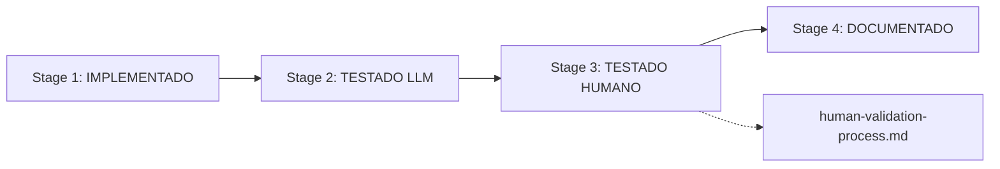

# Process Documentation - Healthcare CMS Development

<!-- DSM:PROCESSES:documentation L4:development_lifecycle HEALTHCARE:quality_assurance -->

## 📋 **Process Documentation Overview**

Esta pasta contém a documentação detalhada dos processos de desenvolvimento Healthcare CMS.

### **human-validation-process.md**
```yaml
Purpose: "Stage 3 do pipeline - Validação humana rigorosa"
Scope: "Code review, manual testing, compliance validation"
Critical: "Bottleneck atual - 73 requirements aguardando Stage 3"
```

## 🔄 **Process Flow Integration**

### **Pipeline de 4 Fases**


### **Related Documentation**
- `../reference/configuration/requirement-lifecycle-config.yml` - Pipeline configuration
- `../reference/requirement-progress-report.md` - Current bottlenecks
- `../../PIPELINE-4-FASES-README.md` - Complete overview

## 🚨 **Current Process Status**

### **Active Processes**
- **Human Validation (Stage 3)**: ⚠️ **SETUP NEEDED**
  - 73 requirements waiting for human validation
  - Process documented but not yet operational
  - Critical path blocker

### **Next Process Implementations**
- **Documentation Standards (Stage 4)**: Process to be defined
- **Quality Metrics Tracking**: Continuous improvement process
- **Process Automation**: Streamlining repetitive validations

## 🎯 **Process Usage Guidelines**

### **For Developers**
1. Consult process documentation before starting Stage 3
2. Follow checklists exactly as documented
3. Document deviations and improvements
4. Update process docs based on learnings

### **For Reviewers**
1. Use human-validation-process.md as definitive guide
2. Complete all validation checklist items
3. Document evidence as specified
4. Provide feedback for process improvement

---

**Process Owner**: Healthcare CMS Pipeline Team
**Review Cycle**: Weekly improvement sessions
**Last Updated**: September 2025