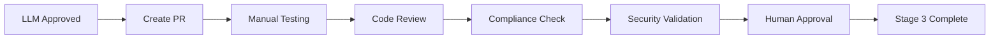

# 🧑‍💻 Human Validation Process - Stage 3 Healthcare CMS

<!-- DSM:PROCESS:human_validation L4:stage_3_requirements HEALTHCARE:manual_testing -->

## 🎯 **Propósito: Stage 2 → Stage 3 Transition**

**Objetivo**: Validar requirements aprovados por LLM através de teste e revisão humana rigorosa antes da fase de documentação.

**Status Current**: **CRÍTICO** - 73 requirements aguardando validação humana (bottleneck principal)

---

## 📋 **Checklist de Validação Humana (Stage 3)**

### **1. Code Review Obrigatório**
```yaml
Reviewer_Requirements:
  - Desenvolvedor sênior (3+ anos Elixir/Phoenix)
  - Conhecimento healthcare compliance
  - Experiência em Zero Trust architectures

Review_Checklist:
  ✅ Code quality e patterns consistency
  ✅ Healthcare compliance adherence (LGPD/CFM/ANVISA)
  ✅ Security best practices validation
  ✅ Performance optimization review
  ✅ Error handling completeness
  ✅ Test coverage adequacy (90%+)

Evidence_Required:
  - GitHub Pull Request aprovado
  - Comments de review addressing concerns
  - Approval formal do reviewer
```

### **2. Manual Testing Sistemático**
```yaml
Functional_Testing:
  ✅ Happy path scenarios
  ✅ Edge cases e error conditions
  ✅ Healthcare-specific workflows
  ✅ Multi-tenant isolation validation
  ✅ Permission/role boundary testing
  ✅ Performance under load

Healthcare_Specific_Tests:
  ✅ Medical professional validation (CRM/CRP)
  ✅ PHI/PII data protection verification
  ✅ LGPD consent management testing
  ✅ Audit trail completeness validation
  ✅ Emergency access protocols testing

Evidence_Required:
  - Manual testing checklist completo
  - Screenshots/videos de funcionalidades
  - Error scenarios documentation
  - Performance testing results
```

### **3. Compliance Validation Manual**
```yaml
LGPD_Compliance:
  ✅ Data minimization principles applied
  ✅ Consent management functional
  ✅ Right to erasure working
  ✅ Data portability validated
  ✅ Privacy by design confirmed

CFM_Professional_Validation:
  ✅ Medical professional identification
  ✅ Content approval workflows
  ✅ Medical disclaimer requirements
  ✅ Professional scope limitations

ANVISA_Medical_Device:
  ✅ Medical content validation
  ✅ Clinical decision support limits
  ✅ Software risk classification
  ✅ Audit trail for regulatory compliance

Evidence_Required:
  - Compliance testing report
  - Regulatory requirements mapping
  - Risk assessment documentation
```

### **4. Security Validation Humana**
```yaml
Zero_Trust_Validation:
  ✅ Policy engine decision validation
  ✅ Trust algorithm accuracy testing
  ✅ PEP enforcement verification
  ✅ Continuous verification working

Penetration_Testing:
  ✅ Input validation security
  ✅ Authentication bypass attempts
  ✅ Authorization boundary testing
  ✅ Data exposure prevention

Evidence_Required:
  - Security testing report
  - Vulnerability assessment
  - Mitigation strategies confirmed
```

---

## 🔄 **Process Workflow**

### **Stage 2 → Stage 3 Transition**


### **Step-by-Step Process**
1. **📋 Pre-Validation Setup**
   - Create Pull Request for requirement
   - Assign senior developer reviewer
   - Setup testing environment
   - Prepare compliance checklist

2. **🧪 Execute Manual Testing**
   - Run functional testing checklist
   - Perform healthcare-specific tests
   - Document edge cases and errors
   - Capture evidence (screenshots/videos)

3. **👨‍💻 Code Review Process**
   - Senior developer reviews code quality
   - Healthcare compliance validation
   - Security patterns verification
   - Performance optimization review

4. **⚖️ Compliance Validation**
   - LGPD compliance manual testing
   - CFM professional requirements check
   - ANVISA medical device validation
   - Audit trail verification

5. **🛡️ Security Validation**
   - Zero Trust architecture testing
   - Penetration testing execution
   - Vulnerability assessment
   - Security boundary validation

6. **✅ Final Human Approval**
   - Consolidate all validation evidence
   - Senior developer sign-off
   - Compliance officer approval (if applicable)
   - Move to Stage 4 (Documentation)

---

## 👥 **Roles & Responsibilities**

### **Senior Developer (Primary Reviewer)**
```yaml
Responsibilities:
  - Code quality assessment
  - Architecture consistency review
  - Performance optimization validation
  - Security best practices verification

Required_Skills:
  - 3+ anos Elixir/Phoenix
  - Healthcare domain knowledge
  - Zero Trust architecture experience
  - LGPD/compliance awareness

Time_Commitment: "4-6 horas por requirement"
```

### **Healthcare Compliance Specialist**
```yaml
Responsibilities:
  - LGPD compliance validation
  - CFM/CRP requirements verification
  - Medical content accuracy review
  - Audit trail completeness

Required_Skills:
  - Healthcare regulatory knowledge
  - LGPD/data privacy expertise
  - Medical professional background (desirable)

Time_Commitment: "2-3 horas por requirement"
```

### **Security Validator**
```yaml
Responsibilities:
  - Zero Trust implementation testing
  - Penetration testing execution
  - Vulnerability assessment
  - Security boundary verification

Required_Skills:
  - Security testing expertise
  - OWASP knowledge
  - Healthcare security standards

Time_Commitment: "3-4 horas por requirement"
```

---

## 📊 **Success Metrics**

### **Quality Gates**
```yaml
Code_Quality:
  minimum_review_score: 85/100
  critical_issues: 0
  security_vulnerabilities: 0

Testing_Coverage:
  functional_tests: 100% scenarios covered
  edge_cases: 90%+ documented
  healthcare_workflows: 100% validated

Compliance_Score:
  lgpd_compliance: 100%
  cfm_requirements: 100%
  audit_trail: Complete and immutable
```

### **Performance Benchmarks**
```yaml
Stage_3_Completion_Time:
  target: "1 semana por requirement"
  maximum: "2 semanas (complex requirements)"

Throughput:
  parallel_validations: "5-8 requirements simultaneous"
  team_capacity: "10-15 requirements/week"

Quality_Assurance:
  rejection_rate: "<10% back to Stage 2"
  documentation_readiness: "95%+ ready for Stage 4"
```

---

## 🚨 **Current Status & Actions Needed**

### **Immediate Actions Required**
```yaml
Priority_1_Setup:
  - "Definir senior developer reviewer principal"
  - "Estabelecer processo de PR creation"
  - "Configurar testing environment dedicado"
  - "Criar templates de validação"

Priority_2_Execution:
  - "Iniciar com WP-F001 (Dashboard) como pilot"
  - "Estabelecer rhythm de 2-3 requirements/week"
  - "Documentar lessons learned do processo"

Timeline: "1-2 semanas para setup completo"
```

### **Process Optimization**
```yaml
Automation_Opportunities:
  - "Automated PR creation from Stage 2"
  - "Testing checklist templates"
  - "Evidence collection automation"
  - "Compliance validation tools"

Documentation_Templates:
  - "Code review template específico healthcare"
  - "Manual testing checklist por categoria"
  - "Compliance validation framework"
  - "Evidence collection guide"
```

---

## 🎯 **Next Steps**

### **Week 1: Process Establishment**
1. Definir reviewer principal e backup
2. Criar PR template para healthcare requirements
3. Setup testing environment isolado
4. Criar first validation checklist

### **Week 2: Pilot Execution**
1. Executar Stage 3 process em WP-F001
2. Documentar tempo real vs estimated
3. Identificar bottlenecks e optimizations
4. Refinar process baseado em learnings

### **Week 3-4: Scale Up**
1. Aplicar process refinado em 5-8 requirements
2. Estabelecer steady state rhythm
3. Train additional reviewers se necessário
4. Prepare para Stage 4 (Documentation)

---

**Status**: Process definido, aguardando execução ⚠️
**Bottleneck**: Falta de senior developer reviewer designado
**Critical Path**: Sem Stage 3, nenhum requirement pode ser DOCUMENTADO
**ETA**: 1-2 semanas para estabelecer processo operacional