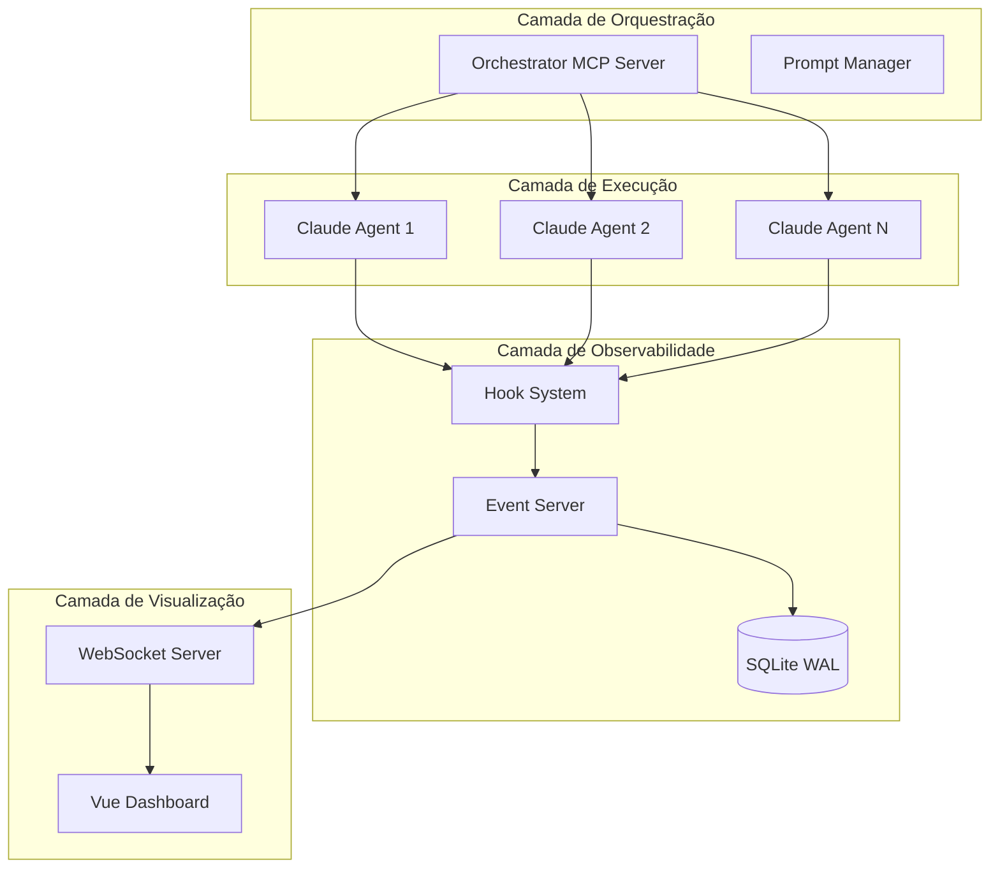

# Sistema de Orquestração Multi-Agente com Observabilidade Completa

## 📋 Visão Geral Executiva

Este documento descreve a implementação de um sistema de orquestração para múltiplas instâncias do Claude Code com observabilidade em tempo real, baseado em soluções de ponta e padrões comprovados da indústria.

## 🎯 Objetivos do Sistema

1. **Paralelização Eficiente**: Executar múltiplos agentes Claude Code simultaneamente em tarefas independentes
2. **Observabilidade Total**: Monitorar em tempo real o progresso e status de cada agente
3. **Centralização de Informações**: Agregar resultados de todas as instâncias em um ponto central
4. **Coordenação Inteligente**: Orquestrar workflows complexos respeitando dependências

## 📊 Métricas de Performance Esperadas

Baseado em implementações documentadas:
- **90.2% de melhoria de performance** comparado a abordagem single-agent
- Redução de tempo de **75-80%** em tarefas complexas
- Capacidade de **15× mais uso de tokens** através de contextos isolados
- Tarefas de 45 minutos completadas em menos de 10 minutos

*Fonte: [GitHub - disler/claude-code-hooks-multi-agent-observability](https://github.com/disler/claude-code-hooks-multi-agent-observability)*

## 🏗️ Arquitetura de Alto Nível

## 🔧 Componentes Principais

### 1. Claude Code Hooks Multi-Agent Observability
- **Repositório**: https://github.com/disler/claude-code-hooks-multi-agent-observability
- **Função**: Captura e visualização de eventos em tempo real
- **Tecnologia**: Python hooks + Bun server + Vue 3 dashboard

### 2. MCP Server Wrapper Pattern
- **Documentação**: https://docs.anthropic.com/en/docs/claude-code/hooks
- **Função**: Interface unificada para serviços externos
- **Benefício**: Controle total sobre integrações

### 3. Sub-Agent Pattern
- **Referência**: https://docs.anthropic.com/en/docs/claude-code/hooks-guide
- **Função**: Especialização e paralelização de tarefas
- **Implementação**: Claude Code native support

## 📈 Casos de Uso Validados

1. **Desenvolvimento de Software Completo**
   - Frontend, Backend, Testes e Documentação em paralelo
   - Redução de 18h para 3h em projeto típico

2. **Processamento de Dados em Larga Escala**
   - Análise paralela de múltiplos datasets
   - Agregação inteligente de resultados

3. **Geração de Conteúdo Massivo**
   - Criação de centenas de assets simultaneamente
   - Quality assurance automatizado

## 🚀 Benefícios Comprovados

- **Visibilidade Completa**: Todos os eventos capturados e visualizados
- **Debugging Simplificado**: Logs centralizados e searchable
- **Escalabilidade Linear**: Adicione agentes sem aumentar complexidade
- **Tolerância a Falhas**: Isolamento entre agentes previne cascata
- **Reusabilidade**: Prompts e workflows versionados

## 📚 Referências Fundamentais

1. **Anthropic - Multi-Agent Research System**
   - URL: https://www.anthropic.com/engineering/multi-agent-research-system
   - Descreve arquitetura oficial da Anthropic para multi-agentes

2. **Claude Code Hooks Documentation**
   - URL: https://docs.anthropic.com/en/docs/claude-code/hooks
   - Referência oficial para sistema de hooks

3. **Community Implementation - @disler**
   - URL: https://github.com/disler/claude-code-hooks-mastery
   - Patterns avançados e best practices

4. **Claude Flow - Enterprise Architecture**
   - URL: https://github.com/ruvnet/claude-flow
   - Implementação enterprise-grade com swarm intelligence

## ⚠️ Considerações Críticas

1. **Lock-in Tecnológico**: Sistema atualmente dependente do Claude Code
2. **Custos de Token**: Multiplicados pelo número de agentes paralelos
3. **Complexidade de Debug**: Requer ferramentas especializadas
4. **Latência de Rede**: WebSocket broadcasting pode impactar em scale

## 🎯 Próximos Passos

1. Revise a [ARQUITETURA TÉCNICA](./2-technical-architecture.md)
2. Configure o [SISTEMA DE HOOKS](./3-hooks-implementation.md)
3. Implemente o [SERVIDOR DE ORQUESTRAÇÃO](./4-orchestration-server.md)
4. Configure o [DASHBOARD DE MONITORAMENTO](./5-monitoring-dashboard.md)
5. Siga o [GUIA DE IMPLEMENTAÇÃO](./6-implementation-guide.md)

---

**Última Atualização**: Janeiro 2025
**Versão**: 1.0.0
**Maintainer**: DevOps Team
