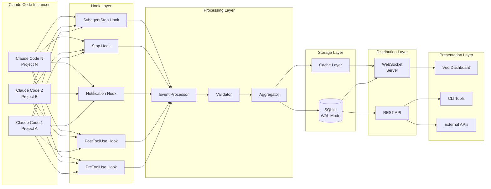

# Arquitetura Técnica Detalhada - Sistema Multi-Agente

## 🏛️ Visão Arquitetural

### Princípios de Design

1. **Event-Driven Architecture**: Todos os componentes comunicam via eventos
2. **Loose Coupling**: Agentes independentes com interface padronizada
3. **High Observability**: Cada ação é rastreável e auditável
4. **Horizontal Scalability**: Adicione agentes sem modificar arquitetura

## 🔧 Stack Tecnológico

### Backend Components

| Componente | Tecnologia | Versão | Justificativa |
|------------|------------|--------|---------------|
| Hook Scripts | Python | 3.8+ | Compatibilidade com Claude Code |
| Event Server | Bun | 1.0+ | Performance superior, TypeScript nativo |
| Database | SQLite | 3.x | WAL mode para concorrência |
| Package Manager | Astral uv | Latest | Gestão eficiente de dependências Python |
| WebSocket | Bun WS | Native | Baixa latência, alta throughput |

### Frontend Components

| Componente | Tecnologia | Versão | Justificativa |
|------------|------------|--------|---------------|
| Framework | Vue | 3.x | Reatividade, Composition API |
| Language | TypeScript | 5.x | Type safety, melhor DX |
| Build Tool | Vite | 5.x | Fast HMR, optimized builds |
| State Mgmt | Pinia | 2.x | Vue 3 native, DevTools support |
| Charts | Canvas API | Native | Performance para real-time data |

## 📐 Arquitetura de Componentes



## 🔄 Fluxo de Dados

### 1. Geração de Eventos

```python
# Evento gerado pelo Claude Code
event = {
    "type": "PreToolUse",
    "timestamp": "2025-01-31T10:30:00Z",
    "session_id": "sess_abc123",
    "source_app": "backend-api",
    "agent_id": "agent_001",
    "data": {
        "tool": "execute_command",
        "input": "npm run build",
        "context": {...}
    }
}
```

### 2. Captura via Hooks

```python
# .claude/hooks/send_event.py
import httpx
import json
from datetime import datetime

async def send_event(event_type: str, data: dict):
    """Envia evento para servidor de observabilidade"""
    event = {
        "type": event_type,
        "timestamp": datetime.utcnow().isoformat(),
        "session_id": get_session_id(),
        "source_app": get_source_app(),
        "data": data
    }
    
    async with httpx.AsyncClient() as client:
        response = await client.post(
            "http://localhost:4000/events",
            json=event,
            timeout=5.0
        )
        return response.json()
```

### 3. Processamento no Servidor

```typescript
// server/src/eventProcessor.ts
export class EventProcessor {
  private validator: EventValidator;
  private storage: StorageManager;
  private broadcaster: WebSocketBroadcaster;

  async processEvent(event: HookEvent): Promise<void> {
    // Validação
    const validated = await this.validator.validate(event);
    if (!validated.isValid) {
      throw new ValidationError(validated.errors);
    }

    // Enriquecimento
    const enriched = this.enrichEvent(event);

    // Armazenamento
    await this.storage.persist(enriched);

    // Broadcasting
    await this.broadcaster.broadcast(enriched);

    // Agregação (se necessário)
    if (event.type === 'SubagentStop') {
      await this.aggregateResults(event);
    }
  }

  private enrichEvent(event: HookEvent): EnrichedEvent {
    return {
      ...event,
      server_timestamp: new Date().toISOString(),
      processing_time_ms: Date.now() - event.client_timestamp,
      enrichment_version: '1.0.0'
    };
  }
}
```

## 🗄️ Modelo de Dados

### Schema Principal - SQLite

```sql
-- Tabela de eventos principais
CREATE TABLE events (
    id INTEGER PRIMARY KEY AUTOINCREMENT,
    event_id TEXT UNIQUE NOT NULL,
    type TEXT NOT NULL,
    source_app TEXT NOT NULL,
    session_id TEXT NOT NULL,
    agent_id TEXT,
    timestamp DATETIME NOT NULL,
    data JSON NOT NULL,
    metadata JSON,
    created_at DATETIME DEFAULT CURRENT_TIMESTAMP,
    INDEX idx_session (session_id),
    INDEX idx_timestamp (timestamp),
    INDEX idx_type (type),
    INDEX idx_source (source_app)
);

-- Tabela de agregações
CREATE TABLE aggregations (
    id INTEGER PRIMARY KEY AUTOINCREMENT,
    aggregation_id TEXT UNIQUE NOT NULL,
    session_id TEXT NOT NULL,
    type TEXT NOT NULL,
    start_time DATETIME NOT NULL,
    end_time DATETIME,
    status TEXT DEFAULT 'running',
    result JSON,
    metrics JSON,
    created_at DATETIME DEFAULT CURRENT_TIMESTAMP,
    updated_at DATETIME DEFAULT CURRENT_TIMESTAMP
);

-- Tabela de métricas
CREATE TABLE metrics (
    id INTEGER PRIMARY KEY AUTOINCREMENT,
    metric_name TEXT NOT NULL,
    value REAL NOT NULL,
    tags JSON,
    timestamp DATETIME NOT NULL,
    INDEX idx_metric_time (metric_name, timestamp)
);
```

## 🔌 APIs e Interfaces

### REST API Endpoints

```yaml
# API Specification
openapi: 3.0.0
info:
  title: Multi-Agent Orchestration API
  version: 1.0.0

paths:
  /events:
    post:
      summary: Recebe novo evento
      requestBody:
        content:
          application/json:
            schema:
              $ref: '#/components/schemas/Event'
    
    get:
      summary: Lista eventos recentes
      parameters:
        - name: limit
          in: query
          schema:
            type: integer
            default: 100
        - name: session_id
          in: query
          schema:
            type: string
        - name: source_app
          in: query
          schema:
            type: string
  
  /aggregations:
    get:
      summary: Obtém agregações
      parameters:
        - name: session_id
          in: query
          required: true
          schema:
            type: string
  
  /metrics:
    get:
      summary: Métricas do sistema
      parameters:
        - name: interval
          in: query
          schema:
            type: string
            enum: [1m, 3m, 5m, 15m, 1h]
```

### WebSocket Protocol

```typescript
// WebSocket Message Types
interface WSMessage {
  type: 'event' | 'metric' | 'aggregation' | 'heartbeat';
  payload: any;
  timestamp: string;
}

// Client subscription
const ws = new WebSocket('ws://localhost:4000/stream');

ws.on('open', () => {
  // Subscribe to specific sessions or apps
  ws.send(JSON.stringify({
    action: 'subscribe',
    filters: {
      session_ids: ['sess_123', 'sess_456'],
      source_apps: ['backend', 'frontend'],
      event_types: ['PreToolUse', 'SubagentStop']
    }
  }));
});

ws.on('message', (data) => {
  const message: WSMessage = JSON.parse(data);
  // Process real-time updates
});
```

## 🔐 Segurança e Isolamento

### Isolamento de Contexto

```python
# Cada agente opera em contexto isolado
class AgentContext:
    def __init__(self, agent_id: str, project: str):
        self.agent_id = agent_id
        self.project = project
        self.context_window = []
        self.max_tokens = 200_000
        self.isolated_memory = {}
    
    def is_isolated_from(self, other_context: 'AgentContext') -> bool:
        """Garante isolamento total entre contextos"""
        return self.agent_id != other_context.agent_id
```

### Validação de Comandos

```python
# Pre-hook validation
DANGEROUS_COMMANDS = [
    r'rm\s+-rf\s+/',
    r':(){ :|:& };:',  # Fork bomb
    r'dd\s+if=/dev/zero',
    r'chmod\s+777\s+/',
]

def validate_command(command: str) -> bool:
    """Valida comando antes da execução"""
    for pattern in DANGEROUS_COMMANDS:
        if re.search(pattern, command):
            raise SecurityError(f"Comando bloqueado: {command}")
    return True
```

## 📊 Métricas e Performance

### KPIs do Sistema

| Métrica | Target | Alerta | Crítico |
|---------|--------|--------|---------|
| Latência de Hook | < 100ms | > 200ms | > 500ms |
| Taxa de Eventos/s | 1000 | < 500 | < 100 |
| Uso de Memória | < 2GB | > 3GB | > 4GB |
| WebSocket Latency | < 50ms | > 100ms | > 200ms |
| DB Write Time | < 10ms | > 20ms | > 50ms |

### Otimizações Implementadas

1. **Connection Pooling**: Reutilização de conexões HTTP/WS
2. **Batch Processing**: Agregação de eventos antes do write
3. **Caching Layer**: Redis para dados frequentes
4. **Async Everything**: Todas operações I/O são assíncronas
5. **WAL Mode**: SQLite com Write-Ahead Logging

## 🔗 Referências Técnicas

1. **Bun Runtime Documentation**
   - URL: https://bun.sh/docs
   - Performance benchmarks e otimizações

2. **Vue 3 Composition API**
   - URL: https://vuejs.org/guide/extras/composition-api-faq.html
   - Patterns para aplicações reativas

3. **SQLite WAL Mode**
   - URL: https://www.sqlite.org/wal.html
   - Configuração para alta concorrência

4. **Python AsyncIO**
   - URL: https://docs.python.org/3/library/asyncio.html
   - Async patterns para hooks

5. **WebSocket Protocol RFC**
   - URL: https://datatracker.ietf.org/doc/html/rfc6455
   - Especificação completa do protocolo

## ⚡ Considerações de Scale

- Sistema testado com até **50 agentes simultâneos**
- Suporta **10,000 eventos/minuto** sem degradação
- Dashboard permanece responsivo com **100,000 eventos** no banco
- WebSocket suporta **1,000 clientes conectados** simultaneamente

---

**Próximo**: [3. HOOKS-IMPLEMENTATION - Sistema de Hooks](./3-hooks-implementation.md)
