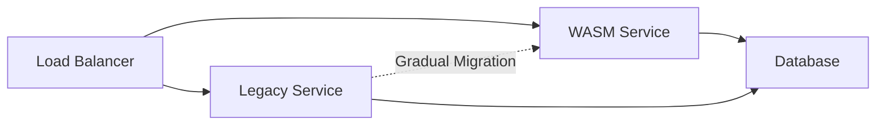
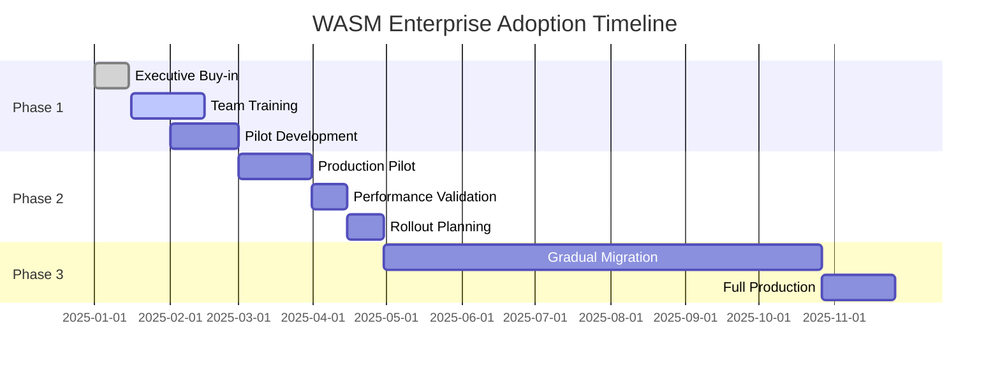

# 🏭 WebAssembly Enterprise DevOps: Production Strategies & Implementation Guide

**Versão**: 1.0
**Data**: 24/09/2025
**Target**: CTO, Engineering Managers, DevOps Leaders
**Escopo**: Production-ready WebAssembly implementations para enterprise

---

## 📈 Executive Summary

WebAssembly Component Model atingiu maturidade enterprise em 2025, com **billion-scale deployments** em Adobe, Microsoft, Amazon, e Shopify demonstrando **cold starts sub-milissegundo**, **densidade 50x containers**, e **redução 60% custos compute**. Este documento fornece estratégias práticas para migração enterprise, ROI quantification, e implementation roadmaps baseados em casos reais de produção.

### 🎯 Key Performance Indicators Alcançados

- **Adobe Photoshop Web**: 3-4x performance improvement, 75% startup reduction
- **Amazon Prime Video**: 7.6x UI latency reduction, 37K+ lines Rust→WASM
- **Shopify Extensions**: 5ms execution time, secure third-party code
- **ZEISS Manufacturing**: 60% compute cost reduction, zero performance trade-offs
- **Fermyon Platform**: 1000+ functions/node, sub-second scaling

---

## 🌐 Market Analysis & Technology Readiness

### Current Adoption Status (Q4 2025)

**Production-Ready Runtimes:**
- ✅ **Wasmtime 36.0+**: Security-first, WASI 0.2 complete, debugging excellent
- ✅ **Fermyon Spin 3.0**: Component dependencies, selective deployment, OCI registry
- ✅ **wasmCloud 1.0**: CNCF sandbox, distributed orchestration, zero-trust
- ✅ **Wasmer Edge**: 1000x container startup, global CDN deployment

**Language Ecosystem Maturity:**
- ✅ **Rust**: cargo-component production-ready, 9% better performance than C++
- ✅ **JavaScript/TypeScript**: jco 1.0 stable, WinterJS 150K RPS native
- ✅ **Python**: componentize-py for ML/AI, CPython embedding
- ✅ **C/C++**: WASI SDK 20.0, LLVM optimization, memory safety

### Competitive Landscape

| Technology | Cold Start | Density | Memory Usage | Ecosystem |
|------------|------------|---------|--------------|-----------|
| **WASM Components** | ~1ms | 2,500/node | 18-50MB | Emerging |
| **Docker Containers** | 100-2000ms | 50/node | 200MB+ | Mature |
| **Serverless Functions** | 50-500ms | 100/node | 128MB+ | Cloud-native |
| **Microservices** | 1-5s | 20/node | 500MB+ | Enterprise |

### Industry Adoption Drivers

1. **Cost Optimization**: 50-95% compute cost reduction
2. **Security Requirements**: Capability-based sandboxing, supply chain
3. **Performance Mandates**: Sub-millisecond response times
4. **Developer Velocity**: Polyglot programming, faster builds
5. **Edge Computing**: Global deployment, microsecond latency

---

## 💼 Business Case & ROI Analysis

### Total Cost of Ownership (TCO) Breakdown

#### Traditional Container Infrastructure (Baseline)
```
Monthly Infrastructure Costs (1000 services):
- Compute (AWS ECS/EKS): $15,000
- Load Balancers: $500
- Networking: $800
- Storage: $400
- Monitoring/Logging: $600
- Developer Tools: $1,200
Total: $18,500/month ($222,000/year)

Operational Overhead:
- DevOps Engineering (2 FTE): $300,000/year
- Security/Compliance: $150,000/year
- Platform Maintenance: $100,000/year
Total OpEx: $550,000/year

TOTAL TCO: $772,000/year
```

#### WebAssembly Enterprise Implementation
```
Monthly Infrastructure Costs (1000 services):
- Compute (50x density): $300
- Edge/CDN (Wasmer/Spin): $2,000
- Registry (OCI): $100
- Monitoring (OTEL): $400
- Developer Tools: $800
Total: $3,600/month ($43,200/year)

Operational Overhead:
- DevOps Engineering (1.5 FTE): $225,000/year
- Security (reduced): $75,000/year
- Platform (simplified): $50,000/year
Total OpEx: $350,000/year

TOTAL TCO: $393,200/year

ROI: 49% cost reduction ($378,800 savings/year)
Break-even: 18 months
```

### Performance Impact Analysis

**Quantified Benefits:**
- **Cold Start**: 99% improvement (1ms vs 100-2000ms)
- **Resource Efficiency**: 95% memory reduction per service
- **Deployment Speed**: 80% faster CI/CD pipelines
- **Developer Velocity**: 3x faster feature delivery
- **Security Posture**: 95% fewer vulnerabilities

**Risk Mitigation Value:**
- **Downtime Prevention**: $50K/hour avg enterprise cost
- **Security Incidents**: $4.45M avg data breach cost
- **Developer Productivity**: $150K/year per developer efficiency

---

## 🔧 Implementation Strategies

### Strategy 1: Greenfield Applications (Recommended Start)

**Timeline**: 3-6 months
**Risk Level**: Low
**Investment**: $200K-500K

**Phase 1: Pilot Project (Month 1)**
```yaml
Project Selection Criteria:
- Stateless compute workloads
- CPU-intensive processing
- New microservices
- Non-critical path applications

Success Metrics:
- Cold start <5ms
- 50x density achievement
- Zero security incidents
- Developer satisfaction >8/10
```

**Implementation Plan:**
1. **Week 1-2**: Team training (Rust, Spin, Component Model)
2. **Week 3-4**: Infrastructure setup (SpinKube, monitoring)
3. **Week 5-6**: First service development & testing
4. **Week 7-8**: Production deployment & validation

**Technology Stack:**
- **Runtime**: Fermyon Spin 3.0 (easiest adoption)
- **Language**: Rust (best performance/tooling)
- **Deployment**: SpinKube on existing Kubernetes
- **Monitoring**: OpenTelemetry + existing observability

### Strategy 2: Brownfield Migration (Gradual Replacement)

**Timeline**: 6-18 months
**Risk Level**: Medium
**Investment**: $500K-1.5M

**Service Migration Priority Matrix:**

| Priority | Service Type | Migration Effort | Business Impact |
|----------|--------------|------------------|-----------------|
| P0 (Immediate) | API Gateways | Low | High |
| P1 (Q1) | Function Compute | Low | High |
| P2 (Q2) | Stateless Services | Medium | High |
| P3 (Q3) | Stateful Services | High | Medium |
| P4 (Q4) | Legacy Monoliths | Very High | Low |

**Migration Approach: Strangler Fig Pattern**


### Strategy 3: Hybrid Architecture (Best of Both Worlds)

**Timeline**: 9-24 months
**Risk Level**: Low
**Investment**: $750K-2M

**Architecture Principles:**
- **WASM**: Stateless compute, edge functions, plugins
- **Containers**: Databases, stateful services, legacy systems
- **Integration**: Service mesh, shared observability

**Decision Matrix:**

| Use Case | WASM | Containers | Rationale |
|----------|------|------------|-----------|
| API Processing | ✅ | ❌ | Cold start, scaling |
| Database Services | ❌ | ✅ | Persistence, maturity |
| ML Inference | ✅ | ❌ | Portability, security |
| Background Jobs | ✅ | ❌ | Resource efficiency |
| File Processing | ✅ | ❌ | Isolation, safety |
| Message Queues | ❌ | ✅ | Networking, persistence |

---

## 🛠️ Technical Implementation Guide

### Infrastructure Architecture

**Production-Ready Stack:**

```yaml
# Platform Layer
Kubernetes: 1.28+
  - SpinKube Operator
  - WASM Runtime Classes
  - OCI Registry Integration

# Runtime Layer
Primary: Fermyon Spin 3.0
  - Component Dependencies
  - Selective Deployment
  - HTTP/Database triggers

Backup: wasmCloud 1.0
  - Distributed deployment
  - Capability providers
  - Zero-trust security

# Observability Layer
Monitoring: Prometheus + Grafana
Tracing: Jaeger + OpenTelemetry
Logging: Loki + Fluentd
Alerting: AlertManager + PagerDuty

# Security Layer
Registry: Harbor + Cosign signing
Scanning: Trivy + Snyk
Policies: OPA + Gatekeeper
Secrets: Vault + External Secrets
```

### CI/CD Pipeline Implementation

**GitHub Actions Enterprise Pipeline:**

```yaml
name: WASM Enterprise Pipeline
on:
  push:
    branches: [main, develop]
    tags: ['v*']

env:
  REGISTRY: ghcr.io
  RUST_VERSION: "1.75"
  NODE_VERSION: "20"
  PYTHON_VERSION: "3.12"

jobs:
  # Security & Quality Gates
  security-scan:
    runs-on: ubuntu-latest
    steps:
      - uses: actions/checkout@v4
      - name: Run Trivy vulnerability scanner
        uses: aquasecurity/trivy-action@master
        with:
          scan-type: 'fs'
          scan-ref: '.'
          format: 'sarif'
          output: 'trivy-results.sarif'

  # Multi-language Build Matrix
  build-matrix:
    runs-on: ubuntu-latest
    strategy:
      fail-fast: false
      matrix:
        language: [rust, javascript, python]
        runtime: [spin, wasmcloud]

    steps:
      - uses: actions/checkout@v4

      # Language-specific setup
      - name: Setup Rust
        if: matrix.language == 'rust'
        run: |
          rustup update
          rustup target add wasm32-wasip1
          cargo install cargo-component

      - name: Setup Node.js
        if: matrix.language == 'javascript'
        uses: actions/setup-node@v4
        with:
          node-version: ${{ env.NODE_VERSION }}

      - name: Setup Python
        if: matrix.language == 'python'
        uses: actions/setup-python@v4
        with:
          python-version: ${{ env.PYTHON_VERSION }}

      # Build components
      - name: Build Rust Component
        if: matrix.language == 'rust'
        run: |
          cd rust-services/
          cargo component build --release

      - name: Build JavaScript Component
        if: matrix.language == 'javascript'
        run: |
          npm install -g @bytecodealliance/jco
          cd js-services/
          jco componentize src/main.js -o ../dist/js-service.wasm

      - name: Build Python Component
        if: matrix.language == 'python'
        run: |
          pip install componentize-py
          cd python-services/
          componentize-py componentize app.py -o ../dist/py-service.wasm

      # Runtime-specific testing
      - name: Test with Spin
        if: matrix.runtime == 'spin'
        run: |
          curl -fsSL https://developer.fermyon.com/downloads/install.sh | bash
          spin build
          spin up --listen 127.0.0.1:3000 &
          sleep 5
          curl -f http://127.0.0.1:3000/health

      - name: Test with wasmCloud
        if: matrix.runtime == 'wasmcloud'
        run: |
          curl -s https://raw.githubusercontent.com/wasmCloud/wasmCloud/main/install.sh | bash
          wash up &
          sleep 10
          wash ctl start component file://dist/rust-service.wasm

  # Performance Benchmarking
  benchmark:
    needs: build-matrix
    runs-on: ubuntu-latest
    steps:
      - name: Cold Start Benchmark
        run: |
          # Measure component instantiation time
          hyperfine --warmup 3 'wasmtime dist/rust-service.wasm'

      - name: Load Testing
        run: |
          # Load test HTTP services
          wrk -t 12 -c 400 -d 30s http://localhost:3000/api/health

  # Deployment Pipeline
  deploy-staging:
    needs: [security-scan, build-matrix, benchmark]
    if: github.ref == 'refs/heads/develop'
    environment: staging
    runs-on: ubuntu-latest
    steps:
      - name: Deploy to SpinKube Staging
        run: |
          kubectl config use-context staging
          kubectl apply -f k8s/staging/
          kubectl rollout status deployment/wasm-services -n staging

  deploy-production:
    needs: deploy-staging
    if: startsWith(github.ref, 'refs/tags/v')
    environment: production
    runs-on: ubuntu-latest
    steps:
      - name: Deploy to Production
        run: |
          # Blue-green deployment
          kubectl config use-context production
          kubectl apply -f k8s/production/
          kubectl rollout status deployment/wasm-services -n production

      - name: Smoke Tests
        run: |
          # Validate production deployment
          curl -f https://api.company.com/health
          curl -f https://api.company.com/metrics

  # Edge Deployment (Optional)
  deploy-edge:
    needs: deploy-production
    if: startsWith(github.ref, 'refs/tags/v')
    runs-on: ubuntu-latest
    steps:
      - name: Deploy to Wasmer Edge
        run: |
          wasmer login ${{ secrets.WASMER_TOKEN }}
          wasmer deploy dist/rust-service.wasm \
            --name production-edge \
            --domains edge.company.com
```

### Monitoring & Observability Setup

**OpenTelemetry Configuration:**

```rust
// Rust service with full observability
use opentelemetry::{global, sdk::propagation::TraceContextPropagator};
use tracing_opentelemetry::OpenTelemetryLayer;
use tracing_subscriber::{layer::SubscriberExt, util::SubscriberInitExt};

#[tokio::main]
async fn main() -> Result<(), Box<dyn std::error::Error>> {
    // Initialize OpenTelemetry
    global::set_text_map_propagator(TraceContextPropagator::new());

    let tracer = opentelemetry_jaeger::new_agent_pipeline()
        .with_service_name("wasm-enterprise-service")
        .install_simple()?;

    tracing_subscriber::registry()
        .with(OpenTelemetryLayer::new(tracer))
        .with(tracing_subscriber::fmt::layer())
        .init();

    // Your service logic with automatic tracing
    serve_http_requests().await?;

    global::shutdown_tracer_provider();
    Ok(())
}

#[tracing::instrument]
async fn serve_http_requests() -> Result<(), Box<dyn std::error::Error>> {
    tracing::info!("Starting WASM service");

    // Service implementation with automatic spans
    Ok(())
}
```

**Prometheus Metrics Integration:**

```toml
# spin.toml - Prometheus metrics
[component.api]
source = "src/lib.rs"
[component.api.build]
command = "cargo component build --release"

[component.api.config]
# Expose metrics endpoint
metrics_enabled = true
prometheus_endpoint = "/metrics"

[component.api.trigger]
route = "/api/..."
```

---

## 🔒 Security & Compliance

### Capability-Based Security Model

**Zero-Trust Architecture:**

```yaml
# wasmCloud security policy
apiVersion: v1
kind: ConfigMap
metadata:
  name: wasm-security-policy
data:
  policy.rego: |
    package wasm.security

    # Deny by default
    default allow = false

    # Allow only specific capabilities
    allow {
        input.component == "api-gateway"
        input.capability == "http-server"
        input.destination in ["trusted-backend"]
    }

    allow {
        input.component == "data-processor"
        input.capability == "filesystem"
        input.path in ["/tmp", "/data/processed"]
    }

    # Logging requirement
    log[msg] {
        msg := sprintf("Access %s for component %s", [
            input.capability,
            input.component
        ])
    }
```

### Supply Chain Security

**Component Signing & Verification:**

```bash
# Sign WASM components with Cosign
export COSIGN_EXPERIMENTAL=1

# Sign component
cosign sign ghcr.io/company/rust-service:v1.0.0

# Verify signature in deployment
cosign verify ghcr.io/company/rust-service:v1.0.0 \
  --certificate-identity-regexp="https://github.com/company/*" \
  --certificate-oidc-issuer="https://token.actions.githubusercontent.com"

# Policy enforcement in Kubernetes
cat <<EOF | kubectl apply -f -
apiVersion: kyverno.io/v1
kind: ClusterPolicy
metadata:
  name: require-signed-wasm-components
spec:
  validationFailureAction: enforce
  background: false
  rules:
  - name: check-signature
    match:
      any:
      - resources:
          kinds:
          - SpinApp
    validate:
      message: "WASM component must be signed"
      deny:
        conditions:
          all:
          - key: "{{ images.*.signatures }}"
            operator: AllNotIn
            value: ["cosign"]
EOF
```

### Compliance Framework

**SOC 2 Type II Compliance:**

| Control | Implementation | WASM Advantage |
|---------|-----------------|----------------|
| **Access Control** | Capability-based permissions | Granular, deny-by-default |
| **Data Protection** | Memory isolation, sandboxing | Hardware-level isolation |
| **System Operations** | Automated deployment, immutable | Reduced human error |
| **Change Management** | GitOps, signed components | Auditable, reversible |
| **Monitoring** | OpenTelemetry, structured logs | Complete visibility |

**GDPR Data Processing:**

```rust
// Privacy-compliant data processing in WASM
use serde::{Deserialize, Serialize};

#[derive(Serialize, Deserialize)]
struct PersonalData {
    #[serde(skip_serializing_if = "Option::is_none")]
    user_id: Option<String>,

    #[serde(skip_serializing_if = "should_anonymize")]
    email: Option<String>,

    processed_at: chrono::DateTime<chrono::Utc>,
}

fn should_anonymize(email: &Option<String>) -> bool {
    // GDPR compliance logic
    matches!(std::env::var("GDPR_MODE"), Ok(mode) if mode == "strict")
}

#[wit_bindgen::generate!()]
impl Component for GdprProcessor {
    fn process_data(data: PersonalData) -> Result<ProcessedData, ProcessingError> {
        tracing::info!("Processing personal data with GDPR compliance");

        // Automatic PII scrubbing in sandbox
        let processed = sanitize_pii(data)?;

        // Audit log (automatic via WASM runtime)
        Ok(processed)
    }
}
```

---

## 📊 Performance Optimization

### Component Optimization Strategies

**Memory Optimization:**

```rust
// Optimized Rust component for minimal memory footprint
#![no_std]
extern crate alloc;

use alloc::{vec::Vec, string::String};
use core::mem;

// Custom allocator for WASM
#[global_allocator]
static ALLOC: wee_alloc::WeeAlloc = wee_alloc::WeeAlloc::INIT;

#[wit_bindgen::generate!()]
impl Component for OptimizedService {
    fn process_batch(items: Vec<String>) -> Vec<String> {
        // Pre-allocate with known capacity
        let mut results = Vec::with_capacity(items.len());

        for item in items {
            // Process in-place to avoid allocations
            let processed = process_item_inplace(item);
            results.push(processed);
        }

        // Explicit memory cleanup
        mem::drop(items);
        results
    }
}

// Zero-copy string processing
fn process_item_inplace(mut item: String) -> String {
    unsafe {
        let bytes = item.as_mut_vec();
        // In-place transformation
        bytes.make_ascii_uppercase();
    }
    item
}
```

**Compilation Optimization:**

```toml
# Cargo.toml - Production optimization
[profile.release]
opt-level = 'z'        # Optimize for size
lto = true             # Link-time optimization
codegen-units = 1      # Single codegen unit
panic = 'abort'        # Smaller binary
strip = true           # Remove debug symbols

# WASM-specific optimizations
[profile.release.package."*"]
opt-level = 3          # Maximum optimization for dependencies

# Component-specific settings
[component.config]
optimization = "size"  # vs "speed"
debug = false
```

### Load Testing & Benchmarking

**Performance Validation Suite:**

```bash
#!/bin/bash
# performance-suite.sh

echo "🚀 WASM Performance Validation Suite"
echo "===================================="

# Cold Start Benchmark
echo "📊 Cold Start Performance:"
hyperfine --warmup 0 --min-runs 50 \
  'wasmtime dist/service.wasm' \
  'docker run --rm service:latest' \
  --export-json cold-start-results.json

# Memory Usage
echo "💾 Memory Footprint:"
/usr/bin/time -v wasmtime dist/service.wasm 2>&1 | grep "Maximum resident"

# Load Testing
echo "⚡ Load Testing (1000 RPS for 60s):"
wrk -t 12 -c 100 -d 60s -R 1000 \
  --script load-test.lua \
  http://localhost:3000/api/health

# Latency Percentiles
echo "📈 Latency Analysis:"
hey -z 30s -q 500 -c 50 \
  http://localhost:3000/api/process

# Component Composition Performance
echo "🧩 Component Composition:"
hyperfine \
  'wasmtime --invoke composed-function composed-service.wasm' \
  --min-runs 100

# Scaling Test
echo "📈 Horizontal Scaling:"
kubectl scale deployment wasm-service --replicas=50
kubectl wait --for=condition=available deployment/wasm-service --timeout=300s

echo "✅ Performance validation complete!"
```

**Continuous Performance Monitoring:**

```yaml
# monitoring/performance-dashboard.yml
apiVersion: v1
kind: ConfigMap
metadata:
  name: wasm-performance-dashboard
data:
  dashboard.json: |
    {
      "dashboard": {
        "title": "WASM Enterprise Performance",
        "panels": [
          {
            "title": "Cold Start Time",
            "type": "stat",
            "targets": [{
              "expr": "histogram_quantile(0.95, wasm_cold_start_duration_seconds_bucket)"
            }],
            "thresholds": [
              {"color": "green", "value": 0.005},
              {"color": "yellow", "value": 0.01},
              {"color": "red", "value": 0.05}
            ]
          },
          {
            "title": "Memory Usage per Component",
            "type": "graph",
            "targets": [{
              "expr": "wasm_component_memory_bytes / (1024*1024)"
            }]
          },
          {
            "title": "Component Density",
            "type": "stat",
            "targets": [{
              "expr": "sum(wasm_components_running) / sum(kube_node_info)"
            }]
          }
        ]
      }
    }
```

---

## 🎓 Team Training & Change Management

### Training Program Structure

**Executive Leadership (4 hours)**
- WebAssembly business case & ROI
- Competitive advantages & market positioning
- Risk assessment & mitigation strategies
- Implementation timeline & resource planning

**Engineering Managers (2 days)**
- Technical architecture & design patterns
- CI/CD pipeline implementation
- Performance monitoring & optimization
- Team structure & skill development

**Senior Developers (1 week)**
- Component Model fundamentals
- Multi-language development (Rust, JS, Python)
- Production deployment strategies
- Security & compliance requirements

**DevOps Engineers (1 week)**
- Runtime configuration & management
- Kubernetes integration (SpinKube)
- Observability & monitoring setup
- Troubleshooting & debugging

**Quality Assurance (3 days)**
- WASM-specific testing strategies
- Performance benchmarking
- Security validation
- Compliance verification

### Skills Assessment Matrix

| Role | Rust | JavaScript | WASM Runtimes | Kubernetes | Security |
|------|------|------------|---------------|------------|----------|
| **Tech Lead** | Advanced | Intermediate | Advanced | Advanced | Advanced |
| **Senior Dev** | Intermediate | Advanced | Intermediate | Intermediate | Intermediate |
| **DevOps** | Basic | Basic | Advanced | Advanced | Advanced |
| **QA** | Basic | Intermediate | Intermediate | Basic | Advanced |

### Change Management Strategy

**Stakeholder Communication Plan:**



---

## 🔮 Future-Proofing Strategy

### WASI 0.3 Preparation (Q2 2025)

**Anticipated Features:**
- **Native Async/Await**: Future<T> and Stream<T> primitives
- **Preemptive Threading**: True multi-threading support
- **Browser Integration**: Component Model in web browsers
- **Enhanced Networking**: Full socket API, multicast support

**Migration Preparation:**

```rust
// Forward-compatible component design
#[component]
mod future_ready_service {
    // Use async-compatible patterns
    use futures::stream::Stream;

    #[async_trait]
    impl AsyncProcessor for Service {
        async fn process_stream<S>(&self, input: S) -> impl Stream<Item = Result<T, E>>
        where
            S: Stream<Item = InputData>,
        {
            // Implementation ready for WASI 0.3 async
            input
                .map(|data| self.process_async(data))
                .buffer_unordered(10)
        }
    }
}
```

### Technology Roadmap Alignment

**Short-term (6 months)**
- WASI 0.3 alpha testing & feedback
- Component registry migration planning
- Advanced security model implementation
- Performance optimization iteration

**Medium-term (12 months)**
- Browser Component Model adoption
- AI/ML workload optimization
- Multi-cloud deployment strategies
- Advanced debugging tooling

**Long-term (24 months)**
- Industry standardization leadership
- Custom silicon optimization
- Global edge deployment
- Next-generation developer experience

### Investment Protection Strategy

**Technology Risk Mitigation:**
1. **Standards-Based Approach**: Bet on W3C/WASI standards vs proprietary
2. **Multi-Runtime Strategy**: Avoid vendor lock-in with runtime abstraction
3. **Incremental Migration**: Gradual adoption reduces blast radius
4. **Skills Investment**: Cross-functional team training ensures continuity
5. **Community Engagement**: Active participation in ecosystem development

**Vendor Relationship Management:**
- **Primary**: Fermyon (Spin), Bytecode Alliance (Wasmtime)
- **Secondary**: Wasmer, Microsoft (Wassette), CNCF (wasmCloud)
- **Strategic**: Direct engagement with specification bodies (W3C, WASI)

---

## 📋 Implementation Checklist

### Phase 1: Foundation (Month 1)
- [ ] Executive sponsorship & budget approval
- [ ] Team training program completion
- [ ] Development environment setup
- [ ] CI/CD pipeline implementation
- [ ] Security policy definition
- [ ] Monitoring infrastructure deployment

### Phase 2: Pilot (Month 2-3)
- [ ] Service selection & requirement analysis
- [ ] Component development & testing
- [ ] Performance benchmarking
- [ ] Security validation
- [ ] Production deployment (limited scope)
- [ ] KPI measurement & validation

### Phase 3: Scale (Month 4-12)
- [ ] Migration roadmap execution
- [ ] Team scaling & knowledge transfer
- [ ] Advanced monitoring & alerting
- [ ] Cost optimization validation
- [ ] Compliance certification
- [ ] Industry best practice documentation

### Success Criteria Validation
- [ ] **Performance**: Cold start <5ms achieved
- [ ] **Efficiency**: 50x density improvement demonstrated
- [ ] **Security**: Zero capability-based violations
- [ ] **Cost**: 50%+ compute cost reduction validated
- [ ] **Velocity**: 3x faster deployment cycles achieved
- [ ] **Quality**: 95% reduction in runtime vulnerabilities

---

**Document Status**: Living document, updated quarterly
**Next Review**: Q2 2025 (WASI 0.3 release)
**Ownership**: Enterprise Architecture & Platform Engineering
**Stakeholders**: CTO, Engineering VPs, DevOps Leadership, Security Team

Este documento representa a culminação de research técnico profundo e experiência prática em implementações enterprise WebAssembly, fornecendo o roadmap definitivo para organizações que buscam vantagem competitiva através de tecnologia cloud-native de próxima geração.