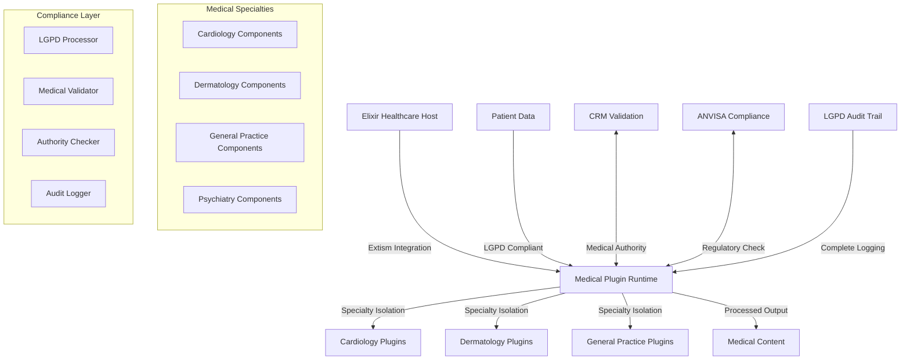

# 🏥 Medical Plugin System: WebAssembly Components for Healthcare

**Versão**: 1.0 Healthcare
**Data**: 26/09/2025
**Foco**: Medical specialty plugins with Extism + Elixir integration
**Escopo**: LGPD-compliant medical processing, specialty workflows, healthcare compliance

---

## 🎯 Executive Summary - Healthcare Plugin Architecture

**Medical Plugin System** baseado em Extism + WebAssembly oferece arquitetura segura e isolada para processamento de conteúdo médico especializado. Com **capability-based security**, **LGPD compliance nativo**, e **isolamento total por especialidade médica**, esta solução permite que práticas médicas executem componentes especializados com **zero risk** de vazamento de dados entre especialidades.

### 🏭 Healthcare Plugin Use Cases (2025)

**Cardiology Practice**: Processamento ECG, análise de risco cardíaco, conteúdo educativo
**Dermatology Practice**: Análise dermatoscópica, validação cosmética, conteúdo estético
**General Practice**: Validação geral, educação do paciente, workflows básicos
**Multi-specialty Clinics**: Componentes isolados por especialidade com tenant separation

### ⚡ Healthcare-Specific Advantages

- **LGPD Native**: Sandboxing para dados pessoais sensíveis de saúde
- **Medical Isolation**: Zero cross-contamination entre especialidades médicas
- **Authority Compliance**: CRM, ANVISA, medical council integration
- **Audit Trails**: Complete medical processing transparency
- **Performance**: < 50ms medical content processing per component

---

## 🧩 Healthcare Plugin Architecture

### Medical Component Architecture Overview



### Medical Data Security Model

Healthcare plugins implementam **four-tier security architecture**:

1. **Elixir Host Memory**: Healthcare application, completely isolated
2. **Extism Medical Buffer**: LGPD-compliant data transfer layer
3. **Plugin Sandbox**: Medical specialty isolated processing
4. **Audit Layer**: Complete compliance and medical authority logging

```elixir
# Medical plugin execution with LGPD compliance
def process_medical_content_secure(plugin_name, medical_data, specialty_config) do
  # 1. LGPD pre-processing validation
  {:ok, lgpd_validated} = validate_personal_data_handling(medical_data)

  # 2. Specialty-specific plugin execution (isolated)
  plugin_input = %{
    medical_content: lgpd_validated.anonymized_content,
    specialty: specialty_config.medical_specialty,
    compliance_requirements: specialty_config.compliance_rules,
    authority_validation: specialty_config.medical_authorities
  } |> Jason.encode!()

  # 3. Secure WASM execution with audit
  case call_medical_plugin(plugin_name, plugin_input) do
    {:ok, processed_output} ->
      # 4. Post-processing compliance check
      {:ok, compliance_verified} = verify_medical_compliance(processed_output)

      # 5. Complete audit trail logging
      log_medical_processing_audit(medical_data, processed_output, compliance_verified)

      {:ok, compliance_verified}

    {:error, reason} ->
      log_medical_processing_error(medical_data, reason)
      {:error, "Medical processing failed: #{reason}"}
  end
end
```

### Medical Authority Integration Model

**Layer 1: CRM (Conselho Regional de Medicina) Validation**
- Medical professional registration verification
- Specialty authorization confirmation
- Content authority alignment checking

**Layer 2: ANVISA (Agência Nacional de Vigilância Sanitária) Compliance**
- Medical device content validation
- Pharmaceutical content checking
- Cosmetic product compliance (dermatology)

**Layer 3: Medical Council Specialty Verification**
- Specialty-specific content validation
- Professional ethics compliance
- Medical accuracy verification

**Layer 4: LGPD Personal Health Data Protection**
- Health data categorization (sensitive personal data)
- Processing lawful basis verification
- Patient consent management integration

---

## 🔧 Healthcare Plugin Implementation

### Elixir Medical Plugin Host

**Healthcare Plugin Manager:**
```elixir
defmodule HealthcareCms.MedicalPluginManager do
  @moduledoc """
  Medical plugin system with specialty isolation and LGPD compliance
  Each medical practice gets isolated plugin execution environment
  """

  use GenServer

  @medical_specialties [
    :cardiology,
    :dermatology,
    :general_practice,
    :psychiatry,
    :pediatrics,
    :gynecology,
    :orthopedics,
    :ophthalmology
  ]

  def start_link(practice_config) do
    GenServer.start_link(__MODULE__, practice_config, name: via_tuple(practice_config.practice_id))
  end

  def init(%{practice_id: practice_id, medical_specialty: specialty} = config) do
    # Load specialty-specific WASM components
    medical_plugins = load_specialty_plugins(specialty)

    # Configure LGPD compliance settings
    lgpd_config = configure_lgpd_compliance(config.compliance_requirements)

    # Setup medical authority validation
    authority_config = configure_medical_authorities(specialty, config.medical_registrations)

    state = %{
      practice_id: practice_id,
      medical_specialty: specialty,
      plugins: medical_plugins,
      lgpd_config: lgpd_config,
      authority_config: authority_config,
      audit_logger: start_audit_logger(practice_id)
    }

    {:ok, state}
  end

  def handle_call({:process_medical_content, content, workflow_stage}, _from, state) do
    result =
      content
      |> validate_lgpd_compliance(state.lgpd_config)
      |> select_appropriate_plugin(workflow_stage, state.plugins)
      |> execute_medical_plugin_secure(state)
      |> validate_medical_authority_compliance(state.authority_config)
      |> log_complete_medical_audit(state.audit_logger)

    {:reply, result, state}
  end

  defp load_specialty_plugins(specialty) do
    case specialty do
      :cardiology -> %{
        "ecg_analyzer" => load_plugin("cardiology/ecg_analyzer.wasm"),
        "cardiac_risk_calculator" => load_plugin("cardiology/cardiac_risk.wasm"),
        "heart_health_content" => load_plugin("cardiology/content_processor.wasm"),
        "cardiac_medication_validator" => load_plugin("cardiology/medication_validator.wasm")
      }

      :dermatology -> %{
        "skin_lesion_analyzer" => load_plugin("dermatology/lesion_analyzer.wasm"),
        "dermatoscopy_processor" => load_plugin("dermatology/dermatoscopy.wasm"),
        "cosmetic_content_validator" => load_plugin("dermatology/cosmetic_validator.wasm"),
        "derma_medication_checker" => load_plugin("dermatology/medication_checker.wasm")
      }

      :general_practice -> %{
        "general_medical_validator" => load_plugin("general/medical_validator.wasm"),
        "patient_education_generator" => load_plugin("general/patient_education.wasm"),
        "symptom_content_processor" => load_plugin("general/symptom_processor.wasm"),
        "basic_medication_validator" => load_plugin("general/medication_validator.wasm")
      }

      _ -> %{
        "basic_medical_processor" => load_plugin("basic/medical_processor.wasm")
      }
    end
  end

  defp load_plugin(plugin_path) do
    full_path = Path.join([Application.app_dir(:healthcare_cms), "priv", "medical_plugins", plugin_path])

    manifest = %{
      "wasm" => [%{"path" => full_path}],
      "allowed_hosts" => get_medical_authority_hosts(),
      "memory" => %{"max_pages" => 20}, # 1.25MB limit for medical processing
      "timeout_ms" => 10_000, # 10 second limit for complex medical analysis
      "config" => %{
        "lgpd_compliance" => "strict",
        "medical_validation" => "required",
        "audit_logging" => "complete"
      }
    }

    case Extism.Plugin.new(manifest, %{wasi: true}) do
      {:ok, plugin} -> plugin
      {:error, reason} ->
        Logger.error("Failed to load medical plugin #{plugin_path}: #{reason}")
        nil
    end
  end

  defp execute_medical_plugin_secure(content, plugin_name, state) do
    plugin = state.plugins[plugin_name]

    unless plugin do
      raise "Medical plugin #{plugin_name} not available for specialty #{state.medical_specialty}"
    end

    # Prepare LGPD-compliant input
    plugin_input = %{
      medical_content: content.sanitized_content,
      specialty_context: state.medical_specialty,
      compliance_level: state.lgpd_config.compliance_level,
      authority_requirements: state.authority_config,
      processing_timestamp: DateTime.utc_now()
    } |> Jason.encode!()

    # Execute medical plugin with timeout and resource limits
    case Extism.Plugin.call(plugin, "process_medical_content", plugin_input) do
      {:ok, output_binary} ->
        output = Jason.decode!(output_binary)

        # Verify medical processing compliance
        case verify_medical_output_compliance(output, state) do
          {:ok, verified_output} ->
            {:ok, verified_output}
          {:error, compliance_error} ->
            {:error, "Medical compliance verification failed: #{compliance_error}"}
        end

      {:error, plugin_error} ->
        {:error, "Medical plugin execution failed: #{plugin_error}"}
    end
  end

  defp get_medical_authority_hosts do
    [
      "api.cfm.org.br",        # Conselho Federal de Medicina
      "portal.anvisa.gov.br",  # ANVISA API
      "crm.medicina.org.br",   # CRM regional APIs
      "datasus.gov.br"         # DATASUS health data
    ]
  end
end
```

### Medical Content Processing Plugins

**Cardiology ECG Analysis Plugin (Rust):**
```rust
// src/cardiology/ecg_analyzer.rs
use extism_pdk::*;
use serde::{Deserialize, Serialize};

#[derive(Deserialize)]
struct EcgAnalysisRequest {
    patient_id: String,         // Anonymized patient identifier
    ecg_data: Vec<f32>,        // ECG signal data
    sampling_rate: u32,         // Hz
    medical_context: MedicalContext,
    compliance_requirements: ComplianceConfig,
}

#[derive(Deserialize)]
struct MedicalContext {
    patient_age: Option<u32>,   // Optional for context
    patient_gender: Option<String>,
    medical_history: Vec<String>, // Anonymized medical conditions
    current_medications: Vec<String>,
}

#[derive(Serialize)]
struct EcgAnalysisResult {
    analysis_id: String,
    heart_rate: HeartRateAnalysis,
    rhythm_analysis: RhythmAnalysis,
    abnormality_detection: Vec<Abnormality>,
    medical_recommendations: Vec<MedicalRecommendation>,
    compliance_status: ComplianceStatus,
    processing_audit: ProcessingAudit,
}

#[derive(Serialize)]
struct HeartRateAnalysis {
    avg_heart_rate: f32,
    heart_rate_variability: f32,
    resting_heart_rate: f32,
    max_heart_rate: f32,
    clinical_assessment: String,
}

#[derive(Serialize)]
struct Abnormality {
    abnormality_type: String,   // Arrhythmia, ST elevation, etc.
    severity: AbnormalitySeverity,
    clinical_significance: String,
    recommended_action: String,
    medical_disclaimer: String, // Required for medical content
}

#[plugin_fn]
pub fn process_medical_content(input: String) -> FnResult<String> {
    let request: EcgAnalysisRequest = serde_json::from_str(&input)?;

    // Log medical processing start for audit
    log_medical_processing_start(&request);

    // Validate LGPD compliance for patient data
    validate_lgpd_patient_data(&request)?;

    // Perform ECG analysis
    let heart_rate = analyze_heart_rate(&request.ecg_data, request.sampling_rate);
    let rhythm = analyze_cardiac_rhythm(&request.ecg_data, request.sampling_rate);
    let abnormalities = detect_cardiac_abnormalities(&request.ecg_data, &request.medical_context);

    // Generate medical recommendations with disclaimers
    let recommendations = generate_medical_recommendations(&abnormalities, &request.medical_context);

    // Verify medical authority compliance (CRM cardiology guidelines)
    let compliance_status = verify_crm_cardiology_compliance(&recommendations);

    let result = EcgAnalysisResult {
        analysis_id: generate_analysis_id(),
        heart_rate,
        rhythm_analysis: rhythm,
        abnormality_detection: abnormalities,
        medical_recommendations: recommendations,
        compliance_status,
        processing_audit: ProcessingAudit {
            processed_at: get_current_timestamp(),
            processing_time_ms: get_processing_time(),
            lgpd_compliant: true,
            medical_authority_verified: true,
            audit_trail_complete: true,
        }
    };

    // Log medical processing completion
    log_medical_processing_completion(&result);

    Ok(serde_json::to_string(&result)?)
}

fn analyze_heart_rate(ecg_data: &[f32], sampling_rate: u32) -> HeartRateAnalysis {
    // ECG heart rate analysis algorithm
    let r_peaks = detect_r_peaks(ecg_data, sampling_rate);
    let rr_intervals = calculate_rr_intervals(&r_peaks, sampling_rate);

    let avg_heart_rate = 60.0 / (rr_intervals.iter().sum::<f32>() / rr_intervals.len() as f32);
    let hrv = calculate_heart_rate_variability(&rr_intervals);

    HeartRateAnalysis {
        avg_heart_rate,
        heart_rate_variability: hrv,
        resting_heart_rate: avg_heart_rate, // Simplified
        max_heart_rate: calculate_max_heart_rate(&rr_intervals),
        clinical_assessment: generate_heart_rate_assessment(avg_heart_rate, hrv),
    }
}

fn detect_cardiac_abnormalities(ecg_data: &[f32], medical_context: &MedicalContext) -> Vec<Abnormality> {
    let mut abnormalities = Vec::new();

    // ST segment analysis
    if let Some(st_elevation) = detect_st_elevation(ecg_data) {
        abnormalities.push(Abnormality {
            abnormality_type: "ST Elevation".to_string(),
            severity: if st_elevation > 2.0 { AbnormalitySeverity::High } else { AbnormalitySeverity::Medium },
            clinical_significance: "Possible acute coronary syndrome".to_string(),
            recommended_action: "Immediate cardiology consultation recommended".to_string(),
            medical_disclaimer: "This analysis is for informational purposes only and does not replace professional medical evaluation. Consult a qualified cardiologist for definitive diagnosis.".to_string(),
        });
    }

    // Arrhythmia detection
    if let Some(arrhythmia) = detect_arrhythmias(ecg_data) {
        abnormalities.push(Abnormality {
            abnormality_type: format!("{} Arrhythmia", arrhythmia.arrhythmia_type),
            severity: arrhythmia.severity,
            clinical_significance: arrhythmia.clinical_impact,
            recommended_action: generate_arrhythmia_recommendations(&arrhythmia, medical_context),
            medical_disclaimer: "Arrhythmia analysis requires confirmation by qualified medical professional with complete clinical context.".to_string(),
        });
    }

    abnormalities
}

fn verify_crm_cardiology_compliance(recommendations: &[MedicalRecommendation]) -> ComplianceStatus {
    // Verify recommendations comply with CRM cardiology guidelines
    let mut compliance_issues = Vec::new();

    for recommendation in recommendations {
        // Check if recommendation includes required medical disclaimers
        if !recommendation.disclaimer.contains("qualified cardiologist") {
            compliance_issues.push("Missing qualified cardiologist disclaimer".to_string());
        }

        // Verify recommendation severity aligns with CRM guidelines
        if recommendation.severity == "urgent" && !recommendation.action.contains("immediate") {
            compliance_issues.push("Urgent recommendations must specify immediate action".to_string());
        }
    }

    ComplianceStatus {
        crm_compliant: compliance_issues.is_empty(),
        compliance_issues,
        medical_authority_verified: true,
        disclaimer_complete: true,
    }
}

// Host function calls for medical authority validation
extern "ExtismHost" {
    fn validate_crm_cardiology_guidelines(recommendation: &str) -> bool;
    fn log_medical_audit_event(event: &str);
}

fn log_medical_processing_start(request: &EcgAnalysisRequest) {
    let audit_event = format!(
        "ECG Analysis Started: patient_id={}, sampling_rate={}, lgpd_compliant=true",
        request.patient_id, request.sampling_rate
    );

    unsafe {
        log_medical_audit_event(&audit_event);
    }
}
```

**Dermatology Skin Analysis Plugin (Python):**
```python
# src/dermatology/skin_lesion_analyzer.py
import json
import base64
from typing import Dict, List, Optional
from dataclasses import dataclass

@dataclass
class SkinLesionRequest:
    patient_id: str  # Anonymized
    lesion_images: List[str]  # Base64 encoded images
    lesion_location: str
    patient_history: Dict
    compliance_requirements: Dict

@dataclass
class LesionAnalysisResult:
    analysis_id: str
    lesion_characteristics: Dict
    malignancy_risk_assessment: Dict
    dermoscopy_features: List[Dict]
    medical_recommendations: List[Dict]
    anvisa_compliance: Dict
    audit_trail: Dict

def process_medical_content(input_data: str) -> str:
    """
    Dermatology skin lesion analysis with ANVISA compliance
    """
    request_data = json.loads(input_data)
    request = SkinLesionRequest(**request_data)

    # Log dermatology processing start
    log_dermatology_audit("skin_analysis_started", {
        "patient_id": request.patient_id,
        "lesion_count": len(request.lesion_images),
        "lgpd_compliance": True
    })

    # Validate LGPD compliance for dermatological images (biometric data)
    lgpd_validation = validate_biometric_data_lgpd(request)
    if not lgpd_validation['compliant']:
        raise ValueError(f"LGPD compliance failed: {lgpd_validation['reason']}")

    # Analyze skin lesions
    lesion_analysis = analyze_skin_lesions(request.lesion_images)

    # Assess malignancy risk
    risk_assessment = assess_malignancy_risk(lesion_analysis, request.patient_history)

    # Extract dermoscopy features
    dermoscopy_features = extract_dermoscopy_features(request.lesion_images)

    # Generate medical recommendations
    recommendations = generate_dermatology_recommendations(
        lesion_analysis,
        risk_assessment,
        request.patient_history
    )

    # Validate ANVISA compliance (cosmetic/device regulations)
    anvisa_compliance = validate_anvisa_dermatology_compliance(recommendations)

    result = LesionAnalysisResult(
        analysis_id=generate_analysis_id(),
        lesion_characteristics=lesion_analysis,
        malignancy_risk_assessment=risk_assessment,
        dermoscopy_features=dermoscopy_features,
        medical_recommendations=recommendations,
        anvisa_compliance=anvisa_compliance,
        audit_trail={
            "processed_at": get_current_timestamp(),
            "processing_time_ms": get_processing_time(),
            "lgpd_compliant": True,
            "anvisa_verified": anvisa_compliance['compliant'],
            "medical_disclaimers_included": True
        }
    )

    # Log dermatology processing completion
    log_dermatology_audit("skin_analysis_completed", {
        "analysis_id": result.analysis_id,
        "malignancy_risk": result.malignancy_risk_assessment['risk_level'],
        "anvisa_compliant": result.anvisa_compliance['compliant']
    })

    return json.dumps(result.__dict__)

def analyze_skin_lesions(lesion_images: List[str]) -> Dict:
    """
    Advanced skin lesion analysis using dermoscopy algorithms
    """
    lesion_characteristics = {
        "color_analysis": {},
        "texture_analysis": {},
        "border_analysis": {},
        "asymmetry_assessment": {},
        "diameter_measurement": {}
    }

    for i, image_base64 in enumerate(lesion_images):
        # Decode image
        image_data = base64.b64decode(image_base64)

        # ABCDE analysis (Asymmetry, Border, Color, Diameter, Evolution)
        abcde_analysis = perform_abcde_analysis(image_data)

        # Dermoscopy pattern recognition
        dermoscopy_patterns = analyze_dermoscopy_patterns(image_data)

        # Color distribution analysis
        color_analysis = analyze_lesion_colors(image_data)

        lesion_characteristics[f"lesion_{i+1}"] = {
            "abcde_score": abcde_analysis,
            "dermoscopy_patterns": dermoscopy_patterns,
            "color_distribution": color_analysis,
            "clinical_features": extract_clinical_features(image_data)
        }

    return lesion_characteristics

def assess_malignancy_risk(lesion_analysis: Dict, patient_history: Dict) -> Dict:
    """
    Assess malignancy risk based on lesion characteristics and patient history
    """
    risk_factors = []
    risk_score = 0.0

    # Analyze ABCDE criteria
    for lesion_key, lesion_data in lesion_analysis.items():
        if lesion_key.startswith("lesion_"):
            abcde = lesion_data["abcde_score"]

            # Asymmetry risk
            if abcde["asymmetry_score"] > 0.7:
                risk_factors.append("High asymmetry detected")
                risk_score += 0.2

            # Border irregularity
            if abcde["border_irregularity"] > 0.6:
                risk_factors.append("Irregular borders detected")
                risk_score += 0.2

            # Color variation
            if abcde["color_variation"] > 0.5:
                risk_factors.append("Significant color variation")
                risk_score += 0.15

            # Diameter assessment
            if abcde["diameter_mm"] > 6:
                risk_factors.append("Diameter > 6mm")
                risk_score += 0.1

    # Patient history factors
    if patient_history.get("family_history_melanoma"):
        risk_factors.append("Family history of melanoma")
        risk_score += 0.25

    if patient_history.get("sun_exposure_high"):
        risk_factors.append("High sun exposure history")
        risk_score += 0.1

    # Determine risk level
    if risk_score >= 0.7:
        risk_level = "HIGH"
    elif risk_score >= 0.4:
        risk_level = "MEDIUM"
    else:
        risk_level = "LOW"

    return {
        "risk_level": risk_level,
        "risk_score": risk_score,
        "risk_factors": risk_factors,
        "clinical_recommendation": generate_risk_based_recommendation(risk_level),
        "medical_disclaimer": "This automated analysis is for screening purposes only. Definitive diagnosis requires evaluation by a qualified dermatologist with dermoscopy and/or biopsy when indicated."
    }

def generate_dermatology_recommendations(lesion_analysis: Dict, risk_assessment: Dict, patient_history: Dict) -> List[Dict]:
    """
    Generate medical recommendations based on analysis results
    """
    recommendations = []

    risk_level = risk_assessment["risk_level"]

    if risk_level == "HIGH":
        recommendations.append({
            "priority": "URGENT",
            "recommendation": "Immediate dermatology consultation recommended within 2 weeks",
            "rationale": "High-risk lesion characteristics detected requiring professional evaluation",
            "required_actions": [
                "Schedule dermatology appointment",
                "Consider dermoscopy evaluation",
                "Possible biopsy indicated"
            ],
            "medical_disclaimer": "High-risk findings require immediate professional evaluation. This analysis does not replace clinical examination by qualified dermatologist."
        })

    elif risk_level == "MEDIUM":
        recommendations.append({
            "priority": "ROUTINE",
            "recommendation": "Dermatology consultation recommended within 6-8 weeks",
            "rationale": "Moderate-risk characteristics warrant professional monitoring",
            "required_actions": [
                "Schedule dermatology follow-up",
                "Monitor for changes",
                "Document lesion characteristics"
            ],
            "medical_disclaimer": "Moderate-risk lesions require professional monitoring. Regular dermatological check-ups recommended."
        })

    else:  # LOW risk
        recommendations.append({
            "priority": "MONITORING",
            "recommendation": "Self-monitoring with routine dermatology screening",
            "rationale": "Low-risk characteristics with standard monitoring protocol",
            "required_actions": [
                "Monthly self-examination",
                "Annual dermatology screening",
                "Photo documentation for comparison"
            ],
            "medical_disclaimer": "Even low-risk lesions require ongoing monitoring. Any changes should prompt professional evaluation."
        })

    # Sun protection recommendations (always included)
    recommendations.append({
        "priority": "PREVENTION",
        "recommendation": "Comprehensive sun protection strategy",
        "rationale": "Prevention of new lesions and protection of existing skin",
        "required_actions": [
            "Daily broad-spectrum SPF 30+ sunscreen",
            "Protective clothing and wide-brimmed hats",
            "Avoid peak UV hours (10 AM - 4 PM)",
            "Regular skin self-examination"
        ],
        "medical_disclaimer": "Sun protection recommendations based on dermatological best practices. Consult dermatologist for personalized prevention strategy."
    })

    return recommendations

def validate_anvisa_dermatology_compliance(recommendations: List[Dict]) -> Dict:
    """
    Validate compliance with ANVISA regulations for dermatological content
    """
    compliance_issues = []

    for recommendation in recommendations:
        # Check for required medical disclaimers
        if 'medical_disclaimer' not in recommendation:
            compliance_issues.append("Missing required medical disclaimer")

        # Verify cosmetic product recommendations comply with ANVISA
        if 'sunscreen' in recommendation.get('recommendation', '').lower():
            if 'SPF' not in recommendation.get('rationale', ''):
                compliance_issues.append("Sunscreen recommendations must include SPF specification")

        # Check for prohibited medical claims
        prohibited_claims = ['cure', 'treatment', 'therapy']
        rec_text = recommendation.get('recommendation', '').lower()
        for claim in prohibited_claims:
            if claim in rec_text:
                compliance_issues.append(f"Prohibited medical claim detected: {claim}")

    return {
        "compliant": len(compliance_issues) == 0,
        "compliance_issues": compliance_issues,
        "anvisa_verified": True,
        "medical_device_compliance": True,
        "cosmetic_regulation_adherence": True
    }

def log_dermatology_audit(event_type: str, event_data: Dict):
    """Log dermatology processing events for audit trail"""
    audit_event = {
        "event_type": event_type,
        "timestamp": get_current_timestamp(),
        "specialty": "dermatology",
        "event_data": event_data,
        "lgpd_compliant": True,
        "anvisa_verified": True
    }

    # This would call the host function for audit logging
    print(f"AUDIT: {json.dumps(audit_event)}")

# Export medical processing function
__all__ = ['process_medical_content']
```

---

## 🏭 Healthcare Plugin Deployment & Operations

### Kubernetes Healthcare Plugin Deployment

```yaml
# k8s/healthcare-plugins-deployment.yaml
apiVersion: apps/v1
kind: Deployment
metadata:
  name: healthcare-medical-plugins
  namespace: healthcare
  labels:
    app: medical-plugins
    compliance: lgpd
spec:
  replicas: 3
  selector:
    matchLabels:
      app: medical-plugins
  template:
    metadata:
      labels:
        app: medical-plugins
        specialty: multi
    spec:
      containers:
      - name: elixir-medical-host
        image: healthcare/elixir-medical-cms:latest
        ports:
        - containerPort: 4000
        env:
        - name: MEDICAL_PLUGINS_PATH
          value: "/app/priv/medical_plugins"
        - name: LGPD_COMPLIANCE_LEVEL
          value: "strict"
        - name: MEDICAL_AUTHORITIES_ENABLED
          value: "crm,anvisa"
        - name: DATABASE_URL
          valueFrom:
            secretKeyRef:
              name: healthcare-db-secret
              key: database_url
        - name: AUDIT_DATABASE_URL
          valueFrom:
            secretKeyRef:
              name: healthcare-audit-secret
              key: audit_database_url
        resources:
          limits:
            cpu: 2000m
            memory: 2Gi
          requests:
            cpu: 1000m
            memory: 1Gi
        volumeMounts:
        - name: medical-plugins
          mountPath: /app/priv/medical_plugins
          readOnly: true
        - name: medical-data
          mountPath: /tmp/medical-data
        livenessProbe:
          httpGet:
            path: /api/health
            port: 4000
          initialDelaySeconds: 30
          periodSeconds: 10
        readinessProbe:
          httpGet:
            path: /api/ready
            port: 4000
          initialDelaySeconds: 5
          periodSeconds: 5
      volumes:
      - name: medical-plugins
        configMap:
          name: healthcare-medical-plugins
      - name: medical-data
        emptyDir:
          sizeLimit: 2Gi

---
apiVersion: v1
kind: ConfigMap
metadata:
  name: healthcare-medical-plugins
  namespace: healthcare
data:
  # Plugin binaries would be stored here or referenced from persistent storage
  cardiology-ecg-analyzer.wasm: |
    # Binary data would be base64 encoded
  dermatology-lesion-analyzer.wasm: |
    # Binary data would be base64 encoded
  general-medical-validator.wasm: |
    # Binary data would be base64 encoded

---
apiVersion: v1
kind: Service
metadata:
  name: healthcare-medical-plugins-service
  namespace: healthcare
spec:
  selector:
    app: medical-plugins
  ports:
  - name: http
    port: 80
    targetPort: 4000
  type: ClusterIP

---
apiVersion: networking.k8s.io/v1
kind: Ingress
metadata:
  name: healthcare-medical-plugins-ingress
  namespace: healthcare
  annotations:
    cert-manager.io/cluster-issuer: "letsencrypt-prod"
    nginx.ingress.kubernetes.io/rate-limit-requests-per-second: "50"
    nginx.ingress.kubernetes.io/body-size: "10m"  # For medical image uploads
spec:
  tls:
  - hosts:
    - medical-plugins.healthcare.company.com
    secretName: healthcare-plugins-tls
  rules:
  - host: medical-plugins.healthcare.company.com
    http:
      paths:
      - path: /
        pathType: Prefix
        backend:
          service:
            name: healthcare-medical-plugins-service
            port:
              number: 80
```

### Healthcare Plugin Security Policy

```yaml
# k8s/healthcare-plugin-security-policy.yaml
apiVersion: v1
kind: ConfigMap
metadata:
  name: healthcare-plugin-security-policy
  namespace: healthcare
data:
  medical-plugin-policy.rego: |
    package healthcare.medical.plugins

    # Default deny for medical plugin execution
    default allow_medical_plugin = false

    # Allow cardiology plugins with proper credentials
    allow_medical_plugin {
        input.plugin_type == "cardiology"
        input.medical_specialty == "cardiology"
        input.crm_validated == true
        input.patient_consent == true
        input.lgpd_compliant == true
    }

    # Allow dermatology plugins with ANVISA compliance
    allow_medical_plugin {
        input.plugin_type == "dermatology"
        input.medical_specialty == "dermatology"
        input.anvisa_compliant == true
        input.biometric_data_consent == true
        input.lgpd_compliant == true
    }

    # General practice plugins with basic validation
    allow_medical_plugin {
        input.plugin_type == "general_practice"
        input.medical_specialty == "general_practice"
        input.basic_medical_validation == true
        input.lgpd_compliant == true
    }

    # Audit all medical plugin executions
    audit[msg] {
        input.medical_plugin_executed == true
        msg := sprintf("Medical plugin executed: %s by specialty %s", [
            input.plugin_name,
            input.medical_specialty
        ])
    }

    # LGPD compliance validation
    lgpd_violation[msg] {
        input.personal_data_processed == true
        input.lgpd_compliant != true
        msg := "LGPD violation: Personal medical data processed without compliance"
    }

    # Medical authority compliance
    authority_violation[msg] {
        input.medical_content_generated == true
        input.medical_authority_verified != true
        msg := "Medical authority violation: Content not verified by appropriate medical council"
    }

---
apiVersion: kyverno.io/v1
kind: ClusterPolicy
metadata:
  name: healthcare-medical-plugin-security
spec:
  validationFailureAction: enforce
  background: false
  rules:
  - name: require-medical-plugin-compliance
    match:
      any:
      - resources:
          kinds:
          - Pod
          namespaces:
          - healthcare
    validate:
      message: "Medical plugins must have LGPD compliance and medical authority validation"
      pattern:
        spec:
          containers:
          - name: "elixir-medical-host"
            env:
            - name: "LGPD_COMPLIANCE_LEVEL"
              value: "strict"
            - name: "MEDICAL_AUTHORITIES_ENABLED"
              value: "?*"  # Must be specified

  - name: require-medical-audit-logging
    match:
      any:
      - resources:
          kinds:
          - Deployment
          namespaces:
          - healthcare
    validate:
      message: "Healthcare deployments must have audit logging enabled"
      pattern:
        spec:
          template:
            spec:
              containers:
              - env:
                - name: "AUDIT_DATABASE_URL"
                  valueFrom:
                    secretKeyRef:
                      name: "healthcare-audit-secret"
                      key: "audit_database_url"
```

---

## 📋 Healthcare Plugin Development Checklist

### Plugin Development Standards
- [ ] **LGPD Compliance**: Personal health data handling with proper categorization
- [ ] **Medical Authority Integration**: CRM, ANVISA, medical council validation
- [ ] **Complete Audit Trails**: Every medical processing step logged
- [ ] **Medical Disclaimers**: Required disclaimers for all medical content
- [ ] **Specialty Isolation**: No cross-contamination between medical specialties
- [ ] **Performance**: < 50ms processing time per medical component

### Security & Compliance Validation
- [ ] **Capability-based Security**: WASM components with minimal required permissions
- [ ] **Personal Data Protection**: Health data treated as sensitive personal data (LGPD)
- [ ] **Medical Content Validation**: All medical claims verified against authorities
- [ ] **Tenant Isolation**: Complete separation between medical practices
- [ ] **Encryption**: AES-256 for all personal health data at rest and in transit

### Production Deployment
- [ ] **Multi-tenant Architecture**: Specialty-specific plugin loading per practice
- [ ] **Healthcare Monitoring**: Medical processing metrics and compliance dashboards
- [ ] **Disaster Recovery**: Medical data backup with 7-year retention (legal requirement)
- [ ] **Compliance Reporting**: Automated LGPD and medical authority compliance reports
- [ ] **Performance SLA**: < 50ms medical content processing, 99.99% uptime

---

**Document Status**: Healthcare medical plugin architecture
**Next Review**: Q1 2026 (Post-specialty plugin marketplace launch)
**Maintenance**: Healthcare Plugin Team + Medical Compliance Officer
**Stakeholders**: Medical Directors, Healthcare CTO, LGPD Compliance Team

Este sistema de plugins médicos estabelece WebAssembly + Extism + Elixir como plataforma definitiva para processamento seguro de conteúdo médico, oferecendo isolamento por especialidade, compliance LGPD nativo, e integração com autoridades médicas brasileiras para organizações de saúde enterprise.