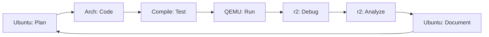

# 🚀 Nova Trilha OS Development Integrada - Com Radare2

## 📋 Visão Geral
- **Objetivo:** Caminho de aprendizado completo para desenvolvimento de sistemas operacionais integrando Radare2 como ferramenta essencial
- **Tempo estimado:** 420+ horas (30h adicionais para domínio do Radare2)
- **Pré-requisitos:** WSL2 + Ubuntu 24.04 (✅) + Arch Linux (✅) instalados
- **Resultado final:** Kernel funcional + expertise em análise binária profissional

## 🔍 Contexto Educativo

### Por que Integrar Radare2?
A análise da transcrição de 2802 linhas revelou que **Radare2 é essencial** para OS Development profissional:
- **Substitui ferramentas** que custam $3000+ (IDA Pro)
- **Debugging kernel** remoto via QEMU
- **Análise de bootloaders** e binários de sistema
- **Engenharia reversa** para entender sistemas existentes
- **Habilidade crítica** no mercado de trabalho

### Como se conecta com a trilha original?
- **Amplia capacidades** de debug e análise
- **Profissionaliza** o aprendizado
- **Conecta teoria** com prática real
- **Prepara para mercado** de sistemas embarcados

## 📊 Status Atual Confirmado
- ✅ **Windows 11 + WSL2** funcionando
- ✅ **Ubuntu 24.04** (ambiente principal)
- ✅ **Arch Linux** instalado para OS Dev
- ✅ **Trilha app-aprender** clonada
- ✅ **Sistema de tracking** configurado

---

## 🎯 FASE 0: Preparação Completa do Ambiente (25h)

### Objetivos da Fase
- Configurar Arch Linux como ambiente especializado
- Instalar Radare2 e ferramentas de análise
- Estabelecer workflow dual Ubuntu/Arch
- Dominar comandos básicos do Radare2

### Módulo 0.1: Configuração Arch Linux + Radare2 (15h)
**Status:** 🟡 Arch instalado, configuração pendente

**Atividades:**
1. **Configuração inicial Arch** (Guia já criado)
   - Criar usuário osdev
   - Instalar base-devel
   - Configurar sudo e aliases

2. **Instalação ferramentas OS Dev**
   ```bash
   sudo pacman -S base-devel git vim nasm qemu-full gdb valgrind
   sudo pacman -S radare2 ghidra-desktop rizin # Trio de análise
   ```

3. **Configuração Radare2**
   - Setup inicial (.radare2rc)
   - Tutorial básico (r2.md)
   - Comandos essenciais

**Checkpoint:** ✅ Ambiente Arch + r2 funcional

### Módulo 0.2: Workflow Integrado Dual-Distro (10h)
**Configurações:**
- Windows Terminal com perfis dedicados
- VSCode integração com ambas distros
- Compartilhamento de arquivos otimizado
- Scripts de automação

**Exercício Prático:** Análise de "Hello World"
- Compilar no Ubuntu
- Analisar no Arch com r2
- Comparar outputs GDB vs r2

---

## 💻 FASE 1: Fundamentos C/C++ + Análise Binária (70h)

### Objetivos Expandidos
- Dominar C/C++ para sistemas
- **Integrar análise binária** desde o início
- Entender **assembly gerado** pelo compilador
- Usar **r2 para debug** avançado

### Módulo 1.1: C/C++ Essencial com r2 (35h)

**Semana 1-2: Fundamentos + Análise**
```markdown
📚 Tópico: Ponteiros e Gerenciamento de Memória
🔬 Prática r2: Analisar como ponteiros aparecem no assembly
🧪 Exercício: Memory allocator + análise com r2

📚 Tópico: Structs e Unions para Hardware
🔬 Prática r2: Visualizar layout em memória
🧪 Exercício: Simular registro x86 + verificar com r2

📚 Tópico: Operações Bitwise
🔬 Prática r2: Ver instruções bit manipulation
🧪 Exercício: Bootloader flags + análise assembly
```

**Projetos Integrados:**
1. **Memory Manager** + análise r2 do heap
2. **Bit Manipulation Library** + verificação assembly
3. **Linked List** + trace execução com r2

### Módulo 1.2: Toolchain + Reverse Engineering (35h)

**Build Systems com Análise:**
- Makefiles + objdump vs r2 comparison
- CMake + análise de diferentes otimizações
- Cross-compilation + análise multi-arch

**Debugging Avançado:**
```markdown
GDB Tradicional vs Radare2:
- Breakpoints e stepping
- Memory inspection
- Register manipulation
- Call stack analysis
```

**Projeto Final Fase 1:**
**"Tiny Shell + Complete Analysis"**
- Implementar shell básico em C
- Análise completa com r2
- Reverse engineer binário gerado
- Otimizações guiadas por análise

**Checkpoint:** ✅ Domínio C/C++ + r2 básico

---

## ⚙️ FASE 2: Hardware + Bootloaders + r2 Analysis (90h)

### Objetivos Revolucionados
- Entender hardware x86 profundamente
- Desenvolver bootloaders do zero
- **Usar r2 para debug** modo real/protegido
- **Reverse engineer** bootloaders existentes

### Módulo 2.1: Hardware x86 + Análise de BIOS (45h)

**Semanas 1-3: Fundamentos + r2**
```markdown
📚 Tópico: Modo Real vs Protegido
🔬 Prática r2: Analisar bootloader GRUB
🧪 Exercício: Disassembly comparativo

📚 Tópico: Segmentação e Paginação  
🔬 Prática r2: Visualizar GDT/IDT
🧪 Exercício: Memory map analysis

📚 Tópico: Interrupções e Exceções
🔬 Prática r2: Trace interrupt handlers
🧪 Exercício: Custom interrupt com r2 debug
```

**Exercícios Únicos com r2:**
1. **GRUB Analysis**: Reverse engineer bootloader real
2. **BIOS Investigation**: Analisar chamadas BIOS
3. **Hardware Probing**: Usar r2 para entender hardware

### Módulo 2.2: Desenvolvimento de Bootloader (45h)

**Abordagem r2-First:**
```markdown
Metodologia:
1. 📝 Escrever assembly
2. 🔨 Compilar com NASM  
3. 🔬 Analisar com r2
4. 🐛 Debug com QEMU + r2
5. ✅ Validar funcionamento
```

**Projetos Progressivos:**
1. **Minimal Bootloader** (512 bytes)
   - Assembly puro
   - r2 analysis de cada byte
   - QEMU debugging

2. **Extended Bootloader** (multi-stage)
   - Carregar kernel
   - r2 trace de loading
   - Memory layout analysis

3. **Advanced Bootloader** (recursos avançados)
   - Filesystem básico
   - r2 analysis I/O operations
   - Performance profiling

**Checkpoint:** ✅ Bootloader funcional + expertise r2

---

## 🖥️ FASE 3: Kernel Development + r2 Debugging (90h)

### Objetivos Transformados
- Desenvolver kernel do zero
- **Master kernel debugging** com r2
- Implementar VFS com análise profunda
- **Debuggar crashes** sistematicamente

### Módulo 3.1: Kernel Básico + Console (45h)

**Desenvolvimento Guiado por r2:**
```markdown
🏗️ Implementação: Console VGA
🔬 r2 Analysis: Memory mapped I/O
🐛 Debug: QEMU remote debugging
📊 Profiling: Performance analysis

🏗️ Implementação: Interrupt handlers
🔬 r2 Analysis: IDT structure
🐛 Debug: Exception tracing
📊 Profiling: Interrupt latency
```

**Workflow de Desenvolvimento:**
1. **Code → Compile → r2 static analysis**
2. **QEMU boot → r2 remote attach** 
3. **Live debugging → crash analysis**
4. **Fix → repeat with validation**

### Módulo 3.2: Sistema de Arquivos Virtual (45h)

**VFS com r2 Deep Dive:**
- **Structure analysis**: Como dados são organizados
- **I/O tracing**: Operações de read/write
- **Performance profiling**: Bottlenecks identification
- **Bug hunting**: Race conditions detection

**Projetos Especiais:**
1. **Mini-VFS Implementation** + r2 structure analysis
2. **File Operations Tracing** com r2 dynamic analysis  
3. **Crash Recovery System** usando r2 post-mortem

**Checkpoint:** ✅ Kernel com VFS + r2 expertise

---

## 🔄 FASE 4: Processos + Scheduling + r2 Tracing (90h)

### Objetivos Avançados
- Implementar multitasking
- **Trace context switches** com r2
- Debug concorrência sistematicamente
- Profiling de performance avançado

### Módulo 4.1: Gerenciamento de Processos (45h)

**Process Control com r2:**
```markdown
🧬 Process Creation: fork() implementation + r2 trace
🔄 Context Switch: register saving + r2 analysis  
💾 Memory Management: page tables + r2 visualization
📋 Process Table: data structures + r2 inspection
```

**Debugging Avançado:**
- **Race condition detection** com r2
- **Deadlock analysis** em tempo real
- **Memory leaks** profiling
- **Performance bottlenecks** identification

### Módulo 4.2: Scheduling + IPC (45h)

**Scheduler Analysis:**
- Implementar algoritmos (Round-Robin, CFS)
- r2 profiling de performance
- Load balancing analysis
- Real-time constraints verification

**IPC com r2:**
- **Message passing** trace analysis
- **Shared memory** layout inspection
- **Semaphore** deadlock detection
- **Pipe** data flow tracing

**Checkpoint:** ✅ Sistema multitask + r2 profiling

---

## 🔌 FASE 5: I/O + Drivers + r2 Hardware Analysis (85h)

### Objetivos Especializados
- Desenvolver device drivers
- **Hardware reverse engineering** com r2
- Otimização I/O com profiling
- Sistema completo de produção

### Módulo 5.1: Device Drivers + Hardware (45h)

**Driver Development com r2:**
```markdown
🔌 Hardware Probing: r2 analysis de device discovery
⚡ Interrupt Handling: r2 trace de IRQ processing
📡 I/O Operations: Port I/O vs Memory mapped
🎛️ Control Registers: Bit manipulation verification
```

**Reverse Engineering Real:**
- Analisar drivers Linux existentes
- Hardware documentation através de r2
- Proprietary driver analysis
- Performance optimization guided

### Módulo 5.2: Sistema Completo + Produção (40h)

**Final Integration:**
- Shell completo com pipes
- Network stack básico
- Filesystem persistente
- Boot optimizations

**r2 Production Analysis:**
- **System profiling** completo
- **Security analysis** do kernel
- **Performance tuning** sistemático
- **Crash dump** forensics

**Projeto Final:**
**"Production-Ready OS"**
- Sistema operacional completo
- Documentação r2 analysis
- Security assessment
- Performance benchmarks

---

## 📊 Cronograma Integrado (7 meses)

### Timeline Realística
| Mês | Fases | Foco Principal | r2 Skills |
|-----|-------|----------------|-----------|
| **1** | FASE 0 | Ambiente + r2 básico | Comandos essenciais |
| **2** | FASE 1 | C/C++ + análise binária | Static analysis |
| **3** | FASE 2 | Hardware + bootloader | Dynamic debugging |
| **4** | FASE 3 | Kernel + VFS | Kernel debugging |
| **5** | FASE 4 | Processos + scheduling | Process tracing |
| **6** | FASE 5 | I/O + drivers | Hardware analysis |
| **7** | Finalização | Polimento + portfolio | Expert profiling |

---

## 🛠️ Ferramentas Integradas

### Stack Tecnológico Completo
```bash
# Ambiente Principal (Ubuntu)
- VSCode + Remote WSL
- Git + GitHub integration  
- Documentação + tracking

# Ambiente Especializado (Arch)
- GCC + cross-compilation tools
- NASM + assembly development
- QEMU + hardware virtualization
- Radare2 + analysis framework
- GDB + traditional debugging
```

### Workflow Típico


---

## 🏆 Diferenciais da Nova Trilha

### vs Trilha Original
```markdown
✅ ADICIONADO: Radare2 expertise
✅ ADICIONADO: Reverse engineering skills
✅ ADICIONADO: Professional debugging
✅ ADICIONADO: Hardware analysis
✅ ADICIONADO: Production-ready skills

🔄 MELHORADO: Debug capabilities
🔄 MELHORADO: Analysis depth
🔄 MELHORADO: Market relevance
🔄 MELHORADO: Problem-solving skills
```

### Competências Extras
- **Binary analysis** expert level
- **Reverse engineering** proficiency  
- **Kernel debugging** mastery
- **Hardware understanding** deep
- **Security analysis** capabilities

---

## 📈 ROI (Return on Investment)

### Investimento Total
- **Tempo:** 420 horas (7 meses dedicados)
- **Ferramentas:** Grátis (open-source)
- **Hardware:** WSL2 existente

### Retorno Esperado
- **Salário:** $120k-200k+ (embedded/kernel dev)
- **Ferramentas:** $3000+ economia (vs IDA Pro)
- **Skills:** Nível senior em sistemas
- **Portfolio:** Projetos impressionantes

---

## ✅ Validação Contínua

### Checkpoints por Fase
```markdown
FASE 0: ✅ r2 comandos básicos + ambiente dual
FASE 1: ✅ Binary analysis + C proficiency  
FASE 2: ✅ Bootloader working + r2 debugging
FASE 3: ✅ Kernel + VFS + crash analysis
FASE 4: ✅ Multitask + process tracing
FASE 5: ✅ Production OS + expert analysis
```

### Métricas de Sucesso
- **Código funcional:** Kernel bootando
- **Skills r2:** Expert level commands
- **Debug capability:** Complex crashes
- **Analysis speed:** Professional level
- **Portfolio quality:** Industry standard

---

## 🚀 Primeiros Passos (Esta Semana)

### Dia 1-2: Configuração Arch
- Executar guia `configuracao-arch-linux-osdev.md`
- Instalar Radare2
- Testar ambiente dual

### Dia 3-4: r2 Básico  
- Tutorial r2.md (2802 linhas)
- Comandos essenciais
- Análise hello-world

### Dia 5-7: Primeiro Projeto
- Implementar programa C simples
- Análise completa com r2
- Comparação GDB vs r2

### Próxima Semana
- Iniciar FASE 1 oficial
- Tracking automático
- Primeira validação

---

## 🎯 Call to Action

**Comando para começar:**
```markdown
"Claude, iniciar FASE 0 com configuração Arch Linux e instalação Radare2"
```

Esta trilha transformará você de iniciante em **expert profissional** em desenvolvimento de sistemas operacionais, com skills de análise binária que poucos no mercado possuem!

---

**Trilha Criada:** 2025-09-03  
**Versão:** 2.0 - Integrada com Radare2  
**Status:** 🚀 Pronta para execução  
**Diferencial:** Única trilha que combina OS Dev + Binary Analysis**