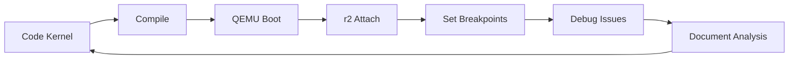

# 🖥️ FASE 3: Kernel Development + r2 Remote Debugging (90h)

## 🎯 Objetivos da Fase
- Desenvolver kernel básico do zero
- Dominar kernel debugging com r2 + QEMU
- Implementar VFS com análise profunda
- Debug crashes sistematicamente

## 📊 Estrutura da Fase
```
FASE_3_KERNEL/
├── modulos/           # Teoria kernel internals
├── exercicios/        # Debug práticas com r2
├── projetos/          # Kernel incremental
├── recursos/          # Kernel sources referência
├── r2-analysis/       # Templates debug kernel
└── kernel-src/        # Código fonte kernel
```

## 🎓 Competências Desenvolvidas
- **Kernel Architecture:** Monolithic vs Microkernel design
- **Memory Management:** Virtual memory, paging, heap
- **VFS Implementation:** File system abstraction layer
- **r2 Kernel Debug:** Remote debugging, crash analysis
- **Exception Handling:** Interrupts, system calls, panic handling

## 📅 Cronograma (6 semanas)
| Semana | Módulo | Foco | r2 Skills |
|--------|---------|-------|-----------|
| 1-2 | Kernel Básico | Console + interrupts | Remote debugging |
| 3-4 | Memory Management | Paging + heap | Memory analysis |
| 5-6 | VFS Implementation | File operations | I/O tracing |

## ✅ Checkpoints de Validação
- [ ] **Checkpoint 3.1:** Kernel básico + console funcionais
- [ ] **Checkpoint 3.2:** Memory management implementado
- [ ] **Checkpoint 3.3:** VFS básico + file operations

## 🚀 Projetos Principais
1. **Basic Kernel:** Console VGA + interrupt handlers + r2 debug
2. **Memory Manager:** Paging + heap allocator + analysis
3. **Mini-VFS:** File system abstraction + I/O tracing

## 📘 Módulos Detalhados
### Módulo 3.1: Kernel Básico + Console (30h)
- Kernel entry point e setup
- Console VGA text mode
- IDT e interrupt handlers
- r2 remote debugging setup
- Kernel panic handler com r2 integration

### Módulo 3.2: Memory Management (30h)
- Virtual memory theory
- Page directory/table setup
- Heap allocator (kmalloc/kfree)
- r2 memory analysis techniques
- Memory leak detection

### Módulo 3.3: VFS Implementation (30h)
- Virtual File System design
- Inode e dentry structures
- File operations interface
- r2 I/O tracing
- Filesystem debugging

## 🔧 r2 Kernel Debug Mastery
### Debug Environment Setup
```bash
# Kernel with debug symbols
gcc -g -ffreestanding -c kernel.c -o kernel.o
ld -o kernel.bin kernel.o -Ttext 0x1000 --oformat binary

# QEMU with debugging
qemu-system-i386 -kernel kernel.bin -S -s -monitor stdio

# r2 remote connection
r2 -d gdb://localhost:1234
> e asm.arch=x86
> e asm.bits=32
```

### Advanced Crash Analysis
```bash
# When kernel panics:
> dc                 # Continue until crash
> dr                 # Capture registers
> dbt                # Stack trace
> px 100 @ esp      # Stack contents
> pd -10 @ eip      # Code before crash
```

### Memory Analysis Techniques
```bash
# Memory layout
> dm                 # Memory maps
> dmi                # Memory info
> px @ page_dir      # Page directory analysis

# Heap debugging
> px @ heap_start    # Heap dump
> dm~heap           # Heap segments
```

## 🐛 Debug Workflow Padrão


## 📚 Recursos Kernel Development
- Linux Kernel Development (Love)
- Understanding Linux Kernel (Bovet)
- OSDev Wiki - Kernel Development
- Intel x86 Manual - System Programming
- r2 remote debugging documentation

## ➡️ Pré-requisitos FASE 4
- Kernel básico funcional
- VFS implementado e testado
- Proficiência r2 kernel debugging
- Memory management funcionando
- Crash analysis systematic capability