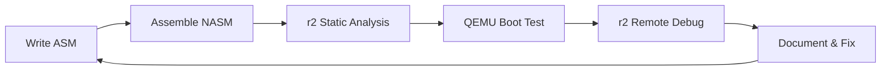

# 🔬 INTEGRAÇÃO RADARE2 COMPLETA - Guia Sistemático OSR2

## 📋 Visão Geral
Sistema completo de integração Radare2 em todas as fases da trilha OS Development, estabelecendo metodologia profissional única no mercado.

---

## 🎯 FILOSOFIA r2-FIRST

### Conceito Revolucionário
**Integrar análise binária desde o PRIMEIRO dia**, não como ferramenta secundária, mas como **metodologia central** de desenvolvimento.

### Diferencial Competitivo
```markdown
Método Tradicional:
Code → Compile → Test → (Maybe debug with GDB)

Método OSR2:
Code → Compile → r2 Static Analysis → Test → r2 Dynamic Debug → Document Analysis
```

---

## 🎓 PROGRESSÃO r2 POR FASE

### 📊 Skill Development Timeline
```
FASE 0: r2 Newcomer    → Basic commands, navigation
FASE 1: r2 User        → Static analysis, disassembly  
FASE 2: r2 Analyst     → Dynamic debugging, 16-bit
FASE 3: r2 Expert      → Kernel debugging, crash analysis
FASE 4: r2 Specialist  → Process tracing, concurrency
FASE 5: r2 Master      → Hardware RE, production analysis
```

---

## 🔧 FASE 0: r2 FOUNDATION (25h)

### Objetivos r2
- Instalar e configurar r2 profissionalmente
- Dominar navegação básica e comandos core
- Primeiro projeto com análise completa
- Estabelecer workflow r2-first

### Core Commands Mastery
```bash
# Navigation & Analysis
r2 binary              # Open binary
> aaa                  # Analyze All Autoname
> V                    # Visual mode
> pdf @ main          # Print Disassembly Function

# Information gathering  
> iI                   # Binary info
> iz                   # Strings
> ie                   # Entry points
> is                   # Symbols

# Memory & Registers
> dm                   # Memory maps
> dr                   # Registers
> px 100 @ address    # Hex dump
```

### First Integration Project: "Hello World Analysis"
```c
// hello.c
#include <stdio.h>
int main() {
    printf("Hello OSR2 World!\n");
    return 42;
}
```

**r2 Analysis Workflow:**
```bash
# 1. Compile with symbols
gcc -g hello.c -o hello

# 2. Static analysis
r2 hello
> aaa
> pdf @ main
> iz

# 3. Dynamic analysis  
> ood               # Debug mode
> db main          # Breakpoint
> dc               # Continue
> dr               # Check registers

# 4. Document findings
> > hello-analysis.md
```

---

## 💻 FASE 1: r2 STATIC ANALYSIS (70h)

### Objetivos r2
- Master static binary analysis
- Understand compiler optimizations via r2
- Analyze C/C++ constructs in assembly
- Build r2 analysis portfolio

### Advanced Commands
```bash
# Function analysis
> af                   # Analyze function
> afi                  # Function info
> ag                   # Call graph

# Cross-references
> axt @ symbol         # Xrefs to
> axf @ symbol         # Xrefs from

# String analysis
> iz                   # ASCII strings
> izz                  # All strings (wide, etc.)

# Binary comparison
> radiff2 binary1 binary2
```

### Integration Projects
1. **Memory Manager Analysis**
   - Implement malloc/free
   - r2 analysis of heap operations
   - Document memory layout changes

2. **Data Structure Visualization**
   - Linked lists, trees, hash tables
   - r2 structure analysis
   - Memory dump interpretation

3. **Compiler Optimization Study**
   - Same code, different -O levels
   - r2 comparison analysis
   - Performance impact documentation

---

## ⚙️ FASE 2: r2 HARDWARE DEBUGGING (90h)

### Objetivos r2
- Master 16-bit debugging with r2
- Bootloader analysis expertise  
- QEMU + r2 remote debugging
- Hardware register analysis

### Specialized Commands
```bash
# 16-bit mode
r2 -b 16 bootloader.bin
> e asm.arch=x86
> e asm.bits=16

# Remote debugging
r2 -d gdb://localhost:1234

# Hardware analysis
> dr                   # CPU registers
> drm                  # Memory-mapped registers  
> dm                   # Memory segments
```

### Bootloader r2 Methodology


### Integration Projects
1. **GRUB Reverse Engineering**
   ```bash
   # Analyze real bootloader
   r2 -b 16 /boot/grub/i386-pc/boot.img
   > aaa
   > pdf
   > iz
   ```

2. **Custom Bootloader Series**
   - 512-byte minimal bootloader
   - Multi-stage bootloader
   - Bootloader with basic filesystem
   - r2 analysis documentation for each

3. **Hardware Register Mapping**
   - PIC 8259A analysis
   - VGA registers mapping
   - Keyboard controller analysis

---

## 🖥️ FASE 3: r2 KERNEL DEBUGGING (90h)

### Objetivos r2
- Master kernel debugging via r2 + QEMU
- Crash analysis expertise
- VFS debugging techniques
- Memory management analysis

### Kernel Debug Setup
```bash
# Kernel with debug symbols
gcc -g -ffreestanding -c kernel.c -o kernel.o
ld -o kernel.bin kernel.o -Ttext 0x1000 --oformat binary

# QEMU with debugging
qemu-system-i386 -kernel kernel.bin -S -s -monitor stdio

# r2 remote attachment
r2 -d gdb://localhost:1234
> e asm.arch=x86
> e asm.bits=32
```

### Advanced Kernel Analysis
```bash
# Memory management
> dm                   # Kernel memory layout
> dmi                  # Memory info
> px @ page_directory  # Page table analysis

# Crash analysis
> dbt                  # Backtrace
> dr                   # Registers at crash
> pd -10 @ eip        # Code before crash
```

### Integration Projects
1. **Kernel Panic Handler + r2**
   ```c
   void kernel_panic(char* msg) {
       // Disable interrupts
       asm("cli");
       
       // r2-compatible register dump
       dump_registers_r2_format();
       
       // Stack trace
       dump_stack_trace();
       
       // Halt
       while(1) asm("hlt");
   }
   ```

2. **VFS Debug Framework**
   - File operation tracing
   - Inode structure analysis
   - Directory traversal debugging

3. **Memory Leak Detection**
   - Heap allocation tracking
   - r2 memory diff analysis
   - Automatic leak reporting

---

## 🔄 FASE 4: r2 PROCESS TRACING (90h)

### Objetivos r2
- Master dynamic process analysis
- Race condition detection
- Scheduling algorithm profiling
- Multi-thread debugging

### Process Analysis Commands
```bash
# Process control
> dp                   # List processes/threads
> dpt                  # Thread info
> dpc                  # Process context

# Tracing
> dt                   # Trace calls
> dtd                  # Detailed disasm trace
> dts                  # System call trace
```

### Concurrency Debugging
```bash
# Thread synchronization
> db pthread_mutex_lock
> db pthread_mutex_unlock
> dc                   # Continue with traces

# Race condition detection
> e dbg.trace=true
> dc                   # Run with full trace
> dt~shared_variable   # Filter traces
```

### Integration Projects
1. **Race Condition Laboratory**
   - Classic race conditions
   - r2 detection techniques
   - Automated analysis scripts

2. **Scheduler Profiling Suite**
   - Context switch analysis
   - Performance measurement
   - r2 tracing automation

3. **Deadlock Detection System**
   - Circular wait detection
   - Resource allocation graphs
   - r2-based monitoring

---

## 🔌 FASE 5: r2 PRODUCTION MASTERY (85h)

### Objetivos r2
- Hardware reverse engineering
- Driver analysis expertise
- Production system profiling
- Security assessment capabilities

### Hardware Analysis
```bash
# PCI device analysis
> r2 -d /dev/mem
> s 0xc0000000         # PCI config space
> px 256               # Config dump

# I/O port analysis
> dko                  # I/O operations trace
> dp                   # Port permissions
```

### Production Analysis Skills
```bash
# Performance profiling
> dt+                  # Detailed trace
> dc                   # Run system
> dt                   # Analyze performance

# Security assessment
> iz                   # String analysis
> ii                   # Imports analysis
> iE                   # Exports analysis
> a/ 0x41414141       # Buffer overflow search
```

### Final Integration: Production OS
1. **Complete System Analysis**
   - Bootloader → Kernel → Drivers → Userspace
   - Full r2 documentation suite
   - Security assessment report

2. **Hardware Driver RE**
   - Network card driver analysis
   - Storage controller RE
   - Graphics driver basics

3. **Performance Optimization**
   - System-wide profiling
   - Bottleneck identification
   - r2-guided optimization

---

## 📚 r2 DOCUMENTATION FRAMEWORK

### Analysis Report Template
```markdown
# [COMPONENT] r2 Analysis Report

## Static Analysis
- Binary info and metadata
- Function identification
- String analysis
- Import/Export analysis

## Dynamic Analysis  
- Execution flow tracing
- Memory usage patterns
- I/O operations
- Performance metrics

## Security Assessment
- Vulnerability analysis
- Buffer overflow checks
- Input validation
- Privilege escalation vectors

## Optimization Opportunities
- Performance hotspots
- Memory optimization
- Code simplification
- Architecture improvements
```

---

## 🎯 r2 SCRIPTS LIBRARY

### Essential Automation Scripts

#### 1. Basic Analysis Script (`analyze.r2`)
```bash
# analyze.r2 - Complete static analysis
e scr.color=1
aaa
iz > strings.txt
is > symbols.txt  
ii > imports.txt
iE > exports.txt
pdf @ main
```

#### 2. Debug Setup Script (`debug-setup.r2`)
```bash
# debug-setup.r2 - Kernel debug preparation
e asm.arch=x86
e asm.bits=32
e dbg.trace=true
db 0x1000
dc
```

#### 3. Performance Profile Script (`profile.r2`)  
```bash
# profile.r2 - Performance analysis
dt+
e trace.tag=perf
dc
dt > performance-trace.txt
dtd > detailed-trace.txt
```

---

## 🏆 r2 MASTERY VALIDATION

### Skill Assessment Checkpoints

#### FASE 0: r2 Newcomer ✅
- [ ] Navigate r2 interface confidently
- [ ] Perform basic static analysis
- [ ] Document first analysis report

#### FASE 1: r2 User ✅  
- [ ] Analyze complex C++ programs
- [ ] Compare compiler optimizations
- [ ] Create custom r2 scripts

#### FASE 2: r2 Analyst ✅
- [ ] Debug 16-bit code effectively
- [ ] Reverse engineer bootloaders
- [ ] Use r2 + QEMU remotely

#### FASE 3: r2 Expert ✅
- [ ] Debug kernel crashes systematically
- [ ] Analyze complex kernel structures
- [ ] Profile memory management

#### FASE 4: r2 Specialist ✅
- [ ] Trace multi-threaded applications
- [ ] Detect race conditions reliably
- [ ] Profile scheduling performance

#### FASE 5: r2 Master ✅
- [ ] Reverse engineer hardware drivers
- [ ] Conduct security assessments
- [ ] Optimize production systems

---

## 🚀 COMPETITIVE ADVANTAGE

### Market Differentiation
Esta integração sistemática do Radare2 cria profissionais com skill set **único no mercado**:

```markdown
Perfil Comum:          Perfil OSR2:
- OS Development       - OS Development  
- GDB debugging        - GDB + r2 mastery
- Basic tools          - Binary analysis expert
- Limited analysis     - Hardware RE capable
                       - Security assessment skills
                       - Production optimization
```

### Career Impact
- **Embedded Systems:** Expert-level debugging
- **Security Research:** Professional-grade analysis  
- **Performance Engineering:** Deep optimization skills
- **Kernel Development:** Advanced debugging capabilities

---

**r2 Integration:** Systematic & Professional  
**Skill Level:** From zero to expert mastery  
**Market Value:** Unique competitive advantage  
**Time Investment:** 420h total, exponential ROI**