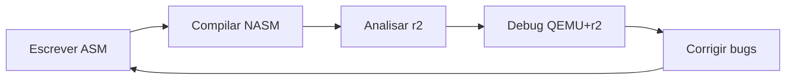

# 🔬 Integração Radare2 com Trilha OS Development - Análise e Guia

## 📋 Resumo Executivo

### 🎯 O que é Radare2 (r2)?
**Radare2** é um framework de engenharia reversa e análise binária extremamente poderoso, **gratuito e open-source**, com 11+ anos de desenvolvimento ativo. É uma alternativa completa ao IDA Pro (que custa milhares de dólares).

### 📊 Análise do Arquivo r2.md
- **Tamanho:** 2802 linhas (transcrição de vídeos tutoriais)
- **Conteúdo:** Tutorial hands-on sobre uso do Radare2
- **Foco:** Análise estática, debugging, disassembly
- **Relevância para OS Dev:** ⭐⭐⭐⭐⭐ **EXTREMAMENTE RELEVANTE**

---

## 🚀 Por que Radare2 é ESSENCIAL para OS Development

### Aplicações Diretas na Trilha

#### FASE 2: Hardware e Bootloader
- **Análise de bootloaders** existentes (GRUB, Syslinux)
- **Debug de código** em modo real (16-bit)
- **Verificação de instruções** assembly geradas
- **Análise de headers** ELF e estruturas binárias

#### FASE 3: Desenvolvimento de Kernel
- **Kernel debugging** remoto via QEMU
- **Análise de crash dumps**
- **Verificação de código** compilado vs esperado
- **Debug de drivers** e módulos

#### FASE 4: Gerenciamento de Processos
- **Análise de executáveis** ELF
- **Debug de system calls**
- **Tracing de execução** de processos
- **Análise de memory layout**

#### FASE 5: Extensões e I/O
- **Debug de device drivers**
- **Análise de protocolos** de comunicação
- **Reverse engineering** de drivers proprietários
- **Verificação de implementações**

---

## 🛠️ Capacidades do Radare2 para OS Dev

### Funcionalidades Principais Identificadas

```markdown
✅ Disassembly (x86, ARM, MIPS, etc.)
✅ Debugging (local, remoto, kernel)
✅ Análise de headers (ELF, PE)
✅ Hex editor integrado
✅ Assembly inline
✅ Cross-references analysis
✅ String search (ASCII, Unicode, Wide)
✅ Binary diffing
✅ Scripting (Python, JavaScript)
✅ Visualização de entropia
✅ Calculadora e conversores
✅ Hashing e crypto
```

### Vantagens sobre Outras Ferramentas
| Ferramenta | Custo | Kernel Debug | Open Source | Scriptable |
|------------|-------|-------------|-------------|------------|
| **Radare2** | Grátis | ✅ | ✅ | ✅ |
| IDA Pro | $3000+ | ✅ | ❌ | ✅ |
| GDB | Grátis | ✅ | ✅ | ⚠️ |
| objdump | Grátis | ❌ | ✅ | ❌ |

---

## 📚 Integração com a Trilha de Aprendizado

### Momento Ideal para Introduzir

**Recomendação:** Introduzir Radare2 na **FASE 1** (Fundamentos) e usar progressivamente:

1. **FASE 1:** Comandos básicos, análise de binários C simples
2. **FASE 2:** Debug de bootloader, análise assembly
3. **FASE 3:** Kernel debugging via QEMU
4. **FASE 4:** Análise de processos e ELF
5. **FASE 5:** Debug avançado de drivers

### Exercícios Práticos Sugeridos

#### Exercício 1: Análise de Hello World (FASE 1)
```bash
# Compilar programa simples
gcc -o hello hello.c

# Analisar com radare2
r2 hello
[0x00000000]> aaa  # Analisar tudo
[0x00000000]> pdf @ main  # Disassembly da main
```

#### Exercício 2: Debug de Bootloader (FASE 2)
```bash
# Analisar bootloader compilado
r2 -b 16 bootloader.bin  # Modo 16-bit
[0x00000000]> pd 20  # Disassembly primeiras 20 instruções
```

#### Exercício 3: Kernel Remote Debug (FASE 3)
```bash
# QEMU com gdbserver
qemu-system-x86_64 -s -S kernel.bin

# Radare2 conecta remotamente
r2 -d gdb://localhost:1234
```

---

## 🎯 Guia de Instalação e Configuração

### Instalação no Arch Linux (Recomendado)
```bash
# Como usuário osdev no Arch:
sudo pacman -S radare2

# Verificar instalação
r2 -v
```

### Instalação no Ubuntu
```bash
# Método 1: Apt (versão pode ser antiga)
sudo apt install radare2

# Método 2: Git (versão mais recente - RECOMENDADO)
git clone https://github.com/radareorg/radare2
cd radare2
./sys/install.sh
```

### Configuração Inicial
```bash
# Criar config pessoal
echo 'e asm.syntax=intel' > ~/.radare2rc  # Sintaxe Intel
echo 'e scr.utf8=true' >> ~/.radare2rc     # UTF-8 support
echo 'e scr.color=1' >> ~/.radare2rc       # Cores
```

---

## 📖 Comandos Essenciais para OS Dev

### Navegação e Análise
```bash
r2 binary           # Abrir binário
> aaa              # Analyze All Autoname
> pdf @ main       # Print Disassembly Function
> iz               # List strings
> iI               # Binary info
> ie               # Entry points
> is               # Symbols
```

### Visual Mode (Interface Gráfica)
```bash
> V                # Enter visual mode
> p/P              # Cycle views (hex/disasm/debug)
> :                # Command prompt in visual
> q                # Quit visual mode
```

### Debugging
```bash
> db main          # Breakpoint na main
> dc               # Continue execution
> ds               # Step one instruction
> dr               # Show registers
> dm               # Show memory maps
```

### Assembly/Disassembly
```bash
> pad 0x90         # Assemble NOP instruction
> pi 10            # Print 10 instructions
> wx 9090          # Write hex bytes
> wa nop           # Write assembly
```

---

## 🔄 Workflow Integrado OS Dev + Radare2

### Desenvolvimento de Bootloader


### Debug de Kernel


---

## 💡 Insights da Transcrição

### Pontos-Chave Identificados
1. **Curva de aprendizado:** Reconhecidamente difícil inicialmente
2. **Comandos únicos:** Sistema próprio diferente de GDB
3. **Múltiplas views:** Hex, disasm, debug, strings, entropy
4. **Seek concept:** Navegação por endereços
5. **Análise necessária:** Comando `aaa` para análise completa

### Dicas do Tutorial
- Use `r2` como alias (mais curto que `radare2`)
- Visual mode (`V`) facilita navegação
- `p/P` para alternar entre views
- `?` para help em qualquer contexto
- Scripts Python podem rodar dentro do r2

---

## 📊 Métricas de Aprendizado

### Tempo Estimado de Domínio
| Nível | Horas | Competências |
|-------|-------|--------------|
| **Básico** | 5-10h | Navegação, disassembly simples |
| **Intermediário** | 20-30h | Debugging, análise ELF |
| **Avançado** | 50+h | Kernel debug, scripting, plugins |

### ROI (Return on Investment)
- **Investimento:** 50-80 horas totais
- **Retorno:** Capacidade profissional de análise binária
- **Economia:** ~$3000 (vs IDA Pro)
- **Aplicabilidade:** 100% da trilha OS Dev

---

## ✅ Recomendação Final

### 🟢 INTEGRAR RADARE2 NA TRILHA

**Justificativas:**
1. **Ferramenta profissional** gratuita
2. **Essencial** para debug de kernel/bootloader
3. **Substitui** múltiplas ferramentas pagas
4. **Alinhado** com filosofia open-source
5. **Habilidade** valorizada no mercado

### Próximos Passos Recomendados
1. ✅ Instalar Radare2 no Arch Linux
2. ✅ Completar tutorial básico (r2.md)
3. ✅ Integrar nos exercícios da FASE 1
4. ✅ Usar progressivamente nas outras fases

---

## 📚 Recursos Adicionais

### Documentação
- [Radare2 Book](https://book.rada.re/)
- [Radare2 GitHub](https://github.com/radareorg/radare2)
- [r2wiki](https://r2wiki.readthedocs.io/)

### Tutoriais Recomendados
- Arquivo `r2.md` (2802 linhas de tutorial prático)
- [Radare2 Explorations](https://monosource.github.io/radare2-explorations/)
- [Reverse Engineering with Radare2](https://www.megabeets.net/)

### Comunidade
- IRC: #radare @ freenode
- Telegram: @radare
- Discord: Radare2

---

`★ Insight ─────────────────────────────────────`
`Radare2 é a "navalha suíça" da análise binária.`
`Dominar esta ferramenta é equivalente a ter um`
`laboratório completo de engenharia reversa gratuito.`
`─────────────────────────────────────────────────`

**Documento Criado:** 2025-09-03  
**Análise do arquivo:** r2.md (2802 linhas)  
**Status:** 🟢 Altamente recomendado para integração  
**Prioridade:** Alta - Introduzir na FASE 1