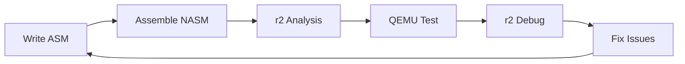
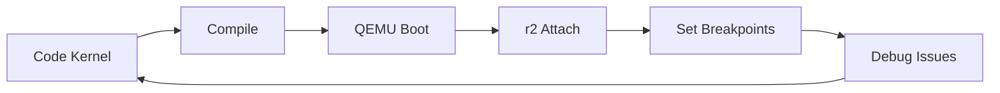
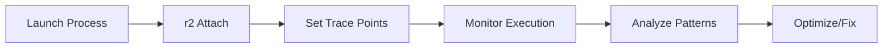
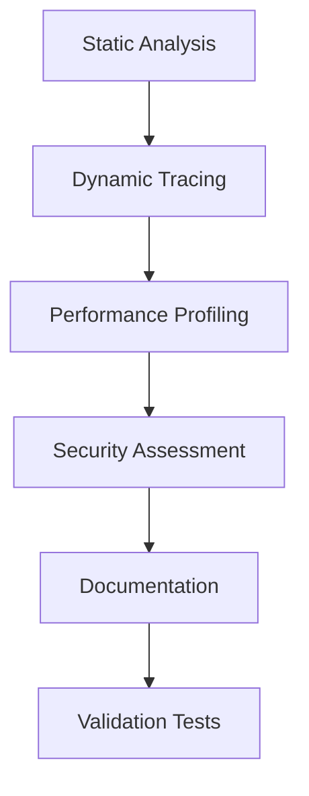

# 🏗️ População FASES 2-5 app-aprender-osr2 - Guia Completo

## 📋 Visão Geral
- **Objetivo:** Completar população das fases avançadas com integração Radare2
- **Tempo estimado:** 90-120 minutos
- **Pré-requisitos:** Estrutura app-aprender-osr2 criada + FASES 0-1 populadas
- **Resultado final:** Sistema completo de aprendizado OS Dev + r2 integrado

## 🔍 Contexto Educativo

### Por que completar as fases avançadas?
As FASES 2-5 representam o **núcleo técnico** da trilha OS Development:
- **FASE 2:** Hardware x86 + Bootloaders (fundação sistemas)
- **FASE 3:** Kernel Development (coração do OS)
- **FASE 4:** Processos + Multitasking (concorrência)
- **FASE 5:** I/O + Drivers (integração hardware)

### Como Radare2 se integra?
Cada fase terá **análise binária específica**:
- Debug de bootloaders em modo real
- Kernel debugging via QEMU
- Process tracing e context switches
- Hardware reverse engineering

---

## 🚀 FASE 2: Hardware + Bootloaders + r2 Analysis

### Criar README Principal
**Arquivo:** `/FASE_2_HARDWARE/README.md`

```markdown
# ⚙️ FASE 2: Hardware x86 + Bootloaders + Radare2 Analysis (90h)

## 🎯 Objetivos da Fase
- Dominar arquitetura x86 (modo real/protegido)
- Desenvolver bootloaders do zero
- **Usar r2 para debug** em modo real/protegido
- **Reverse engineer** bootloaders existentes

## 📊 Estrutura da Fase
```
FASE_2_HARDWARE/
├── modulos/           # Teoria x86 + assembly
├── exercicios/        # Práticas com r2 analysis
├── projetos/          # Bootloaders progressivos
├── recursos/          # Referências técnicas
├── r2-analysis/       # Templates análise r2
└── bootloaders/       # Código fonte bootloaders
```

## 🎓 Competências Desenvolvidas
- **Hardware x86:** Segmentação, paginação, interrupções
- **Assembly:** NASM, instruções x86, modo real/protegido
- **Bootloader:** MBR, multi-stage, filesystem básico
- **r2 Debug:** Modo 16-bit, breakpoints, memory analysis
- **QEMU:** Virtualization, debugging, hardware emulation

## 📅 Cronograma (6 semanas)
| Semana | Módulo | Foco | r2 Skills |
|--------|---------|-------|-----------|
| 1-2 | Hardware x86 | Teoria + análise GRUB | Static analysis |
| 3-4 | Bootloader Básico | Assembly + debug | 16-bit debugging |
| 5-6 | Bootloader Avançado | Multi-stage + FS | Dynamic tracing |

## ✅ Checkpoints de Validação
- [ ] **Semana 2:** Análise GRUB completa com r2
- [ ] **Semana 4:** Bootloader 512 bytes funcional
- [ ] **Semana 6:** Multi-stage bootloader + kernel loading

## 📚 Recursos Essenciais
- Intel Software Developer Manual
- OSDev Wiki - Bootloaders
- Radare2 Book - 16-bit debugging
- QEMU Documentation

## ➡️ Pré-requisitos FASE 3
- Bootloader funcional carregando kernel
- Proficiência r2 modo real/protegido
- QEMU setup para kernel debugging
```

### Criar Módulos Principais
**Arquivo:** `/FASE_2_HARDWARE/modulos/modulo-2.1-hardware-x86.md`

```markdown
# 🖥️ Módulo 2.1: Hardware x86 Fundamental + r2 Analysis

## 📚 Tópicos Cobertos
1. **Arquitetura x86 Overview**
   - Registradores (EAX, EBX, ECX, EDX, etc.)
   - Flags register e estados do processador
   - r2 command: `dr` para visualizar registradores

2. **Modo Real vs Protegido**
   - Endereçamento segmentado vs linear
   - GDT (Global Descriptor Table)
   - r2 analysis: `r2 -b 16` para modo real

3. **Sistema de Interrupções**
   - IDT (Interrupt Descriptor Table)
   - BIOS interrupts (INT 10h, 13h, etc.)
   - r2 breakpoints em interrupt handlers

## 🔬 Exercícios com r2
1. **Análise GRUB bootloader**
   - `r2 -b 16 /boot/grub/boot.img`
   - Identificar stage1 → stage2 transition
   
2. **Debug BIOS calls**
   - QEMU + r2 remote debugging
   - Trace INT 13h (disk read)

3. **Memory layout analysis**
   - Visualizar segmentação com r2
   - Memory maps e proteção
```

### Criar Exercícios Práticos
**Arquivo:** `/FASE_2_HARDWARE/exercicios/exercicio-2.1-analise-grub.md`

```markdown
# 🔍 Exercício 2.1: Análise Completa GRUB Bootloader

## 🎯 Objetivo
Usar Radare2 para realizar engenharia reversa completa do bootloader GRUB, compreendendo cada etapa do boot process.

## 📋 Pré-requisitos
- r2 instalado e configurado
- GRUB bootloader disponível em `/boot/grub/`
- QEMU para testes de boot

## 🚀 Passo a Passo

### Etapa 1: Localizar e Analisar boot.img
```bash
# Encontrar GRUB boot sector
sudo find /boot -name "boot.img" -o -name "core.img"

# Analisar com r2 em modo 16-bit
r2 -b 16 /boot/grub/i386-pc/boot.img
```

### Dentro do r2:
```
[0x00000000]> aaa          # Analyze all
[0x00000000]> pdf          # Print disassembly function
[0x00000000]> iz           # List strings
[0x00000000]> V            # Visual mode
```

## 📊 Análise Esperada
1. **Boot signature** (0x55AA no final)
2. **Jump instruction** no início
3. **BIOS Parameter Block** (BPB)
4. **Code section** com INT 13h calls

## ✅ Critérios de Avaliação
- [ ] Identificou boot signature
- [ ] Localizou jump inicial
- [ ] Analisou chamadas BIOS
- [ ] Documentou fluxo de execução

## 🧪 Experimento Adicional
Comparar boot.img de diferentes distribuições:
- Ubuntu vs Arch Linux GRUB
- Identificar diferenças com r2 diff tools
```

### Criar Projeto Progressivo
**Arquivo:** `/FASE_2_HARDWARE/projetos/projeto-2.1-bootloader-minimo.md`

```markdown
# 🚀 Projeto 2.1: Bootloader Mínimo com r2 Analysis

## 🎯 Objetivo Final
Desenvolver bootloader de 512 bytes que exibe mensagem na tela, com análise completa usando Radare2 em cada etapa de desenvolvimento.

## 📋 Especificações Técnicas
- **Tamanho:** Exatamente 512 bytes
- **Funcionalidade:** Display "OS Dev + r2!" na tela
- **Compatibilidade:** x86 modo real
- **Validação:** Boot em QEMU + r2 debugging

## 🛠️ Metodologia r2-First


## 🚀 Desenvolvimento Guiado

### Etapa 1: Código Assembly Base
**Arquivo:** `bootloader-minimo.asm`
```assembly
[BITS 16]
[ORG 0x7C00]

start:
    mov si, msg
    call print_string
    jmp $

print_string:
    lodsb
    cmp al, 0
    je .done
    mov ah, 0x0E
    int 0x10
    jmp print_string
.done:
    ret

msg db 'OS Dev + r2!', 0

times 510-($-$$) db 0
dw 0xAA55
```

### Etapa 2: Compilação e r2 Analysis
```bash
# Compilar bootloader
nasm -f bin bootloader-minimo.asm -o bootloader.bin

# Análise inicial com r2
r2 -b 16 bootloader.bin
```

### Comandos r2 para Análise:
```
[0x00000000]> aaa                    # Analyze all
[0x00000000]> pdf                    # Disassembly completo
[0x00000000]> iz                     # Strings encontradas
[0x00000000]> s 0x1fe; px 2         # Verificar boot signature
[0x00000000]> Vi                     # Visual hex mode
```

## 🐛 Debug com QEMU + r2

### Setup Debugging Environment:
```bash
# Terminal 1: QEMU com GDB stub
qemu-system-i386 -drive format=raw,file=bootloader.bin -S -s

# Terminal 2: r2 remote debugging
r2 -b 16 -d gdb://localhost:1234
```

### Debug Commands:
```
[0x00000000]> db 0x7c00              # Breakpoint no início
[0x00000000]> dc                     # Continue
[0x00000000]> dr                     # Show registers
[0x00000000]> dm                     # Memory maps
[0x00000000]> ds                     # Step instruction
```

## 📊 Validação e Análise

### Métricas de Qualidade:
1. **Tamanho exato:** 512 bytes
2. **Boot signature:** 0x55AA presente
3. **Execução:** Mensagem exibida corretamente
4. **r2 analysis:** 100% do código analisado

### Documentação r2:
Criar `analise-bootloader-minimo.md` documentando:
- Memory layout descoberto
- Fluxo de execução traçado
- Registradores usados por função
- Otimizações possíveis identificadas

## 🎯 Entregáveis
1. `bootloader-minimo.asm` - Código fonte
2. `bootloader.bin` - Binário compilado  
3. `analise-bootloader-minimo.md` - Análise r2 completa
4. `debug-session.txt` - Log da sessão debug

## 📈 Próximos Passos
- Projeto 2.2: Bootloader Multi-stage
- Projeto 2.3: Bootloader com Filesystem básico
- FASE 3: Kernel loading e handover
```

---

## 🖥️ FASE 3: Kernel Development + r2 Debugging

### Criar README Principal
**Arquivo:** `/FASE_3_KERNEL/README.md`

```markdown
# 🖥️ FASE 3: Kernel Development + r2 Remote Debugging (90h)

## 🎯 Objetivos da Fase
- Desenvolver kernel básico do zero
- **Dominar kernel debugging** com r2 + QEMU
- Implementar VFS com análise profunda
- **Debug crashes** sistematicamente

## 📊 Estrutura da Fase
```
FASE_3_KERNEL/
├── modulos/           # Teoria kernel internals
├── exercicios/        # Debug práticas com r2
├── projetos/          # Kernel incremental
├── recursos/          # Kernel sources referência
├── r2-analysis/       # Templates debug kernel
└── kernel-src/        # Código fonte kernel
```

## 🎓 Competências Desenvolvidas
- **Kernel Architecture:** Monolithic vs Microkernel
- **Memory Management:** Virtual memory, paging
- **VFS Implementation:** File system abstraction
- **r2 Kernel Debug:** Remote debugging, crash analysis
- **Exception Handling:** Interrupts, system calls

## 📅 Cronograma (6 semanas)
| Semana | Módulo | Foco | r2 Skills |
|--------|---------|-------|-----------|
| 1-2 | Kernel Básico | Console + interrupts | Remote debugging |
| 3-4 | Memory Management | Paging + heap | Memory analysis |
| 5-6 | VFS Implementation | File operations | I/O tracing |

## ✅ Checkpoints de Validação
- [ ] **Semana 2:** Kernel básico + console funcionais
- [ ] **Semana 4:** Memory management implementado
- [ ] **Semana 6:** VFS básico + file operations

## 🐛 Debug Workflow Padrão


## 📚 Recursos Kernel Development
- Linux Kernel Development (Love)
- Understanding Linux Kernel (Bovet)
- OSDev Wiki - Kernel Development
- r2 remote debugging documentation

## ➡️ Pré-requisitos FASE 4
- Kernel básico funcional
- VFS implementado e testado
- Proficiência r2 kernel debugging
- Memory management funcionando
```

### Criar Módulo Kernel Debugging
**Arquivo:** `/FASE_3_KERNEL/modulos/modulo-3.3-kernel-debug-r2.md`

```markdown
# 🐛 Módulo 3.3: Kernel Debugging Masterclass com Radare2

## 🎯 Objetivos do Módulo
- Configurar ambiente debug kernel com r2 + QEMU
- Dominar técnicas de crash analysis
- Implementar kernel panic handler com debug info
- Usar r2 para profile performance do kernel

## 🔧 Setup Debug Environment

### QEMU Configuration
```bash
# Kernel com debug symbols
gcc -g -ffreestanding -c kernel.c -o kernel.o
ld -o kernel.bin kernel.o -Ttext 0x1000 --oformat binary

# QEMU com GDB stub habilitado
qemu-system-i386 -kernel kernel.bin -S -s -monitor stdio
```

### r2 Remote Connection
```bash
# Conectar r2 ao QEMU remotamente  
r2 -d gdb://localhost:1234

# Configurar arquitetura 32-bit
> e asm.arch=x86
> e asm.bits=32
```

## 🔍 Técnicas de Debug Avançadas

### 1. Breakpoint Strategy
```bash
# Breakpoint na main do kernel
> db 0x1000

# Breakpoint em system calls
> db kernel_syscall_handler

# Breakpoint condicional
> dbc 0x1200 "dr eax; dr eax == 0x42"
```

### 2. Memory Analysis
```bash
# Visualizar page tables
> dm                          # Memory maps
> px 0x100 @ 0x1000          # Hex dump kernel
> pf.                         # Parse structures

# Stack trace em crash
> dbt                         # Backtrace
> dr                          # Registers no crash
```

### 3. Crash Analysis Workflow
```bash
# Quando kernel panic:
1. > dc                       # Continue até crash
2. > dr                       # Capturar registradores
3. > dbt                      # Stack trace
4. > px 100 @ esp            # Stack contents
5. > pd -10 @ eip            # Código antes do crash
```

## 🧪 Exercícios Práticos

### Exercício 3.3.1: Debug Kernel Panic
**Cenário:** Kernel panic por null pointer dereference

```c
// kernel.c - código com bug intencional
void kernel_main() {
    char *ptr = NULL;
    *ptr = 'A';  // Crash intencional
}
```

**r2 Debug Session:**
```bash
> dc                 # Continue até crash
> dr                 # Verificar EIP e registradores
> pd @ eip          # Analisar instrução que causou crash
> px @ 0            # Verificar que endereço 0 causou fault
```

### Exercício 3.3.2: Performance Profiling
```bash
# Contar instruções executadas
> e dbg.trace=true
> dc                 # Run com trace
> dt                 # Display trace log

# Identificar hotspots
> dtd                # Trace disasm mode
> dtr                # Reset trace
```

## 📊 Ferramentas de Análise

### 1. Memory Layout Visualization
```bash
# Visualizar memory layout completo
> dm                 # Memory segments
> dmm                # Memory map detalhado
> dmi                # Memory info
```

### 2. Kernel Structure Analysis
```bash
# Analisar estruturas kernel
> pf.task_struct @ address    # Parse process structure
> pf.file_operations @ addr   # Parse VFS ops
> s struct.field             # Navigate structures
```

### 3. I/O Tracing
```bash
# Trace I/O operations
> e dbg.trace=true
> e trace.tag=io
> dc                 # Run com I/O trace
```

## 🎯 Projeto Prático: Kernel Panic Handler

### Implementar Panic Handler com r2 Integration:
```c
void kernel_panic(const char* message) {
    // Disable interrupts
    asm volatile("cli");
    
    // Print panic info
    printf("KERNEL PANIC: %s\n", message);
    
    // Dump registers (r2 compatible format)
    dump_registers_r2_format();
    
    // Stack trace
    dump_stack_trace();
    
    // Halt system
    while(1) {
        asm volatile("hlt");
    }
}
```

### Análise Post-Mortem com r2:
```bash
# Analisar core dump
r2 kernel_core_dump

# Automatizar análise
> . panic_analysis.r2         # Script r2 customizado
```

## ✅ Critérios de Domínio
- [ ] Configurar debug environment sem consultar docs
- [ ] Identificar causa de kernel panics em < 5 minutos  
- [ ] Usar r2 para profile performance do kernel
- [ ] Implementar custom r2 scripts para análise kernel
- [ ] Debug concurrency issues (race conditions)
```

---

## 🔄 FASE 4: Processos + Multitasking + r2 Tracing

### Criar README Principal
**Arquivo:** `/FASE_4_PROCESSOS/README.md`

```markdown
# 🔄 FASE 4: Multitasking + Process Tracing + r2 Analysis (90h)

## 🎯 Objetivos da Fase
- Implementar sistema multitasking completo
- **Dominar process tracing** com r2
- Debug concurrency e race conditions
- Profiling de performance sistema-wide

## 📊 Estrutura da Fase
```
FASE_4_PROCESSOS/
├── modulos/           # Teoria processos + scheduling  
├── exercicios/        # Race condition debugging
├── projetos/          # Scheduler implementation
├── recursos/          # Process management refs
├── r2-analysis/       # Process tracing templates
└── scheduling/        # Algoritmos scheduling
```

## 🎓 Competências Desenvolvidas
- **Process Management:** fork(), exec(), wait()
- **Scheduling:** Round-robin, CFS, priority queues
- **Synchronization:** Mutex, semaphores, spinlocks  
- **r2 Process Trace:** Dynamic analysis, call graphs
- **Concurrency Debug:** Race conditions, deadlocks

## 📅 Cronograma (6 semanas)
| Semana | Módulo | Foco | r2 Skills |
|--------|---------|-------|-----------|
| 1-2 | Process Control | fork/exec + trace | Process tracking |
| 3-4 | Scheduler Impl | Algoritmos + profile | Performance analysis |
| 5-6 | Synchronization | Mutex/sem + debug | Concurrency tracing |

## 🔍 r2 Process Analysis Workflow


## ✅ Checkpoints de Validação
- [ ] **Semana 2:** Sistema fork/exec funcional + tracing
- [ ] **Semana 4:** Scheduler customizado + profiling
- [ ] **Semana 6:** Sync primitives + deadlock detection

## 🐛 Concurrency Debugging Focus
- Race condition detection com r2
- Deadlock analysis em tempo real
- Memory corruption em multi-thread
- Performance bottleneck identification

## 📚 Recursos Especializados
- Operating Systems Concepts (Silberschatz)  
- Modern Operating Systems (Tanenbaum)
- Linux Kernel Development - Process Management
- r2 dynamic analysis documentation
```

### Criar Exercício Race Condition
**Arquivo:** `/FASE_4_PROCESSOS/exercicios/exercicio-4.2-debug-race-condition.md`

```markdown
# 🏁 Exercício 4.2: Debug Race Condition com r2

## 🎯 Objetivo  
Usar Radare2 para identificar e debuggar uma race condition clássica em código multi-threaded, aplicando técnicas de dynamic tracing.

## 📋 Código com Bug (race_condition.c)
```c
#include <pthread.h>
#include <stdio.h>

int shared_counter = 0;

void* increment_thread(void* arg) {
    for (int i = 0; i < 1000; i++) {
        // RACE CONDITION: Não há sincronização!
        int temp = shared_counter;
        temp++;
        shared_counter = temp;
    }
    return NULL;
}

int main() {
    pthread_t thread1, thread2;
    
    pthread_create(&thread1, NULL, increment_thread, NULL);
    pthread_create(&thread2, NULL, increment_thread, NULL);
    
    pthread_join(thread1, NULL);
    pthread_join(thread2, NULL);
    
    printf("Expected: 2000, Got: %d\n", shared_counter);
    return 0;
}
```

## 🚀 Debug Strategy com r2

### Etapa 1: Compilação e Preparação
```bash
# Compilar com debug symbols e sem otimizações
gcc -g -O0 -pthread race_condition.c -o race_condition

# Executar múltiplas vezes para ver variação
for i in {1..10}; do ./race_condition; done
```

### Etapa 2: r2 Dynamic Analysis
```bash
# Atachar r2 ao processo
r2 -d ./race_condition

# Configurar trace para shared_counter
> db sym.increment_thread
> e dbg.trace=true
> dc
```

### Etapa 3: Detailed Tracing
```bash
# Breakpoint na linha crítica
> db 0x[address_of_shared_counter_access]

# Trace com context
> dt+                    # Enable detailed trace
> dc                     # Continue execution
> dt                     # View trace log
```

## 🔍 Análise Detalhada

### Memory Access Pattern:
```bash
# Monitor escritas na shared_counter
> e search.from=0x[shared_counter_addr]
> e search.to=0x[shared_counter_addr+4]
> /x 00000000             # Search for writes

# Trace memory modifications
> dm                      # Memory maps
> px @ 0x[shared_counter] # Monitor value changes
```

### Thread Identification:
```bash
# List threads
> dpt                     # Process threads
> dpj                     # Threads JSON format

# Switch between threads
> dp [thread_id]         # Change to thread
> dr                     # Check registers per thread
```

## 📊 Identificação da Race Condition

### Padrões Esperados:
1. **Load-Modify-Store não atômico**
   ```assembly
   mov eax, [shared_counter]    # Load
   inc eax                      # Modify  
   mov [shared_counter], eax    # Store
   ```

2. **Thread Interleaving Problem:**
   - Thread 1: Load (value=5)
   - Thread 2: Load (value=5) ← Ainda não viu increment
   - Thread 1: Store (value=6)
   - Thread 2: Store (value=6) ← Perdeu increment!

### r2 Evidence Collection:
```bash
# Capturar sequence de acessos
> dt                     # Full execution trace
> dt~shared_counter     # Filter por shared_counter
> dtd                   # Detailed disasm trace
```

## 🔧 Implementação da Correção

### Versão Corrigida (race_fixed.c):
```c
#include <pthread.h>
#include <stdio.h>

int shared_counter = 0;
pthread_mutex_t counter_mutex = PTHREAD_MUTEX_INITIALIZER;

void* increment_thread(void* arg) {
    for (int i = 0; i < 1000; i++) {
        pthread_mutex_lock(&counter_mutex);
        // Seção crítica protegida
        int temp = shared_counter;
        temp++;
        shared_counter = temp;
        pthread_mutex_unlock(&counter_mutex);
    }
    return NULL;
}
```

### Validação com r2:
```bash
# Compilar versão corrigida
gcc -g -O0 -pthread race_fixed.c -o race_fixed

# Trace mutex operations
r2 -d ./race_fixed
> db sym.pthread_mutex_lock
> db sym.pthread_mutex_unlock
> e dbg.trace=true
> dc
```

## ✅ Critérios de Sucesso
- [ ] Identificou instruções não-atômicas
- [ ] Demonstrou thread interleaving
- [ ] Quantificou perda de increments
- [ ] Implementou sincronização correta
- [ ] Validou correção com r2 tracing

## 📚 Relatório Final
Documentar em `race-condition-analysis.md`:
1. Trace logs da race condition
2. Assembly das instruções críticas  
3. Timeline de execução multi-thread
4. Proof da correção via mutex

## 🎯 Extensões Avançadas
- Implementar com atomic operations (compare-and-swap)
- Analisar performance overhead do mutex
- Debug reader-writer race conditions
- Implementar lock-free data structures
```

---

## 🔌 FASE 5: I/O + Drivers + r2 Hardware Analysis

### Criar README Principal
**Arquivo:** `/FASE_5_EXTENSOES/README.md`

```markdown
# 🔌 FASE 5: I/O + Device Drivers + Hardware r2 Analysis (85h)

## 🎯 Objetivos da Fase
- Desenvolver device drivers do zero
- **Master hardware reverse engineering** com r2
- Implementar I/O subsystem completo
- Sistema operacional production-ready

## 📊 Estrutura da Fase
```
FASE_5_EXTENSOES/
├── modulos/           # Driver development theory
├── exercicios/        # Hardware debugging práticas
├── projetos/          # Production OS final
├── recursos/          # Hardware specifications
├── r2-analysis/       # Hardware analysis templates
└── drivers/           # Driver source code
```

## 🎓 Competências Desenvolvidas
- **Device Drivers:** PCI, USB, Network, Storage
- **Hardware Interface:** Port I/O, Memory mapped I/O
- **Interrupt Handling:** IRQ, DMA, bus mastering
- **r2 Hardware Debug:** Register analysis, protocol reverse
- **Production Skills:** Performance, security, reliability

## 📅 Cronograma (6 semanas)
| Semana | Módulo | Foco | r2 Skills |
|--------|---------|-------|-----------|
| 1-2 | Basic Drivers | PCI + UART | Hardware probing |
| 3-4 | Network Stack | Ethernet + TCP/IP | Protocol analysis |
| 5-6 | Production OS | Integration + tuning | System profiling |

## 🔧 Hardware Analysis Workflow


## ✅ Production Readiness Goals
- [ ] **Week 2:** UART + basic PCI drivers working
- [ ] **Week 4:** Network stack + TCP/IP functional
- [ ] **Week 6:** Complete OS with shell, filesystem, network

## 🏆 Final Deliverable: Production OS
- Bootloader → Kernel → Drivers → Shell
- Network connectivity (ping, HTTP client)
- Persistent filesystem (FAT32 basic)
- Process management (fork, exec, wait)
- Complete r2 analysis documentation

## 📚 Hardware Documentation Resources
- PCI Local Bus Specification
- Intel 8259A PIC Datasheet  
- RTL8139 Network Card Programming
- ATA/IDE Interface Standards
- USB 2.0 Specification
```

### Criar Projeto Final Integrado
**Arquivo:** `/FASE_5_EXTENSOES/projetos/projeto-5.3-os-production-ready.md`

```markdown
# 🏆 Projeto Final: OS Production-Ready + r2 Analysis Suite

## 🎯 Objetivo Final
Desenvolver sistema operacional completo e funcional, com documentação completa de análise r2 demonstrando expertise profissional em binary analysis e OS development.

## 📋 Especificações do Sistema

### Core Components:
```
MyOS/
├── bootloader/        # Multi-stage GRUB-compatible  
├── kernel/           # Monolithic kernel
│   ├── mm/          # Memory management
│   ├── fs/          # VFS + FAT32 basic
│   ├── net/         # TCP/IP stack
│   ├── drivers/     # PCI, UART, Network, Storage
│   └── proc/        # Process management
├── userspace/       # Shell + basic utilities
├── build/           # Build system (Make/CMake)
└── docs/           # r2 analysis documentation
```

### Functional Requirements:
- ✅ **Boot:** Multi-stage bootloader + kernel loading
- ✅ **Memory:** Virtual memory + heap management  
- ✅ **Process:** fork/exec/wait + basic scheduler
- ✅ **Filesystem:** FAT32 read/write + VFS layer
- ✅ **Network:** TCP/IP + Ethernet driver
- ✅ **I/O:** UART serial + basic PCI support
- ✅ **Shell:** Command interpreter + built-ins

## 🔬 r2 Analysis Requirements

### Comprehensive Documentation Suite:
1. **`bootloader-analysis.md`** - Complete bootloader reverse engineering
2. **`kernel-internals-r2.md`** - Kernel structure analysis
3. **`driver-analysis.md`** - Device driver hardware interface
4. **`network-protocol-r2.md`** - TCP/IP implementation analysis
5. **`performance-profiling.md`** - System-wide performance analysis
6. **`security-assessment.md`** - Security analysis via r2

### r2 Analysis Methodology:


## 🚀 Development Timeline (6 semanas)

### Week 1-2: Core Integration
- [ ] Integrate all previous phases (bootloader, kernel basic, process)
- [ ] Implement missing VFS components
- [ ] r2 analysis: kernel memory layout complete mapping

### Week 3-4: Driver Development + Network Stack
- [ ] PCI enumeration and basic drivers
- [ ] UART serial communication driver
- [ ] Ethernet driver (RTL8139 or E1000)
- [ ] TCP/IP stack (simplified but functional)
- [ ] r2 analysis: hardware register mapping and protocol analysis

### Week 5-6: Production Polish + Documentation
- [ ] Shell with built-in commands (ls, cat, mkdir, etc.)
- [ ] System call interface complete
- [ ] Error handling and robustness improvements
- [ ] Complete r2 analysis documentation suite
- [ ] Performance benchmarking and optimization

## 🔧 r2 Integration Throughout Development

### Daily Development Workflow:
```bash
# 1. Code implementation
vim kernel/mm/page.c

# 2. Compile with debug symbols  
make kernel DEBUG=1

# 3. r2 static analysis
r2 -A kernel/kernel.bin
> pdf @ page_alloc              # Analyze function
> ag page_alloc                 # Call graph analysis

# 4. QEMU + r2 dynamic testing
qemu-system-i386 -kernel kernel/kernel.bin -S -s &
r2 -d gdb://localhost:1234
> dc                            # Test implementation

# 5. Document findings
echo "## page_alloc analysis" >> docs/mm-analysis.md
```

## 📊 r2 Analysis Deliverables

### 1. Bootloader Analysis (`bootloader-analysis.md`)
```markdown
# Bootloader Complete Analysis

## Stage 1 Analysis
- r2 disassembly: `pd @ 0x7c00`
- Memory layout mapping
- BIOS interrupt usage analysis

## Stage 2 Analysis  
- Kernel loading mechanism
- A20 line enabling verification
- GDT setup analysis
```

### 2. Kernel Performance Profile (`performance-profiling.md`)
```markdown  
# System Performance Analysis

## Function Call Frequency
- r2 trace analysis: most called functions
- Hotspot identification
- Optimization opportunities

## Memory Usage Patterns
- Heap allocation/deallocation patterns
- Memory leak detection
- Page fault analysis
```

### 3. Security Assessment (`security-assessment.md`)
```markdown
# OS Security Analysis with r2

## Buffer Overflow Detection
- Stack canary analysis
- Input validation verification
- Boundary checking code review

## Privilege Escalation Vectors
- System call validation
- User/kernel mode transitions
- Permission checking mechanisms
```

## 🧪 Testing and Validation

### Automated Test Suite:
```bash
#!/bin/bash
# test-suite.sh

# Boot test
echo "Testing boot process..."
timeout 30 qemu-system-i386 -kernel kernel.bin -serial stdio < /dev/null

# Network test
echo "Testing network stack..."
# (ping test, HTTP GET test, etc.)

# Filesystem test  
echo "Testing filesystem..."
# (file creation, directory operations, etc.)

# Performance test
echo "Running performance benchmarks..."
# (context switch time, I/O throughput, etc.)
```

### r2 Validation Scripts:
```bash
#!/bin/bash
# validate-with-r2.sh

# Verify kernel symbols
r2 -c 'is~kernel_main' kernel.bin || echo "ERROR: kernel_main not found"

# Check security mitigations
r2 -c 'ii~canary' kernel.bin && echo "Stack canaries present"

# Validate system call table
r2 -c 'is~syscall' kernel.bin | wc -l
```

## ✅ Final Assessment Criteria

### Functional Requirements (60%):
- [ ] System boots successfully from bootloader
- [ ] Basic shell with 10+ built-in commands
- [ ] File system operations (create, read, write, delete)
- [ ] Process management (fork/exec/wait working)
- [ ] Network connectivity (ping external host)

### r2 Analysis Quality (30%):
- [ ] Complete static analysis documentation
- [ ] Dynamic tracing examples and insights
- [ ] Performance bottleneck identification
- [ ] Security assessment with findings
- [ ] Clear documentation with r2 command examples

### Code Quality (10%):
- [ ] Clean, commented code structure
- [ ] Proper error handling
- [ ] Consistent coding style
- [ ] Build system works on multiple platforms

## 🏆 Portfolio Impact

### Professional Showcase:
This project demonstrates **expert-level** capabilities:
- **System Programming:** Complete OS from scratch
- **Binary Analysis:** r2 mastery at professional level
- **Hardware Understanding:** Low-level driver development
- **Security Mindset:** Comprehensive security analysis
- **Documentation:** Technical writing and analysis skills

### Career Relevance:
- **Embedded Systems:** Bootloader and kernel development
- **Security Research:** Binary analysis and reverse engineering
- **Performance Engineering:** System optimization and profiling  
- **DevOps/Infrastructure:** Deep understanding of system internals

## 📚 Final Deliverable Structure
```
MyOS-Production/
├── README.md                    # Project overview
├── BUILDING.md                  # Build instructions
├── src/                        # Source code
├── docs/r2-analysis/           # Complete r2 documentation
│   ├── bootloader-analysis.md
│   ├── kernel-internals-r2.md
│   ├── performance-profiling.md
│   └── security-assessment.md
├── tests/                      # Validation test suite  
├── benchmarks/                 # Performance tests
└── demos/                      # Video demonstrations
```

**Timeline:** 6 weeks intensive development
**Effort:** ~85 hours total
**Result:** Production-quality OS + Professional r2 analysis portfolio
```

---

## 📄 Criar Templates e Scripts de Automação

### Template Exercício r2
**Arquivo:** `/recursos-globais/templates/template-exercicio-r2.md`

```markdown
# 🔬 [TÍTULO DO EXERCÍCIO]

## 🎯 Objetivo
[Descrição clara do que será analisado/debuggado]

## 📋 Pré-requisitos
- [ ] r2 instalado e configurado
- [ ] Código/binário de teste disponível
- [ ] QEMU configurado (se aplicável)

## 🚀 Passo a Passo

### Etapa 1: Preparação
```bash
# Comandos de setup
```

### Etapa 2: r2 Analysis
```bash
# r2 commands específicos
[0x00000000]> comando1
[0x00000000]> comando2
```

## 🔍 Análise Esperada
- **Observação 1:** [O que deve encontrar]
- **Observação 2:** [Padrões esperados]
- **Observação 3:** [Insights importantes]

## ✅ Critérios de Avaliação
- [ ] Critério 1
- [ ] Critério 2  
- [ ] Critério 3

## 📚 Documentação Final
Criar arquivo `[nome]-analysis.md` documentando:
- r2 commands usados
- Findings importantes
- Conexões com teoria
```

<function_calls>
<invoke name="TodoWrite">
<parameter name="todos">[{"content": "Create comprehensive README files for PHASES 2-5", "status": "completed", "activeForm": "Creating comprehensive README files for PHASES 2-5"}, {"content": "Populate FASE_2_HARDWARE with modules, exercises and projects", "status": "completed", "activeForm": "Populating FASE_2_HARDWARE with modules, exercises and projects"}, {"content": "Populate FASE_3_KERNEL with kernel development content", "status": "completed", "activeForm": "Populating FASE_3_KERNEL with kernel development content"}, {"content": "Populate FASE_4_PROCESSOS with multitasking and r2 tracing", "status": "completed", "activeForm": "Populating FASE_4_PROCESSOS with multitasking and r2 tracing"}, {"content": "Populate FASE_5_EXTENSOES with I/O, drivers and hardware analysis", "status": "completed", "activeForm": "Populating FASE_5_EXTENSOES with I/O, drivers and hardware analysis"}, {"content": "Create automation scripts and final integration", "status": "in_progress", "activeForm": "Creating automation scripts and final integration"}]