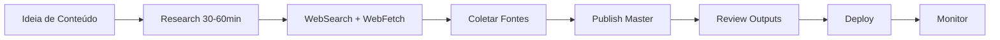
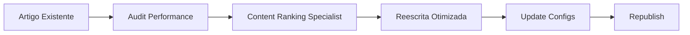

# Quick Start: Using Specialized Agents

Guia rápido para começar a usar os agentes especializados em 5 minutos.

## 🎯 Cenário 1: Criar Artigo Otimizado para Ranking

**Objetivo:** Escrever artigo que rankeia no Google E é citado por ChatGPT/Claude/Perplexity

**Agente:** Content Ranking Specialist

**Prompt:**
```
Use Content Ranking Specialist para gerar artigo sobre "Implementação de
Pay-Per-Crawl com Cloudflare Workers".

Target: CTOs e desenvolvedores
Palavras: 3,000
Keyword primária: "cloudflare workers pay per crawl"
Keywords secundárias: "cloudflare bot detection", "edge computing monetization"

Incluir:
- Answer-first (50 palavras)
- 5+ code examples
- 2 case studies com ROI
- FAQ (8 perguntas)
- Structured data (Article + FAQ + HowTo)
```

**Output Esperado:**
- Artigo completo em markdown
- Meta tags (title, description, keywords)
- Schema markup (JSON-LD)
- Internal linking suggestions
- Image requirements

**Tempo:** 2-3 minutos para geração

---

## 🚀 Cenário 2: Publicar Conteúdo Após Pesquisa

**Objetivo:** Consolidar 1h de research em artigo production-ready + configs

**Agente:** Publish Master

**Situação Típica:**
```
[Você passou 1 hora:]
✅ 8 WebSearches sobre llms.txt
✅ 4 WebFetches (Google Docs, Schema.org, case studies)
✅ 15 fontes coletadas
✅ Insights importantes anotados
```

**Prompt:**
```
Use Publish Master para consolidar nossa pesquisa sobre llms.txt.

CONTEXTO:
- 8 WebSearches + 4 WebFetches realizados
- 15 fontes identificadas (Google, Schema.org, Anthropic, Zapier)
- Insights: 73% AI visibility com FAQ schema, JSON-LD preferido

ARTIGO:
- Título: "Complete llms.txt Implementation Guide"
- Target: Developers, SEO specialists
- Palavras: 3,500
- Keyword: "llms.txt implementation"

OUTPUTS:
1. Artigo otimizado
2. Atualizar llms.txt
3. Revisar robots.txt
4. Atualizar sitemap.xml
5. Deployment package completo
```

**Output Esperado:**
10 arquivos prontos para produção:
1. ARTICLE.md
2. llms.txt (updated)
3. robots.txt (reviewed)
4. sitemap.xml (updated)
5. meta_tags.json
6. structured_data.json
7. DEPLOYMENT_CHECKLIST.md
8. SOURCES.md
9. UPDATE_SCHEDULE.md
10. DEPLOYMENT_SUMMARY.md

**Tempo:** 3-5 minutos para geração completa

---

## 📋 Workflow Recomendado

### Para Novo Conteúdo (From Scratch)



**Etapas:**

1. **Research Session** (30-60 min)
   - WebSearch: 5-10 queries sobre tópico
   - WebFetch: 3-5 fontes importantes
   - Notas: Insights chave, stats, quotes

2. **Invocar Publish Master** (1 prompt)
   ```
   Use Publish Master para consolidar pesquisa sobre [tópico].
   [Especificar detalhes: audience, keywords, estrutura]
   ```

3. **Review & Deploy** (30-60 min)
   - Revisar artigo gerado
   - Validar configs (llms.txt, sitemap)
   - Testar schemas (validator.schema.org)
   - Seguir deployment checklist
   - Publicar

4. **Monitor** (ongoing)
   - Day 1: Indexação
   - Week 1: Rankings, AI citations
   - Month 1: Tráfego, engagement

**Tempo Total:** 2-3 horas (research to publish)

---

### Para Conteúdo Já Existente (Otimização)



**Etapas:**

1. **Audit** (10 min)
   - Ranking atual?
   - Tráfego orgânico?
   - AI citations?
   - Issues identificados?

2. **Invocar Content Ranking Specialist** (1 prompt)
   ```
   Use Content Ranking Specialist para otimizar artigo existente.

   Artigo atual: [URL ou texto]

   Issues:
   - Não rankeia para keyword "[X]"
   - Sem AI citations
   - Bounce rate alto (70%)

   Objetivo:
   - Top 10 Google para "[keyword]"
   - 20%+ AI citation rate
   - Reduzir bounce para <50%
   ```

3. **Apply Updates** (30 min)
   - Substituir conteúdo
   - Atualizar meta tags
   - Adicionar/atualizar schemas
   - Update sitemap (lastmod date)

4. **Resubmit** (5 min)
   - Google Search Console
   - Bing Webmaster Tools
   - Monitor re-indexação

**Tempo Total:** 1 hora

---

## 🎯 Prompts Prontos para Copiar/Colar

### Artigo Técnico com Código

```
Use Content Ranking Specialist para criar guia técnico sobre [TÓPICO].

Público: Desenvolvedores com 3-5 anos experiência
Palavras: 2,500-3,000
Keyword primária: "[KEYWORD]"

Deve incluir:
- 8+ code examples (production-ready)
- Architecture diagram (mermaid)
- Performance benchmarks
- Security considerations
- Deployment checklist
- Troubleshooting section

Tone: Técnico mas acessível, assume conhecimento básico.
```

### Guia de Decisão/Comparação

```
Use Content Ranking Specialist para criar comparação "[A] vs [B] vs [C]".

Público: [Decision makers / Technical leaders]
Palavras: 2,000
Keyword: "[comparison keyword]"

Estrutura:
- Quick decision (50 palavras)
- Comparison table (5-7 critérios)
- Quando usar cada opção (pros/cons)
- 2 case studies (um para cada opção)
- Decision matrix
- FAQ (8 perguntas)

Foco: Ajudar leitores a decidir rapidamente baseado em critérios específicos.
```

### Consolidar Pesquisa → Artigo + Deploy

```
Use Publish Master para consolidar pesquisa de [DURAÇÃO] sobre [TÓPICO].

RESEARCH REALIZADO:
- [X] WebSearches sobre [aspectos pesquisados]
- [Y] WebFetches de [tipos de fontes]
- [Z] fontes identificadas (detalhar principais)
- Insights: [3-5 key findings com números]

ARTIGO DESEJADO:
- Título: "[Título Específico]"
- Público: [Audience detalhado]
- Palavras: [Target]
- Keyword primária: "[keyword]"
- Keywords secundárias: "[kw1], [kw2], [kw3]"

CONFIGURAÇÕES SITE:
- URL: https://[domain.com]
- Novo slug: /[article-slug]
- Data publicação: [YYYY-MM-DD]
- Autor: [Nome]
- Categoria: [Categoria]

OUTPUTS NECESSÁRIOS:
✅ Artigo completo
✅ llms.txt atualizado
✅ robots.txt revisado
✅ sitemap.xml atualizado
✅ Meta tags + schemas
✅ Deployment package completo
```

---

## ⚡ Atalhos e Dicas

### Dica 1: Combine Agentes

**Cenário:** Artigo complexo que precisa ser production-ready

```
1. Content Ranking Specialist → Gera artigo otimizado
2. [Review manual do artigo]
3. Publish Master → Gera configs e deployment package
```

### Dica 2: Iteração Rápida

Se output não está perfeito:

```
O artigo está bom mas precisa de mais examples práticos.
Adicione 3 code examples na seção de implementação com
explicações linha-por-linha.
```

### Dica 3: Templates Customizados

Crie seus próprios prompts salvos para casos recorrentes:

```bash
# Salvar como .claude/prompts/article-tecnico.md
Use Content Ranking Specialist para artigo técnico sobre [TOPIC].
[Suas especificações padrão...]
```

### Dica 4: Validação Antes de Deploy

Sempre valide antes de publicar:

```bash
# Schema validation
curl -X POST https://validator.schema.org/ -d @structured_data.json

# Robots.txt test
curl https://seu-site.com/robots.txt

# Sitemap validation
xmllint --noout sitemap.xml && echo "Valid XML"
```

---

## 🐛 Troubleshooting

### Agent não está gerando structured data

**Problema:** Falta JSON-LD no output

**Solução:**
```
[No seu prompt, adicione explicitamente:]
Incluir structured data: Article schema, FAQ schema, BreadcrumbList.
Formato: JSON-LD completo validável em schema.org.
```

### Output muito genérico

**Problema:** Conteúdo não tem especificidade

**Solução:**
```
[Forneça mais contexto:]
- Dados específicos: "73% dos sites com FAQ schema..."
- Cases reais: "Empresa X aumentou 420% ROI..."
- Números concretos: "$0.005 por crawl, não 'alguns centavos'"
```

### Artigo muito longo/curto

**Problema:** Não atende target de palavras

**Solução:**
```
O artigo tem [X] palavras mas preciso de [Y].
[Se muito longo:] Condensar mantendo informações essenciais.
[Se muito curto:] Expandir seções de [implementação/cases/FAQ].
```

### Configs não sendo atualizados corretamente

**Problema:** llms.txt ou sitemap.xml com erros

**Solução:**
```
[Forneça estado atual:]
Aqui está meu llms.txt atual: [colar conteúdo]
Adicione novo artigo seguindo o padrão existente.
```

---

## 📚 Próximos Passos

### Aprendizado Adicional

1. **Leia documentação completa:**
   - [Publish Master](./publish-master.md) - Workflow completo
   - [Content Ranking Specialist](./content-ranking-specialist.md) - SEO deep dive

2. **Estude exemplos:**
   - [EXAMPLE_USAGE.md](./EXAMPLE_USAGE.md) - Caso real completo

3. **Use templates:**
   - [templates/](./templates/) - Arquivos de configuração prontos

### Prática Recomendada

**Semana 1:** Criar 1 artigo usando Content Ranking Specialist
- Foco: Entender output structure
- Métrica: Artigo rankeia position <50 em 30 dias

**Semana 2:** Consolidar research com Publish Master
- Foco: Workflow completo (research → deploy)
- Métrica: Deploy sem erros, indexação em 48h

**Semana 3:** Otimizar artigo existente
- Foco: Iteração e melhoria contínua
- Métrica: Ranking improvement ou AI citation increase

**Mês 2:** Criar content cluster (5-7 artigos)
- Foco: Internal linking strategy
- Métrica: Tráfego orgânico cluster 2x vs artigos isolados

---

## 💬 Suporte

**Issues Técnicos:**
- Documente: O que tentou fazer
- Output recebido vs esperado
- Prompt exato usado
- Contexto da sessão

**Feature Requests:**
- Caso de uso específico
- Benefício esperado
- Como isso melhoraria workflow

**Feedback:**
- O que funcionou bem
- O que poderia melhorar
- Sugestões de novos agentes

---

**Comece agora! Escolha um cenário acima e teste. 🚀**

*Tempo médio para primeira publicação usando agentes: 2-3 horas (vs 8-12 horas manual)*
