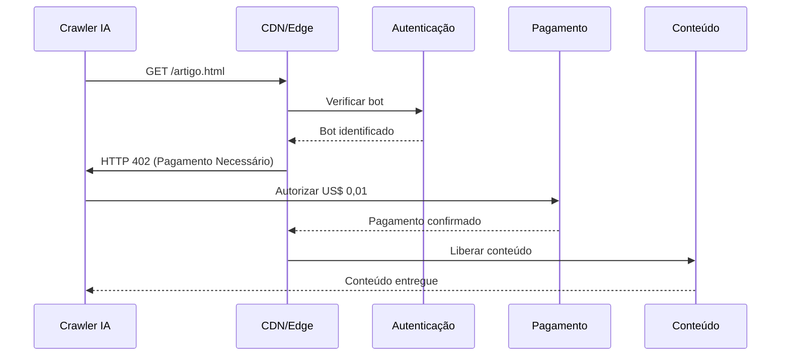

# 🎯 Conceitos Fundamentais do Pay-Per-Crawl

## O Que é Pay-Per-Crawl?

Pay-per-crawl é um modelo de monetização onde **publicadores cobram empresas de IA por cada acesso** ao seu conteúdo para treinamento ou inferência. É a resposta da indústria web ao uso massivo e não compensado de conteúdo por modelos de linguagem.

### Analogia Simples
Imagine que seu site é uma **biblioteca premium**:
- 🚪 **Antes**: Portas abertas, todos entram e copiam livros gratuitamente
- 💳 **Agora**: Catraca na entrada, paga-se por cada livro consultado
- 📊 **Resultado**: Biblioteca sustentável, conteúdo valorizado

## Por Que Surgiu Agora?

### 1. **Desequilíbrio Crítico de Valor**
```
Crawl-to-Referral Ratio (Taxa de Varredura vs Referência)

ClaudeBot (Anthropic):  73.000:1  ❌ Insustentável
GPTBot (OpenAI):         1.700:1  ⚠️  Problemático  
Googlebot:                  14:1  ✅ Equilibrado
```

**Interpretação**: Para cada visita que a IA envia de volta, ela consome milhares de páginas.

### 2. **Escala Massiva de Consumo**
- OpenAI: **10 bilhões** de páginas/mês
- Anthropic: **5 bilhões** de páginas/mês
- Google (IA): **15 bilhões** de páginas/mês

### 3. **Custos Crescentes de Produção de Conteúdo**
- Jornalismo investigativo: US$ 5.000-50.000/artigo
- Conteúdo técnico especializado: US$ 500-5.000/artigo
- Moderação e curadoria UGC: US$ 0,10-1,00/post

## Como Funciona na Prática?

### Fluxo Básico de Cobrança



### Componentes Essenciais

1. **Identificação do Bot**
   - User-Agent parsing
   - Verificação de IP
   - Assinatura criptográfica

2. **Decisão de Acesso**
   - ✅ Permitir (gratuito)
   - 💰 Cobrar (pago)
   - 🚫 Bloquear (negado)

3. **Processamento de Pagamento**
   - Micropagamentos (US$ 0,001-0,05)
   - Créditos pré-pagos
   - Faturamento mensal

4. **Entrega de Conteúdo**
   - Conteúdo completo
   - Metadados apenas
   - Versão resumida

## HTTP 402: O Status Code Ressuscitado

### História Curiosa
```http
HTTP/1.1 402 Payment Required
```

- **1997**: Criado mas nunca implementado
- **2025**: Cloudflare revive para pay-per-crawl
- **Significado**: "Este conteúdo requer pagamento"

### Exemplo de Resposta
```http
HTTP/1.1 402 Payment Required
Content-Type: application/json
Payment-Options: stripe, lightning, credits
Price: USD 0.01
Crawler-Auth-Required: true

{
  "message": "Pagamento necessário para acessar este conteúdo",
  "price": 0.01,
  "currency": "USD",
  "payment_url": "https://pay.site.com/crawler/12345"
}
```

## Tipos de Crawlers e Seus Propósitos

### 1. **Crawlers de Treinamento**
**Objetivo**: Coletar dados para treinar novos modelos
- GPTBot (OpenAI)
- ClaudeBot (Anthropic)
- **Valor do conteúdo**: Máximo (US$ 0,01-0,05/página)

### 2. **Crawlers de Inferência/RAG**
**Objetivo**: Buscar informações em tempo real
- ChatGPT-User (OpenAI)
- PerplexityBot
- **Valor do conteúdo**: Médio (US$ 0,005-0,02/página)

### 3. **Crawlers de Índice**
**Objetivo**: Criar índices de busca
- OAI-SearchBot
- BingBot (modo IA)
- **Valor do conteúdo**: Baixo (US$ 0,001-0,005/página)

## Modelos de Precificação

### 1. **Pay-Per-Request Simples**
```
Preço fixo por requisição
├── Básico: US$ 0,001/request
├── Padrão: US$ 0,01/request
└── Premium: US$ 0,05/request
```

### 2. **Precificação em Camadas**
```
Volume mensal        Preço/1000 requests
0-10K               US$ 10,00
10K-100K            US$ 8,00
100K-1M             US$ 6,00
1M+                 US$ 4,00
```

### 3. **Modelo Híbrido**
```
Componente          Custo
Acesso básico       US$ 1.000/mês (flat)
Requests adicionais US$ 0,005/cada
API premium         US$ 0,02/request
```

## Métricas-Chave para Publicadores

### 1. **CPR (Cost Per Request)**
```
CPR = Receita Total / Total de Requests
Meta: US$ 0,01-0,02
```

### 2. **Bot Traffic Ratio**
```
BTR = Tráfego de Bots / Tráfego Total
Típico: 15-40%
```

### 3. **Monetization Rate**
```
MR = Requests Pagos / Total Bot Requests
Meta: > 60%
```

### 4. **Revenue Per Mille (RPM)**
```
RPM = (Receita / Pageviews) × 1000
Benchmark: US$ 12-120
```

## Vantagens vs Desvantagens

### ✅ Vantagens para Publicadores

1. **Nova Fonte de Receita**
   - Adicional ao modelo de anúncios
   - Não canibaliza receita existente

2. **Valorização do Conteúdo**
   - Reconhecimento do valor real
   - Compensação justa pelo uso

3. **Controle Total**
   - Escolha quem acessa
   - Define próprios preços

4. **Dados Valiosos**
   - Entende demanda de IA
   - Insights sobre conteúdo valioso

### ❌ Desvantagens e Riscos

1. **Complexidade Técnica**
   - Requer infraestrutura robusta
   - Manutenção contínua

2. **Risco de Exclusão**
   - Pode perder visibilidade em IA
   - Menos citações/referências

3. **Guerra de Preços**
   - Pressão para reduzir valores
   - Commoditização do conteúdo

4. **Custos Operacionais**
   - Processamento de pagamentos
   - Suporte e disputas

## Casos de Uso por Indústria

### 📰 **Jornalismo**
- **Modelo**: Licenciamento exclusivo + pay-per-crawl
- **Preço médio**: US$ 0,02-0,05/artigo
- **Exemplo**: Wall Street Journal

### 💬 **Fóruns e Comunidades**
- **Modelo**: Acesso bulk + API premium
- **Preço médio**: US$ 0,005-0,01/post
- **Exemplo**: Reddit

### 📚 **Publicações Acadêmicas**
- **Modelo**: Assinatura + pay-per-paper
- **Preço médio**: US$ 0,10-1,00/paper
- **Exemplo**: Taylor & Francis

### 🛍️ **E-commerce**
- **Modelo**: Feed de produtos + atualizações
- **Preço médio**: US$ 0,001-0,005/produto
- **Exemplo**: Marketplaces

### 🎨 **Conteúdo Criativo**
- **Modelo**: Licenciamento + royalties
- **Preço médio**: US$ 0,05-0,50/asset
- **Exemplo**: Getty Images

## Conceitos Técnicos Relacionados

### 1. **Robots.txt Evoluído**
```txt
# Tradicional
User-agent: GPTBot
Disallow: /

# Pay-per-crawl
User-agent: GPTBot
Allow: /
Crawl-delay: 1
Payment-required: true
Price-per-request: 0.01
```

### 2. **Autenticação Criptográfica**
- **Ed25519**: Assinaturas de curva elíptica
- **JWK**: JSON Web Keys para chaves públicas
- **HTTP Signatures**: RFC 9421 para assinatura de requests

### 3. **Rate Limiting Inteligente**
- **Token Bucket**: Controle de burst
- **Sliding Window**: Média móvel
- **Leaky Bucket**: Taxa constante

### 4. **Detecção de Bots ML**
- **Fingerprinting**: Identificação única
- **Behavioral Analysis**: Padrões de navegação
- **Anomaly Detection**: Desvios estatísticos

## Perguntas Frequentes

### **1. Isso não vai matar a inovação em IA?**
Não necessariamente. Cria um mercado sustentável onde:
- Conteúdo de qualidade é recompensado
- IA companies podem planejar custos
- Incentiva criação de conteúdo novo

### **2. E o Google? Eles vão pagar também?**
Google já tem acordos com muitos publicadores e mantém proporção saudável de referências (14:1).

### **3. Pequenos sites podem implementar?**
Sim! Cloudflare oferece solução plug-and-play. Custo zero para começar.

### **4. E se a IA simplesmente parar de crawlear?**
Improvável. IA precisa de dados frescos para:
- Manter relevância
- Evitar alucinações
- Competir no mercado

### **5. Qual o preço ideal?**
Depende do conteúdo:
- Notícias: US$ 0,01-0,05
- UGC: US$ 0,001-0,01
- Acadêmico: US$ 0,10-1,00

## Próximos Passos

1. **Entenda** a [Arquitetura Cloudflare](./02-arquitetura-cloudflare.md)
2. **Explore** os [Modelos de Negócio](./03-modelos-negocio.md)
3. **Implemente** com nosso [Guia Técnico](./04-implementacao-tecnica.md)
4. **Proteja-se** legalmente com [Aspectos Legais](./05-aspectos-legais.md)

---

**Conceitos dominados?** ✅ Você está pronto para mergulhar na implementação técnica!