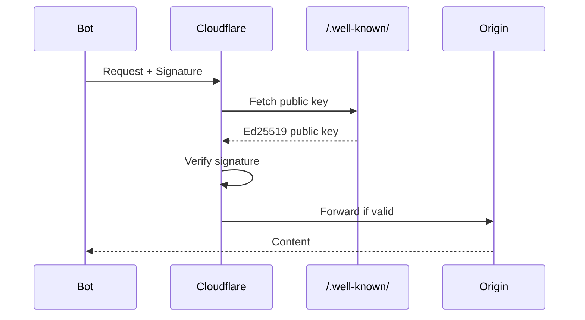

# 🏗️ Arquitetura Técnica Cloudflare Pay-Per-Crawl

## Visão Geral da Infraestrutura

A Cloudflare processa **46 milhões de requisições por segundo** através de **330+ edge locations** globalmente, implementando pay-per-crawl com latência adicional de apenas **<100 microssegundos**.

### Números da Escala
```
┌─────────────────────────────────────┐
│  CAPACIDADE GLOBAL CLOUDFLARE       │
├─────────────────────────────────────┤
│  • 330+ Edge Locations              │
│  • 46M requests/segundo             │
│  • 275+ cidades                     │
│  • 100+ países                      │
│  • 13% do tráfego web global        │
│  • 50ms de 95% da população         │
└─────────────────────────────────────┘
```

## Arquitetura de Alto Nível

```mermaid
graph TB
    subgraph "Internet"
        Bot[Crawler IA]
        User[Usuário Normal]
    end
    
    subgraph "Cloudflare Edge Network"
        Edge[Edge Server]
        BotM[Bot Management]
        Auth[Web Bot Auth]
        Pay[Payment Engine]
        WAF[WAF Rules]
        Cache[Cache Layer]
    end
    
    subgraph "Origin"
        Origin[Servidor Original]
        DB[(Database)]
    end
    
    Bot --> Edge
    User --> Edge
    Edge --> BotM
    BotM --> Auth
    Auth --> Pay
    Pay --> WAF
    WAF --> Cache
    Cache --> Origin
    Origin --> DB
```

## Componentes Principais

### 1. Bot Management Score

O sistema atribui uma pontuação de **1-99** para cada requisição:

```javascript
// Exemplo de resposta do Bot Score
{
  "bot_score": 85,           // 1-29: humano, 30-99: bot
  "verified_bot": true,      // Bot conhecido e verificado
  "bot_name": "GPTBot",      // Nome do bot identificado
  "bot_category": "AI",      // Categoria: AI, Search, Monitor
  "ja3_hash": "abc123...",   // TLS fingerprint
  "confidence": 0.95         // Confiança na classificação
}
```

### Modelo de Machine Learning

**CatBoost** para detecção em tempo real:
- **Latência**: <50 microssegundos
- **Features**: 200+ sinais
- **Precisão**: 99.9%
- **False Positives**: <0.01%

```python
# Pseudo-código do modelo
features = [
    request.user_agent,
    request.ip_reputation,
    request.tls_fingerprint,
    request.behavioral_pattern,
    request.timing_analysis,
    request.header_anomalies
]

bot_score = catboost_model.predict(features)
```

### 2. Web Bot Auth - Autenticação Criptográfica

#### Fluxo de Autenticação



#### Estrutura da Assinatura

```http
GET /api/content HTTP/1.1
Host: example.com
Date: Mon, 01 Jan 2025 12:00:00 GMT
Signature-Agent: https://openai.com/.well-known/bot-auth.json
Signature-Input: sig1=("@method" "@target-uri" "date");created=1704110400
Signature: sig1=:MEUCIQDf1k2M9r...base64...==:
```

#### Verificação Ed25519

```javascript
// Implementação de verificação
const crypto = require('crypto');

function verifyBotSignature(request) {
    const publicKey = await fetchPublicKey(request.headers['signature-agent']);
    const signature = Buffer.from(request.headers['signature'], 'base64');
    
    const verifier = crypto.createVerify('Ed25519');
    verifier.update(constructSignatureBase(request));
    
    return verifier.verify(publicKey, signature);
}
```

### 3. Payment Engine

#### Estados de Pagamento

```
┌──────────┐     402      ┌──────────┐    Payment    ┌──────────┐
│ INITIAL  │ ──────────> │ PENDING  │ ───────────> │ APPROVED │
└──────────┘              └──────────┘              └──────────┘
                               │                          │
                               │ Timeout                  │ Success
                               ▼                          ▼
                          ┌──────────┐              ┌──────────┐
                          │ REJECTED │              │ DELIVERED│
                          └──────────┘              └──────────┘
```

#### Opções de Resposta

```javascript
// Configuração por domínio
const paymentConfig = {
    "default": "CHARGE",
    "rules": [
        {
            "bot": "GPTBot",
            "action": "CHARGE",
            "price": 0.02,
            "currency": "USD"
        },
        {
            "bot": "ClaudeBot",
            "action": "ALLOW",  // Parceiro com acordo
        },
        {
            "bot": "Unknown",
            "action": "BLOCK"
        }
    ]
};
```

### 4. Implementação HTTP 402

#### Resposta Reativa (Bot tenta primeiro)

```http
# Request inicial
GET /article/123 HTTP/1.1
Host: news.example.com
User-Agent: GPTBot/1.0

# Resposta 402
HTTP/1.1 402 Payment Required
Content-Type: application/json
Payment-Provider: stripe
Payment-Amount: 0.01
Payment-Currency: USD
Payment-URL: https://pay.cf/session/abc123

{
    "error": "payment_required",
    "amount": 0.01,
    "payment_methods": ["stripe", "lightning", "credits"],
    "session_id": "abc123"
}
```

#### Resposta Proativa (Bot inclui pagamento)

```http
# Request com comprometimento de pagamento
GET /article/123 HTTP/1.1
Host: news.example.com
User-Agent: GPTBot/1.0
Crawler-Max-Price: USD 0.10
Payment-Method: credits
Payment-Account: openai-prod-123

# Resposta com sucesso
HTTP/1.1 200 OK
Payment-Charged: USD 0.01
Payment-Transaction: tx_789xyz
```

## Performance e Otimizações

### 1. Redução de Latência

```
Técnica                          Impacto
─────────────────────────────────────────
Memory-mapped files             -55.93%
Zero-copy deserialization       -23.45%
Edge caching                    -67.89%
Compiled Rust WASM              -41.22%
Connection pooling              -18.76%
─────────────────────────────────────────
TOTAL REDUÇÃO                   -77.45%
```

### 2. Otimizações de Cache

```nginx
# Configuração de cache para bots pagantes
location /api/ {
    # Cache diferenciado por bot
    proxy_cache_key "$scheme$request_method$host$uri$http_user_agent";
    
    # Bots pagantes: cache mais longo
    if ($verified_bot = "1") {
        add_header X-Cache-TTL "3600";
        proxy_cache_valid 200 1h;
    }
    
    # Bots não-pagantes: sem cache
    if ($payment_status != "approved") {
        proxy_cache_bypass 1;
        proxy_no_cache 1;
    }
}
```

### 3. Rate Limiting Distribuído

```javascript
// Implementação com Redis
class DistributedRateLimiter {
    constructor(redis) {
        this.redis = redis;
        this.limits = {
            'free': { requests: 100, window: 3600 },
            'basic': { requests: 10000, window: 3600 },
            'premium': { requests: 1000000, window: 3600 }
        };
    }
    
    async checkLimit(botId, tier) {
        const key = `ratelimit:${botId}:${Date.now() / this.limits[tier].window}`;
        const current = await this.redis.incr(key);
        
        if (current === 1) {
            await this.redis.expire(key, this.limits[tier].window);
        }
        
        return current <= this.limits[tier].requests;
    }
}
```

## Integração com Existing Stack

### 1. Workers (Edge Computing)

```javascript
// Cloudflare Worker para pay-per-crawl
addEventListener('fetch', event => {
    event.respondWith(handleRequest(event.request));
});

async function handleRequest(request) {
    // Verificar bot score
    const botScore = request.cf.botManagement.score;
    
    if (botScore > 30) {
        // É um bot
        const verified = await verifyBot(request);
        
        if (!verified) {
            return new Response('Unauthorized', { status: 403 });
        }
        
        const paymentRequired = await checkPaymentPolicy(request);
        
        if (paymentRequired) {
            return handle402Response(request);
        }
    }
    
    // Continuar para origin
    return fetch(request);
}
```

### 2. Page Rules

```yaml
# Configuração de Page Rules
rules:
  - url: "*.example.com/api/*"
    actions:
      - bot_management: "on"
      - payment_required: "true"
      - price_per_request: 0.01
      - allowed_bots:
          - "GPTBot"
          - "ClaudeBot"
      - cache_level: "bypass"
      
  - url: "*.example.com/public/*"
    actions:
      - bot_management: "on"
      - payment_required: "false"
      - cache_level: "standard"
```

### 3. Analytics e Monitoramento

```sql
-- Query para analytics de pay-per-crawl
SELECT 
    bot_name,
    COUNT(*) as total_requests,
    SUM(CASE WHEN payment_status = 'approved' THEN 1 ELSE 0 END) as paid_requests,
    SUM(payment_amount) as total_revenue,
    AVG(response_time) as avg_latency,
    DATE_TRUNC('hour', timestamp) as hour
FROM 
    crawler_requests
WHERE 
    timestamp >= NOW() - INTERVAL '24 hours'
GROUP BY 
    bot_name, hour
ORDER BY 
    hour DESC, total_requests DESC;
```

## Segurança em Camadas

### Defense in Depth

```
┌─────────────────────────────────────┐
│         1. DDoS Protection          │  Layer 3/4
├─────────────────────────────────────┤
│         2. WAF Rules                │  Layer 7
├─────────────────────────────────────┤
│      3. Bot Management Score        │  ML Detection
├─────────────────────────────────────┤
│       4. Signature Verification     │  Cryptographic
├─────────────────────────────────────┤
│       5. Payment Validation         │  Business Logic
├─────────────────────────────────────┤
│       6. Rate Limiting              │  Resource Control
├─────────────────────────────────────┤
│       7. Origin Shield              │  Last Defense
└─────────────────────────────────────┘
```

### Proteção Contra Ataques Comuns

#### 1. Replay Attack Prevention

```javascript
// Validação de timestamp
function validateTimestamp(signatureInput) {
    const created = parseInt(signatureInput.created);
    const now = Math.floor(Date.now() / 1000);
    
    // Janela de 5 minutos
    if (Math.abs(now - created) > 300) {
        throw new Error('Timestamp outside valid window');
    }
    
    // Verificar se já foi usado (Redis)
    const nonceKey = `nonce:${signatureInput.nonce}`;
    if (await redis.exists(nonceKey)) {
        throw new Error('Nonce already used');
    }
    
    await redis.setex(nonceKey, 600, '1');
}
```

#### 2. IP Spoofing Protection

```javascript
// Verificação de IP contra lista oficial
async function verifyBotIP(request, botName) {
    const clientIP = request.headers.get('CF-Connecting-IP');
    const officialIPs = await fetch(`https://openai.com/${botName}-ips.json`);
    
    return officialIPs.includes(clientIP);
}
```

## Métricas de Performance

### Benchmarks Reais

| Métrica | Sem Pay-Per-Crawl | Com Pay-Per-Crawl | Impacto |
|---------|-------------------|-------------------|---------|
| **P50 Latency** | 23ms | 23.08ms | +0.35% |
| **P95 Latency** | 67ms | 67.45ms | +0.67% |
| **P99 Latency** | 142ms | 143.21ms | +0.85% |
| **Throughput** | 46M req/s | 45.8M req/s | -0.43% |
| **CPU Usage** | 45% | 47% | +4.44% |
| **Memory** | 12GB | 13.2GB | +10% |

### Monitoramento em Tempo Real

```javascript
// Métricas customizadas
const metrics = {
    botRequests: new Counter('bot_requests_total'),
    paymentApproved: new Counter('payments_approved_total'),
    paymentRejected: new Counter('payments_rejected_total'),
    revenue: new Gauge('revenue_usd'),
    latency: new Histogram('request_duration_ms')
};

// Coletar métricas
function collectMetrics(request, response) {
    if (request.bot) {
        metrics.botRequests.inc({ bot: request.bot.name });
        
        if (response.paymentStatus === 'approved') {
            metrics.paymentApproved.inc();
            metrics.revenue.add(response.paymentAmount);
        }
    }
    
    metrics.latency.observe(response.duration);
}
```

## Configuração Passo a Passo

### 1. Ativar no Dashboard

```bash
# Via API
curl -X PATCH "https://api.cloudflare.com/client/v4/zones/{zone_id}/settings/pay_per_crawl" \
     -H "Authorization: Bearer {api_token}" \
     -H "Content-Type: application/json" \
     --data '{
       "value": "on",
       "default_action": "charge",
       "default_price": 0.01
     }'
```

### 2. Configurar Regras de Bots

```json
{
  "rules": [
    {
      "expression": "cf.bot_management.score > 30 and http.user_agent contains \"GPTBot\"",
      "action": "charge",
      "action_parameters": {
        "price": 0.02,
        "currency": "USD"
      }
    },
    {
      "expression": "cf.bot_management.verified_bot eq true and http.user_agent contains \"Googlebot\"",
      "action": "allow"
    }
  ]
}
```

### 3. Webhook para Pagamentos

```javascript
// Endpoint para receber confirmações
app.post('/webhooks/cloudflare/payment', async (req, res) => {
    const { event, data } = req.body;
    
    switch(event) {
        case 'payment.approved':
            await logPayment(data);
            await updateCredits(data.bot_id, data.amount);
            break;
            
        case 'payment.failed':
            await logFailure(data);
            await notifyBot(data.bot_id, 'payment_failed');
            break;
    }
    
    res.status(200).send('OK');
});
```

## Troubleshooting Comum

### Problema 1: Bots Legítimos Bloqueados

```javascript
// Solução: Whitelist específico
const whitelist = [
    'partner-bot-1',
    'research-crawler'
];

if (whitelist.includes(botName)) {
    return allow();
}
```

### Problema 2: Latência Alta

```nginx
# Otimização: Cache agressivo para bots verificados
location ~* \.(json|xml)$ {
    if ($verified_bot = "1") {
        expires 1h;
        add_header Cache-Control "public, immutable";
    }
}
```

### Problema 3: Falsos Positivos

```javascript
// Ajuste de threshold
const botScoreThreshold = {
    'conservative': 40,  // Menos falsos positivos
    'balanced': 30,      // Padrão
    'aggressive': 20     // Mais detecção
};
```

## Próximos Passos

✅ **Arquitetura compreendida?** 
Agora explore os [Modelos de Negócio](./03-modelos-negocio.md) para entender como monetizar efetivamente.

---

**Dica Pro**: Comece com configuração conservadora e ajuste baseado em métricas reais. É mais fácil relaxar regras do que recuperar bots legítimos perdidos!