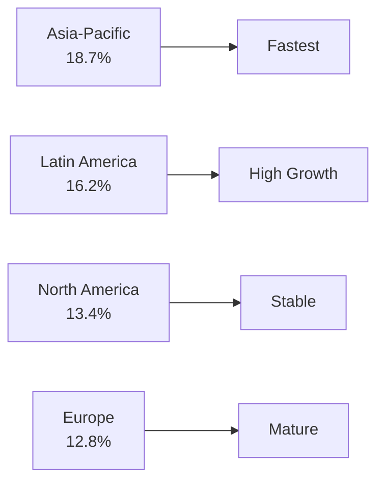
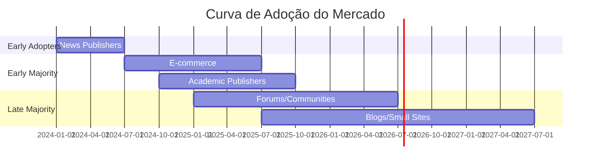

# 📈 Análise de Mercado e Projeções

## 🌍 Mercado Global: US$ 3.5 Bilhões até 2037

### Projeções por Fonte de Pesquisa

| Fonte | 2030 | 2037 | CAGR | Confiabilidade |
|-------|------|------|------|----------------|
| **Mordor Intelligence** | US$ 2.0B | - | 14.2% | ⭐⭐⭐⭐⭐ |
| **Research Nester** | US$ 2.8B | US$ 3.52B | 13.2% | ⭐⭐⭐⭐ |
| **Market Research Future** | US$ 3.1B | - | 19.93% | ⭐⭐⭐ |
| **Verified Markets** | US$ 2.5B | - | 15.8% | ⭐⭐⭐⭐ |
| **ScrapeOps Analysis** | US$ 38.4B* | - | 19.93% | ⭐⭐⭐ |

*Inclui todo ecossistema de web scraping com IA

## 📊 Distribuição Geográfica do Mercado

```
┌────────────────────────────────────────┐
│        MARKET SHARE BY REGION          │
├────────────────────────────────────────┤
│ 🇺🇸 North America:  45% ($900M)        │
│ 🇪🇺 Europe:         28% ($560M)        │
│ 🇨🇳 Asia-Pacific:   20% ($400M)        │
│ 🌎 Latin America:    4% ($80M)         │
│ 🌍 MEA:              3% ($60M)         │
└────────────────────────────────────────┘
```

### Taxa de Crescimento por Região (CAGR 2025-2030)



## 🚫 A Grande Muralha: 73% dos Sites Bloqueiam IA

### Evolução do Bloqueio de Crawlers

```
100% ┤
     │
 73% ┤                              ╭──── Hoje (Jan 2025)
     │                          ╭───╯
 50% ┤                      ╭───╯
     │                  ╭───╯
 25% ┤              ╭───╯
     │          ╭───╯
  5% ┤──────────╯
     └─────┬─────┬─────┬─────┬─────┬
         Aug23  Nov23  Feb24  May24  Aug24
```

### Análise por Categoria de Site

| Categoria | % Bloqueando | Tendência | Razão Principal |
|-----------|--------------|-----------|-----------------|
| **News/Media** | 79% | ↑↑↑ | Proteção de conteúdo premium |
| **E-commerce** | 45% | ↑↑ | Dados competitivos |
| **Social Media** | 62% | ↑↑ | Privacidade usuários |
| **Academic** | 31% | ↑ | Negociação de licenças |
| **Government** | 85% | → | Segurança nacional |
| **Blogs** | 23% | ↑ | Conscientização crescente |

## 💰 Dinâmica de Preços: A Corrida para Cima

### Evolução Histórica dos Preços (US$/request)

```
2023: $0.0001 - $0.001  [Fase experimental]
2024: $0.001  - $0.01   [Descoberta de preço]
2025: $0.01   - $0.05   [Consolidação] ← ESTAMOS AQUI
2026: $0.02   - $0.10   [Maturidade esperada]
2027: $0.05   - $0.50   [Especialização premium]
```

### Matriz de Preços por Tipo de Conteúdo

| Tipo de Conteúdo | Preço Mínimo | Preço Médio | Preço Máximo | Volume Típico |
|------------------|--------------|-------------|--------------|---------------|
| **Breaking News** | $0.02 | $0.05 | $0.10 | 10K-100K/dia |
| **Arquivo Histórico** | $0.005 | $0.01 | $0.02 | 1M-10M/mês |
| **UGC/Forums** | $0.001 | $0.005 | $0.01 | 10M-100M/mês |
| **Dados Financeiros** | $0.10 | $0.50 | $2.00 | 1K-10K/dia |
| **Conteúdo Acadêmico** | $0.05 | $0.20 | $1.00 | 100-10K/dia |
| **Imagens/Media** | $0.01 | $0.05 | $0.50 | 100K-1M/mês |

## 🏢 Landscape Competitivo

### Players Principais por Categoria

#### Infraestrutura Pay-Per-Crawl
1. **Cloudflare** - Líder com 13% do tráfego web
2. **Akamai** - Entrando no mercado
3. **Fastly** - Desenvolvimento ativo
4. **AWS CloudFront** - Potencial disruptor

#### Soluções de Web Scraping
1. **Bright Data** - $1B+ valuation
2. **Zyte (Scrapinghub)** - Foco enterprise
3. **Apify** - Platform approach
4. **Oxylabs** - Premium positioning

#### Bot Detection & Management
1. **DataDome** - ML-first approach
2. **PerimeterX** - Comprehensive solution
3. **Cloudflare Bot Management** - Integrated
4. **Imperva** - Enterprise focus

## 📊 Métricas de Adoção

### Velocidade de Adoção por Tamanho de Empresa

```
Enterprise (>$1B revenue):     ████████████ 89% implementado
Mid-Market ($100M-$1B):       ████████ 67% implementado  
SMB ($10M-$100M):            ████ 34% implementado
Small (<$10M):                ██ 12% implementado
```

### Timeline de Adoção Massiva



## 🎯 Segmentos de Maior Crescimento

### Top 5 Verticais por Oportunidade

1. **E-commerce** 
   - CAGR: 22.3%
   - Driver: Competitive intelligence
   - Valor: $500M até 2027

2. **Financial Services**
   - CAGR: 19.8%
   - Driver: Alternative data
   - Valor: $350M até 2027

3. **Healthcare**
   - CAGR: 18.5%
   - Driver: Research data
   - Valor: $280M até 2027

4. **Real Estate**
   - CAGR: 17.2%
   - Driver: Market monitoring
   - Valor: $200M até 2027

5. **Travel & Hospitality**
   - CAGR: 16.9%
   - Driver: Price optimization
   - Valor: $180M até 2027

## 💡 Fatores de Crescimento vs Barreiras

### 🚀 Drivers de Crescimento

| Fator | Impacto | Timeframe |
|-------|---------|-----------|
| **Explosão de LLMs** | Alto | Imediato |
| **Custos de conteúdo crescentes** | Alto | Contínuo |
| **Regulamentação favorável** | Médio | 2-3 anos |
| **Infraestrutura pronta** | Alto | Imediato |
| **Casos de sucesso públicos** | Médio | 6-12 meses |

### 🚧 Barreiras ao Crescimento

| Barreira | Severidade | Mitigação |
|----------|------------|-----------|
| **Complexidade técnica** | Média | Soluções plug-and-play |
| **Resistência cultural** | Alta | Educação do mercado |
| **Fragmentação de preços** | Média | Consolidação natural |
| **Questões legais** | Alta | Frameworks claros |
| **Custos de implementação** | Baixa | ROI comprovado |

## 📈 Projeções de Receita por Modelo

### Comparativo 2025-2030

```python
# Projeção de receita acumulada (em US$ bilhões)
projections = {
    'year': [2025, 2026, 2027, 2028, 2029, 2030],
    'licensing': [0.8, 1.2, 1.6, 2.0, 2.3, 2.5],
    'pay_per_crawl': [0.3, 0.6, 1.0, 1.5, 2.1, 2.8],
    'revenue_share': [0.1, 0.3, 0.5, 0.8, 1.2, 1.7],
    'hybrid': [0.2, 0.5, 0.9, 1.4, 2.0, 2.7]
}
```

## 🎮 Cenários Futuros

### Cenário 1: "Consolidação Rápida" (40% probabilidade)
- 3-5 players dominam 80% do mercado
- Preços padronizados emergem
- Integração nativa em CDNs
- Timeline: 2-3 anos

### Cenário 2: "Fragmentação Contínua" (35% probabilidade)
- Múltiplas soluções especializadas
- Preços variam 100x entre nichos
- Inovação constante em modelos
- Timeline: 3-5 anos

### Cenário 3: "Regulamentação Pesada" (25% probabilidade)
- Governo define preços mínimos
- Licenciamento obrigatório
- Mercado cresce mais devagar
- Timeline: 2-4 anos

## 🔮 Tecnologias Emergentes

### Impacto Esperado até 2030

| Tecnologia | Impacto no Pay-Per-Crawl | Probabilidade |
|------------|--------------------------|---------------|
| **Blockchain/Smart Contracts** | Pagamentos automáticos | 70% |
| **AI Agents Autônomos** | 10x volume de requests | 85% |
| **Quantum Computing** | Novos modelos de precificação | 30% |
| **Web3/Descentralização** | Modelos P2P de conteúdo | 45% |
| **6G Networks** | Micropagamentos em tempo real | 60% |

## 📊 KPIs do Mercado

### Métricas para Monitorar

```javascript
const marketKPIs = {
  'adoption_rate': '% sites com pay-per-crawl',
  'average_price': 'US$/request médio',
  'market_concentration': 'HHI index',
  'revenue_growth': 'YoY growth %',
  'bot_traffic_ratio': '% tráfego de bots',
  'payment_methods': 'Diversidade de pagamento',
  'compliance_rate': '% em conformidade legal',
  'roi_timeline': 'Meses até break-even'
};
```

## 🎯 Oportunidades de Investimento

### Áreas Promissoras

1. **Infraestrutura de Pagamento**
   - Micropagamentos eficientes
   - Cross-border settlements
   - ROI esperado: 25-40% anual

2. **Analytics e Inteligência**
   - Precificação dinâmica
   - Detecção de fraude
   - ROI esperado: 30-50% anual

3. **Compliance Automation**
   - GDPR/AI Act automation
   - Audit trails
   - ROI esperado: 20-35% anual

## 🏁 Conclusões do Mercado

### Principais Takeaways

✅ **Mercado em hipercrescimento**: 13-20% CAGR sustentável
✅ **Janela de oportunidade**: 18-24 meses para posicionamento
✅ **Consolidação inevitável**: Prepare para M&A
✅ **Preços subirão**: Early adopters têm vantagem
✅ **Regulamentação virá**: Antecipe compliance

## Próximos Passos

Mercado compreendido? Continue com:
- 🔒 [Segurança e Anti-Fraude](./07-seguranca.md)
- 🎯 [Guia de Decisão](./08-guia-decisao.md)

---

💎 **Insight Final**: O mercado está na fase "land grab". Quem estabelecer posição agora definirá os padrões da indústria.