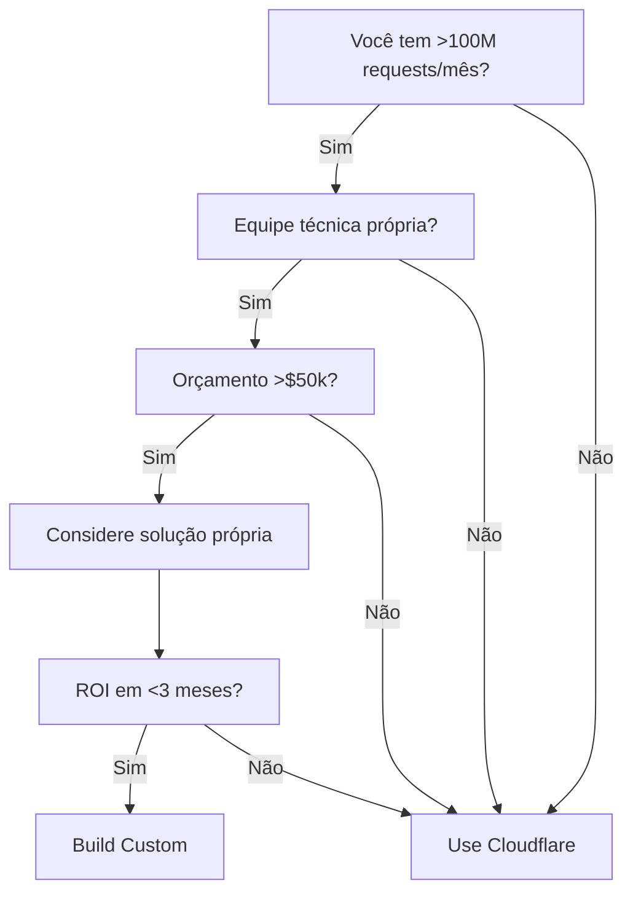

# 🎯 Guia de Decisão para Publicadores

## 🤔 A Pergunta de US$ 1 Milhão: Cloudflare ou Solução Própria?

### Árvore de Decisão Rápida



## 📊 Matriz de Decisão Detalhada

### Cloudflare vs Custom: Análise Comparativa

| Critério | Cloudflare | Solução Própria | Vencedor |
|----------|------------|-----------------|----------|
| **Tempo de implementação** | 1-2 semanas | 3-4 meses | Cloudflare ✅ |
| **Custo inicial** | $0 | $6k-50k | Cloudflare ✅ |
| **Custo operacional** | % da receita | Fixo + infra | Depende 🤷 |
| **Controle de preços** | Limitado | Total | Custom ✅ |
| **Flexibilidade** | Baixa | Alta | Custom ✅ |
| **Escalabilidade** | Automática | Manual | Cloudflare ✅ |
| **Suporte** | 24/7 incluído | Próprio | Cloudflare ✅ |
| **Compliance** | Built-in | Desenvolver | Cloudflare ✅ |
| **Integração pagamento** | Limitada | Qualquer | Custom ✅ |
| **Analytics** | Básico | Customizado | Custom ✅ |

### Pontuação Final por Cenário

```python
def calculate_best_option(monthly_requests, team_size, budget):
    cloudflare_score = 0
    custom_score = 0
    
    # Volume de requests
    if monthly_requests < 10_000_000:
        cloudflare_score += 3
    elif monthly_requests < 100_000_000:
        cloudflare_score += 1
        custom_score += 1
    else:
        custom_score += 3
    
    # Tamanho da equipe
    if team_size < 2:
        cloudflare_score += 3
    elif team_size < 5:
        cloudflare_score += 2
    else:
        custom_score += 2
    
    # Orçamento
    if budget < 10_000:
        cloudflare_score += 3
    elif budget < 50_000:
        cloudflare_score += 1
        custom_score += 1
    else:
        custom_score += 3
    
    return "Cloudflare" if cloudflare_score > custom_score else "Custom"
```

## 📝 Passo a Passo: Do Zero ao Primeiro Pagamento

### Fase 1: Auditoria (Semana 1)

#### Checklist de Auditoria de Crawlers

```bash
# Script de auditoria rápida
#!/bin/bash

echo "=== Análise de Crawlers no Access Log ==="

# Top 10 User-Agents
echo "\n📊 Top 10 Bots por Volume:"
grep -E "(bot|Bot|spider|Spider|crawl|Crawl)" access.log | \
  awk -F'"' '{print $6}' | \
  sort | uniq -c | sort -rn | head -10

# Proporção bot vs humano
total=$(wc -l < access.log)
bots=$(grep -cE "(bot|Bot|spider|Spider)" access.log)
humans=$((total - bots))

echo "\n📈 Proporção de Tráfego:"
echo "Bots: $bots ($(( bots * 100 / total ))%)"
echo "Humanos: $humans ($(( humans * 100 / total ))%)"

# IPs com mais requests
echo "\n🌐 Top IPs Suspeitos:"
awk '{print $1}' access.log | \
  sort | uniq -c | sort -rn | head -10
```

#### Ferramentas de Análise

| Ferramenta | Propósito | Preço | Link |
|------------|-----------|-------|------|
| **Originality.AI** | Detectar AI crawlers | $14.95/mês | [Link](https://originality.ai) |
| **Cloudflare Analytics** | Análise de bots | Grátis | Dashboard CF |
| **GoAccess** | Análise de logs | Grátis | [Link](https://goaccess.io) |
| **Matomo** | Analytics completo | Grátis | [Link](https://matomo.org) |

### Fase 2: Estratégia de Preços (Semana 2)

#### Calculadora de Preços Ótimos

```javascript
class PricingStrategy {
    constructor(data) {
        this.monthlyPageviews = data.pageviews;
        this.currentRevenue = data.revenue;
        this.botTrafficPercent = data.botPercent;
        this.contentType = data.type;
    }
    
    calculateOptimalPrice() {
        // Base price por tipo de conteúdo
        const basePrices = {
            'news': 0.02,
            'ugc': 0.005,
            'academic': 0.10,
            'ecommerce': 0.001,
            'blog': 0.01
        };
        
        let price = basePrices[this.contentType] || 0.01;
        
        // Ajustes por volume
        const botRequests = this.monthlyPageviews * this.botTrafficPercent;
        
        if (botRequests > 10_000_000) {
            price *= 0.7;  // Desconto volume
        } else if (botRequests < 100_000) {
            price *= 1.5;  // Premium low volume
        }
        
        // Validar contra receita atual
        const projectedRevenue = botRequests * price * 0.5; // 50% pagantes
        const revenueIncrease = projectedRevenue / this.currentRevenue;
        
        return {
            recommended_price: price,
            projected_monthly: projectedRevenue,
            revenue_increase: `${(revenueIncrease * 100).toFixed(1)}%`,
            break_even_requests: 1000 / price
        };
    }
}
```

### Fase 3: Implementação Técnica (Semanas 3-4)

#### Roteiro de Implementação

```markdown
## Semana 3: Setup Básico
- [ ] Criar conta Cloudflare / Setup servidor
- [ ] Configurar DNS
- [ ] Instalar certificados SSL
- [ ] Setup básico de WAF
- [ ] Configurar robots.txt

## Semana 4: Pay-Per-Crawl
- [ ] Ativar Bot Management
- [ ] Configurar regras de pricing
- [ ] Setup payment processor
- [ ] Implementar logging
- [ ] Criar dashboard básico

## Semana 5: Otimização
- [ ] A/B testing de preços
- [ ] Ajustar rate limits
- [ ] Configurar alertas
- [ ] Treinar equipe
- [ ] Documentar processos
```

### Fase 4: Go-Live (Semana 5)

#### Checklist de Lançamento

##### 🚀 Técnico
- [ ] Todos os testes passando
- [ ] Backup configurado
- [ ] Monitoramento ativo
- [ ] Rollback plan pronto
- [ ] Logs estruturados

##### 📋 Legal
- [ ] Terms of Service atualizado
- [ ] Privacy Policy revisada
- [ ] Robots.txt compliant
- [ ] GDPR compliance check
- [ ] DPAs preparados

##### 💰 Negócio
- [ ] Pricing finalizado
- [ ] Payment processing testado
- [ ] Equipe treinada
- [ ] Suporte preparado
- [ ] Comunicação pronta

## 🎮 Simulador de ROI

### Cenários Reais de Implementação

#### Cenário 1: Pequeno Blog (1M pageviews/mês)

```
Investimento:
- Cloudflare Pro: $20/mês
- Setup time: 20 horas @ $50/h = $1,000
- Total: $1,240 ano 1

Receita:
- Bot traffic: 300k requests/mês (30%)
- Paying bots: 150k (50%)
- Price: $0.01
- Monthly: $1,500
- Annual: $18,000

ROI: 1,351% | Payback: 0.8 meses ✅
```

#### Cenário 2: Site de Notícias (50M pageviews/mês)

```
Investimento:
- Custom solution: $30,000
- Manutenção: $2,000/mês
- Total: $54,000 ano 1

Receita:
- Bot traffic: 20M requests/mês (40%)
- Paying bots: 14M (70%)
- Price: $0.015
- Monthly: $210,000
- Annual: $2,520,000

ROI: 4,567% | Payback: 0.3 meses ✅✅
```

#### Cenário 3: Fórum Comunitário (10M pageviews/mês)

```
Investimento:
- Cloudflare Business: $200/mês
- Integration: $5,000
- Total: $7,400 ano 1

Receita:
- Bot traffic: 2M requests/mês (20%)
- Paying bots: 1M (50%)
- Price: $0.005
- Monthly: $5,000
- Annual: $60,000

ROI: 711% | Payback: 1.5 meses ✅
```

## 🎯 Decisões Estratégicas Críticas

### 1. Política de Bloqueio

```python
blocking_strategy = {
    'conservative': {
        'default': 'allow',
        'block_list': ['malicious_bots'],
        'risk': 'Menor receita',
        'benefit': 'Máxima compatibilidade'
    },
    'balanced': {
        'default': 'pay_required',
        'allow_list': ['google', 'bing'],
        'risk': 'Alguns falsos positivos',
        'benefit': 'Boa receita, baixo risco'
    },
    'aggressive': {
        'default': 'block',
        'pay_list': ['verified_bots'],
        'risk': 'Perda de visibilidade',
        'benefit': 'Máxima receita'
    }
}
```

### 2. Modelo de Precificação

| Estratégia | Quando Usar | Prós | Contras |
|------------|-------------|------|---------|
| **Flat Rate** | Conteúdo homogêneo | Simples | Deixa dinheiro na mesa |
| **Tiered** | Diversos tipos | Flexível | Complexidade média |
| **Dynamic** | Alto volume | Maximiza receita | Complexo de implementar |
| **Auction** | Conteúdo premium | Máximo valor | Muito complexo |

### 3. Parcerias Estratégicas

#### Priorização de Crawlers

```
Tier 1 (Licenciamento Direto):
- OpenAI (GPTBot)
- Google (Bard)
- Microsoft (Bing)
Potencial: $1-10M/ano

Tier 2 (Pay-Per-Crawl Premium):
- Anthropic (Claude)
- Perplexity
- Meta
Potencial: $100k-1M/ano

Tier 3 (Pay-Per-Crawl Standard):
- Startups de IA
- Pesquisadores
- Outros
Potencial: $10k-100k/ano
```

## 📈 KPIs para Monitorar

### Métricas Essenciais

```javascript
const essentialKPIs = {
    // Financeiras
    'RPR': 'Revenue per Request',
    'ARPU': 'Average Revenue per User (Bot)',
    'CAC': 'Customer Acquisition Cost',
    'LTV': 'Lifetime Value',
    'Payback': 'Meses até recuperar investimento',
    
    // Operacionais
    'Payment Success Rate': '% pagamentos aprovados',
    'Bot Detection Accuracy': '% correta identificação',
    'False Positive Rate': '% bloqueios incorretos',
    'Latency Impact': 'ms adicionados',
    
    // Crescimento
    'MoM Growth': '% crescimento mensal',
    'Churn Rate': '% bots que param de pagar',
    'Conversion Rate': '% free → paid',
    'Market Share': '% do tráfego de IA'
};
```

## 🚨 Erros Comuns a Evitar

### Top 10 Armadilhas

1. **Bloquear Googlebot acidentalmente** → -90% tráfego orgânico
2. **Preços muito altos no início** → 0 adoção
3. **Não ter fallback** → Site down quando sistema falha
4. **Ignorar mobile bots** → Perder 40% da receita
5. **Não monitorar false positives** → Bloquear usuários reais
6. **Esquecer de cache** → Cobrar múltiplas vezes
7. **Não ter suporte 24/7** → Perder grandes deals
8. **Ignorar compliance** → Multas milionárias
9. **Não fazer backup de configs** → Perder tudo
10. **Lançar sem testes** → Caos total

## 🎓 Recursos de Aprendizado

### Cursos e Certificações
- Cloudflare Certified Developer
- AWS Web Application Security
- Google Cloud Security

### Comunidades
- r/webscraping (Reddit)
- Web Scraping Forum
- Cloudflare Community

### Consultores Especializados
- Empresas de implementação Cloudflare
- Consultores de precificação SaaS
- Advogados especializados em tech

## ✅ Sua Decisão Final

### Framework de Decisão

```python
def make_final_decision():
    score = 0
    
    # Suas respostas (ajuste conforme necessário)
    questions = {
        'urgent_need': True,           # +3 Cloudflare
        'technical_team': False,        # +3 Cloudflare
        'unique_requirements': False,    # +3 Custom
        'high_volume': False,           # +3 Custom
        'budget_constraint': True,      # +3 Cloudflare
        'compliance_critical': True,    # +2 Cloudflare
        'pricing_flexibility': False,   # +3 Custom
    }
    
    if questions['urgent_need']: score -= 3
    if not questions['technical_team']: score -= 3
    if questions['unique_requirements']: score += 3
    if questions['high_volume']: score += 3
    if questions['budget_constraint']: score -= 3
    if questions['compliance_critical']: score -= 2
    if questions['pricing_flexibility']: score += 3
    
    if score < 0:
        return "✅ Vá com Cloudflare!"
    else:
        return "🔧 Construa solução própria!"
```

## Próximos Passos

Decisão tomada? Finalize com:
- 🔗 [Recursos e Referências](./09-recursos-referencias.md)

---

💡 **Conselho Final**: Comece com Cloudflare, aprenda com dados reais, migre para custom quando o ROI justificar!