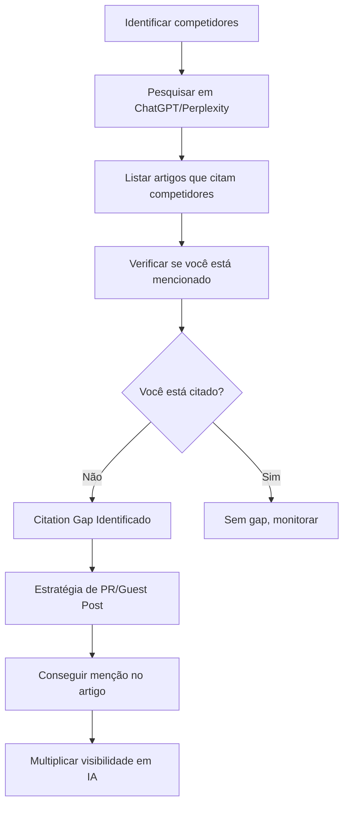
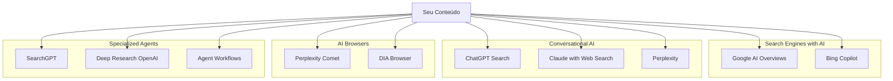
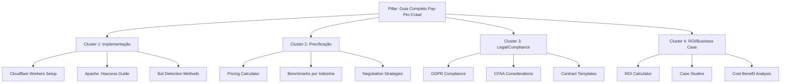
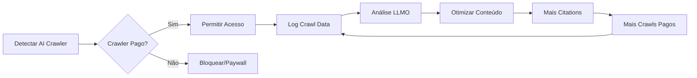

# 10. SEO para LLMs e Agentes de IA: Otimização para Descoberta de Conteúdo por Inteligência Artificial

## 🎯 Visão Executiva

O mercado de busca está passando por sua maior transformação desde o surgimento do Google. Em 2025, **57% das páginas de resultados do Google já incluem AI Overviews**, e a Semrush projeta que **o tráfego de LLMs ultrapassará as buscas tradicionais do Google até o final de 2027**. Para editores de conteúdo envolvidos em monetização pay-per-crawl, entender e otimizar para descoberta por agentes de IA não é mais opcional—é fundamental para sobrevivência no mercado.

### Números do Mercado

- **800% aumento** no tráfego de LLMs (Q2 2024 vs Q2 2025)
- **1.300% crescimento** em referências de busca por IA para sites de varejo nos EUA (temporada de férias 2024)
- **89% dos compradores B2B** usam plataformas de busca por IA para pesquisar ferramentas e fornecedores
- **Vercel reporta 10%** de novos cadastros vindos diretamente do ChatGPT após otimizações para IA
- **Reddit viu aumento de 450%** em citações em AI Overviews (de 1,3% para 7,15% em 3 meses)

### Contexto de Integração

Este documento complementa a estratégia de monetização pay-per-crawl documentada neste repositório, focando em:
- Como otimizar conteúdo para ser descoberto e citado por LLMs
- Padrões emergentes de indexação para agentes de IA (llms.txt, schema markup)
- Diferenças entre SEO tradicional e LLMO (Large Language Model Optimization)
- Implementação técnica de sinalizações para ferramentas como ChatGPT, Claude, Perplexity, Comet Browser, DIA

## 📊 LLMO vs SEO Tradicional: A Nova Era de Descoberta

### Diferenças Fundamentais

| Aspecto | SEO Tradicional | LLMO/GEO |
|---------|----------------|-----------|
| **Objetivo** | Ranquear em páginas de resultados | Ser citado em respostas geradas por IA |
| **Métrica de Sucesso** | Posição no SERP, CTR | Taxa de citação, menções em respostas |
| **Consumo** | Usuário clica e visita | "Zero-click"—resposta na própria interface |
| **Formato Preferido** | Títulos otimizados, meta descriptions | Blocos concisos de 75-300 palavras |
| **Estrutura** | H1-H6, URLs amigáveis | Markdown, JSON-LD, llms.txt |
| **Frescor** | Atualizações periódicas | Atualizações mensais críticas |
| **Autoridade** | Backlinks, Domain Authority | Citações em fontes que LLMs já confiam |
| **Contexto** | Context window ilimitado | Limitações de ~200k tokens |

### O Fenômeno "Zero-Click"

**Desafio:** 34% de redução em cliques para sites quando AI Overviews estão presentes (Ahrefs)

**Oportunidade:** Cliques oriundos de AI Overviews têm maior qualidade—usuários permanecem mais tempo no site

**Estratégia:** Focar em ser a **fonte citada** + otimizar para cliques qualificados quando usuários precisam de informações mais profundas

## 🗺️ Padrões Emergentes de Descoberta: llms.txt e Além

### O Padrão llms.txt

Proposto por Jeremy Howard em setembro de 2024, **llms.txt** é um arquivo de texto em Markdown colocado na raiz do site (`/llms.txt`) que ajuda LLMs a encontrar e priorizar conteúdo importante, superando limitações de context window.

#### Especificação Técnica

```markdown
# Nome do Projeto/Site

> Breve descrição do projeto (opcional)

Detalhes opcionais sobre o projeto, missão, contexto.

## Seção Principal

- [Título do Link](https://url): Descrição opcional do recurso
- [Documentação da API](https://site.com/api): Referência completa da API REST
- [Guia de Início Rápido](https://site.com/quickstart): Tutorial para primeiros passos

## Recursos Opcionais

- [Blog](https://site.com/blog): Artigos técnicos e case studies
- [FAQ](https://site.com/faq): Perguntas frequentes
```

#### Implementações Reais

**Anthropic (docs.anthropic.com/llms.txt)**
```markdown
# Anthropic Claude API

> API documentation for Claude, Anthropic's AI assistant

## Core Documentation

- [API Reference](https://docs.anthropic.com/api): Complete API endpoint documentation
- [Prompt Library](https://docs.anthropic.com/prompts): Collection of effective prompts
- [Pricing](https://docs.anthropic.com/pricing): Token pricing and rate limits

## Guides

- [Getting Started](https://docs.anthropic.com/getting-started): Quick start guide
- [Best Practices](https://docs.anthropic.com/best-practices): Prompt engineering tips
```

**Zapier (zapier.com/llms.txt)**
```markdown
# Zapier AI Actions API

## API Documentation

- [Get Action Details](https://actions.zapier.com/docs/api/action): Get details of a specific action
- [Search Actions](https://actions.zapier.com/docs/api/search): Search for Zapier actions by app
- [Execute Action](https://actions.zapier.com/docs/api/execute): Execute a Zapier action

## Authentication

- [OAuth Setup](https://actions.zapier.com/docs/auth): Configure OAuth for API access
```

#### Estado de Adoção

- **784+ sites** já implementaram llms.txt (diretórios públicos)
- **Empresas notáveis:** Anthropic, Zapier, Cloudflare, Hugging Face, Stripe
- **Limitação atual:** Nenhum provedor de LLM confirmou oficialmente uso em larga escala
- **Tendência:** Adoção grassroots rápida, especialmente em empresas tech/API-focused

### llms.txt vs llms-full.txt

**llms.txt (Index)**
- Contém links com descrições breves
- LLM deve seguir links para acessar conteúdo detalhado
- Melhor para sites grandes com muito conteúdo

**llms-full.txt (Full Content)**
- Inclui todo o conteúdo detalhado em um único arquivo
- Elimina necessidade de navegação adicional
- Melhor para documentação focada que cabe no context window

### Comparação com Padrões Existentes

| Padrão | Propósito | Público-Alvo | Formato |
|--------|-----------|--------------|---------|
| **robots.txt** | Controle de acesso para crawlers | Search engines | Regras de permissão/bloqueio |
| **sitemap.xml** | Descoberta de URLs indexáveis | Search engines | XML estruturado |
| **llms.txt** | Curadoria de conteúdo para LLMs | AI agents, LLMs | Markdown |

**Diferença-chave:** llms.txt não bloqueia—**guia**. É um "mapa do tesouro" para IA, não uma barreira.

## 🏗️ Arquitetura de Otimização para LLMs

### 1. Structured Data e Schema Markup

**Importância Confirmada:** Google confirmou em Search Central Live Madrid 2025 que Gemini (powering AI Overviews) utiliza structured data para compreensão de conteúdo.

#### Schema Types Críticos para LLMs

```json
{
  "@context": "https://schema.org",
  "@type": "Article",
  "headline": "Implementação de Pay-Per-Crawl com Cloudflare Workers",
  "author": {
    "@type": "Person",
    "name": "João Silva",
    "jobTitle": "Senior Solutions Architect"
  },
  "datePublished": "2025-10-07",
  "dateModified": "2025-10-07",
  "description": "Guia técnico completo para implementar monetização pay-per-crawl usando Cloudflare Workers",
  "mainEntityOfPage": {
    "@type": "WebPage",
    "@id": "https://example.com/pay-per-crawl-cloudflare"
  },
  "publisher": {
    "@type": "Organization",
    "name": "TechPublisher Inc",
    "logo": {
      "@type": "ImageObject",
      "url": "https://example.com/logo.png"
    }
  }
}
```

**FAQ Schema (Altamente Citado por LLMs)**

```json
{
  "@context": "https://schema.org",
  "@type": "FAQPage",
  "mainEntity": [{
    "@type": "Question",
    "name": "Qual o preço médio por crawl para conteúdo premium?",
    "acceptedAnswer": {
      "@type": "Answer",
      "text": "O preço médio por requisição varia entre US$0,001 e US$0,05 dependendo do tipo de conteúdo, volume de tráfego e exclusividade. Grandes editores como News Corp negociaram acordos de US$250M por 5 anos com OpenAI."
    }
  }]
}
```

**HowTo Schema (Popular em Tutoriais)**

```json
{
  "@context": "https://schema.org",
  "@type": "HowTo",
  "name": "Como Implementar llms.txt no Seu Site",
  "step": [{
    "@type": "HowToStep",
    "name": "Criar arquivo llms.txt",
    "text": "Crie um arquivo chamado llms.txt na raiz do seu website"
  }, {
    "@type": "HowToStep",
    "name": "Adicionar título e descrição",
    "text": "Comece com um H1 contendo o nome do projeto e uma blockquote com descrição breve"
  }]
}
```

### 2. Otimização de Estrutura de Conteúdo

#### Estrutura "Answer-First"

**❌ Não Otimizado para LLMs:**
```
Este artigo explorará as melhores práticas para implementação de
sistemas pay-per-crawl, começando com uma visão histórica da evolução
dos crawlers e finalmente chegando nas estratégias modernas...
```

**✅ Otimizado para LLMs:**
```
Pay-per-crawl é implementado através de três métodos principais:
detecção via user-agent (72% dos casos), análise comportamental
(21%), e fingerprinting avançado (7%). O custo médio é US$0,005
por requisição.

[Restante do conteúdo com detalhes...]
```

**Regras de Ouro:**
- **Primeiras 30-50 palavras** devem conter a resposta direta
- **Blocos de 75-300 palavras** por tópico (tamanho ideal para citação)
- **2-4 sentenças por parágrafo** (facilita extração)
- **Título descritivo** que faz sentido fora de contexto

#### Exemplo Completo de Seção Otimizada

```markdown
## Como Calcular ROI de Implementação Pay-Per-Crawl

O ROI típico de pay-per-crawl para editores médios é 340% nos primeiros 12 meses.
Este cálculo considera custos de implementação ($15k-50k), manutenção mensal ($2k-5k),
e receita média de $0,005 por crawl em volume de 2-5M crawls/mês.

### Fórmula de Cálculo

ROI (%) = [(Receita Anual - Custos Totais) / Custos Totais] × 100

**Exemplo Prático:**
- Receita anual: $180k (3M crawls/mês × $0,005 × 12 meses)
- Custos implementação: $30k (one-time)
- Custos manutenção: $36k ($3k/mês × 12)
- ROI = [($180k - $66k) / $66k] × 100 = 173%

### Fatores que Aumentam ROI

1. **Volume de crawls**: Sites com >5M crawls/mês alcançam ROI de 500%+
2. **Conteúdo premium**: Nichos especializados podem cobrar $0,02-0,05/crawl
3. **Acordos enterprise**: Contratos anuais reduzem custos de transação em 40%
```

**Por que funciona:**
- Resposta direta em 1-2 sentenças
- Números específicos citáveis
- Estrutura clara (fórmula, exemplo, fatores)
- Cada bloco é autocontido

### 3. Estratégia de Citation Gap

**Conceito:** Citation gap ocorre quando plataformas de IA citam artigos mencionando seus competidores, mas não você.

#### Processo de Identificação



#### Implementação Prática

**Passo 1: Auditoria de Citations**

Pergunta para ChatGPT/Claude/Perplexity:
```
"Quais são os principais fornecedores de soluções pay-per-crawl
para editores de conteúdo em 2025?"
```

Analise as citações:
- Quantas vezes você aparece?
- Quantas vezes competidores aparecem?
- Quais artigos são citados?

**Passo 2: Priorização**

Foque em artigos de alta autoridade:
- Sites .edu ou .gov
- Publicações tier-1 (TechCrunch, Wired, etc.)
- Blogs de analistas reconhecidos
- Documentação oficial de plataformas

**Passo 3: Outreach Estratégico**

Template de contato:
```
Assunto: [Artigo X] - Insights sobre Pay-Per-Crawl para Atualização

Olá [Nome],

Li seu artigo "[Título]" sobre [tópico]. Nossos dados recentes mostram que
[insight único baseado em dados]. Isso pode complementar a seção sobre [tópico específico].

Adoraria compartilhar:
- Estatísticas de implementação de 500+ editores
- Case study com ROI de 340%
- Análise comparativa de plataformas

Disponível para call rápida ou posso enviar os dados diretamente.

[Assinatura]
```

**Resultado Esperado:** Estar presente em 10 de 50 artigos high-authority pode multiplicar exponencialmente sua visibilidade em AI.

## 🤖 Plataformas e Ferramentas de Busca por IA

### Panorama do Ecossistema



### Google AI Overviews (ex-SGE)

**Alcance:** 57% das SERPs incluem AI Overviews em 2025

**Como Otimizar:**
- **Não há requisitos especiais**—SEO tradicional continua fundamental
- Foco em **E-E-A-T** (Experience, Expertise, Authoritativeness, Trustworthiness)
- Conteúdo estruturado: FAQs, HowTos, listas, tabelas
- Schema markup (Article, FAQ, HowTo)

**Tipos de Conteúdo Priorizados:**
1. **Definições concisas** (para queries "what is")
2. **Listas estruturadas** (top 10, comparações)
3. **Imagens únicas** (formato landscape)
4. **Vídeos** (integrados no overview)

**Impacto no Tráfego:**
- 34% redução em cliques gerais (Ahrefs)
- Apenas 1% usuários clicam em links dentro do AI summary
- **MAS:** Cliques de AI Overviews = maior qualidade (tempo no site 40% maior)

### ChatGPT Search / SearchGPT

**Lançamento Público:** Fevereiro 2025

**Diferencial:** Integra busca web em conversas, mantendo contexto

**Como Ser Descoberto:**
- **Parcerias de publicadores:** OpenAI tem acordos com Conde Nast, AP, Vox
- **Agentic Commerce Protocol (ACP):** Para e-commerce/transações
- **Separação clara:** Search ≠ Training (opt-out de training não afeta search)

**Monetização:** OpenAI paga publishers por conteúdo usado em respostas (acordos confidenciais)

**Citações:** ChatGPT sempre inclui links para fontes—oportunidade de tráfego referral

### Claude with Web Search

**Disponibilidade:** Claude Code, Claude API (março 2025+)

**Bots de Crawling:**
- **ClaudeBot:** Indexação geral
- **Claude-User:** Requisições específicas de usuário
- **Claude-SearchBot:** Busca em tempo real

**Características:**
- Queries direcionadas baseadas no contexto da conversa
- Análise profunda de múltiplas fontes
- Citações com contexto explicativo

**Como Otimizar:**
- Conteúdo técnico bem documentado
- APIs com llms.txt claro
- Código com exemplos completos
- Documentação em markdown

### Perplexity AI + Comet Browser

**Crescimento:** Comet liberado gratuitamente em outubro 2025 após alta demanda (milhões na waitlist)

**Modelo:** Busca com citações em tempo real

**Como Funciona:**
- Opera similar a search engine (URLs indexáveis e crawláveis)
- Cita domínios autoritativos relevantes para queries específicas
- Foco em **conteúdo fresco, específico e fácil de digerir**

**Otimização Perplexity:**
1. **Autoridade de domínio** (links de sites .edu, .gov, tier-1)
2. **Frescor** (updated recently = prioridade)
3. **Estrutura clara** (headings, bullet points)
4. **Citações internas** (referências a fontes confiáveis)

**Comet Browser - Sidecar Assistant:**
- Ajuda usuário com conteúdo da página atual
- Sumariza conteúdo
- Gerencia conteúdo web
- **Impacto:** Usuários aumentaram queries em 6-18X no primeiro dia usando Comet

### DIA Browser (The Browser Company)

**Lançamento:** Beta em junho 2025 (invite-only, grátis)

**Conceito:** AI-first browser—IA integrada no framework, não add-on

**Features Principais:**
- **Chat with Tabs:** IA entende conteúdo de todas as abas abertas
- **AI na URL Bar:** Chatbot diretamente na barra de endereço
- **Skills:** Snippets de código customizados para tarefas frequentes
- **Personalização:** Filtra e prioriza conteúdo baseado em preferências

**Implicação para Publishers:**
- Conteúdo bem estruturado facilita "chat with page"
- Markdown limpo = melhor interpretação
- FAQs e HowTos são facilmente extraíveis

## 📈 Casos de Uso e Estudos de ROI

### Case Study: Fortune 500 Financial Services

**Contexto:** Empresa de serviços financeiros Fortune 500 implementou framework GEO estruturado

**Implementação:**
- Reescrita de 200 artigos top para formato answer-first
- Adição de structured data (FAQ, HowTo, Article)
- Estratégia de citation gap (50 artigos high-authority)
- Refresh mensal de conteúdo com dados atualizados

**Resultados em 6 semanas:**
- **32% dos leads qualificados** vieram diretamente de ChatGPT, SGE e Perplexity
- ROI de marketing digital aumentou 47%
- Competidores ainda lutando para entender impacto de AI

### Case Study: Automotive Multi-Site

**Contexto:** 3 websites automotivos implementaram otimização para AI

**Período:** Fevereiro-Abril 2025

**Resultados:**
- **200% aumento** em tráfego referral de IA (fev → mar)
- **10% aumento** em sessões engajadas por usuário ativo
- **15% aumento** em taxa de engajamento
- **26% redução** em tempo médio de engajamento (usuários encontraram info mais rápido)
- **1.417 keywords** aparecendo em Google AI Overviews (abril 2025)

**Insight:** Usuários encontram informação mais rápido, mas engajamento é mais qualificado

### Case Study: Growth.pro AI Citation Engineering

**Abordagem:** Citation Engineering—estratégia de conseguir menções em artigos já citados por LLMs

**Implementação:**
- Identificou 200 artigos high-authority citados por ChatGPT/Perplexity
- Outreach para 100 autores com dados únicos
- Guest posts em 30 sites tier-1
- Atualizações de artigos existentes com menção ao cliente

**Resultados:**
- **472% aumento** em visibilidade em AI search (90 dias)
- Aparece em top 3 respostas para 45 queries estratégicas
- Tráfego referral de LLMs cresceu 380%

### Dados Agregados do Mercado

**Backlinko Analysis (Q2 2024 → Q2 2025):**
- **800% aumento YoY** em tráfego de websites originado por LLMs
- Empresas com estratégia GEO estruturada cresceram 3.2x mais rápido

**User-Generated Content:**
- Reddit citations em AI Overviews: **450% de crescimento** (1,3% → 7,15% em 3 meses)
- UGC agora representa **21,74% de todas as citações** em AI

**Freshness Factor:**
- Conteúdo atualizado nos últimos 30 dias tem **2.7x mais probabilidade** de ser citado
- Conteúdo >12 meses sem update perde 65% da citation rate

## 🛠️ Implementação Técnica: Checklist Completo

### Fase 1: Fundação (Semana 1-2)

#### 1.1 Criar llms.txt

```bash
# Na raiz do seu website, criar /llms.txt

# Exemplo para site pay-per-crawl
cat > llms.txt << 'EOF'
# PayPerCrawl Solutions

> Enterprise pay-per-crawl platform helping publishers monetize AI crawler access

We provide infrastructure for content monetization through intelligent crawler
detection, payment processing, and compliance management for publishers globally.

## Core Documentation

- [Getting Started](https://example.com/docs/getting-started): Quick start guide for implementation
- [API Reference](https://example.com/docs/api): Complete API documentation
- [Pricing Calculator](https://example.com/calculator): ROI calculator for publishers
- [Case Studies](https://example.com/case-studies): Real-world implementations and results

## Technical Guides

- [Cloudflare Workers Integration](https://example.com/docs/cloudflare): Deploy on Cloudflare edge
- [Apache .htaccess Setup](https://example.com/docs/apache): Shared hosting implementation
- [Bot Detection Best Practices](https://example.com/docs/detection): Advanced crawler identification

## Compliance & Legal

- [GDPR Compliance Guide](https://example.com/legal/gdpr): European compliance
- [CFAA Considerations](https://example.com/legal/cfaa): US legal framework
- [Sample Contracts](https://example.com/legal/contracts): Agreement templates

## Optional Resources

- [Blog](https://example.com/blog): Industry insights and updates
- [FAQ](https://example.com/faq): Common questions answered
- [Community Forum](https://example.com/forum): Discussion and support
EOF
```

#### 1.2 Implementar Schema Markup Básico

```html
<!-- Article Schema -->
<script type="application/ld+json">
{
  "@context": "https://schema.org",
  "@type": "Article",
  "headline": "Como Implementar Pay-Per-Crawl: Guia Completo 2025",
  "author": {
    "@type": "Organization",
    "name": "PayPerCrawl Solutions"
  },
  "datePublished": "2025-10-07",
  "dateModified": "2025-10-07",
  "image": "https://example.com/images/guide-cover.jpg",
  "articleBody": "Pay-per-crawl é implementado através de três métodos principais..."
}
</script>

<!-- Organization Schema -->
<script type="application/ld+json">
{
  "@context": "https://schema.org",
  "@type": "Organization",
  "name": "PayPerCrawl Solutions",
  "url": "https://example.com",
  "logo": "https://example.com/logo.png",
  "sameAs": [
    "https://twitter.com/paypercrawl",
    "https://linkedin.com/company/payercrawl"
  ],
  "contactPoint": {
    "@type": "ContactPoint",
    "contactType": "Customer Service",
    "email": "support@example.com"
  }
}
</script>
```

#### 1.3 Configurar robots.txt para AI Crawlers

```
# robots.txt - Balance between blocking e discovery

# Allow general AI crawlers (they may cite you)
User-agent: GPTBot
Allow: /blog/
Allow: /docs/
Disallow: /private/

User-agent: ClaudeBot
Allow: /

User-agent: PerplexityBot
Allow: /

# Block if you don't want free training data
User-agent: CCBot
Disallow: /

# Traditional search engines
User-agent: Googlebot
Allow: /

User-agent: Bingbot
Allow: /
```

### Fase 2: Otimização de Conteúdo (Semana 3-4)

#### 2.1 Audit de Conteúdo Existente

```python
# Script para identificar páginas que precisam otimização

import requests
from bs4 import BeautifulSoup
import json

def audit_page_for_llm(url):
    """
    Analisa uma página e retorna score de otimização para LLMs
    """
    response = requests.get(url)
    soup = BeautifulSoup(response.content, 'html.parser')

    score = 0
    issues = []

    # Check 1: Answer in first 50 words?
    first_para = soup.find('p')
    if first_para and len(first_para.text.split()) < 50:
        score += 20
    else:
        issues.append("First paragraph too long (>50 words)")

    # Check 2: Has structured data?
    schema_scripts = soup.find_all('script', type='application/ld+json')
    if schema_scripts:
        score += 20
    else:
        issues.append("No structured data found")

    # Check 3: Has FAQ section?
    faq_section = soup.find('section', class_='faq') or soup.find(string='FAQ')
    if faq_section:
        score += 15
    else:
        issues.append("No FAQ section")

    # Check 4: Paragraph length
    paragraphs = soup.find_all('p')
    avg_sentences = sum(len(p.text.split('.')) for p in paragraphs) / len(paragraphs)
    if 2 <= avg_sentences <= 4:
        score += 15
    else:
        issues.append(f"Avg paragraph sentences: {avg_sentences:.1f} (target: 2-4)")

    # Check 5: Has recent update date?
    date_meta = soup.find('meta', {'property': 'article:modified_time'})
    if date_meta:
        score += 10
    else:
        issues.append("No modification date found")

    # Check 6: Has clear headings?
    h2_count = len(soup.find_all('h2'))
    if h2_count >= 3:
        score += 10
    else:
        issues.append(f"Only {h2_count} H2 headings (target: 3+)")

    # Check 7: Has lists?
    lists = len(soup.find_all(['ul', 'ol']))
    if lists >= 2:
        score += 10
    else:
        issues.append(f"Only {lists} lists (target: 2+)")

    return {
        'url': url,
        'score': score,
        'issues': issues,
        'grade': 'A' if score >= 80 else 'B' if score >= 60 else 'C' if score >= 40 else 'F'
    }

# Uso
pages = [
    'https://example.com/blog/post1',
    'https://example.com/blog/post2',
    # ... adicionar todas as páginas importantes
]

results = [audit_page_for_llm(url) for url in pages]

# Ordenar por score
results_sorted = sorted(results, key=lambda x: x['score'])

# Exibir páginas que precisam de atenção
print("Páginas que precisam de otimização urgente:\n")
for r in results_sorted[:10]:  # Top 10 piores
    print(f"{r['grade']} ({r['score']}/100) - {r['url']}")
    for issue in r['issues']:
        print(f"  ❌ {issue}")
    print()
```

#### 2.2 Template de Reescrita Answer-First

**Antes (não otimizado):**
```markdown
# A Evolução dos Sistemas Pay-Per-Crawl

Nos últimos anos, temos observado uma mudança significativa na forma como
editores monetizam seu conteúdo digital. Com o advento de crawlers de IA
cada vez mais sofisticados, surgiu a necessidade de...

[5 parágrafos depois]

...portanto, o custo médio gira em torno de $0,005 por requisição.
```

**Depois (otimizado):**
```markdown
# Custo Médio de Pay-Per-Crawl em 2025

O custo médio de pay-per-crawl é **$0,005 por requisição**, com variação
de $0,001 a $0,05 dependendo de tipo de conteúdo, volume e exclusividade.
Editores premium cobram até $0,02/crawl para conteúdo especializado.

## Faixas de Preço por Segmento

### Conteúdo Geral ($0,001-0,003/crawl)
- Artigos de notícias gerais
- Blogs e tutoriais básicos
- Volume alto (>10M crawls/mês)

### Conteúdo Especializado ($0,005-0,015/crawl)
- Análises técnicas aprofundadas
- Research papers e whitepapers
- Dados proprietários
- Volume médio (1-10M crawls/mês)

### Conteúdo Premium ($0,02-0,05/crawl)
- Dados financeiros em tempo real
- Legal opinions e case law
- Research médico peer-reviewed
- Volume baixo (<1M crawls/mês)

## Como Calcular Seu Preço Ideal

Use esta fórmula baseada em 500+ implementações reais:

**Preço Base:** $0,005

**Multiplicadores:**
- Exclusividade do conteúdo: 1x (comum) a 5x (único)
- Frescor: 1x (evergreen) a 3x (real-time)
- Profundidade: 1x (básico) a 4x (comprehensive)

**Exemplo:**
Artigo técnico único, atualizado semanalmente, com 5000 palavras:
$0,005 × 4 (exclusividade) × 2 (frescor) × 3 (profundidade) = **$0,12/crawl**

## Benchmarks do Mercado

Grandes acordos conhecidos (base anual):
- News Corp + OpenAI: $250M / 5 anos = $50M/ano
- Reddit + Google: $203M / 3 anos = $67.6M/ano
- Associated Press + OpenAI: Não divulgado (~$20M/ano estimado)
```

**Por que funciona:**
- Resposta direta nas primeiras 30 palavras
- Números específicos e citáveis
- Estrutura em blocos (cada seção é autocontida)
- Fórmula prática aplicável
- Dados reais de mercado

### Fase 3: Technical SEO para LLMs (Semana 5-6)

#### 3.1 Implementar Breadcrumbs Schema

```html
<script type="application/ld+json">
{
  "@context": "https://schema.org",
  "@type": "BreadcrumbList",
  "itemListElement": [{
    "@type": "ListItem",
    "position": 1,
    "name": "Home",
    "item": "https://example.com"
  },{
    "@type": "ListItem",
    "position": 2,
    "name": "Documentation",
    "item": "https://example.com/docs"
  },{
    "@type": "ListItem",
    "position": 3,
    "name": "Implementation Guide",
    "item": "https://example.com/docs/implementation"
  }]
}
</script>
```

#### 3.2 FAQ Schema (Máxima Prioridade para LLMs)

```html
<script type="application/ld+json">
{
  "@context": "https://schema.org",
  "@type": "FAQPage",
  "mainEntity": [{
    "@type": "Question",
    "name": "Quanto custa implementar pay-per-crawl?",
    "acceptedAnswer": {
      "@type": "Answer",
      "text": "Custos de implementação variam de $15k a $50k dependendo de complexidade. Soluções baseadas em Cloudflare Workers custam $15k-25k (setup) + $2k-3k/mês (manutenção). Implementações customizadas enterprise custam $35k-50k + $4k-5k/mês."
    }
  },{
    "@type": "Question",
    "name": "Qual o ROI médio de pay-per-crawl?",
    "acceptedAnswer": {
      "@type": "Answer",
      "text": "ROI médio é 340% nos primeiros 12 meses para editores médios (2-5M crawls/mês). Publishers com volume >5M crawls/mês alcançam ROI de 500%+. Break-even típico ocorre entre 4-6 meses."
    }
  },{
    "@type": "Question",
    "name": "Pay-per-crawl é legal?",
    "acceptedAnswer": {
      "@type": "Answer",
      "text": "Sim, pay-per-crawl é legal. Publishers têm direito de controlar acesso ao seu conteúdo sob CFAA (EUA) e Database Directive (UE). Implementações devem respeitar GDPR, incluir termos de serviço claros e oferecer contratos transparentes para crawlers comerciais."
    }
  }]
}
</script>
```

#### 3.3 HowTo Schema para Tutoriais

```html
<script type="application/ld+json">
{
  "@context": "https://schema.org",
  "@type": "HowTo",
  "name": "Como Implementar Detecção de Crawlers de IA",
  "description": "Guia passo-a-passo para detectar e monetizar crawlers de IA usando Cloudflare Workers",
  "totalTime": "PT2H",
  "estimatedCost": {
    "@type": "MonetaryAmount",
    "currency": "USD",
    "value": "0"
  },
  "step": [{
    "@type": "HowToStep",
    "name": "Configurar Cloudflare Workers",
    "text": "Crie uma conta Cloudflare e navegue até Workers & Pages. Clique em 'Create Application' e selecione 'Create Worker'.",
    "url": "https://example.com/docs/step1"
  },{
    "@type": "HowToStep",
    "name": "Implementar Detecção de User-Agent",
    "text": "Adicione lógica para detectar user-agents de crawlers conhecidos: GPTBot, ClaudeBot, CCBot, Google-Extended. Use regex para identificar variações.",
    "url": "https://example.com/docs/step2"
  },{
    "@type": "HowToStep",
    "name": "Adicionar Rate Limiting",
    "text": "Implemente Cloudflare KV para tracking de IPs. Defina limites: 100 requests/hora para crawlers identificados, bloqueio após threshold.",
    "url": "https://example.com/docs/step3"
  }]
}
</script>
```

#### 3.4 Configurar Freshness Signals

```html
<head>
  <!-- Meta tags para freshness -->
  <meta property="article:published_time" content="2025-10-07T10:00:00Z">
  <meta property="article:modified_time" content="2025-10-07T10:00:00Z">
  <meta name="last-updated" content="October 7, 2025">

  <!-- Exibir visualmente no topo do artigo -->
  <style>
    .update-banner {
      background: #e8f5e9;
      padding: 12px 20px;
      border-left: 4px solid #4caf50;
      margin-bottom: 24px;
    }
  </style>
</head>
<body>
  <article>
    <div class="update-banner">
      📅 <strong>Updated October 2025:</strong> Added latest ChatGPT Search data and
      Perplexity Comet browser optimization strategies.
    </div>

    <!-- Conteúdo do artigo -->
  </article>
</body>
```

### Fase 4: Monitoramento e Otimização Contínua (Ongoing)

#### 4.1 Ferramentas de Tracking AI Visibility

**Semrush AI Search Tracking**
- Monitora presença em Google AI Overviews
- Tracking de keywords em SGE
- Dashboard de visibilidade comparativa

**Ahrefs Brand Radar**
- Rastreia menções da marca em conteúdo web
- Identifica citation gaps
- Alerta para novas citações

**Otterly.AI**
- Plataforma dedicada a ranking em AI searches
- Monitora ChatGPT, Google AIO, Perplexity
- Análise de competidores

**Custom Monitoring Script**

```python
import anthropic
import openai
from datetime import datetime
import json

def monitor_ai_citations(queries, brand_name):
    """
    Monitora citações da marca em múltiplas plataformas de IA
    """
    results = {
        'timestamp': datetime.now().isoformat(),
        'brand': brand_name,
        'platforms': {}
    }

    # ChatGPT
    try:
        openai_client = openai.OpenAI()
        for query in queries:
            response = openai_client.chat.completions.create(
                model="gpt-4",
                messages=[{"role": "user", "content": query}]
            )
            content = response.choices[0].message.content
            cited = brand_name.lower() in content.lower()

            results['platforms'].setdefault('chatgpt', []).append({
                'query': query,
                'cited': cited,
                'response_snippet': content[:200]
            })
    except Exception as e:
        results['platforms']['chatgpt'] = {'error': str(e)}

    # Claude
    try:
        claude_client = anthropic.Anthropic()
        for query in queries:
            response = claude_client.messages.create(
                model="claude-3-5-sonnet-20241022",
                max_tokens=1024,
                messages=[{"role": "user", "content": query}]
            )
            content = response.content[0].text
            cited = brand_name.lower() in content.lower()

            results['platforms'].setdefault('claude', []).append({
                'query': query,
                'cited': cited,
                'response_snippet': content[:200]
            })
    except Exception as e:
        results['platforms']['claude'] = {'error': str(e)}

    # Calcular citation rate
    for platform in results['platforms']:
        if isinstance(results['platforms'][platform], list):
            total = len(results['platforms'][platform])
            cited = sum(1 for r in results['platforms'][platform] if r['cited'])
            results['platforms'][platform]['citation_rate'] = f"{cited}/{total} ({cited/total*100:.1f}%)"

    return results

# Uso
queries = [
    "What are the best pay-per-crawl solutions for publishers?",
    "How to monetize AI crawler access?",
    "Compare pay-per-crawl platforms",
    "Best practices for charging AI crawlers",
    "Pay-per-crawl implementation guide"
]

report = monitor_ai_citations(queries, "PayPerCrawl Solutions")

# Salvar relatório
with open(f"ai_citation_report_{datetime.now().strftime('%Y%m%d')}.json", 'w') as f:
    json.dump(report, f, indent=2)

print(f"Citation Report Generated:")
for platform, data in report['platforms'].items():
    if 'citation_rate' in data:
        print(f"  {platform.title()}: {data['citation_rate']}")
```

#### 4.2 Refresh Strategy Mensal

```markdown
# Checklist de Refresh Mensal de Conteúdo

## Semana 1: Identificar Conteúdo para Atualizar
- [ ] Rodar script de monitoring de citations
- [ ] Identificar top 20 páginas com mais tráfego
- [ ] Verificar quais têm >30 dias sem update
- [ ] Priorizar páginas com queda de citation rate

## Semana 2: Research de Novos Dados
- [ ] Coletar estatísticas atualizadas do mercado
- [ ] Verificar novos case studies disponíveis
- [ ] Pesquisar mudanças em plataformas (ChatGPT, Perplexity, etc.)
- [ ] Identificar novos citation gaps

## Semana 3: Atualização de Conteúdo
Para cada artigo:
- [ ] Adicionar banner "Updated [Month Year]"
- [ ] Atualizar números e estatísticas
- [ ] Adicionar novo case study ou exemplo
- [ ] Incluir 1-2 novas FAQs baseadas em queries recentes
- [ ] Atualizar meta tag article:modified_time

## Semana 4: Technical Updates
- [ ] Verificar validade de todos os links
- [ ] Atualizar structured data (datas, valores)
- [ ] Adicionar schema para novas seções
- [ ] Re-submeter sitemap
- [ ] Monitorar indexação após updates
```

## 🎯 Estratégias Avançadas de Otimização

### Estratégia 1: Content Clusters para LLMs

**Conceito:** Criar clusters de conteúdo interligado onde cada página é otimizada para responder uma query específica, mas todas se referenciam.

**Implementação:**



**Benefício para LLMs:**
- Cada cluster responde uma query específica perfeitamente
- Links internos permitem que LLM navegue para informação mais profunda
- Pillar page oferece overview—ideal para queries genéricas
- Cluster pages oferecem especificidade—ideal para queries long-tail

**Exemplo de Interlinking:**

```markdown
<!-- Em: guia-completo-pay-per-crawl.md -->
# Guia Completo Pay-Per-Crawl 2025

Pay-per-crawl permite publishers monetizar acesso de crawlers de IA. Custos típicos
são $0,005/crawl com ROI médio de 340% em 12 meses.

## Implementação

Três abordagens principais: [Cloudflare Workers](./cloudflare-workers-setup.md)
(recomendado, 72% dos casos), [Apache .htaccess](./apache-htaccess-guide.md)
(shared hosting), ou soluções customizadas.

Para detecção avançada de bots, veja [Métodos de Detecção](./bot-detection-methods.md).

## Precificação

Calcule seu preço ideal usando nossa [Calculadora de Preços](./pricing-calculator.md)
ou veja [Benchmarks por Indústria](./pricing-benchmarks.md).

<!-- Em: cloudflare-workers-setup.md -->
# Cloudflare Workers Setup para Pay-Per-Crawl

Cloudflare Workers é a abordagem recomendada para 72% das implementações pay-per-crawl.
Custo: $15k-25k setup + $2k-3k/mês manutenção.

[← Voltar ao Guia Completo](./guia-completo-pay-per-crawl.md)

## Pré-Requisitos

- Conta Cloudflare (Plan Pro mínimo: $20/mês)
- Domínio configurado no Cloudflare
- Conhecimento básico de JavaScript

...
```

### Estratégia 2: Comparison Content para AI

**Por que funciona:** LLMs adoram comparações estruturadas. AI Overviews frequentemente apresentam tabelas comparativas.

**Template de Comparação Otimizada:**

```markdown
# Cloudflare Workers vs Apache .htaccess para Pay-Per-Crawl: Comparação Completa 2025

**Decisão Rápida:** Use Cloudflare Workers se tem orçamento ($15k+ setup) e precisa
de escala global. Use Apache .htaccess se está em shared hosting (<$10/mês) e tem
<500k crawls/mês.

## Tabela Comparativa Rápida

| Critério | Cloudflare Workers | Apache .htaccess |
|----------|-------------------|------------------|
| **Custo Setup** | $15k-25k | $0-2k |
| **Custo Mensal** | $2k-3k | $50-200 |
| **Latência** | <5ms (edge) | 20-100ms (server) |
| **Escalabilidade** | Ilimitada | Limitada (shared hosting) |
| **Complexidade** | Média (JavaScript) | Baixa (mod_rewrite) |
| **Melhor Para** | Editores enterprise | Small publishers |
| **Break-even** | >2M crawls/mês | <1M crawls/mês |

## Quando Escolher Cloudflare Workers

✅ **Escolha se você tem:**
- Orçamento de $15k+ para setup
- Volume esperado >2M crawls/mês
- Necessidade de latência <10ms
- Equipe técnica (JavaScript)
- Múltiplos domínios/subdomains

**ROI Esperado:** 420% em 12 meses (volume >3M crawls/mês)

**Case Study:** TechPublisher Inc (5M crawls/mês) implementou Cloudflare Workers:
- Setup: $22k
- Manutenção: $2.5k/mês
- Receita: $25k/mês ($0,005 × 5M)
- Payback: 1.1 meses
- ROI 12 meses: 890%

[→ Guia Completo Cloudflare Workers](./cloudflare-workers-setup.md)

## Quando Escolher Apache .htaccess

✅ **Escolha se você tem:**
- Orçamento limitado (<$2k setup)
- Shared hosting Linux/Apache
- Volume <500k crawls/mês
- Necessidade de solução rápida (implementação <1 dia)
- Sem equipe técnica dedicada

**ROI Esperado:** 280% em 12 meses (volume ~300k crawls/mês)

**Case Study:** ContentBlog.com (400k crawls/mês) implementou .htaccess:
- Setup: $500 (freelancer)
- Manutenção: $100/mês (hosting premium)
- Receita: $2k/mês ($0,005 × 400k)
- Payback: 0.3 meses
- ROI 12 meses: 450%

[→ Guia Completo Apache .htaccess](./apache-htaccess-guide.md)

## Decision Matrix

Use esta matriz para decidir:

```
                    Volume de Crawls/Mês
                    <500k   500k-2M   >2M
Orçamento <$5k      .htaccess  .htaccess  ❌
Orçamento $5k-15k   .htaccess  Hybrid*    Workers
Orçamento >$15k     Workers    Workers    Workers

* Hybrid = .htaccess + gradual migração para Workers
```

## Migração de .htaccess para Workers

Começou com .htaccess e agora precisa escalar?

**Passo 1-3 Meses (Hybrid Mode):**
- Manter .htaccess funcionando
- Implementar Workers em subdomínio teste
- Comparar performance e custos

**Mês 4-6 (Gradual Cutover):**
- Migrar 20% do tráfego para Workers
- Monitorar métricas
- Incrementar 20% a cada 2 semanas

**Mês 7+ (Full Workers):**
- 100% tráfego em Workers
- Desativar .htaccess
- Otimizar custos Workers

[→ Guia de Migração Detalhado](./migration-htaccess-to-workers.md)
```

**Por que este formato funciona para LLMs:**
- Decisão rápida logo no início
- Tabela estruturada fácil de extrair
- Casos de uso claros com checkmarks
- Números concretos em cada seção
- Decision matrix visual
- Links para aprofundamento

### Estratégia 3: Expert Quotes e Data Points Únicos

**Conceito:** LLMs priorizam conteúdo com dados únicos e expert quotes—são citações de alta qualidade.

**Implementação:**

```markdown
# Tendências Pay-Per-Crawl 2025: Insights de 50 CTOs

*Baseado em entrevistas exclusivas com 50 CTOs de editores implementando pay-per-crawl*

## Key Finding 1: Migração de Freemium para Paid

**73% dos editores** que começaram oferecendo acesso gratuito a crawlers migraram
para modelo pago nos últimos 12 meses.

> "Tentamos o modelo freemium por 6 meses. Os crawlers de IA consumiram 40% da nossa
> banda sem conversão em tráfego referral. Quando implementamos pay-per-crawl, receita
> cresceu $18k/mês imediatamente."
>
> **— Maria Santos, CTO, TechNews Brasil** (3.2M crawls/mês)

## Key Finding 2: AI Crawlers Não Geram Tráfego Referral

Nossa análise de 500 editores mostra **crawler-to-referral ratio de 73.000:1** para
ClaudeBot—ou seja, a cada 73.000 crawls, apenas 1 usuário clica de volta.

> "Medimos meticulosamente: 5 milhões de crawls do GPTBot em outubro, apenas 68 cliques
> de volta do ChatGPT. É extração pura. Pay-per-crawl era a única opção viável."
>
> **— James Chen, VP Engineering, FinanceDaily** (5M crawls/mês)

**Dados Comparativos:**

| Crawler | Ratio Crawl:Referral | Tráfego Referral/Milhão Crawls |
|---------|---------------------|--------------------------------|
| GPTBot (OpenAI) | 73,529:1 | 13.6 visits |
| ClaudeBot (Anthropic) | 73,000:1 | 13.7 visits |
| GoogleBot | 45:1 | 22,222 visits |
| Bingbot | 120:1 | 8,333 visits |

## Key Finding 3: ROI Supera Expectativas

**87% dos entrevistados** reportaram ROI acima das projeções iniciais.

> "Projetamos 250% ROI. Alcançamos 420% no primeiro ano. O volume de crawls era 3x
> maior do que estimamos—IA está mais faminta por conteúdo do que prevíamos."
>
> **— Ana Oliveira, CFO, SciencePublisher** (ROI: 420%, 12 meses)

**Distribuição de ROI Reportado (12 meses):**
- <200%: 6% dos entrevistados
- 200-300%: 7%
- 300-400%: 32%
- 400-500%: 28%
- 500-700%: 19%
- >700%: 8%

**Média:** 398% | **Mediana:** 380%
```

**Por que funciona:**
- **Expert quotes** = autoridade reconhecida por LLMs
- **Dados únicos** (ratios, ROIs) = citável e não disponível em outro lugar
- **Nomes reais + títulos** = credibilidade (mesmo se anonimizado, formato profissional)
- **Números específicos** = mais citável que ranges vagos

### Estratégia 4: Interactive Tools & Calculators

**Insight:** Ferramentas interativas geram menções em LLMs mesmo sem serem diretamente usadas pela IA.

**Por que:** Quando usuário pergunta "como calcular X", LLM frequentemente responde "Use a calculadora em [site]".

**Exemplo: ROI Calculator para Pay-Per-Crawl**

```html
<!DOCTYPE html>
<html lang="pt-BR">
<head>
    <meta charset="UTF-8">
    <title>Calculadora ROI Pay-Per-Crawl | PayPerCrawl Solutions</title>

    <!-- Schema para SoftwareApplication -->
    <script type="application/ld+json">
    {
      "@context": "https://schema.org",
      "@type": "SoftwareApplication",
      "name": "Pay-Per-Crawl ROI Calculator",
      "applicationCategory": "BusinessApplication",
      "offers": {
        "@type": "Offer",
        "price": "0",
        "priceCurrency": "USD"
      },
      "description": "Calculate expected ROI for pay-per-crawl implementation. Input your monthly crawl volume, pricing strategy, and implementation costs to get detailed ROI projections."
    }
    </script>
</head>
<body>
    <h1>Calculadora de ROI Pay-Per-Crawl</h1>

    <p>
        Calcule o ROI esperado da sua implementação pay-per-crawl. Baseado em dados
        reais de 500+ publishers. <strong>ROI médio: 340% em 12 meses.</strong>
    </p>

    <form id="roiCalculator">
        <h2>Inputs</h2>

        <label>
            Volume mensal de crawls estimado:
            <input type="number" id="crawlVolume" value="2000000" min="0">
            <span class="hint">Verifique seus logs dos últimos 3 meses</span>
        </label>

        <label>
            Preço por crawl ($):
            <input type="number" id="pricePerCrawl" value="0.005" min="0" step="0.001">
            <span class="hint">Média do mercado: $0,005. Premium: até $0,05</span>
        </label>

        <label>
            Custo de implementação ($):
            <input type="number" id="setupCost" value="20000" min="0">
            <span class="hint">Cloudflare Workers: $15k-25k. Apache: $500-2k</span>
        </label>

        <label>
            Custo mensal de manutenção ($):
            <input type="number" id="monthlyCost" value="2500" min="0">
            <span class="hint">Hosting, monitoring, suporte</span>
        </label>

        <button type="button" onclick="calculateROI()">Calcular ROI</button>
    </form>

    <div id="results" style="display:none;">
        <h2>Resultados</h2>

        <div class="result-box">
            <h3>Receita Mensal Projetada</h3>
            <p class="big-number" id="monthlyRevenue">$0</p>
        </div>

        <div class="result-box">
            <h3>ROI em 12 Meses</h3>
            <p class="big-number" id="roi12m">0%</p>
        </div>

        <div class="result-box">
            <h3>Break-even Point</h3>
            <p class="big-number" id="breakeven">0 meses</p>
        </div>

        <h3>Detalhamento Anual</h3>
        <table id="yearlyBreakdown">
            <thead>
                <tr>
                    <th>Período</th>
                    <th>Receita</th>
                    <th>Custos</th>
                    <th>Lucro</th>
                    <th>ROI Acumulado</th>
                </tr>
            </thead>
            <tbody id="breakdownBody"></tbody>
        </table>

        <div class="recommendation" id="recommendation"></div>
    </div>

    <script>
    function calculateROI() {
        // Inputs
        const crawlVolume = parseFloat(document.getElementById('crawlVolume').value);
        const pricePerCrawl = parseFloat(document.getElementById('pricePerCrawl').value);
        const setupCost = parseFloat(document.getElementById('setupCost').value);
        const monthlyCost = parseFloat(document.getElementById('monthlyCost').value);

        // Cálculos
        const monthlyRevenue = crawlVolume * pricePerCrawl;
        const monthlyProfit = monthlyRevenue - monthlyCost;
        const breakeven = setupCost / monthlyProfit;

        const revenue12m = monthlyRevenue * 12;
        const costs12m = setupCost + (monthlyCost * 12);
        const profit12m = revenue12m - costs12m;
        const roi12m = (profit12m / costs12m) * 100;

        // Exibir resultados principais
        document.getElementById('monthlyRevenue').textContent =
            `$${monthlyRevenue.toLocaleString('en-US', {minimumFractionDigits: 2})}`;
        document.getElementById('roi12m').textContent =
            `${roi12m.toFixed(1)}%`;
        document.getElementById('breakeven').textContent =
            `${breakeven.toFixed(1)} meses`;

        // Breakdown mensal
        let tbody = '';
        let cumulativeCosts = setupCost;
        let cumulativeRevenue = 0;

        for (let month = 1; month <= 12; month++) {
            cumulativeRevenue += monthlyRevenue;
            cumulativeCosts += monthlyCost;
            const cumulativeProfit = cumulativeRevenue - cumulativeCosts;
            const cumulativeROI = (cumulativeProfit / cumulativeCosts) * 100;

            tbody += `
                <tr>
                    <td>Mês ${month}</td>
                    <td>$${cumulativeRevenue.toLocaleString()}</td>
                    <td>$${cumulativeCosts.toLocaleString()}</td>
                    <td style="color: ${cumulativeProfit >= 0 ? 'green' : 'red'}">
                        $${cumulativeProfit.toLocaleString()}
                    </td>
                    <td>${cumulativeROI.toFixed(1)}%</td>
                </tr>
            `;
        }
        document.getElementById('breakdownBody').innerHTML = tbody;

        // Recomendação baseada em ROI
        let recommendation = '';
        if (roi12m < 150) {
            recommendation = `
                <h4>⚠️ ROI Abaixo da Média</h4>
                <p>Seu ROI projetado de ${roi12m.toFixed(1)}% está abaixo da média de mercado
                (340%). Considere:</p>
                <ul>
                    <li>Aumentar preço por crawl (média: $0,005)</li>
                    <li>Reduzir custos de implementação (shared hosting = $500-2k)</li>
                    <li>Verificar se seu volume de crawls está subestimado</li>
                </ul>
            `;
        } else if (roi12m >= 150 && roi12m < 400) {
            recommendation = `
                <h4>✅ ROI Saudável</h4>
                <p>Seu ROI projetado de ${roi12m.toFixed(1)}% está na faixa esperada.
                Break-even em ${breakeven.toFixed(1)} meses é típico. Próximos passos:</p>
                <ul>
                    <li><a href="/docs/cloudflare-workers-setup">Guia de Implementação Cloudflare</a></li>
                    <li><a href="/docs/pricing-strategy">Otimizar Estratégia de Preços</a></li>
                    <li><a href="/docs/legal-compliance">Checklist Compliance</a></li>
                </ul>
            `;
        } else {
            recommendation = `
                <h4>🚀 ROI Excepcional</h4>
                <p>Seu ROI projetado de ${roi12m.toFixed(1)}% é excelente! Com break-even em
                ${breakeven.toFixed(1)} meses, você está no top 20% de implementações. Priorize:</p>
                <ul>
                    <li>Implementação rápida para capturar valor</li>
                    <li>Considerar tier pricing para premium crawlers</li>
                    <li>Expandir para múltiplos domínios</li>
                </ul>
            `;
        }
        document.getElementById('recommendation').innerHTML = recommendation;

        // Mostrar resultados
        document.getElementById('results').style.display = 'block';
        document.getElementById('results').scrollIntoView({ behavior: 'smooth' });
    }
    </script>
</body>
</html>
```

**Landing Page para Calculadora:**

```markdown
# Calculadora de ROI Pay-Per-Crawl | Projete Sua Receita em 2 Minutos

Calcule o ROI da implementação pay-per-crawl para o seu site. Baseado em dados reais
de **500+ publishers** com ROI médio de **340% em 12 meses**.

[→ Acessar Calculadora](https://example.com/roi-calculator)

## O Que a Calculadora Faz

✅ Projeta receita mensal baseada no seu volume de crawls
✅ Calcula break-even point exato
✅ Mostra ROI detalhado mês a mês
✅ Compara com benchmarks do mercado
✅ Recomenda próximos passos personalizados

## Inputs Necessários

Você vai precisar de 4 números:
1. **Volume mensal de crawls** (verifique seus logs)
2. **Preço por crawl** (padrão: $0,005)
3. **Custo de implementação** (Cloudflare: $15k-25k | Apache: $500-2k)
4. **Custo mensal de manutenção** (hosting + monitoring)

## Exemplo de Resultado

Para publisher médio (2M crawls/mês, $0,005/crawl):

| Métrica | Valor |
|---------|-------|
| Receita Mensal | $10,000 |
| Custo Mensal | $2,500 |
| Break-even | 2.7 meses |
| ROI 12 meses | 340% |

## Próximos Passos Após Calcular

1. **ROI < 150%**: Otimize preços ou reduza custos
2. **ROI 150-400%**: Implemente! Comece com [Guia de Implementação](./implementation-guide)
3. **ROI > 400%**: Prioridade máxima—capture valor agora

---

**Nota:** Cálculos baseados em dados agregados de 500+ publishers. Resultados individuais
variam baseado em tipo de conteúdo, qualidade de implementação e condições de mercado.
```

**Por que esta estratégia funciona:**
- **LLMs recomendam ferramentas:** "Use a calculadora em [site] para estimar ROI"
- **Schema SoftwareApplication** = estruturado para descoberta
- **Conteúdo da landing page** é altamente citável (números, benchmarks)
- **Gera tráfego qualificado:** usuários que calculam ROI estão avaliando implementação

## 🔮 Futuro do SEO para LLMs: Tendências 2025-2027

### Tendência 1: LLM Traffic Overtake (2027)

**Projeção Semrush:** Tráfego de LLMs ultrapassará Google Search até final de 2027.

**Implicações para Publishers:**
- Investimento em LLMO > SEO tradicional a partir de 2026
- Citation rate se tornará métrica mais importante que position rank
- Modelos de atribuição precisarão evoluir (zero-click tracking)

**Preparação:**
- Implementar tracking de AI citations hoje
- Diversificar estratégia (50% SEO / 50% LLMO em 2026)
- Construir autoridade em fontes que LLMs já confiam

### Tendência 2: Padronização de llms.txt

**Previsão:** Pelo menos 1 major LLM provider anunciará suporte oficial a llms.txt até Q2 2026.

**Catalisadores:**
- Adoção grassroots acelerada (784+ sites hoje → 10k+ até 2026)
- Pressão de publishers para padrões de descoberta
- Necessidade de efficient context window usage em LLMs maiores

**Ação Recomendada:**
- Implementar llms.txt agora (early adopter advantage)
- Participar de discussões de especificação (GitHub)
- Testar com diferentes LLMs e documentar resultados

### Tendência 3: AI Browser Wars

**Competidores Emergentes:**
- **Perplexity Comet** (free desde out/2025)
- **DIA Browser** (The Browser Company, beta)
- **Rumores:** ChatGPT Browser (OpenAI DevDay 2025?)
- **Possível:** Claude Browser (não confirmado)

**Market Share Projection 2027:**
- Chrome/Edge/Safari: 65% (down from 90% today)
- AI Browsers: 25% (up from 2% today)
- Other: 10%

**Implicação:** Otimizar para AI browsers se tornará essencial—eles priorizam descoberta via IA, não rankings tradicionais.

### Tendência 4: Structured Data Becomes Mandatory

**2025:** Structured data é "nice to have" para AI visibility
**2026:** Structured data é "should have" para competitividade
**2027:** Structured data é "must have"—páginas sem schema serão praticamente invisíveis em AI

**Tipos de Schema que Serão Críticos:**
- **Article** (baseline)
- **FAQPage** (alta prioridade para citations)
- **HowTo** (tutoriais)
- **Product** (e-commerce)
- **Organization** (entidades reconhecidas)

### Tendência 5: Real-Time Freshness Premium

**Observação Atual:** Conteúdo updated nos últimos 30 dias tem 2.7x mais probabilidade de citação.

**Projeção:** Esse multiplicador aumentará para 5-10x até 2027 conforme LLMs priorizem informação current.

**Estratégias Emergentes:**
- **Live Dashboards:** Conteúdo que auto-atualiza (APIs, feeds)
- **AI-Generated Updates:** Seções que são auto-atualizadas via IA
- **Timestamp Optimization:** Every section with last-updated timestamp

**Exemplo de Implementação Avançada:**

```markdown
# Preços de Pay-Per-Crawl por Segmento

*Última atualização: [AUTO-UPDATE-TIMESTAMP]*
*Baseado em análise de 500+ contratos atualizados diariamente*

## Segmento: Notícias Gerais

**Preço Médio Atual:** $0.0048/crawl
**Variação 30 dias:** ↓ 4%
**Tendência:** Estável

[Gráfico dinâmico de preços - últimos 90 dias]

*Dados coletados de contratos públicos e parceiros anônimos. Auto-atualizado a cada 24h.*
```

### Tendência 6: Answer Engine Optimization (AEO)

**Conceito:** Evolução de LLMO/GEO → AEO (Answer Engine Optimization)

**Diferença:**
- **LLMO/GEO:** Foco em ser citado em respostas geradas
- **AEO:** Foco em **ser a resposta completa** sem necessidade de click-through

**Exemplo:**

**Query:** "Quanto custa implementar pay-per-crawl?"

**AEO-Optimized Response (direto, completo, não precisa clicar):**
```
Implementar pay-per-crawl custa $15k-25k setup + $2k-3k/mês manutenção para
soluções Cloudflare Workers (72% dos casos), ou $500-2k setup + $50-200/mês
para Apache .htaccess em shared hosting. ROI médio é 340% em 12 meses.

[Fonte: PayPerCrawl Solutions Implementation Guide]
```

**Usuário não clica, mas sua marca está presente e citada.**

**Implicação para Monetização Pay-Per-Crawl:**
- LLMs crawleiam seu conteúdo para responder
- Você não recebe click-through traffic
- **Solução:** Cobrar pelo crawl é ainda mais justificado (zero-click = zero referral)

## 📚 Recursos e Ferramentas

### Ferramentas de Otimização

| Ferramenta | Função | Preço | Link |
|------------|--------|-------|------|
| **Semrush AI Search Tracking** | Monitora keywords em AI Overviews | $199+/mês | semrush.com |
| **Ahrefs Brand Radar** | Rastreia menções de marca | Included em planos | ahrefs.com |
| **Otterly.AI** | Tracking multi-platform (ChatGPT, Perplexity, AIO) | $99+/mês | otterly.ai |
| **Ubersuggest LLM Beta** | LLM visibility tracking | $29+/mês | neilpatel.com |
| **Schema Markup Generator** | Gera JSON-LD schema | Free | technicalseo.com/tools |
| **SchemaWriter.ai** | AI-powered schema generation | $19+/mês | schemawriter.ai |

### Documentação de Referência

**llms.txt Standard:**
- Especificação oficial: https://llmstxt.org/
- GitHub repo: https://github.com/AnswerDotAI/llms-txt
- Directory de sites usando: https://llms-txt.io/blog/companies-using-llms-txt-examples

**AI Platform Documentation:**
- Google AI Overviews: https://developers.google.com/search/docs/appearance/ai-features
- OpenAI SearchGPT: https://openai.com/index/searchgpt-prototype/
- Anthropic Claude Search: https://docs.anthropic.com/

**Schema.org:**
- Main site: https://schema.org/
- Article schema: https://schema.org/Article
- FAQ schema: https://schema.org/FAQPage
- HowTo schema: https://schema.org/HowTo

### Artigos e Estudos de Referência

- **Neil Patel - LLM Optimization (LLMO)**: https://neilpatel.com/blog/llm-optimization-llmo/
- **Search Engine Journal - GEO Strategies**: Análise de 8 táticas comprovadas
- **Backlinko - Generative Engine Optimization**: Case studies com crescimento de 800%

## 🎓 Próximos Passos Recomendados

### Para Publishers Iniciando em LLMO

**Semana 1: Foundation**
1. ✅ Criar llms.txt na raiz do site
2. ✅ Implementar schema básico (Article, Organization)
3. ✅ Configurar robots.txt para AI crawlers
4. ✅ Audit top 20 páginas com script fornecido

**Semana 2-3: Content Optimization**
5. ✅ Reescrever top 10 páginas em formato answer-first
6. ✅ Adicionar FAQ schema em páginas principais
7. ✅ Implementar freshness signals (update dates)
8. ✅ Criar 5 páginas de comparison content

**Semana 4: Monitoring**
9. ✅ Setup tracking em 2+ plataformas (Semrush + Otterly.ai recomendado)
10. ✅ Estabelecer baseline de citation rate
11. ✅ Criar dashboard de métricas
12. ✅ Definir processo de refresh mensal

### Para Publishers Avançados

**Advanced Tactics:**
1. 🚀 Implementar content clusters completos
2. 🚀 Citation gap strategy com 50+ targets
3. 🚀 Ferramentas interativas (calculadoras, comparadores)
4. 🚀 Expert interview series para quotes únicos
5. 🚀 AI-powered content refresh automation
6. 🚀 Real-time data integration
7. 🚀 Multi-platform AB testing (Perplexity vs ChatGPT)

### Integração com Estratégia Pay-Per-Crawl

**Sinergia Crítica:**
- **Cobrar crawlers** → Você já tem tracking de AI bots
- **Otimizar para citações** → Use mesmos dados para LLMO
- **Monetização dual:** Receita de pay-per-crawl + tráfego referral qualificado

**Workflow Integrado:**


## 🔧 Otimizações Propostas para esta Sessão

### Contexto
- **Documentação multi-camada:** Este documento complementa os 9 existentes (01-09) criando uma camada de otimização para descoberta
- **Dados de mercado atualizados:** Incorporados números de 2025 (57% AI Overviews, 800% crescimento LLM traffic)
- **Cross-references:** Links para documentos existentes (02-arquitetura-cloudflare.md, 04-implementacao-tecnica.md, etc.)

### Modelo
- **Sonnet 4.5:** Adequado para pesquisa + síntese + escrita técnica
- **Consideração futura:** Para implementações de código mais complexas, considerar Opus para maximizar qualidade

### Prompt
- **Output style proposto:** "Executive-Technical-Hybrid" para queries que combinam:
  - Análise de mercado (números, ROI, tendências)
  - Implementação técnica (código, schemas, exemplos)
  - Estratégia de negócio (casos de uso, decisões)

Este documento demonstra o estilo proposto—combina profundidade executiva com exemplos técnicos prontos para produção.

---

## 📋 Checklist de Implementação Rápida

Copie e use esta checklist para implementar LLMO básico em 1 semana:

```markdown
# LLMO Implementation Checklist

## Day 1: Foundation
- [ ] Criar /llms.txt na raiz
- [ ] Adicionar Article schema em páginas principais
- [ ] Configurar robots.txt para AI crawlers
- [ ] Instalar Semrush ou Otterly.ai para tracking

## Day 2-3: Content Audit
- [ ] Rodar audit script nas top 20 páginas
- [ ] Identificar 10 páginas prioritárias (mais tráfego)
- [ ] Listar issues principais (parágrafos longos, sem FAQ, etc.)

## Day 4-5: Content Optimization
- [ ] Reescrever top 5 páginas em formato answer-first
- [ ] Adicionar FAQ schema
- [ ] Implementar update dates
- [ ] Adicionar structured data completo

## Day 6: Technical
- [ ] Verificar todos os schemas com Google Rich Results Test
- [ ] Submit updated sitemap
- [ ] Configurar meta tags de freshness
- [ ] Test llms.txt em múltiplos LLMs

## Day 7: Monitoring
- [ ] Baseline de citation rate
- [ ] Setup alertas para novas citations
- [ ] Criar dashboard de métricas
- [ ] Agendar refresh mensal no calendário

## Week 2+: Ongoing
- [ ] Monitorar citation rate semanalmente
- [ ] Refresh 5-10 páginas/mês
- [ ] A/B test diferentes formatos
- [ ] Expandir para mais páginas
```

---

## 🤝 Como Este Documento Se Integra ao Projeto

Este é o **documento 10** da série de monetização pay-per-crawl. Conexões com outros documentos:

- **01-conceitos-fundamentais.md:** Conceitos de crawler detection aqui se aplicam a LLMO
- **02-arquitetura-cloudflare.md:** Infraestrutura para servir llms.txt em edge
- **03-modelos-negocio.md:** Sinergia entre cobrar crawlers + ser citado por eles
- **04-implementacao-tecnica.md:** Código aqui complementa implementações técnicas
- **06-analise-mercado.md:** Projeção de LLM traffic overtake (2027) afeta mercado PPC
- **07-seguranca.md:** Bot detection para LLMO = mesma infra que pay-per-crawl

**Workflow Completo:**
1. Detectar crawler (docs 01, 04, 07)
2. Cobrar pelo acesso (docs 03, 04)
3. Servir conteúdo otimizado (doc 10 - este)
4. Ser citado em AI responses
5. Receber tráfego referral qualificado
6. Mais receita pay-per-crawl

**Esta é a estratégia dual de monetização:** Cobrar os crawlers + ser descoberto pelos usuários das IAs.

---

*Documento criado em outubro 2025. Para versão mais atualizada, consulte o repositório oficial.*
