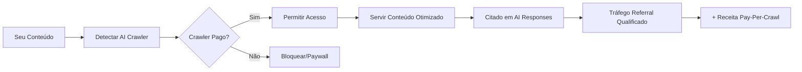

# 💰 Monetização Pay-Per-Crawl: Documentação Completa

> **A revolução na monetização de conteúdo web para IA: Como publicadores estão transformando dados em receita de US$ 2 bilhões**

## 📊 Visão Executiva

O modelo de monetização pay-per-crawl emergiu como a resposta definitiva da web ao apetite insaciável da IA por dados de treinamento. Com publicadores cobrando **US$ 0,001-0,05 por requisição** e garantindo acordos de **US$ 10-250 milhões anuais**, este mercado está revolucionando a economia da web.

### Números-Chave do Mercado
- **73%** dos principais sites de notícias já bloqueiam crawlers de IA
- Mercado projetado: **US$ 2-3,5 bilhões até 2030**
- Taxa de crescimento: **13-17% CAGR**
- Maior acordo conhecido: **US$ 250 milhões** (News Corp + OpenAI)

## 📁 Estrutura da Documentação

### 🎯 [1. Conceitos Fundamentais](./01-conceitos-fundamentais.md)
Entenda os princípios básicos do pay-per-crawl e como funciona a monetização de conteúdo para IA.

### 🏗️ [2. Arquitetura Técnica Cloudflare](./02-arquitetura-cloudflare.md)
Análise detalhada da infraestrutura da Cloudflare que processa 46 milhões de requisições/segundo.

### 💼 [3. Modelos de Negócio e Precificação](./03-modelos-negocio.md)
Estratégias de precificação, acordos bilionários e modelos de compartilhamento de receita.

### ⚙️ [4. Guia de Implementação Técnica](./04-implementacao-tecnica.md)
Código pronto para produção, exemplos práticos e integrações de pagamento.

### ⚖️ [5. Aspectos Legais e Compliance](./05-aspectos-legais.md)
GDPR, EU AI Act, CFAA e frameworks regulatórios com penalidades de até 7% do faturamento.

### 📈 [6. Análise de Mercado e Projeções](./06-analise-mercado.md)
Dinâmicas do mercado, crescimento por região e oportunidades até 2037.

### 🔒 [7. Segurança e Proteção Anti-Fraude](./07-seguranca.md)
Arquitetura de segurança que previne 99,9% do tráfego malicioso.

### 🤔 [8. Guia de Decisão para Publicadores](./08-guia-decisao.md)
Framework para escolher entre Cloudflare e soluções customizadas.

### 🔗 [9. Recursos e Referências](./09-recursos-referencias.md)
166 links essenciais, repositórios GitHub e documentação técnica.

### 🔍 [10. SEO para LLMs e Agentes de IA](./10-seo-llm-agentes-ia.md)
Otimização para descoberta por agentes de IA: llms.txt, LLMO/GEO, structured data e estratégias para ChatGPT, Claude, Perplexity e AI browsers. **Novo documento complementar sobre a revolução da busca por IA.**

### 🖥️ [11. Hosting para Elixir Phoenix](./11-hosting-elixir-phoenix.md)
Comparação completa de **14 plataformas** de hosting para aplicações Elixir Phoenix: Fly.io (recomendação #1 com região São Paulo), Gigalixir, Render, Railway, **Sevalla by Kinsta** (novo - GCP+Cloudflare, região GRU, 14s deploys), Cloud Run, AWS ECS, Azure, Cloudflare Containers, soluções brasileiras (Hostinger, Locaweb) e análise de WebAssembly. Inclui **capacidades pay-per-crawl** por plataforma, exemplo de Plug Phoenix para detecção de AI crawlers, templates de deploy (Dockerfile, fly.toml, railway.json, render.yaml, nixpacks.toml), matriz de preços por tier, latências regionais e integração com Claude Code SDK.

### 💵 [12. BOM e Guia de Fornecedores: Blog Phoenix Pay-Per-Crawl](./12-bom-blog-phoenix-paypercrawl.md)
**Bill of Materials completo** e análise de custos para lançar um blog Elixir Phoenix focado em monetização de AI crawlers. Inclui **4 cenários de custo** ($0,83/mês ultra low-cost até $924/mês enterprise), **rankings de fornecedores** por categoria (🥇🥈🥉), análise de **ROI e break-even** para 4 níveis de tráfego (50k-1M+ pageviews/mês), **roadmap de implementação 90 dias** (5 fases), **projeções de crescimento 12 meses**, estratégias de otimização de custos, análise de riscos com mitigações, e checklist completo de compra. Cobertura detalhada: hosting (Fly.io, Railway, Sevalla), CDN (Cloudflare), payment processing (Stripe, Asaas PIX), analytics (Plausible, Umami), email (Resend), database (PostgreSQL), e pay-per-crawl infrastructure (Workers, DIY Phoenix Plug).

## 🚀 Quick Start

### Para Publicadores
```bash
# 1. Audite seus crawlers atuais
curl -A "Mozilla/5.0" https://seu-site.com/robots.txt

# 2. Configure bloqueio básico
User-agent: GPTBot
Disallow: /

# 3. Implemente autenticação
npm install @botwall/middleware
```

### Para Desenvolvedores
```javascript
// Exemplo de implementação básica
const { validateCrawlRequest } = require('@botwall/middleware');

app.use('/api/*', validateCrawlRequest({
  pricePerRequest: 0.01,
  allowedBots: ['GPTBot', 'ClaudeBot'],
  paymentProcessor: 'stripe'
}));
```

## 🔄 Sinergia: Pay-Per-Crawl + SEO para LLMs

**Nova Estratégia Dual de Monetização** documentada no [Capítulo 10](./10-seo-llm-agentes-ia.md):

### Por que Otimizar para LLMs?
- **57% das SERPs** do Google já incluem AI Overviews (2025)
- **800% crescimento YoY** em tráfego de LLMs
- **Projeção Semrush:** Tráfego LLM > Google Search até 2027

### Estratégia Integrada


### Benefícios Duplos
1. **Receita Direta:** US$ 0,001-0,05 por crawl
2. **Visibilidade em IA:** Citations em ChatGPT, Claude, Perplexity
3. **Tráfego Qualificado:** Usuários vindos de AI têm 40% mais engajamento

**Implementação Rápida:** llms.txt + structured data + content optimization = 1 semana

## 💡 Casos de Uso Principais

### 1. **Jornalismo Premium**
- **Receita**: US$ 16-250 milhões/ano
- **Exemplo**: Wall Street Journal + OpenAI
- **Modelo**: Licenciamento exclusivo + royalties

### 2. **Conteúdo Gerado por Usuários**
- **Receita**: US$ 60 milhões/ano
- **Exemplo**: Reddit + Google
- **Modelo**: Acesso bulk a discussões históricas

### 3. **Publicações Acadêmicas**
- **Receita**: US$ 10+ milhões
- **Exemplo**: Taylor & Francis + Microsoft
- **Modelo**: Pagamento inicial + recorrente

## 🎯 Decisões Críticas

### Cloudflare vs Solução Customizada

| Aspecto | Cloudflare | Customizada |
|---------|------------|-------------|
| **Tempo de Implementação** | 1-2 semanas | 3-4 meses |
| **Investimento Inicial** | Zero | US$ 6-50 mil |
| **Controle de Preços** | Limitado | Total |
| **Escalabilidade** | Automática | Manual |
| **Melhor Para** | < 100M requisições/mês | > 100M requisições/mês |

## 📊 ROI Esperado

### Para Site com 1M Pageviews/mês

| Modelo | Receita Anual |
|--------|---------------|
| **CPM Tradicional** | US$ 6.000-144.600 |
| **Pay-Per-Crawl** | US$ 12.000-120.000 |
| **Híbrido** | US$ 18.000-264.600 |

## 🔄 Linha do Tempo de Implementação

```mermaid
gantt
    title Roadmap de Implementação Pay-Per-Crawl
    dateFormat  YYYY-MM-DD
    section Fase 1
    Auditoria de Crawlers     :2025-01-01, 7d
    Estratégia de Preços      :7d
    section Fase 2
    Implementação Técnica     :14d
    Integração Pagamentos     :7d
    section Fase 3
    Testes e Otimização      :14d
    Go-Live                  :milestone
```

## 🎓 Principais Aprendizados

1. **Timing é Crítico**: 73% dos sites já bloqueiam - janela de oportunidade fechando
2. **Preços Variam 50x**: De US$ 0,001 a US$ 0,05 por requisição
3. **Autenticação é Essencial**: User-Agent não basta - use criptografia Ed25519
4. **Compliance Primeiro**: Multas de até 7% do faturamento global
5. **ROI Comprovado**: Payback em 3-6 meses para implementações bem-sucedidas

## 🚨 Avisos Importantes

⚠️ **Conformidade Legal**: Sempre consulte assessoria jurídica antes da implementação
⚠️ **Impacto SEO**: Cuidado para não bloquear crawlers legítimos de busca
⚠️ **Recursos Técnicos**: Prepare infraestrutura para 100.000+ requisições/segundo
⚠️ **Gestão de Fraude**: Implemente detecção ML desde o início

## 📞 Próximos Passos

1. **Avalie** sua situação atual com a [auditoria de crawlers](./08-guia-decisao.md#auditoria)
2. **Decida** entre Cloudflare ou solução própria
3. **Implemente** seguindo nosso [guia técnico](./04-implementacao-tecnica.md)
4. **Monitore** métricas e ajuste preços conforme necessário
5. **Scale** expandindo para novos crawlers e modelos

## 🤝 Contribuindo

Esta documentação é um trabalho em progresso. Contribuições são bem-vindas através de:
- Issues com sugestões de melhorias
- Pull requests com atualizações
- Compartilhamento de casos de uso reais
- Feedback sobre implementações

## 📜 Licença

Esta documentação está disponível sob licença MIT. Use livremente para fins educacionais e comerciais.

---

**Última atualização**: Janeiro 2025
**Versão**: 1.0.0
**Mantido por**: Comunidade de Publicadores Web