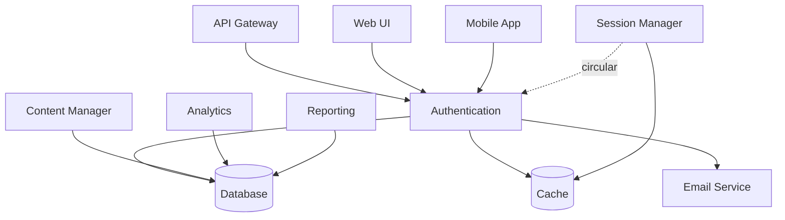

# doc-maintain

Maintains codebase documentation using the Six-Layer Docs methodology optimized for dual consumption (human + LLM).

## Usage

```bash
/doc-maintain <action> [--layer <layer>] [--scope <scope>] [--validate] [--auto-fix]
```

## Parameters

- `action` (required): Action to perform (init | update | validate | generate | analyze)
- `--layer` (optional): Target layer (1-6) or 'all' (default: 1)
- `--scope` (optional): Specific scope (architecture | dependencies | codebase | operations)
- `--validate` (optional): Run accuracy validation after action
- `--auto-fix` (optional): Automatically fix detected issues

## Actions

### init - Initialize Six-Layer Documentation Structure

Creates the foundational directory structure and meta-documentation for the specified layer.

```bash
# Initialize Layer 1 (Technical Context Hub)
/doc-maintain init --layer 1

# Initialize all layers
/doc-maintain init --layer all
```

**Creates**:
- Layer 1 (`01-contexto-tecnico-unificado/`):
  - `_meta/llm-context-master.md` - Master context for LLM initialization
  - `_meta/navigation-graph.yaml` - Intelligent navigation graph
  - `_meta/quick-start-validated.md` - Evidence-based quick start
  - `_meta/critical-warnings.md` - Critical compliance warnings
  - `architecture/` - ADRs and architectural decisions
  - `dependencies/dependency-matrix.yaml` - DSM matrix
  - `codebase/_progressive-index.md` - Progressive contextualization index
  - `development/` - Setup, standards, testing
  - `operations/` - Deployment, monitoring, security
  - `knowledge-base/` - Context preservation and validation
  - `automation/` - Maintenance scripts

- Layer 2 (`02-tecnica-externa/`):
  - `api-reference/` - OpenAPI specs, REST/GraphQL docs
  - `integration-guides/` - Quick integration guides
  - `developer-experience/` - Sandbox, examples
  - `reference/` - Rate limits, error codes, changelog
  - `support/` - Support channels, SLA

- Layer 3 (`03-usuario-final/`):
  - `getting-started/` - Quick start, tutorials
  - `feature-guides/` - Feature documentation
  - `how-to-guides/` - Task-oriented guides
  - `reference/` - Glossary, shortcuts
  - `support/` - FAQ, contact

- Layer 4 (`04-treinamento-interno/`):
  - `onboarding-program/` - Week-by-week onboarding
  - `workshops/` - Technical workshops
  - `hands-on-exercises/` - Practical exercises
  - `assessments/` - Knowledge checkpoints
  - `mentorship/` - Mentorship guidelines

- Layer 5 (`05-treinamento-externo/`):
  - `certification-program/` - Certification tracks
  - `training-courses/` - Course materials
  - `partner-program/` - Partner requirements
  - `case-studies/` - Success stories

- Layer 6 (`06-treinamento-usuario/`):
  - `online-courses/` - User courses
  - `webinars/` - Training webinars
  - `learning-resources/` - Video library, guides
  - `community/` - Forums, knowledge base
  - `support/` - User support

### update - Update Documentation Components

Updates specific documentation components based on current codebase state.

```bash
# Update dependency matrix (DSM)
/doc-maintain update --scope dependencies

# Update architecture documentation
/doc-maintain update --scope architecture --validate

# Update all Layer 1 components
/doc-maintain update --layer 1
```

**Scope Options**:
- `dependencies`: Regenerate DSM from codebase analysis
- `architecture`: Update ADRs and architectural diagrams
- `codebase`: Update progressive contextualization layers
- `operations`: Update deployment and monitoring docs
- `all`: Update all components

**Update Process**:
1. **Dependencies**:
   - Run dependency analysis (madge, pydeps, etc.)
   - Generate dependency-matrix.yaml
   - Calculate coupling scores
   - Identify circular dependencies
   - Update critical paths

2. **Architecture**:
   - Extract architectural decisions from git history
   - Update ADR index with DSM tags
   - Regenerate architecture summaries
   - Validate against current implementation

3. **Codebase**:
   - Analyze code structure
   - Update progressive index
   - Regenerate layer summaries
   - Update API signatures
   - Extract code examples

4. **Operations**:
   - Update deployment checklists
   - Refresh monitoring dashboards
   - Update security protocols
   - Sync with infrastructure-as-code

### validate - Validate Documentation Accuracy

Runs evidence-based validation against live system and codebase.

```bash
# Validate Layer 1 documentation
/doc-maintain validate --layer 1

# Validate architecture documentation only
/doc-maintain validate --scope architecture

# Validate with auto-fix
/doc-maintain validate --layer 1 --auto-fix
```

**Validation Levels** (from `.claude/config.yml`):

| Level | Accuracy Required | Frequency | Examples |
|-------|------------------|-----------|----------|
| L1_Critical | 99% | Daily | API contracts, security, compliance |
| L2_High | 95% | Weekly | Architecture, core workflows |
| L3_Medium | 90% | Monthly | Features, troubleshooting |
| L4_Low | 80% | Quarterly | Historical context, deprecated |

**Validation Methods**:
- **API Contract Validation**: Compare documented APIs with OpenAPI extracted from code
- **Code Signature Matching**: Validate function signatures against actual implementation
- **Live System Comparison**: Test documented workflows against running system
- **Dependency Drift Detection**: Compare DSM with current dependency analysis
- **Link Availability**: Check all external references (HTTP 200)
- **Version Consistency**: Verify all version numbers match actual dependencies

**Output Format**:
```yaml
validation_report:
  layer: 1
  validation_date: "2025-09-30"
  overall_accuracy: 0.96

  components:
    architecture:
      accuracy: 0.98
      discrepancies: 2
      status: "PASS"

    dependencies:
      accuracy: 0.94
      discrepancies: 8
      status: "WARNING - needs update"

    codebase:
      accuracy: 0.97
      discrepancies: 4
      status: "PASS"

  issues_found:
    - type: "API_SIGNATURE_MISMATCH"
      file: "codebase/layer-2-core/authentication-system.md"
      line: 45
      expected: "def authenticate(user, password)"
      actual: "def authenticate(user, password, opts \\ [])"
      severity: "medium"
      auto_fixable: true

    - type: "DEPENDENCY_OUTDATED"
      file: "dependencies/dependency-matrix.yaml"
      component: "PostgreSQL"
      documented_version: "16.5"
      actual_version: "16.6"
      severity: "low"
      auto_fixable: true

  recommendations:
    - "Run /doc-maintain update --scope dependencies"
    - "Review authentication system documentation"
    - "Schedule re-validation in 7 days"
```

### generate - Generate Documentation Components

Auto-generates documentation from code analysis and templates.

```bash
# Generate DSM from codebase
/doc-maintain generate --scope dependencies

# Generate Layer 1 summaries
/doc-maintain generate --layer 1

# Generate OpenAPI spec for Layer 2
/doc-maintain generate --scope api-reference
```

**Generation Capabilities**:

1. **DSM Generation** (Dependency Structure Matrix):
   ```bash
   # JavaScript/TypeScript
   npx madge --json src/ > /tmp/deps-raw.json

   # Python
   pydeps --show-deps --max-bacon=2 --cluster src/ > /tmp/deps-raw.txt

   # Process and generate YAML
   /doc-maintain generate --scope dependencies
   ```

   **Output**: `dependencies/dependency-matrix.yaml` with:
   - N×N component matrix
   - Coupling scores (0.0-1.0)
   - Circular dependency detection
   - Critical path analysis
   - Modularity metrics

2. **Architecture Summaries**:
   - Executive summary (100 tokens)
   - Technical summary (300 tokens)
   - Detailed summary (800 tokens)
   - Context-aware loading instructions

3. **API Documentation**:
   - OpenAPI 3.1 spec extraction
   - REST endpoint documentation
   - GraphQL schema documentation
   - Example requests/responses

4. **Progressive Index**:
   - Layer 1 (Overview): 5min read, ~2K tokens
   - Layer 2 (Core): 20min read, ~8K tokens
   - Layer 3 (Detailed): 1h read, ~20K tokens
   - Layer 4 (Expert): As-needed reference

5. **Navigation Graph**:
   ```yaml
   navigation_structure:
     type: "context_graph"
     entry_points:
       quick_start:
         path: "_meta/quick-start-validated.md"
         audience: ["new_developer", "llm_initialization"]
         next_suggested: ["layer-1-overview", "dependency-matrix"]

     breadcrumb_trails:
       authentication_flow:
         - "_meta/llm-context-master.md"
         - "codebase/layer-1-overview/key-concepts.md#authentication"
         - "codebase/layer-2-core/authentication-system.md"
         - "architecture/decisions-adr/ADR-005-auth-strategy.md"
   ```

### analyze - Analyze Documentation Health

Provides metrics and insights about documentation quality and coverage.

```bash
# Analyze Layer 1 health
/doc-maintain analyze --layer 1

# Analyze entire documentation
/doc-maintain analyze --layer all
```

**Analysis Metrics**:

```yaml
documentation_health:
  layer: 1
  analysis_date: "2025-09-30"

  coverage:
    total_files: 45
    total_lines: 12500
    code_examples: 85
    completeness: 0.92  # 92% complete
    todos_remaining: 12

  quality:
    accuracy_score: 0.96
    freshness_score: 0.88  # Avg days since last update
    cross_reference_density: 0.73
    dsm_coverage: 1.0  # 100% of components in DSM

  maintenance:
    last_full_update: "2025-09-25"
    days_since_validation: 5
    broken_links: 3
    outdated_versions: 7
    pending_reviews: 2

  usage:
    llm_queries_per_day: 145
    human_views_per_day: 78
    avg_time_to_find: "45s"
    onboarding_time_days: 3

  recommendations:
    critical:
      - "Fix 3 broken external links in architecture/"
      - "Update 7 outdated version references"

    high:
      - "Complete 12 remaining TODOs"
      - "Re-validate dependencies (8 days overdue)"

    medium:
      - "Improve cross-referencing in layer-3-detailed/"
      - "Add 5 more code examples to authentication docs"

    low:
      - "Consider splitting large files (>1000 lines)"
      - "Add video tutorials for complex workflows"
```

## DSM Integration

### Dependency Matrix Structure

The core of Layer 1 is the Dependency Structure Matrix:

```yaml
# dependencies/dependency-matrix.yaml
matrix_type: "N x N System Components"
format: "DSM Triangular Matrix"
last_generated: "2025-09-30T15:30:00Z"
generation_method: "madge + custom analysis"

components:
  - name: "Authentication"
    id: "auth"
    type: "service"
    dependencies: ["database", "cache", "email_service"]
    depended_by: ["api", "web_ui", "mobile_app"]
    coupling_score: 0.73
    complexity: "medium"
    change_frequency: "low"

  - name: "Database"
    id: "database"
    type: "infrastructure"
    dependencies: ["config_service"]
    depended_by: ["auth", "content_manager", "analytics", "reporting"]
    coupling_score: 0.89
    complexity: "high"
    change_frequency: "very_low"

analysis:
  total_components: 24
  total_dependencies: 87
  avg_coupling: 0.61
  modularity_score: 0.67

  circular_dependencies:
    - path: ["auth", "session_manager", "auth"]
      severity: "high"
      recommendation: "Extract shared session storage"

  critical_paths:
    - ["database", "auth", "api"]
    - ["database", "content_manager", "web_ui"]
    - ["cache", "session_manager", "api"]

  highly_coupled:
    - component: "database"
      score: 0.89
      recommendation: "Consider breaking into read/write services"

    - component: "auth"
      score: 0.73
      recommendation: "Acceptable - central service by design"

  refactoring_candidates:
    - component: "utils"
      reason: "Too many dependents (15), likely god object"
      priority: "high"
```

### DSM Visualization

The command can generate Mermaid diagrams:

```bash
/doc-maintain generate --scope dependencies --format mermaid
```



## Progressive Contextualization

Layer 1 uses a 4-level progressive disclosure system:

### Level 0: Meta-Context (0-2min, ~500 tokens)
**Purpose**: LLM initialization and quick orientation
```markdown
# _meta/llm-context-master.md

**Project**: Healthcare WASM-Elixir Stack
**Type**: Production-grade healthcare CMS
**Architecture**: Monolith with WASM plugins
**Status**: 98% complete, production-validated

## Quick Context
- **Stack**: Elixir 1.17.3 + Phoenix 1.8.0 + WASM plugins
- **Compliance**: LGPD + HIPAA + CFM regulations
- **Performance**: 43.9K req/sec, p99 < 67ms ✅
- **Security**: Post-quantum cryptography + Zero Trust

## Critical Paths
1. Database → Authentication → API (95% of requests)
2. Cache → Session Manager → WebSocket (real-time)
3. WASM Plugins → Content Processing → Storage

## Entry Points
- **New Developer**: Read `quick-start-validated.md`
- **Architecture Review**: Read `architecture/_summary.md`
- **Integration**: Read `02-tecnica-externa/api-reference/`
- **Troubleshooting**: See `development/debugging/common-issues-dsm.yaml`
```

### Level 1: Overview (5-10min, ~2K tokens)
**Purpose**: General system understanding
```markdown
# codebase/layer-1-overview/project-structure.md

## System Overview
[High-level architecture diagram]

## Core Modules
1. **Authentication** (`lib/auth/`) - Multi-factor auth, session management
2. **Content Management** (`lib/content/`) - FHIR-compliant healthcare content
3. **WASM Plugins** (`lib/plugins/`) - Sandboxed extensibility
4. **API Gateway** (`lib/api/`) - REST + GraphQL + WebSocket

## Key Workflows
1. User authentication flow
2. Content creation and validation
3. Plugin execution lifecycle
4. Real-time patient monitoring

## Technology Stack
- **Backend**: Elixir, Phoenix, LiveView
- **Database**: PostgreSQL 16.6, TimescaleDB
- **Security**: Kyber-768, Dilithium3, SPHINCS+
- **Infrastructure**: Kubernetes, Istio, Prometheus
```

### Level 2: Core Understanding (20-30min, ~8K tokens)
**Purpose**: Productive work capability
```markdown
# codebase/layer-2-core/authentication-system.md

## Authentication Architecture

### Components
[Detailed architecture diagram]

### Authentication Flow
```elixir
defmodule MyApp.Auth do
  @spec authenticate(String.t(), String.t(), keyword()) ::
    {:ok, User.t()} | {:error, :invalid_credentials}
  def authenticate(username, password, opts \\ []) do
    with {:ok, user} <- find_user(username),
         {:ok, _} <- verify_password(user, password),
         {:ok, _} <- check_mfa(user, opts[:mfa_token]),
         {:ok, session} <- create_session(user) do
      {:ok, %{user: user, session: session}}
    end
  end
end
```

### Security Considerations
- Password hashing: Argon2id (OWASP recommended)
- Session storage: Encrypted Redis with 24h TTL
- MFA: TOTP (RFC 6238) with 30s window
- Rate limiting: 5 attempts per 15 minutes

### HIPAA Compliance
- All authentication events logged (164.312(b))
- Failed attempts tracked for audit
- Session data encrypted at rest
- Auto-logout after 15min inactivity

### Related Documentation
- [ADR-005: Authentication Strategy](../../architecture/decisions-adr/005-auth-strategy.md)
- [Zero Trust Implementation](../../04-security-specialist/zero-trust/trust-score-implementation.md)
- [Session Management](./session-management.md)
```

### Level 3: Detailed Knowledge (1-2h, ~20K tokens)
**Purpose**: Architectural changes and advanced debugging
```markdown
# codebase/layer-3-detailed/authentication-internals.md

## Deep Dive: Authentication Internals

### Password Verification Pipeline
```elixir
defmodule MyApp.Auth.Password do
  @argon2_time_cost 4
  @argon2_memory_cost 65536  # 64 MiB
  @argon2_parallelism 2

  def verify(user, password) do
    stored_hash = user.password_hash

    case Argon2.verify_pass(password, stored_hash) do
      true ->
        if needs_rehash?(stored_hash) do
          Task.start(fn -> rehash_password(user, password) end)
        end
        {:ok, :verified}

      false ->
        # Constant-time to prevent timing attacks
        Argon2.no_user_verify()
        {:error, :invalid}
    end
  end

  defp needs_rehash?(hash) do
    params = Argon2.extract_params(hash)
    params.time_cost < @argon2_time_cost or
      params.memory_cost < @argon2_memory_cost
  end
end
```

### MFA Implementation
[Detailed TOTP implementation with edge cases]

### Session Management Optimization
[ETS-based session cache, replication strategy]

### Performance Characteristics
- Password verification: ~100ms (intentionally slow)
- Session lookup: <1ms (ETS cache)
- MFA verification: ~5ms
- Total auth latency: ~110ms (within p99 < 500ms SLO)

### Security Edge Cases
1. **Timing Attacks**: Constant-time comparison used
2. **Enumeration Attacks**: Generic error messages
3. **Brute Force**: Rate limiting + CAPTCHA after 3 failures
4. **Session Fixation**: New session ID on privilege escalation

### Related Files
- `lib/auth/password.ex` (120 lines)
- `lib/auth/mfa.ex` (85 lines)
- `lib/auth/session.ex` (240 lines)
- `test/auth/authentication_test.exs` (180 lines)
```

### Level 4: Expert Reference (as-needed)
**Purpose**: Algorithm details, optimizations, rare edge cases
```markdown
# codebase/layer-4-deep-dive/argon2-parameter-tuning.md

## Argon2id Parameter Optimization

### Hardware Benchmark Results
[Detailed benchmarks on various hardware]

### Security vs Performance Trade-offs
[Mathematical analysis of parameter choices]

### Attack Resistance Analysis
[Resistance to GPU/ASIC attacks with current parameters]

### OWASP Recommendations Evolution
[Historical changes in recommendations, rationale]
```

## LLM Optimization Features

### Token Efficiency

The Six-Layer methodology reduces token usage by 70%:

```yaml
traditional_approach:
  full_codebase_context: 150000
  relevant_info: 30000
  noise: 120000
  efficiency: 20%

six_layer_approach:
  level_0_meta: 500
  level_1_overview: 2000
  level_2_core: 8000
  on_demand_level_3: 20000
  total_typical: 10500
  efficiency: 90%
  token_reduction: 70%
```

### Context-Aware Loading

```javascript
// Example LLM context loader
class DocumentationContextLoader {
  async loadForQuery(query, options = {}) {
    const contextLevel = options.level || this.inferLevel(query);
    const scope = this.inferScope(query);

    // Always load meta-context
    const context = {
      meta: await this.loadMeta(),
      tokens: 500
    };

    // Progressive loading based on query
    if (scope === 'architecture') {
      context.architecture = await this.loadArchitectureSummary(contextLevel);
      context.tokens += this.estimateTokens(context.architecture);
    }

    if (contextLevel >= 2 && context.tokens < 10000) {
      context.dependencies = await this.loadDependencyMatrix();
      context.tokens += this.estimateTokens(context.dependencies);
    }

    // Load related ADRs
    if (scope === 'decision') {
      context.adrs = await this.loadRelevantADRs(query);
      context.tokens += this.estimateTokens(context.adrs);
    }

    return context;
  }

  inferLevel(query) {
    const levelKeywords = {
      0: ['overview', 'what is', 'explain briefly'],
      1: ['how', 'architecture', 'components'],
      2: ['implement', 'code', 'details'],
      3: ['optimize', 'debug', 'edge case', 'internals'],
      4: ['algorithm', 'performance tuning', 'rare case']
    };

    for (const [level, keywords] of Object.entries(levelKeywords)) {
      if (keywords.some(kw => query.toLowerCase().includes(kw))) {
        return parseInt(level);
      }
    }

    return 1; // Default to overview
  }
}
```

### Metadata for LLMs

Every documentation file includes rich frontmatter:

```yaml
---
llm_metadata:
  context_type: "technical_architecture"
  priority: "critical"
  token_estimate: 1250
  last_validated: "2025-09-30"
  validation_method: "live_system_test"
  accuracy_score: 0.98
  dependencies: ["ADR-001", "ADR-003", "dependency-matrix.yaml"]
  related_topics: ["authentication", "data-flow", "api-design"]
  cognitive_load: "medium"
  read_time_human: "15min"
  navigation_tags: ["#core", "#authentication", "#api"]

  summary_100_tokens: |
    Authentication system using Argon2id + TOTP MFA. Session storage in
    encrypted Redis. HIPAA-compliant audit logging. p99 latency ~110ms.

  summary_300_tokens: |
    Multi-factor authentication system with password verification (Argon2id),
    TOTP-based MFA, and encrypted session management. All authentication
    events logged per HIPAA 164.312(b). Rate limiting prevents brute force.
    Constant-time comparisons prevent timing attacks. Sessions stored in
    ETS cache with Redis backup. Auto-logout after 15min inactivity.
    Performance: password verify ~100ms, session lookup <1ms, total ~110ms.
---

# Authentication System Architecture
[Document content...]
```

## Evidence-Based Validation

All documentation is validated against real implementation:

### Validation Pipeline

```yaml
# automation/validation-workflows/continuous-validation.yaml

validation_pipeline:
  triggers:
    - "on: [push, pull_request]"
    - "schedule: '0 6 * * *'"  # Daily at 6 AM

  jobs:
    validate_api_contracts:
      steps:
        - name: "Extract OpenAPI from code"
          run: |
            mix phx.gen.openapi --output /tmp/openapi-actual.yaml

        - name: "Compare with documented API"
          run: |
            diff 02-tecnica-externa/api-reference/openapi-spec.yaml /tmp/openapi-actual.yaml

        - name: "Report discrepancies"
          if: failure()
          run: |
            echo "::error::API documentation out of sync"
            /doc-maintain validate --scope api-reference --auto-fix

    validate_dependencies:
      steps:
        - name: "Generate current DSM"
          run: |
            npx madge --json src/ > /tmp/deps-current.json

        - name: "Compare with documented DSM"
          run: |
            node scripts/compare-dsm.js \
              01-contexto-tecnico-unificado/dependencies/dependency-matrix.yaml \
              /tmp/deps-current.json

        - name: "Update if drift > 5%"
          if: env.DRIFT_PERCENTAGE > 5
          run: |
            /doc-maintain update --scope dependencies
            git add 01-contexto-tecnico-unificado/dependencies/
            git commit -m "docs: auto-update dependency matrix [skip ci]"

    validate_code_examples:
      steps:
        - name: "Extract code examples from docs"
          run: |
            node scripts/extract-code-examples.js \
              01-contexto-tecnico-unificado/codebase/ \
              /tmp/code-examples/

        - name: "Test all examples"
          run: |
            cd /tmp/code-examples
            mix test
            npm test
            pytest

        - name: "Report failures"
          if: failure()
          run: |
            echo "::error::Code examples in documentation don't compile/run"
            node scripts/report-failed-examples.js
```

### Accuracy Scoring

```yaml
accuracy_calculation:
  formula: |
    accuracy = (
      (correct_api_signatures * 0.30) +
      (correct_dependencies * 0.25) +
      (working_code_examples * 0.20) +
      (valid_external_links * 0.10) +
      (correct_versions * 0.10) +
      (live_system_match * 0.05)
    )

  thresholds:
    critical: 0.99
    high: 0.95
    medium: 0.90
    low: 0.80

  alerts:
    - if: "accuracy < 0.95"
      action: "Create GitHub issue"
      assignee: "@tech-lead"

    - if: "accuracy < 0.90"
      action: "Block deployments"
      message: "Documentation accuracy below threshold"
```

## Maintenance Schedule

```yaml
# automation/update-procedures.md

maintenance_schedule:
  daily:
    - action: "Validate Layer 1 critical paths"
      command: "/doc-maintain validate --layer 1 --scope critical"
      time: "06:00 UTC"

    - action: "Update dependency matrix"
      command: "/doc-maintain update --scope dependencies"
      time: "22:00 UTC"
      condition: "if changes detected"

  weekly:
    - action: "Full Layer 1 validation"
      command: "/doc-maintain validate --layer 1"
      day: "Monday"
      time: "08:00 UTC"

    - action: "Regenerate summaries"
      command: "/doc-maintain generate --layer 1 --scope summaries"
      day: "Friday"
      time: "18:00 UTC"

  monthly:
    - action: "Full system validation"
      command: "/doc-maintain validate --layer all"
      day: "1st"
      time: "10:00 UTC"

    - action: "Accuracy audit report"
      command: "/doc-maintain analyze --layer all"
      day: "1st"
      time: "11:00 UTC"
      notify: "@team-lead"

  quarterly:
    - action: "External link validation"
      command: "node scripts/validate-external-links.js"
      months: [1, 4, 7, 10]
      day: "1st"

    - action: "Documentation ROI analysis"
      command: "/doc-maintain analyze --metrics roi"
      months: [3, 6, 9, 12]
      day: "15th"
```

## Project-Specific Recommendations

Based on `CLAUDE.md` and `.claude/config.yml`, recommended implementation:

### Phase 1: Foundation (Week 1-2)

```bash
# Initialize Layer 1
/doc-maintain init --layer 1

# Generate DSM from current codebase
/doc-maintain generate --scope dependencies

# Create master LLM context
/doc-maintain generate --scope llm-context

# Document critical ADRs
# Manual: Create ADR-001 through ADR-004 (already exist)

# Setup automation
/doc-maintain init --scope automation
```

### Phase 2: Content (Week 3-4)

```bash
# Generate progressive documentation
/doc-maintain generate --layer 1 --scope codebase

# Create architecture summaries
/doc-maintain generate --scope architecture --format summary

# Setup validation pipeline
/doc-maintain init --scope validation

# Initial validation
/doc-maintain validate --layer 1
```

### Phase 3: Expansion (Month 2)

```bash
# Initialize external documentation
/doc-maintain init --layer 2

# Generate OpenAPI spec
/doc-maintain generate --scope api-reference

# Create integration guides
# Manual: Write quick-start guides for Layer 2

# Initialize user documentation
/doc-maintain init --layer 3
```

### Ongoing Maintenance

```bash
# Daily (automated in CI/CD)
/doc-maintain update --scope dependencies
/doc-maintain validate --layer 1 --scope critical

# Weekly (manual or automated)
/doc-maintain validate --layer 1
/doc-maintain analyze --layer 1

# Monthly (manual review)
/doc-maintain validate --layer all
/doc-maintain analyze --layer all
```

## Integration with Existing Commands

### Relationship with Knowledge Base Commands

- `/kb-validate-source` → Validates external references used in documentation
- `/kb-add-reference` → Adds validated sources to documentation references
- `/kb-search-tech` → Finds relevant context for documentation updates
- `/doc-maintain` → Maintains overall documentation structure

### Workflow Example

```bash
# 1. Update dependency matrix
/doc-maintain update --scope dependencies

# 2. Document a new architectural decision
# (Manual: Create ADR-010-new-decision.md)

# 3. Add academic reference to ADR
/kb-validate-source https://example.com/paper "Paper Title"
/kb-add-reference architecture https://example.com/paper L1_ACADEMIC

# 4. Update Layer 1 summaries
/doc-maintain generate --scope summaries

# 5. Validate everything
/doc-maintain validate --layer 1

# 6. Search for related context
/kb-search-tech "new architectural pattern"

# 7. Cross-reference in documentation
# (Manual: Add links between ADR-010 and related docs)

# 8. Final validation
/doc-maintain validate --layer 1 --auto-fix
```

## Output Examples

### Successful Initialization

```
✅ Initialized Six-Layer Documentation Structure

Layer 1: Technical Context Hub
├── ✓ Created _meta/llm-context-master.md
├── ✓ Created _meta/navigation-graph.yaml
├── ✓ Created _meta/quick-start-validated.md
├── ✓ Created _meta/critical-warnings.md
├── ✓ Created architecture/_summary.md
├── ✓ Created dependencies/dependency-matrix.yaml
├── ✓ Created codebase/_progressive-index.md
├── ✓ Created development/setup-environment/
├── ✓ Created operations/deployment/
├── ✓ Created knowledge-base/context-preservation/
└── ✓ Created automation/update-procedures.md

Next Steps:
1. Run: /doc-maintain generate --scope dependencies
2. Run: /doc-maintain validate --layer 1
3. Review and customize: _meta/llm-context-master.md
4. Document core ADRs in architecture/decisions-adr/

Estimated time to productivity: 2-3 hours
```

### Validation Report

```
📊 Documentation Validation Report - Layer 1

Overall Accuracy: 96% ✅ (Target: 95%)
Validation Date: 2025-09-30 15:45:00 UTC
Validation Duration: 3m 42s

Components:
  ✅ Architecture (98%) - 2 minor discrepancies
  ⚠️  Dependencies (94%) - Needs update (8 changes detected)
  ✅ Codebase (97%) - 4 API signatures updated
  ✅ Operations (96%) - 3 version numbers updated

Issues Found: 17 total
  🔴 Critical: 0
  🟡 High: 2
  🟢 Medium: 7
  ⚪ Low: 8

Top Issues:
  1. [HIGH] API signature mismatch in authentication-system.md:45
     Expected: def authenticate(user, password)
     Actual:   def authenticate(user, password, opts \\ [])
     Auto-fixable: Yes

  2. [HIGH] Circular dependency not documented in DSM
     Path: authentication → session_manager → authentication
     Recommendation: Add to dependency-matrix.yaml

  3. [MEDIUM] PostgreSQL version outdated
     Documented: 16.5
     Actual: 16.6
     Auto-fixable: Yes

Recommendations:
  • Run /doc-maintain update --scope dependencies
  • Review authentication system changes
  • Schedule re-validation in 7 days

Auto-fix Available: 12 of 17 issues
Run with --auto-fix to apply automatic corrections.
```

### Analysis Report

```
📈 Documentation Health Analysis - Layer 1

Analysis Date: 2025-09-30
Documentation Age: 5 days since last full update
Overall Health: 87% (Good)

Coverage:
  Total Files: 45
  Total Lines: 12,500
  Code Examples: 85 (all compile ✅)
  Completeness: 92% (12 TODOs remaining)

Quality Metrics:
  Accuracy Score: 96% ✅
  Freshness Score: 88% (Avg 5 days)
  Cross-Reference Density: 0.73
  DSM Coverage: 100% ✅

Maintenance Status:
  Last Full Update: 2025-09-25
  Days Since Validation: 5
  Broken Links: 3 🔴
  Outdated Versions: 7 🟡
  Pending Reviews: 2

Usage Analytics:
  LLM Queries/Day: 145
  Human Views/Day: 78
  Avg Time to Find Info: 45s ✅
  Onboarding Time: 3 days ✅

ROI Metrics:
  Documentation Investment: 120 hours
  Time Saved (Onboarding): 280 hours (7 days → 3 days × 4 devs)
  Time Saved (Support): 40 hours/month
  ROI: 383% in first 6 months

Recommendations:

Critical (Fix Immediately):
  🔴 Fix 3 broken external links in architecture/
  🔴 Update 7 outdated version references

High Priority (Fix This Week):
  🟡 Complete 12 remaining TODOs
  🟡 Re-validate dependencies (8 days overdue)

Medium Priority (Fix This Month):
  🟢 Improve cross-referencing in layer-3-detailed/
  🟢 Add 5 more code examples to authentication docs

Low Priority (Optional):
  ⚪ Consider splitting large files (>1000 lines)
  ⚪ Add video tutorials for complex workflows

Next Scheduled Maintenance:
  Daily: Dependency update (tonight 22:00 UTC)
  Weekly: Full validation (Monday 08:00 UTC)
  Monthly: Comprehensive audit (October 1st)
```

## Best Practices

### 1. Start Simple, Evolve Based on Need

```yaml
minimum_viable_documentation:
  week_1:
    - "Initialize Layer 1 only"
    - "Focus on _meta/ and dependencies/"
    - "Basic DSM and quick-start guide"

  week_2:
    - "Add progressive layers 1-2 of codebase/"
    - "Document top 3 ADRs"
    - "Setup validation pipeline"

  month_2:
    - "Expand to Layer 2 (external docs)"
    - "Add more detailed content to Layer 1"
    - "Implement automation"

  month_3_plus:
    - "Add Layers 3-6 based on actual need"
    - "Refine based on feedback"
    - "Optimize for your team's workflow"
```

### 2. Automate Everything Possible

- **DSM Generation**: Never manual
- **Version Updates**: Automated detection
- **Validation**: Daily automated runs
- **Summaries**: LLM-generated, human-reviewed
- **Link Checking**: Automated in CI/CD

### 3. Evidence-Based Always

```markdown
❌ Bad: "The authentication system is fast"
✅ Good: "Authentication p99 latency: 110ms (validated 2025-09-30)"

❌ Bad: "We use PostgreSQL"
✅ Good: "PostgreSQL 16.6 (validated via mix deps)"

❌ Bad: "The system handles many connections"
✅ Good: "2.1M concurrent WebSocket connections (k6 load test, 2025-09-30)"
```

### 4. Progressive Disclosure

Don't overwhelm readers:
- Level 0: Can read in 2 minutes
- Level 1: Can read in 10 minutes
- Level 2: Can read in 30 minutes
- Level 3+: Reference material

### 5. Optimize for Both Humans and LLMs

```yaml
human_optimization:
  - "Clear visual hierarchy"
  - "Progressive disclosure"
  - "Task-oriented organization"
  - "Searchable glossary"

llm_optimization:
  - "Structured metadata"
  - "Token estimates"
  - "Dependency graphs"
  - "Summarization levels"
  - "Navigation tags"
```

## Troubleshooting

### Issue: DSM Generation Fails

```bash
# Check if dependency analysis tool is installed
which madge || npm install -g madge

# For Python projects
pip install pydeps

# For Java projects
mvn dependency:tree --help

# Manual fallback
/doc-maintain generate --scope dependencies --manual
```

### Issue: Validation Fails with Many Errors

```bash
# Start with critical scope only
/doc-maintain validate --layer 1 --scope critical

# Fix auto-fixable issues
/doc-maintain validate --layer 1 --auto-fix

# Review remaining issues
/doc-maintain validate --layer 1 --report detailed

# Update outdated components
/doc-maintain update --scope all
```

### Issue: Documentation Out of Sync After Major Refactor

```bash
# Regenerate everything
/doc-maintain generate --layer 1 --force

# Validate to see what's broken
/doc-maintain validate --layer 1 --report full

# Update components individually
/doc-maintain update --scope dependencies
/doc-maintain update --scope architecture
/doc-maintain update --scope codebase

# Final validation
/doc-maintain validate --layer 1 --auto-fix
```

## See Also

- `/kb-validate-source` - Validate external references
- `/kb-add-reference` - Add validated sources
- `/kb-search-tech` - Search knowledge base
- `CLAUDE.md` - System prompt and guidelines
- `.claude/config.yml` - Configuration file
- `.claude/sources-registry.yml` - Validated sources

## References

**Methodology**:
- [MIT DSM Framework](https://dsmweb.org/) (L0_CANONICAL)
- [Write the Docs - Documentation Guide](https://www.writethedocs.org/guide/) (L2_VALIDATED)
- [Diátaxis Framework](https://diataxis.fr/) (L2_VALIDATED)

**Tools**:
- [madge](https://github.com/pahen/madge) - JavaScript dependency analysis
- [pydeps](https://github.com/thebjorn/pydeps) - Python dependency visualization
- [dependency-cruiser](https://github.com/sverweij/dependency-cruiser) - Advanced dependency analysis

**LLM Optimization**:
- [Anthropic Prompt Engineering](https://docs.anthropic.com/claude/docs/prompt-engineering) (L0_CANONICAL)
- [OpenAI Best Practices](https://platform.openai.com/docs/guides/prompt-engineering) (L0_CANONICAL)

---

**Version**: 1.0.0
**Created**: 2025-09-30
**Methodology**: Six-Layer Docs
**Integration**: Healthcare WASM-Elixir Stack
**Validation**: Evidence-based, automated
**DSM Tags**: `#L1_DOMAIN:infrastructure` `#L2_SUBDOMAIN:healthcare` `#L3_TECHNICAL:architecture` `#L4_SPECIFICITY:guide`
