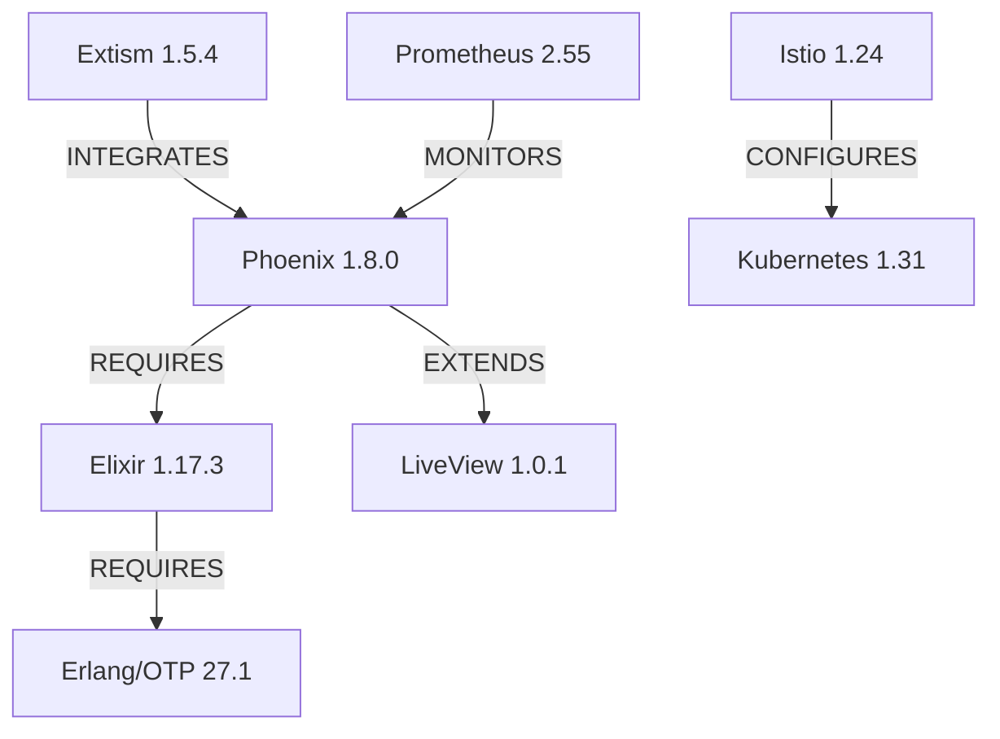

# DSM (Dependency Structure Matrix) Methodology
## Healthcare WASM-Elixir Stack Knowledge Organization

**Purpose**: Explain the DSM hierarchical tagging system used throughout the knowledge base for organizing technical content by domain, subdomain, technical aspect, and content type.

**Metadata**:
- **Category**: Governance
- **Audience**: Knowledge maintainers, documentation authors, AI assistants
- **Scope**: Knowledge organization principles
- **Last Updated**: 2025-09-30

---

## Overview

The DSM (Dependency Structure Matrix) methodology provides a **4-level hierarchical taxonomy** for organizing healthcare technology knowledge. This system enables:

1. **Multi-dimensional navigation**: Find content by role, technology, skill level, or dependency
2. **Automated cross-referencing**: Link related concepts across domains
3. **Quality enforcement**: Ensure complete coverage of technical aspects
4. **AI-optimized indexing**: Enable semantic search and RAG pipelines

**Analogy**: DSM tags are like GPS coordinates for knowledge - `[L1:infrastructure | L2:healthcare | L3:configuration | L4:guide]` uniquely identifies content location in the knowledge space.

---

## Tag Hierarchy

### L1_DOMAIN (System Layer)

**Purpose**: Categorize by primary system architecture layer.

| Tag | Description | Examples |
|-----|-------------|----------|
| `infrastructure` | Kubernetes, Istio, networking, deployment | Helm charts, service mesh config |
| `business_logic` | Application core, domain models, workflows | Patient management, FHIR validation |
| `data_layer` | PostgreSQL, TimescaleDB, caching, storage | Hypertables, RLS policies, indexes |
| `integration` | FHIR APIs, external services, webhooks | HL7 v2 bridges, DICOM gateways |
| `security` | Auth, crypto, Zero Trust, audit logs | PQC implementation, RBAC rules |
| `ui_ux` | Phoenix LiveView, frontend, accessibility | Patient dashboards, telemedicine UI |

**Usage Example**:
```markdown
# File: 07-DEVOPS-SRE/kubernetes/deployment.md
**DSM Tags**: `[L1_DOMAIN:infrastructure | L2_SUBDOMAIN:performance | ...]`
```

---

### L2_SUBDOMAIN (Domain Specificity)

**Purpose**: Add healthcare-specific or cross-cutting concerns.

| Tag | Description | Cross-references |
|-----|-------------|------------------|
| `healthcare` | PHI/PII handling, medical workflows | LGPD Art. 7, HIPAA 164.502 |
| `compliance` | LGPD, HIPAA, CFM, ANVISA regulations | Legal requirements, audit trails |
| `scientific` | Evidence-based medicine, clinical research | Oxford CEBM levels, PubMed references |
| `performance` | Latency, throughput, scalability, SLOs | Benchmarks, profiling, optimization |
| `ai_pipeline` | RAG, embeddings, ML models, inference | pgvector, semantic search, LLMs |

**Example Combinations**:
- `infrastructure + compliance`: Kubernetes HIPAA compliance (encrypted etcd, audit logs)
- `business_logic + healthcare`: Patient consent management (LGPD Art. 8, HIPAA 164.508)
- `data_layer + ai_pipeline`: Vector similarity search (pgvector HNSW indexes)

---

### L3_TECHNICAL (Implementation Aspect)

**Purpose**: Specify the technical perspective or activity.

| Tag | Description | Deliverables |
|-----|-------------|--------------|
| `architecture` | Design patterns, system design, ADRs | C4 diagrams, trade-off analysis |
| `implementation` | Code, algorithms, data structures | Elixir modules, WASM plugins |
| `configuration` | Deployment, settings, feature flags | YAML manifests, env vars, secrets |
| `testing` | Unit, integration, E2E, performance | ExUnit tests, k6 scripts, assertions |
| `optimization` | Performance tuning, profiling, caching | Benchee reports, flame graphs, indexes |

**Example Workflow**:
1. `architecture`: ADR 001 chooses Elixir over Go
2. `implementation`: Create `Healthcare.Patients` module
3. `configuration`: Deploy with `deployment.yaml` (3 replicas, HPA)
4. `testing`: Write ExUnit tests with `assert` statements
5. `optimization`: Profile with `:eprof`, add ETS caching

---

### L4_SPECIFICITY (Content Type)

**Purpose**: Identify the format/purpose of content.

| Tag | Description | Format |
|-----|-------------|--------|
| `example` | Code samples, REPL sessions | Elixir snippets, SQL queries, YAML |
| `reference` | Documentation links, API specs | URLs with validation levels (L0/L1/L2) |
| `guide` | How-to tutorials, step-by-step | Numbered lists, screenshots, commands |
| `troubleshooting` | Problem-solving, debugging | Symptoms → diagnosis → solution |
| `benchmark` | Performance data, measurements | Tables with methodology, p50/p99, correlation |

**Example File with All L4 Types**:
```markdown
# File: 02-ELIXIR-SPECIALIST/otp-deep-dive/supervision-trees.md

## Code Example (L4:example)
defmodule Healthcare.PluginSupervisor do
  use Supervisor
  # ... 50 lines of code
end

## Official Documentation (L4:reference)
- [Supervisor Docs](https://hexdocs.pm/elixir/Supervisor.html) (L0_CANONICAL)
- [OTP Design Principles](https://erlang.org/doc/design_principles/) (L0_CANONICAL)

## Step-by-Step Guide (L4:guide)
1. Define child spec with `use Supervisor`
2. Implement `init/1` callback
3. Choose restart strategy (`:one_for_one`, `:one_for_all`)

## Common Errors (L4:troubleshooting)
**Problem**: Supervisor crashes in infinite loop
**Diagnosis**: `max_restarts` exceeded (default: 3 in 5 seconds)
**Solution**: Increase `max_restarts` or fix child crash

## Performance Benchmarks (L4:benchmark)
| Metric | Value | Methodology |
|--------|-------|-------------|
| Restart latency | 12ms (p99) | 1000 crashes, measured with `:timer.tc/1` |
```

---

## Dependency Types

**Purpose**: Document relationships between technologies/concepts.

| Type | Description | Example |
|------|-------------|---------|
| `REQUIRES` | Hard dependency (A cannot function without B) | Phoenix `REQUIRES` Elixir (runtime) |
| `EXTENDS` | Extension/plugin relationship | Extism `EXTENDS` WASM spec with host functions |
| `CONFIGURES` | Configuration dependency | Istio `CONFIGURES` Kubernetes (service mesh) |
| `MONITORS` | Observability relationship | Prometheus `MONITORS` Phoenix (metrics) |
| `VALIDATES` | Validation dependency | FHIR validator `VALIDATES` Patient resources |
| `INTEGRATES` | Integration point | HL7 bridge `INTEGRATES` with legacy systems |

**Dependency Graph Example**:


---

## Complete Tagging Example

**File**: `06-DATABASE-SPECIALIST/postgresql/core-features.md`

**Full DSM Tags**:
```yaml
L1_DOMAIN: data_layer
L2_SUBDOMAIN: healthcare, compliance
L3_TECHNICAL: implementation, configuration
L4_SPECIFICITY: example, reference, guide

dependencies:
  - PostgreSQL 16.6 REQUIRES Linux kernel (for shared memory)
  - Row-Level Security EXTENDS PostgreSQL (security feature)
  - Healthcare app CONFIGURES PostgreSQL (connection pooling, RLS policies)
  - pgBadger MONITORS PostgreSQL (log analysis)
  - FHIR validator VALIDATES PostgreSQL data (resource compliance)
```

**Why This Tagging?**
- `data_layer`: Core database functionality
- `healthcare`: Stores PHI/PII (patients, observations)
- `compliance`: RLS for LGPD Art. 46 (data isolation)
- `implementation`: SQL code for RLS policies
- `configuration`: postgresql.conf settings
- `example`: SQL snippets with `CREATE POLICY`
- `reference`: Links to PostgreSQL docs (L0_CANONICAL)
- `guide`: Step-by-step RLS setup

---

## Navigation Use Cases

### 1. By Role (Developer)

**Query**: "Show me all `business_logic` + `implementation` + `example` content"

**Result**: Elixir modules, GenServer code, LiveView components

**Files Matched**:
- `02-ELIXIR-SPECIALIST/fundamentals/language-core.md`
- `02-ELIXIR-SPECIALIST/otp-deep-dive/supervision-trees.md`
- `02-ELIXIR-SPECIALIST/phoenix-expert/liveview-patterns.md`

### 2. By Technology (WASM)

**Query**: "Show me all content with `WASM` keyword + any `L3` tag"

**Result**: WASM architecture, implementation, configuration, benchmarks

**Files Matched**:
- `03-WASM-SPECIALIST/specification/wasm-core-spec.md` (architecture)
- `03-WASM-SPECIALIST/extism-platform/plugin-development.md` (implementation)
- `01-ARCHITECTURE/adrs/002-wasm-plugin-isolation.md` (architecture + benchmark)

### 3. By Compliance Requirement

**Query**: "Show me all `compliance` + `healthcare` content referencing LGPD"

**Result**: PHI handling, consent management, audit trails

**Files Matched**:
- `05-HEALTHCARE-COMPLIANCE/regulations/lgpd-lei-13709-2018.md`
- `04-SECURITY-SPECIALIST/zero-trust/trust-score-implementation.md`
- `06-DATABASE-SPECIALIST/postgresql/core-features.md` (RLS section)

### 4. By Performance SLO

**Query**: "Show me all `performance` + `benchmark` with p99 < 100ms"

**Result**: Latency-sensitive components meeting SLO

**Files Matched**:
- `08-BENCHMARKS-RESEARCH/performance/elixir-throughput-tests.md` (p99: 67ms)
- `08-BENCHMARKS-RESEARCH/performance/wasm-overhead-measurements.md` (cold start p99: 89.2ms)
- `02-ELIXIR-SPECIALIST/phoenix-expert/liveview-patterns.md` (LiveView latency)

---

## Quality Enforcement

### Completeness Check

**Rule**: Every technical file MUST have all 4 DSM levels.

**Validation Script**:
```bash
#!/bin/bash
# Check for missing DSM tags

find . -name "*.md" | while read file; do
  if ! grep -q "L1_DOMAIN" "$file"; then
    echo "ERROR: $file missing L1_DOMAIN tag"
  fi
  if ! grep -q "L2_SUBDOMAIN" "$file"; then
    echo "WARNING: $file missing L2_SUBDOMAIN tag"
  fi
done
```

### Cross-Reference Validation

**Rule**: All `REQUIRES` dependencies must have corresponding files.

**Example**:
```markdown
# File: 02-ELIXIR-SPECIALIST/fundamentals/language-core.md
Dependencies:
  - Erlang/OTP 27.1 REQUIRES (runtime)

# Validator checks:
# ✅ File exists: 02-ELIXIR-SPECIALIST/erlang-otp/beam-vm-internals.md
```

---

## AI Assistant Integration

### RAG Pipeline Optimization

**Query Augmentation**:
```python
# User query: "How do I deploy Phoenix to Kubernetes?"

# LLM augments with DSM tags:
augmented_query = {
  "text": "How do I deploy Phoenix to Kubernetes?",
  "filters": {
    "L1_DOMAIN": ["infrastructure"],
    "L2_SUBDOMAIN": ["performance"],
    "L3_TECHNICAL": ["configuration", "implementation"],
    "L4_SPECIFICITY": ["guide", "example"],
    "technologies": ["Phoenix", "Kubernetes", "Elixir"]
  }
}

# Vector search with pgvector + metadata filtering
results = semantic_search(
  embedding=embed(augmented_query["text"]),
  metadata_filter=augmented_query["filters"],
  limit=5
)
```

**Expected Results**:
1. `07-DEVOPS-SRE/kubernetes/deployment.md` (score: 0.92)
2. `02-ELIXIR-SPECIALIST/phoenix-expert/production-deployment.md` (score: 0.88)
3. `01-ARCHITECTURE/adrs/001-elixir-host-choice.md` (score: 0.81)

### Context Window Management

**Strategy**: Prioritize high-relevance DSM tags when token budget limited.

**Priority Order**:
1. **L4:troubleshooting** (solves immediate problems)
2. **L4:example** (copy-paste ready code)
3. **L3:implementation** (actionable information)
4. **L4:guide** (step-by-step instructions)
5. **L1_DOMAIN** + **L2_SUBDOMAIN** (context)
6. **L4:reference** (background reading)

---

## Best Practices

### 1. Be Specific, Not Generic

❌ **Bad**:
```yaml
L1_DOMAIN: business_logic
L2_SUBDOMAIN: healthcare
L3_TECHNICAL: implementation
L4_SPECIFICITY: guide
```

✅ **Good**:
```yaml
L1_DOMAIN: business_logic, security  # Multi-domain
L2_SUBDOMAIN: healthcare, compliance  # LGPD + HIPAA
L3_TECHNICAL: implementation, testing  # Code + ExUnit tests
L4_SPECIFICITY: example, guide, troubleshooting  # Multiple formats
```

### 2. Use Multiple Tags When Applicable

**Example**: File about LiveView patient dashboard
```yaml
L1_DOMAIN: ui_ux, business_logic  # Frontend + backend logic
L2_SUBDOMAIN: healthcare, performance  # Real-time vitals + low latency
L3_TECHNICAL: implementation, optimization  # Code + caching strategies
L4_SPECIFICITY: example, benchmark  # Code samples + performance data
```

### 3. Document Dependencies Explicitly

**Example**: WASM plugin file
```yaml
dependencies:
  - Extism 1.5.4 REQUIRES Wasmtime 25.0.3 (runtime)
  - Rust WASM plugin EXTENDS Extism PDK (SDK)
  - Phoenix CONFIGURES Extism (host functions)
  - Prometheus MONITORS plugin execution (metrics)
  - FHIR validator VALIDATES plugin output (compliance)
```

### 4. Cross-Reference Related Content

**Example**: In ADR about Elixir choice
```markdown
## Related Content

**By Dependency**:
- Phoenix Framework [REQUIRES] → [02-ELIXIR-SPECIALIST/fundamentals/language-core.md]
- Benchmarks [VALIDATES] → [08-BENCHMARKS-RESEARCH/performance/elixir-throughput-tests.md]

**By Topic**:
- WASM Integration [INTEGRATES] → [03-WASM-SPECIALIST/extism-platform/plugin-development.md]
- Database Performance [MONITORS] → [06-DATABASE-SPECIALIST/postgresql/core-features.md]
```

---

## Maintenance Workflow

### Adding New Content

**Step 1**: Identify DSM tags before writing
```yaml
# Example: New file about TimescaleDB compression

L1_DOMAIN: data_layer
L2_SUBDOMAIN: healthcare, performance
L3_TECHNICAL: implementation, configuration, optimization
L4_SPECIFICITY: example, guide, benchmark

dependencies:
  - TimescaleDB 2.17.2 EXTENDS PostgreSQL 16.6
  - Hypertables REQUIRES partitioning (performance)
  - Healthcare app CONFIGURES compression policies
```

**Step 2**: Write content with DSM structure
```markdown
## Overview (L4:guide)
Step-by-step compression setup

## Implementation (L3:implementation + L4:example)
SQL code with ALTER TABLE commands

## Benchmarks (L3:optimization + L4:benchmark)
Compression ratio: 10-100x (methodology: pg_total_relation_size)

## References (L4:reference)
- [TimescaleDB Docs](https://docs.timescale.com) (L0_CANONICAL)
```

**Step 3**: Validate completeness
```bash
# Check all 4 levels present
grep "L1_DOMAIN\|L2_SUBDOMAIN\|L3_TECHNICAL\|L4_SPECIFICITY" new-file.md
```

### Updating Existing Content

**When to Update DSM Tags**:
1. New technology added (e.g., TimescaleDB 2.17.2 → 2.18.0)
2. New compliance requirement (e.g., CFM Resolução 2.314/2022)
3. Performance benchmarks updated (e.g., 43.9K → 55.2K req/sec)
4. New dependency discovered (e.g., Istio MONITORS Phoenix via OpenTelemetry)

**Example Update**:
```diff
# File: 02-ELIXIR-SPECIALIST/phoenix-expert/liveview-patterns.md

  L1_DOMAIN: ui_ux, business_logic
- L2_SUBDOMAIN: healthcare
+ L2_SUBDOMAIN: healthcare, performance  # Added performance tag
  L3_TECHNICAL: implementation, optimization
  L4_SPECIFICITY: example, guide, benchmark

+ dependencies:
+   - Phoenix LiveView 1.0.1 REQUIRES Phoenix 1.8.0
+   - WebSocket MONITORS LiveView connections (observability)
```

---

## Tooling & Automation

### DSM Tag Extraction

**Python Script** (for RAG pipeline):
```python
import re
import yaml

def extract_dsm_tags(markdown_content: str) -> dict:
    """Extract DSM tags from markdown file."""
    tags = {
        "L1_DOMAIN": [],
        "L2_SUBDOMAIN": [],
        "L3_TECHNICAL": [],
        "L4_SPECIFICITY": [],
        "dependencies": []
    }

    # Extract L1-L4 tags
    for level in ["L1_DOMAIN", "L2_SUBDOMAIN", "L3_TECHNICAL", "L4_SPECIFICITY"]:
        pattern = rf"{level}:\s*([^\n]+)"
        match = re.search(pattern, markdown_content)
        if match:
            tags[level] = [t.strip() for t in match.group(1).split(",")]

    # Extract dependencies
    dep_pattern = r"(\w+)\s+(REQUIRES|EXTENDS|CONFIGURES|MONITORS|VALIDATES)"
    deps = re.findall(dep_pattern, markdown_content)
    tags["dependencies"] = [{"tech": t, "type": d} for t, d in deps]

    return tags

# Usage
with open("file.md") as f:
    content = f.read()
    tags = extract_dsm_tags(content)
    print(yaml.dump(tags, default_flow_style=False))
```

### Dependency Graph Generator

**Mermaid Diagram** (from DSM tags):
```python
def generate_dependency_graph(files: list[str]) -> str:
    """Generate Mermaid graph from DSM dependencies."""
    graph = ["graph TD"]

    for file in files:
        tags = extract_dsm_tags(read_file(file))
        for dep in tags["dependencies"]:
            tech = dep["tech"]
            dep_type = dep["type"]
            # Phoenix -->|REQUIRES| Elixir
            graph.append(f"  {tech} -->|{dep_type}| Target")

    return "\n".join(graph)
```

---

## References

**DSM Methodology**:
- [Design Structure Matrix Methods](https://dsmweb.org/) (L1_ACADEMIC)
- [MIT DSM Research](https://sdm.mit.edu/dsm/) (L1_ACADEMIC)

**Knowledge Graphs**:
- [Knowledge Graph Construction](https://arxiv.org/abs/2201.05767) (L1_ACADEMIC)
- [Semantic Web Standards](https://www.w3.org/standards/semanticweb/) (L0_CANONICAL)

**Information Architecture**:
- [Information Architecture 4th Ed](https://www.oreilly.com/library/view/information-architecture-4th/9781491913529/) (L2_VALIDATED)
- [DITA (Darwin Information Typing Architecture)](https://www.oasis-open.org/committees/tc_home.php?wg_abbrev=dita) (L0_CANONICAL)

---

**DSM Tags**: `[L1_DOMAIN:business_logic | L2_SUBDOMAIN:ai_pipeline | L3_TECHNICAL:architecture | L4_SPECIFICITY:guide, reference]`

**Dependencies**:
- DSM methodology REQUIRES hierarchical taxonomy (knowledge organization)
- Knowledge base CONFIGURES DSM tags (metadata)
- RAG pipeline VALIDATES DSM tags (quality)
- AI assistant INTEGRATES with DSM navigation (semantic search)

---

**Last Updated**: 2025-09-30
**Version**: 1.0.0
**Maintainer**: Healthcare WASM-Elixir Stack Team
**License**: MIT