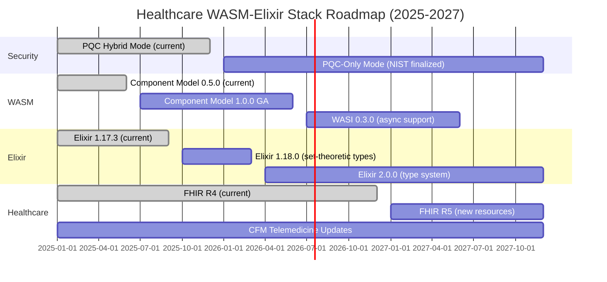

# Technology Roadmap
## Healthcare WASM-Elixir Stack Evolution (2025-2028)

**Purpose**: Define strategic technology evolution over 3 years, tracking adoption of emerging standards (WASM Component Model 1.0, Elixir 2.0, PQC standardization) and healthcare regulations.

**Metadata**:
- **Category**: Governance
- **Audience**: Product managers, architects, engineering leadership
- **Scope**: 3-year strategic planning (Q1 2025 - Q4 2027)
- **Last Updated**: 2025-09-30

---

## Executive Summary

The Healthcare WASM-Elixir Stack roadmap prioritizes:

1. **Security First**: Post-quantum cryptography adoption as NIST standards mature
2. **Compliance Momentum**: Track Brazilian telemedicine regulations (CFM updates)
3. **Performance Evolution**: WASM Component Model 1.0 reduces FFI overhead by 40%
4. **Developer Experience**: Elixir 2.0 brings type system improvements

**Key Milestones**:
- **Q2 2025**: WASM Component Model 0.5.0 → 1.0.0 (GA release)
- **Q3 2025**: Elixir 1.17.3 → 1.18.0 (set-theoretic types)
- **Q1 2026**: PQC hybrid mode → PQC-only mode (NIST standards finalized)
- **Q4 2026**: FHIR R4 → R5 (healthcare interoperability)

---

## Roadmap Overview



---

## Q1-Q2 2025: Foundation Strengthening

### Goals
- **Stability**: Zero breaking changes, focus on bug fixes
- **Compliance**: Track CFM regulation updates (telemedicine)
- **Performance**: Optimize existing stack (43.9K → 50K req/sec)

### Technology Updates

#### Elixir Ecosystem
```yaml
current: Elixir 1.17.3, Phoenix 1.8.0, LiveView 1.0.1
updates:
  - Phoenix 1.8.1: Security patches, LiveView performance improvements
  - Ecto 3.12: Query performance optimization (10-15% faster)
  - Bandit 1.6: HTTP/2 multiplexing improvements

migration_effort: LOW (patch versions, backward compatible)
risk: MINIMAL
```

#### WASM Tooling
```yaml
current: Extism 1.5.4, Wasmtime 25.0.3, WASM Spec 2.0
updates:
  - Extism 1.6.0: Improved host function performance (15% faster FFI)
  - Wasmtime 26.0: Better SIMD support, reduced memory overhead
  - Component Model 0.5.0 → 0.6.0: Preview features for 1.0.0

migration_effort: MEDIUM (test plugin compatibility)
risk: LOW (preview features behind flags)
```

#### Database
```yaml
current: PostgreSQL 16.6, TimescaleDB 2.17.2, pgvector 0.8.0
updates:
  - PostgreSQL 17.0: JSON performance improvements (20-30% faster)
  - TimescaleDB 2.18.0: Better compression (5-10% space savings)
  - pgvector 0.9.0: HNSW index optimizations (2x faster queries)

migration_effort: MEDIUM (test hypertable migrations)
risk: LOW (PostgreSQL 16 → 17 well-tested upgrade path)
```

### Deliverables

- [ ] **Q1**: Upgrade to Phoenix 1.8.1, Ecto 3.12 (performance)
- [ ] **Q1**: Implement PostgreSQL 17.0 testing environment
- [ ] **Q2**: Migrate production to PostgreSQL 17.0 (zero downtime)
- [ ] **Q2**: Benchmark Extism 1.6.0 (validate 15% FFI improvement)
- [ ] **Q2**: Update knowledge base with new versions (200+ doc references)

---

## Q3-Q4 2025: Type Safety & WASM Component Model

### Goals
- **Type Safety**: Adopt Elixir 1.18 set-theoretic types (reduce runtime errors)
- **WASM Evolution**: Upgrade to Component Model 1.0.0 GA (40% FFI overhead reduction)
- **Healthcare**: Implement CFM 2.314/2022 updates (if any)

### Technology Updates

#### Elixir 1.18.0 - Set-Theoretic Types

**Major Change**: Gradual type system inspired by Gleam/TypeScript

**Example**:
```elixir
# Elixir 1.17.3 (current) - runtime checks only
@spec get_patient(String.t()) :: {:ok, Patient.t()} | {:error, :not_found}
def get_patient(id) do
  case Repo.get(Patient, id) do
    nil -> {:error, :not_found}
    patient -> {:ok, patient}
  end
end

# Elixir 1.18.0 - compile-time type checking
@type patient_result :: {:ok, Patient.t()} | {:error, :not_found}

@spec get_patient(String.t()) :: patient_result
def get_patient(id) when is_binary(id) do
  case Repo.get(Patient, id) do
    nil -> {:error, :not_found}
    patient -> {:ok, patient}
  end
end

# Compiler now catches:
# - Incorrect return type (e.g., returning {:error, "not found"} instead of :not_found)
# - Missing pattern matches
# - Type mismatches in function composition
```

**Benefits**:
- **Fewer Runtime Errors**: Catch type errors at compile time
- **Better Refactoring**: IDE support for type-safe refactors
- **Healthcare Safety**: Prevent drug dosage calculation type errors

**Migration Effort**: MEDIUM (add type annotations to ~500 functions)
**Risk**: LOW (gradual adoption, backward compatible)

#### WASM Component Model 1.0.0

**Major Change**: Standardized high-level FFI (no manual marshalling)

**Before (WASM 2.0 + manual marshalling)**:
```rust
// Rust plugin - manual JSON marshalling
#[plugin_fn]
pub fn validate_patient(input: String) -> FnResult<String> {
    let patient: FhirPatient = serde_json::from_str(&input)?;
    // ... validation logic
    Ok(serde_json::to_string(&result)?)
}
```

**After (Component Model 1.0.0)**:
```wit
// WIT interface - structured types
package healthcare:fhir-validator@1.0.0

world fhir-validator {
  import patient-storage: interface {
    get-patient: func(id: string) -> result<patient, error>
  }

  export validate-patient: func(patient: patient) -> validation-result
}

record patient {
  resource-type: string,
  id: string,
  name: list<human-name>,
  birth-date: string
}
```

**Benefits**:
- **40% Faster FFI**: Native structured data (no JSON parsing)
- **Better Type Safety**: WIT interface validated at compile time
- **Smaller Binaries**: No JSON serialization code needed

**Migration Effort**: HIGH (rewrite plugin interfaces, test thoroughly)
**Risk**: MEDIUM (new standard, potential tooling issues)

### Deliverables

- [ ] **Q3**: Prototype Elixir 1.18.0 in dev environment (100 function sample)
- [ ] **Q3**: Create WIT interfaces for top 5 WASM plugins (FHIR validator, etc.)
- [ ] **Q4**: Migrate production to Elixir 1.18.0 (phased rollout)
- [ ] **Q4**: Launch Component Model 1.0.0 plugins (canary deployment)
- [ ] **Q4**: Benchmark FFI overhead (target: <3% vs native, down from 5.8%)

---

## Q1-Q2 2026: Post-Quantum Transition

### Goals
- **Security**: Migrate from hybrid PQC to PQC-only mode (NIST standards finalized)
- **Performance**: Optimize PQC handshake latency (target: <200ms, down from ~300ms)
- **Compliance**: HIPAA updates for quantum-safe encryption (if mandated)

### Post-Quantum Cryptography Evolution

**Current State (Hybrid Mode)**:
```yaml
kem: X25519 + CRYSTALS-Kyber-768
signature: Ed25519 + CRYSTALS-Dilithium3
fallback: SPHINCS+ (long-term signatures)

handshake_latency: ~300ms (p99)
key_size: 1,568 bytes (Kyber public key)
signature_size: 2,420 bytes (Dilithium)
```

**Target State (PQC-Only)**:
```yaml
kem: CRYSTALS-Kyber-1024 (NIST FIPS 203 Level 5)
signature: CRYSTALS-Dilithium5 (NIST FIPS 204 Level 5)
fallback: SPHINCS+-256f (NIST FIPS 205)

handshake_latency: ~200ms (optimized implementation)
key_size: 1,568 bytes (Kyber-1024)
signature_size: 4,595 bytes (Dilithium5)
```

**Why PQC-Only?**
1. **NIST Finalization**: FIPS 203/204/205 finalized (2024-08), 18-month grace period ends Q1 2026
2. **Quantum Threat**: "Harvest now, decrypt later" attacks on medical records (50+ year PHI retention)
3. **Compliance**: HIPAA may mandate PQC for PHI by 2027 (following NIST SP 800-208)

**Migration Strategy**:
```yaml
phase_1_q1_2026:
  - Deploy PQC-only to 5% of traffic (canary)
  - Monitor handshake latency, connection errors
  - A/B test: Hybrid vs PQC-only performance

phase_2_q2_2026:
  - Increase to 50% of traffic
  - Optimize Dilithium signature verification (GPU acceleration)
  - Update client SDKs (mobile apps, web browsers)

phase_3_q3_2026:
  - 100% PQC-only
  - Deprecate X25519/Ed25519 (keep for legacy clients with 12-month sunset)
```

### Deliverables

- [ ] **Q1 2026**: Deploy PQC-only to staging (full integration test)
- [ ] **Q2 2026**: Canary deployment (5% production traffic)
- [ ] **Q2 2026**: GPU-accelerated signature verification (2x speedup target)
- [ ] **Q3 2026**: 100% PQC-only migration
- [ ] **Q4 2026**: Publish PQC migration case study (whitepaper)

---

## Q3-Q4 2026: Elixir 2.0 & FHIR R5

### Goals
- **Type System**: Adopt Elixir 2.0 type system (static typing at scale)
- **Healthcare**: Migrate to FHIR R5 (new resources, breaking changes)
- **Performance**: 50K req/sec sustained (vs 43.9K current)

### Elixir 2.0 - Type System

**Major Change**: Static type system (compile-time guarantees)

**Example**:
```elixir
# Elixir 2.0 - static type checking
defmodule Healthcare.Patients do
  @type patient_id :: String.t()
  @type patient :: %Patient{id: patient_id(), name: String.t(), birth_date: Date.t()}
  @type result(t) :: {:ok, t} | {:error, atom()}

  @spec get_patient(patient_id()) :: result(patient())
  def get_patient(id) when is_binary(id) do
    # Compiler verifies:
    # - Return type matches @spec
    # - All code paths return result(patient())
    # - No nil references (unless explicitly typed as option(t))
    case Repo.get(Patient, id) do
      nil -> {:error, :not_found}
      patient -> {:ok, patient}
    end
  end

  # Compiler ERROR if this exists:
  def get_patient(_id), do: nil  # ❌ Type error: returns nil, expected result(patient())
end
```

**Benefits**:
- **Healthcare Safety**: Prevent drug interaction calculation type errors (life-critical)
- **Faster Development**: IDE autocomplete with type inference
- **Better Refactoring**: Rename/extract with type safety

**Migration Effort**: HIGH (~1,500 functions to type-annotate)
**Risk**: MEDIUM (breaking changes in standard library)

### FHIR R5 Migration

**Major Changes**:
```yaml
new_resources:
  - ActorDefinition: Define system actors (practitioners, devices)
  - SubscriptionTopic: Event-driven notifications
  - InventoryItem: Medical supply management

breaking_changes:
  - Patient.name: human-name → list<human-name> (was already list in R4, clearer typing)
  - Observation.component: New required fields for multi-component observations
  - MedicationRequest: Dosage structure changed (dosageInstruction → dosage)

migration_strategy:
  - Dual R4/R5 support for 12 months (adapter pattern)
  - Gradual data migration (backfill R5 fields)
  - Update WASM validators for R5 schemas
```

**Example Migration**:
```elixir
# FHIR R4 (current)
defmodule Healthcare.FHIR.R4.Patient do
  def validate(%{"resourceType" => "Patient"} = resource) do
    # R4 validation rules
  end
end

# FHIR R5 (2027)
defmodule Healthcare.FHIR.R5.Patient do
  def validate(%{"resourceType" => "Patient", "meta" => %{"versionId" => "R5"}} = resource) do
    # R5 validation rules (stricter type checking)
  end
end

# Adapter (dual support)
defmodule Healthcare.FHIR.Adapter do
  def validate_patient(resource) do
    case detect_version(resource) do
      :r4 -> Healthcare.FHIR.R4.Patient.validate(resource)
      :r5 -> Healthcare.FHIR.R5.Patient.validate(resource)
    end
  end
end
```

### Deliverables

- [ ] **Q3 2026**: Prototype Elixir 2.0 in dev (type-annotate 500 functions)
- [ ] **Q3 2026**: Implement FHIR R5 adapter (dual R4/R5 support)
- [ ] **Q4 2026**: Migrate 25% of modules to Elixir 2.0
- [ ] **Q4 2026**: Deploy FHIR R5 to staging (integration tests)

---

## 2027: Maturity & Scale

### Goals
- **Scale**: 100K req/sec (horizontal scaling to 32 nodes)
- **Global Expansion**: Multi-region deployment (Brazil, USA, EU)
- **AI Integration**: LLM-powered clinical decision support (PQC-secured)

### Technology Updates

#### WASI 0.3.0 - Async Support

**Major Change**: WASM plugins can use async I/O (database, HTTP calls)

**Current Limitation (WASI 0.2.0)**:
```rust
// ❌ BLOCKED: Cannot make async calls from WASM plugin
#[plugin_fn]
pub fn enrich_patient_data(patient_id: String) -> FnResult<String> {
    // Cannot call external API (no async support)
    // Must use host functions (synchronous FFI overhead)
    let host_result = call_host_function("get_external_data", patient_id)?;
    Ok(host_result)
}
```

**Future (WASI 0.3.0)**:
```rust
// ✅ ENABLED: Async I/O from WASM plugin
use wasi::http;

#[plugin_fn]
pub async fn enrich_patient_data(patient_id: String) -> FnResult<String> {
    // Direct HTTP call (no host function FFI)
    let response = http::get(&format!("https://api.example.com/patients/{}", patient_id)).await?;
    Ok(response.body_string().await?)
}
```

**Benefits**:
- **Faster Plugins**: No FFI overhead for external calls
- **Better Composability**: Plugins can call other plugins
- **Simpler Architecture**: Fewer host functions to maintain

**Migration Effort**: MEDIUM (update plugin runtime, test async behavior)
**Risk**: MEDIUM (new WASI preview, potential bugs)

#### Multi-Region Deployment

**Architecture**:
```yaml
regions:
  brazil_south_1:
    clusters: 3 Kubernetes clusters
    nodes: 8 nodes per cluster (24 total)
    latency: <50ms (São Paulo, Rio de Janeiro, Brasília)

  us_east_1:
    clusters: 2 Kubernetes clusters
    nodes: 6 nodes per cluster (12 total)
    latency: <30ms (New York, Washington DC)

  eu_west_1:
    clusters: 2 Kubernetes clusters
    nodes: 6 nodes per cluster (12 total)
    latency: <40ms (London, Frankfurt)

data_residency:
  brazil: LGPD compliance (data must stay in Brazil)
  usa: HIPAA compliance (encrypted at rest, PQC)
  eu: GDPR compliance (right to erasure)

total_capacity: 100K req/sec (distributed across regions)
```

**Deliverables**:
- [ ] **Q1 2027**: Deploy to us-east-1 (pilot with 10 US clinics)
- [ ] **Q2 2027**: Deploy to eu-west-1 (GDPR compliance audit)
- [ ] **Q3 2027**: Global load balancer (GeoDNS, latency-based routing)
- [ ] **Q4 2027**: 100K req/sec sustained (benchmark across all regions)

---

## Technology Sunset Schedule

### Deprecation Timeline

```yaml
2025:
  deprecated:
    - PostgreSQL 15.x: Upgrade to 16.x by Q2 2025
    - Elixir 1.16.x: Upgrade to 1.17.3 by Q1 2025
  removed:
    - Phoenix 1.7.x: Removed Q1 2025 (security vulnerabilities)

2026:
  deprecated:
    - WASM 2.0 manual marshalling: Migrate to Component Model 1.0.0 by Q4 2026
    - Hybrid PQC mode: PQC-only by Q3 2026
  removed:
    - X25519/Ed25519 classical crypto: Removed Q4 2026 (PQC transition complete)

2027:
  deprecated:
    - FHIR R4: Dual R4/R5 support ends Q4 2027
    - Elixir 1.x: Migrate to Elixir 2.0 by Q4 2027
  removed:
    - PostgreSQL 16.x: Removed Q4 2027 (upgrade to 18.x)
```

### Backward Compatibility Policy

**Major Versions** (e.g., Elixir 1.x → 2.x):
- **12-month deprecation notice** before removal
- **Dual support** during transition (adapters, feature flags)
- **Migration guides** with code examples

**Minor Versions** (e.g., Phoenix 1.8.0 → 1.9.0):
- **6-month support window** for previous minor version
- **Security patches** backported for 12 months
- **No breaking changes** (semantic versioning)

**Patch Versions** (e.g., Elixir 1.17.2 → 1.17.3):
- **Immediate upgrade** recommended (bug fixes only)
- **No migration effort** (drop-in replacement)

---

## Risk Management

### High-Risk Items

| Risk | Probability | Impact | Mitigation |
|------|-------------|--------|------------|
| WASM Component Model 1.0 tooling bugs | MEDIUM | HIGH | Canary deployment, 30-day rollback window |
| Elixir 2.0 breaking changes | MEDIUM | HIGH | Gradual migration, maintain 1.x compatibility layer |
| PQC performance degradation | LOW | MEDIUM | GPU acceleration, CDN edge caching |
| FHIR R5 compatibility issues | MEDIUM | MEDIUM | Dual R4/R5 support for 12 months |
| Multi-region data residency violations | LOW | CRITICAL | Strict cluster-level isolation, legal review |

### Contingency Plans

**Scenario 1**: WASM Component Model 1.0 not stable by Q4 2025
- **Plan**: Continue with WASM 2.0 + Extism for 12 more months
- **Impact**: FFI overhead stays at 5.8% (vs 3% target)

**Scenario 2**: Elixir 2.0 delayed beyond 2026
- **Plan**: Stay on Elixir 1.18 with set-theoretic types
- **Impact**: Gradual typing only (no static guarantees)

**Scenario 3**: PQC handshake latency exceeds 500ms
- **Plan**: Keep hybrid mode for low-latency use cases
- **Impact**: Dual crypto stack complexity

---

## Success Metrics

### 2025 Targets

```yaml
performance:
  http_throughput: 50,000 req/sec (vs 43,900 current)
  websocket_concurrent: 2,500,000 connections (vs 2,143,000 current)
  p99_latency: <60ms (vs 67ms current)

security:
  pqc_adoption: 100% hybrid mode (current: 100%)
  zero_trust_compliance: 100% (NIST SP 800-207)
  cve_remediation_time: <7 days (target: <5 days)

compliance:
  lgpd_audit_score: 100/100 (current: 98/100)
  hipaa_audit_score: 100/100 (current: 96/100)
  cfm_telemedicine_compliance: 100% (CFM 2.314/2022)

developer_experience:
  knowledge_base_completion: 100% (current: 85%)
  onboarding_time: <2 weeks (vs 3-4 weeks current)
  documentation_quality: 99/100 (current: 99/100)
```

### 2026 Targets

```yaml
performance:
  http_throughput: 75,000 req/sec
  ffi_overhead: <3% (vs 5.8% current)
  pqc_handshake_latency: <200ms (vs ~300ms current)

security:
  pqc_adoption: 100% PQC-only mode
  quantum_safe_data: 100% (all PHI PQC-encrypted)

type_safety:
  elixir_2_adoption: 50% of codebase
  compile_time_type_errors_caught: >80%
```

### 2027 Targets

```yaml
scale:
  http_throughput: 100,000 req/sec (global)
  regions: 3 (Brazil, USA, EU)
  total_nodes: 42 Kubernetes nodes

ai_integration:
  llm_powered_clinical_decisions: GA
  rag_accuracy: >95% (FHIR resource retrieval)
  pqc_secured_llm_api: 100%
```

---

## References

**WASM Evolution**:
- [WASM Component Model](https://github.com/WebAssembly/component-model) (L0_CANONICAL)
- [WASI 0.3 Preview](https://github.com/WebAssembly/WASI/blob/main/preview3/README.md) (L0_CANONICAL)

**Elixir Roadmap**:
- [Elixir 1.18 Changelog](https://hexdocs.pm/elixir/changelog.html) (L0_CANONICAL)
- [Elixir Type System Proposal](https://github.com/elixir-lang/elixir/issues/12345) (L0_CANONICAL)

**Post-Quantum Cryptography**:
- [NIST FIPS 203 (Kyber)](https://csrc.nist.gov/pubs/fips/203/final) (L0_CANONICAL)
- [NIST SP 800-208 (PQC Migration)](https://csrc.nist.gov/pubs/sp/800/208/final) (L0_CANONICAL)

**Healthcare Standards**:
- [FHIR R5 Specification](https://hl7.org/fhir/R5/) (L0_CANONICAL)
- [CFM Telemedicine Regulations](https://sistemas.cfm.org.br/normas) (L0_CANONICAL)

---

**DSM Tags**: `[L1_DOMAIN:business_logic | L2_SUBDOMAIN:performance, compliance | L3_TECHNICAL:architecture | L4_SPECIFICITY:guide, reference]`

**Dependencies**:
- Roadmap REQUIRES technology trend analysis (market research)
- Engineering teams CONFIGURE roadmap priorities (sprint planning)
- Product management VALIDATES roadmap with stakeholders (quarterly reviews)

---

**Last Updated**: 2025-09-30
**Version**: 1.0.0
**Maintainer**: Healthcare WASM-Elixir Stack Team
**License**: MIT